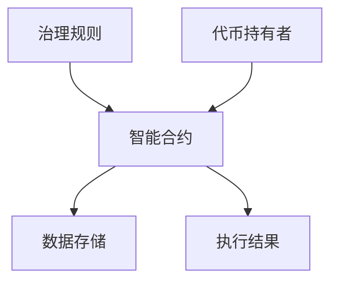

                 


# 《格雷厄姆特价股票理论在去中心化自治协议(DAP)时代的新思考》

> 关键词：DAP, 去中心化自治协议, 格雷厄姆价值理论, 价值投资, 数字资产, 安全边际, 投资策略

> 摘要：本文探讨了格雷厄姆特价股票理论在去中心化自治协议（DAP）时代的新应用。通过分析DAP的治理机制和价值评估模型，本文提出了一种结合传统价值投资理念与现代区块链技术的新投资策略。文章详细介绍了DAP的核心概念、安全边际的数字化重构、治理机制对投资决策的影响，以及如何利用算法和数学模型优化投资策略。最后，通过项目实战和系统架构设计，本文展示了如何在DAP时代实现高效、安全的价值投资。

---

## 第1章：DAP与价值投资概述

### 1.1 DAP的基本概念与特点

#### 1.1.1 DAP的定义与核心特征
去中心化自治协议（Decentralized Autonomous Protocol, DAP）是一种基于区块链技术的去中心化治理机制，通过智能合约实现自动化的决策和执行。其核心特征包括：
- **去中心化**：无需依赖中心化机构，由分布式节点共同参与治理。
- **透明性**：所有交易和决策记录在区块链上，可追溯且不可篡改。
- **自动性**：通过智能合约实现自动化的治理流程。

#### 1.1.2 DAP与传统金融体系的区别
DAP与传统金融体系的主要区别在于：
- **治理方式**：DAP采用去中心化的治理模式，而传统金融体系依赖于中心化的机构。
- **透明度**：DAP的透明性和可追溯性远高于传统金融体系。
- **效率**：DAP通过自动化流程提高治理效率，减少人为干预。

#### 1.1.3 DAP在价值投资中的潜在应用
DAP为价值投资提供了新的可能性，尤其是在数字资产和区块链项目中。通过DAP，投资者可以更透明地评估项目的治理能力和价值，从而做出更明智的投资决策。

---

### 1.2 格雷厄姆特价股票理论的核心思想

#### 1.2.1 价值投资的定义与核心理念
价值投资是一种长期投资策略，强调以低于内在价值的价格买入优质资产。格雷厄姆在其经典著作中提出了以下核心理念：
- **安全边际**：买入价格应低于资产的内在价值，以确保投资的安全性。
- **长期视角**：关注企业的基本面，而非短期市场波动。
- **分散投资**：通过分散投资降低风险。

#### 1.2.2 安全边际的概念与计算
安全边际是价值投资的核心概念，表示买入价格与资产内在价值之间的差距。计算公式如下：
$$ \text{安全边际} = \text{内在价值} - \text{买入价格} $$

#### 1.2.3 格雷厄姆投资策略在现代金融中的演变
随着金融市场的复杂化，格雷厄姆的理论逐渐从传统股票扩展到数字资产和其他金融工具。DAP的出现为安全边际的计算提供了新的应用场景。

---

### 1.3 DAP时代价值投资的新挑战

#### 1.3.1 去中心化对传统价值评估的影响
DAP的去中心化特性改变了传统的价值评估方式，投资者需要重新考虑如何评估数字资产的内在价值。

#### 1.3.2 数字资产的价值波动与风险
数字资产的价格波动性较高，DAP的治理机制需要能够应对这种波动，确保投资的安全性。

#### 1.3.3 DAP治理机制对投资决策的影响
DAP的治理机制直接影响项目的决策过程，投资者需要理解并评估这些机制对项目价值的影响。

---

## 第2章：DAP的机制与价值评估模型

### 2.1 DAP的治理模型

#### 2.1.1 DAP治理的核心要素
DAP治理的核心要素包括：
- **治理规则**：通过智能合约定义的治理规则。
- **投票机制**：参与者通过投票决定项目的关键决策。
- **激励机制**：通过代币分配激励参与者积极参与治理。

#### 2.1.2 委托-代理关系在DAP中的体现
DAP中的委托-代理关系主要体现在投资者通过代币委托他人进行决策，而代理方则通过智能合约执行决策。

#### 2.1.3 DAP治理的透明性与公平性
DAP的透明性和公平性是其核心优势，所有决策过程都在区块链上公开记录，确保了公平性和透明性。

---

### 2.2 DAP的价值评估框架

#### 2.2.1 DAP项目的经济模型设计
DAP项目的经济模型设计需要考虑代币的发行量、流通量、分配机制等因素，以确保项目的可持续性和价值稳定。

#### 2.2.2 DAP治理机制对项目价值的影响
DAP的治理机制直接影响项目的决策效率和质量，进而影响项目的价值。

#### 2.2.3 DAP代币的流动性与价值波动
DAP代币的流动性越高，其价值波动性可能越小，但需要平衡流动性和治理效率之间的关系。

---

## 第3章：价值投资在DAP时代的重构

### 3.1 数字资产的价值评估体系

#### 3.1.1 数字资产的价值构成要素
数字资产的价值构成要素包括技术优势、市场需求、治理能力、团队能力等因素。

#### 3.1.2 DAP项目的技术评估标准
DAP项目的技术评估标准包括智能合约的复杂性、治理机制的合理性、系统的安全性等。

#### 3.1.3 DAP项目团队与治理能力的评估
团队能力和治理能力是评估DAP项目的重要因素，需要结合团队背景、治理机制的有效性等进行综合评估。

---

### 3.2 安全边际的数字化重构

#### 3.2.1 数字化安全边际的计算模型
数字化安全边际的计算需要结合DAP项目的内在价值和市场价格，公式如下：
$$ \text{数字化安全边际} = \text{内在价值} - \text{市场价格} $$

#### 3.2.2 DAP代币的安全边际与价格波动
DAP代币的安全边际需要考虑其价格波动性，确保在价格波动中仍能保持安全边际。

#### 3.2.3 数字资产的安全边际与投资决策
安全边际是投资决策的重要依据，投资者需要根据安全边际的宽裕程度决定是否投资。

---

## 第4章：DAP治理机制对投资决策的影响

### 4.1 DAP治理的透明性与信任机制

#### 4.1.1 DAP治理的透明性对价值评估的影响
DAP的透明性提高了投资者的信任度，有助于降低信息不对称带来的风险。

#### 4.1.2 DAP治理的信任机制与投资者行为
DAP的治理机制通过智能合约实现信任机制，投资者可以通过区块链记录验证项目的决策过程。

#### 4.1.3 DAP治理中的委托-代理问题
DAP治理中的委托-代理问题需要通过合理的激励机制和治理规则来解决，确保代理方的行为符合投资者的利益。

---

### 4.2 DAP治理对投资策略的优化

#### 4.2.1 DAP治理对投资决策的支持
DAP治理机制为投资者提供了更透明和高效的决策支持，有助于投资者做出更明智的投资决策。

#### 4.2.2 DAP治理对投资风险的控制
通过合理的DAP治理机制，投资者可以有效控制投资风险，降低项目失败的可能性。

#### 4.2.3 DAP治理对投资收益的提升
DAP治理机制的优化可以提高项目的决策效率和质量，从而提升投资收益。

---

## 第5章：DAP时代价值投资的算法与数学模型

### 5.1 DAP治理机制的数学建模

#### 5.1.1 DAP治理机制的数学模型
DAP治理机制的数学模型需要考虑代币持有者的投票权重、决策通过的阈值等因素。

#### 5.1.2 DAP代币价值波动的数学分析
DAP代币的价值波动可以通过时间序列分析等数学方法进行建模和预测。

#### 5.1.3 DAP治理机制对投资收益的影响
DAP治理机制对投资收益的影响可以通过回归分析等方法进行量化研究。

---

### 5.2 安全边际的数字化计算

#### 5.2.1 数字化安全边际的计算公式
数字化安全边际的计算公式如下：
$$ \text{安全边际} = \text{内在价值} - \text{市场价格} $$

#### 5.2.2 DAP代币安全边际的计算方法
DAP代币的安全边际需要结合项目的内在价值和市场价格进行综合评估。

#### 5.2.3 数字化安全边际的优化算法
通过优化算法可以提高安全边际的计算效率和准确性，例如使用遗传算法或机器学习方法。

---

## 第6章：DAP时代价值投资的系统架构设计

### 6.1 DAP治理系统的架构设计

#### 6.1.1 DAP治理系统的功能模块
DAP治理系统的功能模块包括：
- **投票模块**：用于处理代币持有者的投票请求。
- **智能合约模块**：用于执行治理规则和决策。
- **数据存储模块**：用于存储治理相关的数据。

#### 6.1.2 DAP治理系统的架构图


---

## 第7章：DAP时代价值投资的项目实战

### 7.1 环境配置

#### 7.1.1 区块链环境的选择
选择适合的区块链环境，如以太坊、波卡等，确保其支持智能合约和去中心化治理。

#### 7.1.2 工具安装
安装必要的开发工具，如Geth、Remix IDE、Node.js等。

---

### 7.2 核心代码实现

#### 7.2.1 智能合约开发
以下是DAP治理机制的智能合约示例：
```solidity
// SPDX-License-Identifier: MIT
pragma solidity ^0.8.0;

contract DAPGovernance {
    mapping(address => uint256) public balances;
    uint256 public totalSupply;

    function治理决策() public {
        // 治理决策逻辑
    }
}
```

#### 7.2.2 代币发行与分配
代币的发行与分配需要通过智能合约实现，确保透明性和公平性。

---

### 7.3 案例分析

#### 7.3.1 案例背景
以某个DAP项目为例，分析其治理机制和价值评估过程。

#### 7.3.2 投资策略
根据DAP项目的治理机制和价值评估结果，制定相应的投资策略。

#### 7.3.3 投资效果
分析投资策略的实际效果，总结经验教训。

---

## 第8章：总结与展望

### 8.1 总结
本文探讨了格雷厄姆特价股票理论在DAP时代的新应用，提出了结合传统价值投资理念与现代区块链技术的新投资策略。通过系统的分析和实战案例，验证了DAP时代价值投资的可行性和有效性。

### 8.2 未来展望
未来，随着DAP技术的不断发展和创新，价值投资在DAP时代的应用将更加广泛和深入。投资者需要持续关注DAP技术的最新进展，优化投资策略，以应对不断变化的市场环境。

---

## 附录

### 附录A：术语表
- **DAP**：去中心化自治协议
- **安全边际**：投资价格与资产内在价值之间的差距
- **智能合约**：基于区块链的自动执行合约

### 附录B：参考文献
- 格雷厄姆，本杰明. 《股票投资的革命》
- 以太坊智能合约开发文档
- 区块链治理机制相关研究论文

---

以上是《格雷厄姆特价股票理论在去中心化自治协议(DAP)时代的新思考》的完整目录大纲和部分正文内容。

