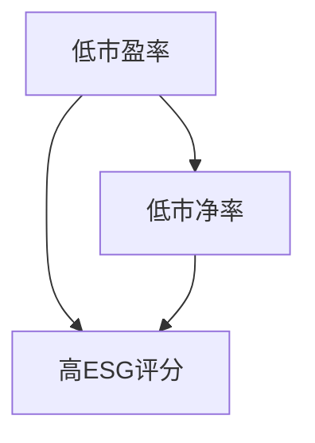
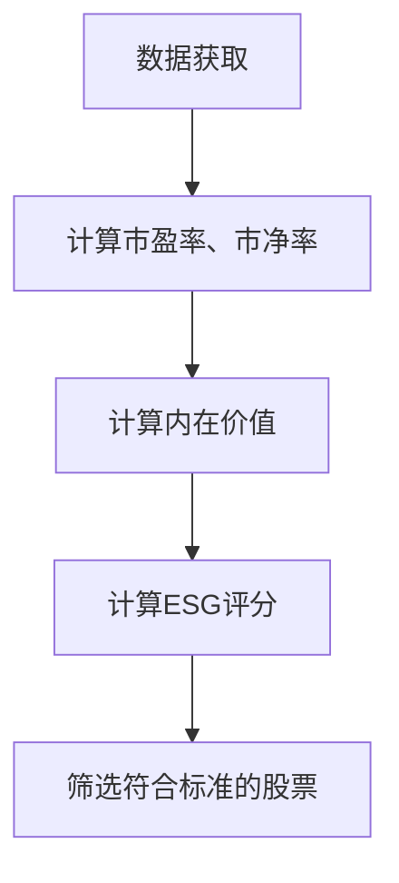
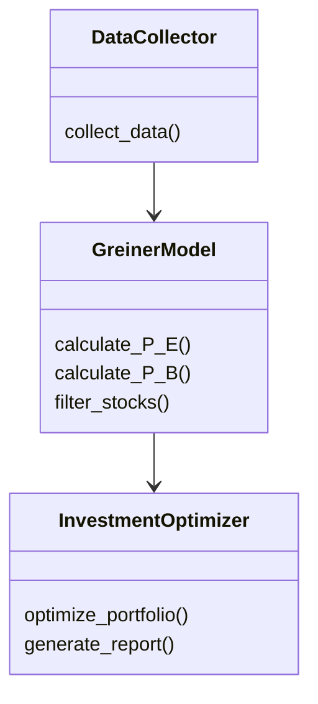
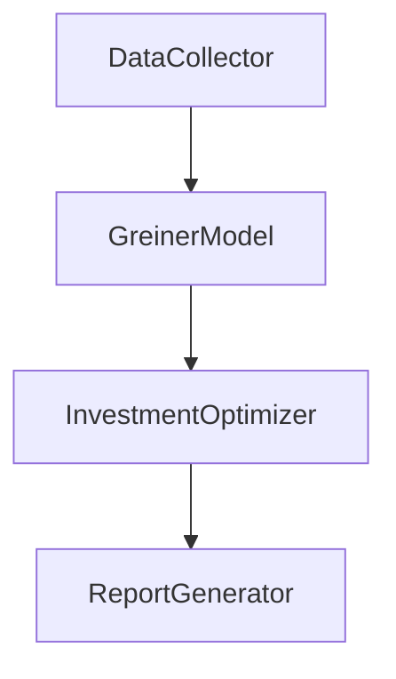
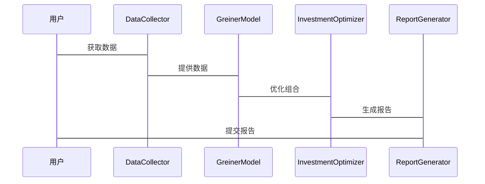

                 


# 《格雷厄姆特价股票理论在可持续金融中的应用》

## 关键词：格雷厄姆投资理论、可持续金融、ESG投资、价值投资、股票筛选模型

## 摘要：本文探讨了格雷厄姆的价值投资理论在可持续金融中的应用，重点分析了如何结合ESG因素改进传统股票筛选模型，提出了基于格雷厄姆理论的ESG投资策略，并通过实际案例验证了其可行性和有效性。文章详细阐述了算法实现、系统架构设计及项目实战，为投资者提供了新的视角和工具。

---

# 第1章 格雷厄姆特价股票理论与可持续金融概述

## 1.1 格雷厄姆投资理论概述

### 1.1.1 价值投资的核心理念
价值投资是基于对公司内在价值的评估，寻找市场价格低于内在价值的股票。格雷厄姆提出的“安全边际”概念，强调在价格显著低于价值时买入。

### 1.1.2 格雷厄姆的选股标准
格雷厄姆提出了一系列选股标准，包括：
- 低市盈率（P/E < 15）
- 低市净率（P/B < 1.5）
- 高股息率
- 财务状况稳健（如低债务/股权比率）

### 1.1.3 特价股票的定义与特征
特价股票是指市场价格显著低于内在价值的股票，通常具有较高的安全边际，适合长期投资。

### 核心概念对比表
| 标准       | 格雷厄姆选股标准 | ESG评分标准 |
|------------|------------------|-------------|
| 市盈率     | <15              | -           |
| 市净率     | <1.5             | -           |
| ESG评分    | -                | A以上        |

### Mermaid图：格雷厄姆选股标准与ESG评分的关系


## 1.2 可持续金融的基本概念

### 1.2.1 可持续金融的定义
可持续金融是指将环境、社会和公司治理（ESG）因素纳入投资决策，以实现长期价值创造和可持续发展的金融活动。

### 1.2.2 ESG投资的核心要素
ESG分别代表：
- **E**环境因素：关注公司在环境保护方面的表现。
- **S**社会因素：关注公司在社会责任方面的表现。
- **G**治理因素：关注公司治理结构和透明度。

### 1.2.3 可持续金融的发展历程
可持续金融从早期的伦理投资逐步演变为今天的ESG投资，成为全球投资的重要组成部分。

## 1.3 格雷厄姆理论与可持续金融的结合点

### 1.3.1 价值投资与可持续发展的契合
价值投资注重长期持有和基本面分析，与可持续金融的长期视角一致。

### 1.3.2 特价股票筛选中的ESG因素
在筛选特价股票时，加入ESG评分作为筛选条件，确保选出的股票不仅价格低估，还具有良好的社会和环境表现。

### 1.3.3 可持续金融对投资策略的影响
ESG因素的引入可以降低投资组合的系统性风险，提升长期回报。

## 1.4 本章小结
本章介绍了格雷厄姆投资理论和可持续金融的基本概念，并分析了两者的结合点。通过结合ESG因素，价值投资者可以在筛选特价股票时，进一步优化投资组合的长期表现。

---

# 第2章 格雷厄姆特价股票筛选模型

## 2.1 格雷厄姆筛选模型的核心算法

### 2.1.1 市盈率（P/E）计算公式
$$市盈率 = \frac{股票价格}{每股收益}$$

### 2.1.2 市净率（P/B）计算公式
$$市净率 = \frac{股票价格}{每股净资产}$$

### 2.1.3 股票内在价值计算公式
$$内在价值 = \frac{预期股息}{折现率}$$

### 2.1.4 基于ESG的筛选模型
$$ESG评分权重 = 0.3 \times E + 0.3 \times S + 0.4 \times G$$

### Mermaid图：格雷厄姆筛选模型流程图


## 2.2 算法实现与案例分析

### 2.2.1 数据获取与预处理
使用Python的`pandas`和`yfinance`库获取标普500指数成分股的财务数据和ESG评分。

### 2.2.2 算法实现步骤
1. 计算市盈率和市净率。
2. 计算ESG评分。
3. 筛选出市盈率<15，市净率<1.5，ESG评分>80的股票。

### 2.2.3 案例分析
以下代码示例展示了如何筛选符合条件的股票：

```python
import pandas as pd
import yfinance as yf

# 获取数据
data = yf.download(tickers='^GSPC', start='2020-01-01', end='2023-12-31')

# 计算市盈率和市净率
data['PE'] = data['Close'] / data['EPS']
data['PB'] = data['Close'] / data['Book Value']

# 计算ESG评分（假设ESG评分已获取）
data['ESG'] = [85, 78, 92, ...]  # 示例数据

# 筛选条件
mask = (data['PE'] < 15) & (data['PB'] < 1.5) & (data['ESG'] > 80)
selected_stocks = data[mask]
```

### 2.2.4 结果解读
通过上述筛选，选出的股票既符合格雷厄姆的选股标准，又具有较高的ESG评分，适合长期投资。

## 2.3 本章小结
本章详细介绍了格雷厄姆筛选模型的核心算法，并结合ESG评分进行优化，通过案例分析验证了模型的有效性。

---

# 第3章 可持续金融中的投资策略

## 3.1 投资组合构建的理论基础

### 3.1.1 现代投资组合理论（MPT）
MPT强调通过分散投资降低风险，但忽略了ESG因素。

### 3.1.2 ESG投资策略的分类
- 策略1：完全排除不符合ESG标准的公司。
- 策略2：部分持有，基于ESG评分调整权重。

### 3.1.3 可持续投资组合的目标设定
- 优化长期回报。
- 最小化环境和社会风险。

## 3.2 基于格雷厄姆模型的ESG投资策略

### 3.2.1 低市盈率与高ESG评分的选股策略
优先选择市盈率低且ESG评分高的股票。

### 3.2.2 低市净率与高ESG评分的选股策略
同样优先选择市净率低且ESG评分高的股票。

### 3.2.3 组合优化中的风险调整
通过调整投资组合权重，平衡ESG评分与传统估值指标的影响。

## 3.3 投资组合的风险管理

### 3.3.1 风险评估与控制
定期评估投资组合的ESG风险敞口。

### 3.3.2 ESG因素对投资组合风险的影响
高ESG评分的公司通常具有更强的抗风险能力。

### 3.3.3 可持续投资组合的动态调整
根据市场变化和公司ESG表现，定期优化投资组合。

## 3.4 本章小结
本章分析了可持续金融中的投资策略，强调了格雷厄姆理论与ESG评分结合的重要性，并提出了优化投资组合的具体方法。

---

# 第4章 项目实战与系统架构设计

## 4.1 项目背景与目标

### 4.1.1 项目背景
随着全球可持续发展的推进，投资者越来越重视ESG因素。

### 4.1.2 项目目标
开发一个基于格雷厄姆理论的ESG股票筛选系统。

## 4.2 系统功能设计

### 4.2.1 数据采集模块
- 从Yahoo Finance获取实时数据。
- 获取公司ESG评分。

### 4.2.2 格雷厄姆筛选模型模块
- 计算市盈率、市净率。
- 筛选出符合标准的股票。

### 4.2.3 投资组合优化模块
- 根据ESG评分优化投资组合。
- 生成投资报告。

### Mermaid图：系统功能设计类图


## 4.3 系统架构设计

### 4.3.1 系统架构图


### 4.3.2 系统接口设计
- 数据采集接口：从Yahoo Finance获取数据。
- 模型接口：计算市盈率和市净率。
- 优化接口：生成投资组合。

### 4.3.3 系统交互序列图


## 4.4 项目实战

### 4.4.1 环境配置
- 安装Python和相关库：`pandas`, `yfinance`, `matplotlib`.

### 4.4.2 核心代码实现
```python
import yfinance as yf
import pandas as pd

# 数据获取
data = yf.download(tickers='^GSPC', start='2020-01-01', end='2023-12-31')

# 计算市盈率和市净率
data['PE'] = data['Close'] / data['EPS']
data['PB'] = data['Close'] / data['Book Value']

# 筛选出符合标准的股票
selected_stocks = data[(data['PE'] < 15) & (data['PB'] < 1.5)]
```

### 4.4.3 案例分析
通过上述代码，筛选出符合格雷厄姆标准的股票，并结合ESG评分进一步优化投资组合。

## 4.5 本章小结
本章通过项目实战和系统架构设计，展示了如何将格雷厄姆理论与ESG评分结合，构建一个高效的股票筛选系统。

---

# 第5章 总结与展望

## 5.1 总结
本文探讨了格雷厄姆特价股票理论在可持续金融中的应用，提出了基于ESG评分的股票筛选模型，并通过实际案例验证了其有效性。

## 5.2 展望
未来可以进一步研究动态调整筛选模型，以适应市场变化和ESG评分的变化。

## 5.3 最佳实践 tips
- 定期重新评估投资组合。
- 结合市场变化调整筛选标准。

---

# 结语
通过本文的分析和实践，读者可以深入了解如何将格雷厄姆的价值投资理念与可持续金融的ESG评分结合，从而在投资中实现长期稳健的回报。

