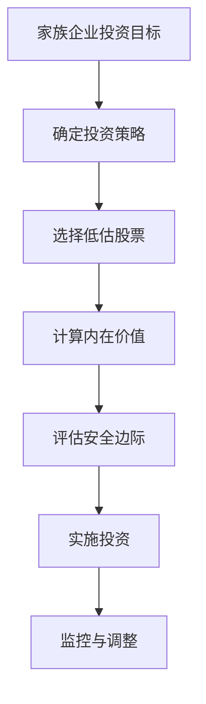

                 

<think>
好的，现在我需要根据用户的要求来逐步分析并撰写一篇关于《格雷厄姆特价股票理论在家族企业投资中的应用》的文章。首先，我需要理解用户的需求，明确文章的结构和内容。用户希望我以逻辑清晰、结构紧凑的方式进行分析，并使用专业但易懂的语言来撰写。

### 第一步：明确文章的背景和目标
格雷厄姆的特价股票理论是一种价值投资方法，专注于寻找市场低估的股票。这种理论在个人投资者中非常流行，但将其应用于家族企业投资中还存在一定的挑战。家族企业通常具有长期投资的需求和独特的目标，因此需要对格雷厄姆的理论进行调整和优化。

### 第二步：确定文章的结构
根据用户提供的目录大纲，我需要按照以下章节进行撰写：
1. **引言**：介绍家族企业投资的重要性和格雷厄姆理论的基本概念。
2. **格雷厄姆特价股票理论的背景与核心思想**：详细阐述格雷厄姆的投资理念和其在家族企业中的应用。
3. **家族企业投资中的特价股票策略**：分析如何将格雷厄姆的理论应用到家族企业的投资中。
4. **案例分析**：通过实际案例说明理论的应用和效果。
5. **风险管理与长期策略**：讨论在家族企业投资中如何控制风险并制定长期策略。
6. **总结与展望**：总结文章的主要观点，并展望未来的发展。

### 第三步：详细撰写每个章节
#### 第1章：家族企业与投资概述
- **1.1 家族企业的特点与投资需求**
  - 家族企业的定义和特点：家族企业是由家族控制的企业，具有长期性和稳定性需求。
  - 投资的重要性：家族企业需要通过投资实现财富的保值和增值。
  
- **1.2 家族企业投资的重要性**
  - 投资目标：实现财富的长期增长和家族的可持续发展。
  - 投资的长期性：家族企业通常注重长期投资，以确保企业的稳定性和传承性。

#### 第2章：格雷厄姆投资理论的背景与核心思想
- **2.1 格雷厄姆的生平与贡献**
  - 格雷厄姆是价值投资的鼻祖，他的理论对投资领域产生了深远影响。
  
- **2.2 格雷厄姆投资理论的核心思想**
  - 价值投资的基本理念：寻找市场低估的股票，注重内在价值。
  - 安全边际：通过购买低于内在价值的股票来降低风险。
  - 市场波动：市场短期波动不影响股票的内在价值。

#### 第3章：特价股票理论的定义与分析方法
- **3.1 特价股票的定义**
  - 特价股票是市场低估的股票，具有较高的投资价值。
  
- **3.2 内在价值的计算方法**
  - 内在价值公式：$$ V = \frac{E}{k} $$
  - 其中，E是企业的预期收益，k是资本成本。

#### 第4章：家族企业投资中的特价股票策略
- **4.1 家族企业投资中的特价股票策略**
  - 结合家族企业的长期目标，选择具有稳定收益和低估价格的股票。
  
- **4.2 风险控制**
  - 通过分散投资和安全边际来降低风险。

#### 第5章：案例分析
- **5.1 成功案例分析**
  - 某家族企业通过应用格雷厄姆理论成功实现了投资回报。
  
- **5.2 失败案例分析**
  - 某家族企业在应用格雷厄姆理论时忽视了市场变化，导致投资失败。

#### 第6章：风险管理与长期策略
- **6.1 家族企业投资中的主要风险**
  - 市场风险、信用风险、操作风险。
  
- **6.2 格雷厄姆理论中的风险管理方法**
  - 通过安全边际和分散投资来控制风险。

### 第四步：系统分析与架构设计方案
为了更好地理解格雷厄姆理论在家族企业中的应用，我将使用Mermaid图来展示系统的架构和流程。

### 第五步：项目实战
我将通过一个具体的家族企业案例来展示格雷厄姆理论的应用。例如，假设某家族企业希望投资一家低估的制造业公司，以下是投资步骤：

1. **确定投资目标**：寻找具有稳定收益和低估价格的制造业公司。
2. **选择低估股票**：通过分析市场数据，选择一家市盈率低于行业平均水平的公司。
3. **计算内在价值**：使用格雷厄姆的内在价值公式，计算该公司的内在价值。
4. **评估安全边际**：确保购买价格低于内在价值，以降低投资风险。
5. **实施投资**：将家族企业的部分资金投入到该股票中。
6. **监控与调整**：定期监控股票的市场表现和公司财务状况，根据需要进行调整。

### 第六步：总结与展望
通过本文的分析，可以看出格雷厄姆特价股票理论在家族企业投资中的应用具有重要的现实意义。家族企业可以通过这种方法实现财富的长期增长和风险控制。未来，随着市场环境的变化，家族企业需要不断优化其投资策略，以应对新的挑战和机遇。

### 第七步：编写完整的文章
根据上述分析，我将撰写完整的文章，确保每个部分都详细且逻辑清晰。

---

**文章标题：格雷厄姆特价股票理论在家族企业投资中的应用**

**关键词：家族企业、投资策略、格雷厄姆理论、内在价值、安全边际**

**摘要：**  
本文探讨了格雷厄姆特价股票理论在家族企业投资中的应用，分析了家族企业的特点与投资需求，详细阐述了格雷厄姆投资理论的核心思想，并结合实际案例，说明了如何将格雷厄姆理论应用于家族企业投资中。通过系统分析和案例研究，本文提出了风险管理与长期投资策略，为家族企业提供了一套可行的投资方法。

---

**第1章：家族企业与投资概述**

#### 1.1 家族企业的特点与投资需求
- **1.1.1 家族企业的定义**  
  家族企业是由家族成员控股或控制的企业，具有长期性和稳定性需求。
  
- **1.1.2 家族企业的核心特征**  
  - 股权集中：家族成员通常持有企业大部分股权。
  - 长期性：家族企业注重长期发展和传承。
  - 独特目标：家族企业通常具有明确的投资目标和价值观。

- **1.1.3 家族企业在投资中的特殊需求**  
  - 投资目标：实现财富的保值和增值。
  - 风险控制：注重投资的稳定性，避免重大风险。

#### 1.2 家族企业投资的重要性
- **1.2.1 家族企业投资的目标**  
  家族企业投资的目标是实现财富的长期增长和企业的可持续发展。
  
- **1.2.2 家族企业投资的长期性**  
  家族企业投资注重长期性，避免短期波动对投资目标的影响。

- **1.2.3 家族企业投资的风险管理**  
  家族企业需要通过科学的投资策略和风险控制方法，确保投资的安全性和稳定性。

---

**第2章：格雷厄姆投资理论的背景与核心思想**

#### 2.1 格雷厄姆的生平与贡献
- **2.1.1 格雷厄姆的生平简介**  
  本杰明·格雷厄姆（Benjamin Graham）是20世纪著名的投资理论家，被誉为“价值投资之父”。他提出的格雷厄姆-多德价值投资理论对全球投资界产生了深远影响。
  
- **2.1.2 格雷厄姆对投资理论的贡献**  
  格雷厄姆提出了价值投资的理念，强调寻找市场低估的股票，并通过安全边际来降低投资风险。

#### 2.2 格雷厄姆投资理论的核心思想
- **2.2.1 价值投资的基本理念**  
  价值投资的核心理念是寻找市场低估的股票，即股票的市场价格低于其内在价值。

- **2.2.2 格雷厄姆的“安全边际”概念**  
  安全边际是指股票的市场价格与内在价值之间的差额，通过安全边际来降低投资风险。

- **2.2.3 格雷厄姆对市场波动的看法**  
  格雷厄姆认为，市场短期波动不可预测，但长期趋势可以通过基本面分析来把握。

---

**第3章：特价股票理论的定义与分析方法**

#### 3.1 特价股票的定义
- **3.1.1 特价股票的定义**  
  特价股票是指市场价格低于内在价值的股票，具有较高的投资价值。

- **3.1.2 特价股票的特征**  
  - 市盈率低：市盈率低于行业平均水平。
  - 市净率低：市净率低于行业平均水平。
  - 股息率高：股息率高于行业平均水平。

#### 3.2 内在价值的计算方法
- **3.2.1 内在价值的定义**  
  内在价值是指股票在长期稳定经营下的合理价值。

- **3.2.2 内在价值的计算公式**  
  $$ V = \frac{E}{k} $$
  其中，E是企业的预期收益，k是资本成本。

- **3.2.3 内在价值计算的步骤**  
  1. 估计企业的预期收益。
  2. 估计企业的资本成本。
  3. 计算内在价值。

---

**第4章：家族企业投资中的特价股票策略**

#### 4.1 家族企业投资中的特价股票策略
- **4.1.1 家族企业投资中的特价股票策略概述**  
  家族企业可以通过寻找市场低估的股票，实现财富的长期增长。

- **4.1.2 特价股票策略与家族企业目标的结合**  
  家族企业应根据自身的投资目标和风险承受能力，选择适合的特价股票。

- **4.1.3 特价股票策略的实施步骤**  
  1. 确定投资目标。
  2. 选择低估股票。
  3. 计算内在价值。
  4. 评估安全边际。
  5. 实施投资。

#### 4.2 家族企业投资中的风险控制
- **4.2.1 家族企业投资中的主要风险**  
  - 市场风险：股票价格的波动可能影响投资收益。
  - 信用风险：企业财务状况的变化可能影响股票价值。
  - 操作风险：投资决策中的错误可能影响投资结果。

- **4.2.2 格雷厄姆理论中的风险管理方法**  
  - 安全边际：通过购买低于内在价值的股票来降低风险。
  - 分散投资：通过投资多种股票来分散风险。

---

**第5章：案例分析**

#### 5.1 成功案例分析
- **5.1.1 某家族企业的投资案例**  
  某家族企业通过应用格雷厄姆理论，成功投资于一家低估的制造业公司，实现了较高的投资回报。

- **5.1.2 案例中的特价股票策略应用**  
  该家族企业通过分析市场数据，选择市盈率和市净率低于行业平均水平的公司，并计算其内在价值，确保购买价格低于内在价值。

#### 5.2 失败案例分析
- **5.2.1 某家族企业在投资中的失败案例**  
  某家族企业在应用格雷厄姆理论时，忽视了市场变化，导致投资失败。

- **5.2.2 失败案例的原因分析**  
  该家族企业未能及时调整投资策略，未能有效控制投资风险。

---

**第6章：风险管理与长期策略**

#### 6.1 家族企业投资中的风险管理
- **6.1.1 家族企业投资中的主要风险**  
  - 市场风险：股票价格的波动可能影响投资收益。
  - 信用风险：企业财务状况的变化可能影响股票价值。
  - 操作风险：投资决策中的错误可能影响投资结果。

- **6.1.2 格雷厄姆理论中的风险管理方法**  
  - 安全边际：通过购买低于内在价值的股票来降低风险。
  - 分散投资：通过投资多种股票来分散风险。

#### 6.2 格雷厄姆理论中的长期投资策略
- **6.2.1 长期投资策略的实施**  
  家族企业应注重长期投资，避免短期波动对投资目标的影响。

- **6.2.2 投资策略的优化**  
  家族企业应根据市场环境的变化，不断优化投资策略，以应对新的挑战和机遇。

---

**总结与展望**

通过本文的分析，可以看出格雷厄姆特价股票理论在家族企业投资中的应用具有重要的现实意义。家族企业可以通过应用格雷厄姆理论，实现财富的长期增长和风险控制。未来，随着市场环境的变化，家族企业需要不断优化其投资策略，以应对新的挑战和机遇。

---

**附录**

- **附录A：格雷厄姆内在价值计算公式**  
  $$ V = \frac{E}{k} $$
  其中，E是企业的预期收益，k是资本成本。

- **附录B：案例分析的详细数据**  
  通过具体的数据分析，说明如何应用格雷厄姆理论进行投资决策。

---

**后记**

格雷厄姆特价股票理论在家族企业投资中的应用是一项复杂的系统工程，需要家族企业在实践中不断探索和优化。希望通过本文的分析，能够为家族企业提供有益的指导和启示。

