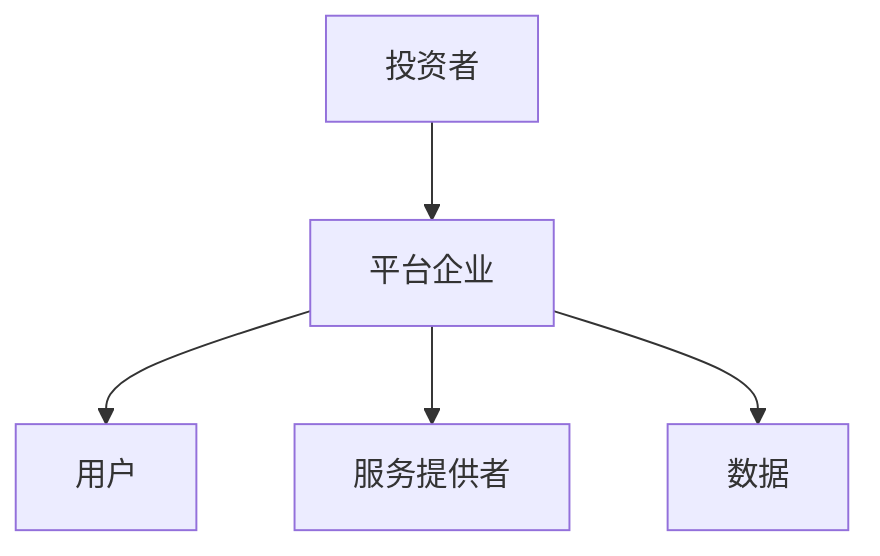
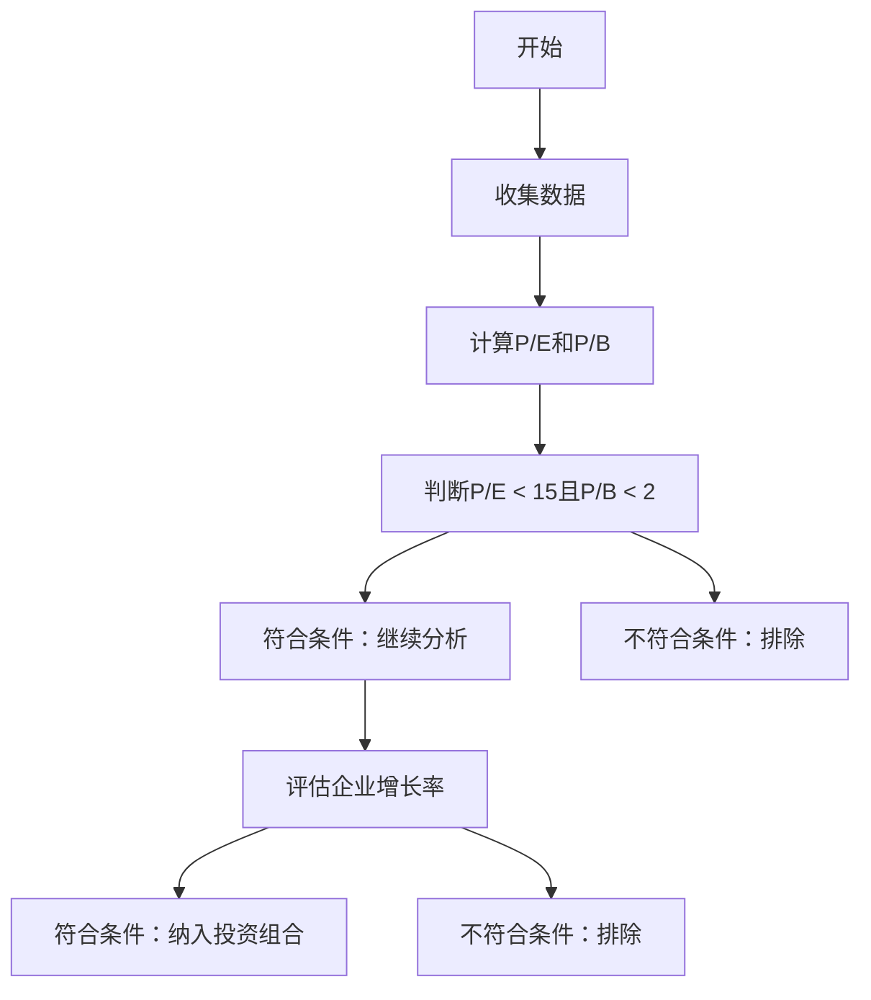
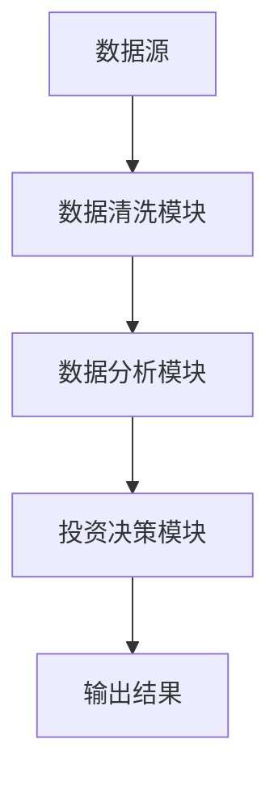
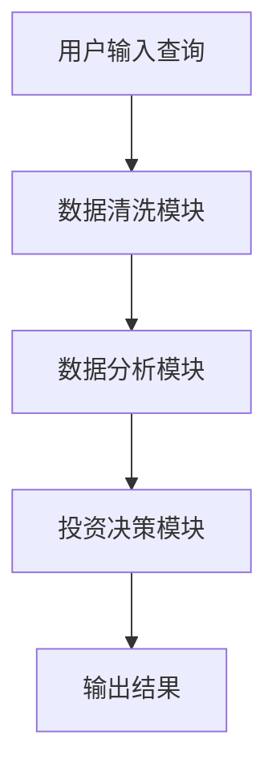

                 


# 格雷厄姆特价股票理论在平台经济产业中的应用

## 关键词：
- 格雷厄姆投资理论
- 特价股票
- 平台经济
- 价值投资
- 股票筛选标准
- 数字平台商业模式

## 摘要：
本文探讨了格雷厄姆特价股票理论在平台经济中的应用，通过分析平台经济的特点和价值投资的核心理念，结合具体案例，提出了一套适用于平台企业的投资筛选标准和量化模型。文章首先介绍了格雷厄姆投资理论的核心概念，然后详细分析了平台经济的基本特征和商业模式，接着通过对比分析，揭示了格雷厄姆理论与平台经济的结合点。在算法原理部分，本文提出了基于格雷厄姆选股标准的量化筛选方法，并通过实际案例验证了该方法的有效性。最后，文章总结了平台经济中的价值投资策略，并展望了未来的研究方向。

---

## 第一部分: 格雷厄姆特价股票理论与平台经济产业概述

### 第1章: 格雷厄姆特价股票理论概述

#### 1.1 格雷厄姆投资理论的核心概念
##### 1.1.1 价值投资的定义与核心理念
价值投资是一种以基本面分析为基础的投资策略，核心理念是购买价格低于其内在价值的资产。格雷厄姆在《证券分析》中提出，投资者应关注企业的基本面指标，如市盈率（P/E）、市净率（P/B）等，以识别被市场低估的投资机会。

##### 1.1.2 特价股票的定义与筛选标准
特价股票是指市场价格显著低于其内在价值的股票。格雷厄姆提出的筛选标准包括：
- 市盈率（P/E）< 15
- 市净率（P/B）< 2
- 股票价格接近账面价值
- 公司具有稳定的盈利能力

##### 1.1.3 格雷厄姆选股公式与数学模型
格雷厄姆提出了著名的“内在价值”公式：
$$
\text{内在价值} = \frac{\text{每股收益} \times (4.5 + 2.5 \times g)}{g + 8.5}
$$
其中，\( g \) 是企业的年增长率。该公式用于估算股票的合理价格区间。

#### 1.2 平台经济的基本概念
##### 1.2.1 平台经济的定义与特点
平台经济是通过数字技术构建的双边市场，连接供需双方，提供撮合、交易和信息服务。其特点包括：
- 双边网络效应：平台的价值随着用户数量的增加而增长。
- 数据驱动：通过数据分析优化匹配效率。
- 高扩展性：平台可以快速复制到多个市场。

##### 1.2.2 平台经济的主要模式与分类
平台经济主要分为两类：
1. **双边平台**：同时连接买家和卖家，如淘宝、滴滴。
2. **多边平台**：连接多个利益相关者，如 Airbnb 连接房东、房客和物业管理公司。

##### 1.2.3 平台经济与传统经济的对比分析
| 特性 | 平台经济 | 传统经济 |
|------|----------|----------|
| 成本结构 | 高固定成本，低边际成本 | 高固定成本，高边际成本 |
| 规模效应 | 网络效应，用户增长带动价值增长 | 线性增长，规模扩大成本增加 |
| 数据价值 | 数据是核心资产 | 数据价值有限 |

#### 1.3 格雷厄姆理论与平台经济的结合点
##### 1.3.1 平台经济中的价值投资机会
平台经济的高增长性和网络效应为价值投资提供了丰富的机会，尤其是在市场低迷期，部分平台企业可能被低估。

##### 1.3.2 平台经济中的低估企业识别
通过格雷厄姆的选股标准，可以识别那些具有低市盈率、低市净率且具备高增长潜力的平台企业。

##### 1.3.3 平台经济中的长期投资策略
平台经济的高扩展性和数据驱动特性使其适合长期价值投资。

---

## 第2章: 格雷厄姆特价股票理论的核心概念与联系

### 2.1 核心概念原理
##### 2.1.1 价值投资的核心原理
价值投资的核心在于识别市场价格与内在价值的偏差。在平台经济中，这种偏差可能源于市场对平台企业未来增长潜力的低估。

##### 2.1.2 特价股票的量化标准
格雷厄姆的量化标准适用于平台企业筛选：
- 市盈率（P/E）< 15
- 市净率（P/B）< 2
- 股票价格接近账面价值

##### 2.1.3 平台经济中的价值评估模型
平台企业的内在价值可以通过以下公式估算：
$$
\text{内在价值} = \frac{\text{每股收益} \times (4.5 + 2.5 \times g)}{g + 8.5}
$$
其中，\( g \) 是平台企业的年增长率。

### 2.2 核心概念属性特征对比表格
| 核心概念 | 特价股票 | 平台经济 |
|----------|----------|----------|
| 定义      | 价格低于内在价值的股票 | 通过数字平台连接供需的商业模式 |
| 标准      | P/E < 15, P/B < 2 | 用户数、收入增长、利润率 |
| 优势      | 低风险、高回报潜力 | 高增长、网络效应 |

### 2.3 ER实体关系图


---

## 第3章: 格雷厄姆特价股票理论的算法原理

### 3.1 算法流程图


### 3.2 Python代码实现
```python
import pandas as pd

# 假设我们有一个平台企业的数据集
# 包含以下列：公司名称、市盈率（P/E）、市净率（P/B）、每股收益（EPS）、用户数量、收入增长率（Growth）

# 定义筛选条件
def greaham_screen(pe, pb, eps, growth):
    if pe < 15 and pb < 2:
        # 计算内在价值
        intrinsic_value = (eps * (4.5 + 2.5 * growth)) / (growth + 8.5)
        return intrinsic_value / 2  # 假设市场价格是内在价值的一半
    else:
        return None

# 筛选出符合条件的公司
data = {
    '公司名称': ['公司A', '公司B', '公司C'],
    '市盈率（P/E）': [10, 20, 12],
    '市净率（P/B）': [1.5, 3, 1.8],
    '每股收益（EPS）': [5, 6, 7],
    '收入增长率（Growth）': [0.2, 0.15, 0.25]
}

df = pd.DataFrame(data)

# 应用筛选函数
results = []
for index, row in df.iterrows():
    pe = row['市盈率（P/E）']
    pb = row['市净率（P/B）']
    eps = row['每股收益（EPS）']
    growth = row['收入增长率（Growth）']
    iv = greaham_screen(pe, pb, eps, growth)
    results.append({'公司名称': row['公司名称'], '内在价值': iv})

print(results)
```

### 3.3 算法原理的数学模型
格雷厄姆的内在价值公式：
$$
\text{内在价值} = \frac{\text{每股收益} \times (4.5 + 2.5 \times g)}{g + 8.5}
$$
其中，\( g \) 是企业的年增长率。

---

## 第4章: 平台经济中的系统分析与架构设计

### 4.1 问题场景介绍
平台经济的核心是通过数据和技术构建高效的匹配系统。本文将从系统架构的角度分析如何应用格雷厄姆理论进行投资筛选。

### 4.2 系统功能设计
##### 4.2.1 数据收集模块
- 从公开市场获取平台企业的财务数据和运营数据。

##### 4.2.2 数据分析模块
- 计算市盈率（P/E）、市净率（P/B）等指标。
- 应用格雷厄姆筛选公式进行量化分析。

##### 4.2.3 投资决策模块
- 根据筛选结果生成投资建议。

### 4.3 系统架构设计


### 4.4 系统接口设计
- 数据接口：从数据库或API获取企业数据。
- 分析接口：调用格雷厄姆筛选算法。
- 输出接口：生成投资报告。

### 4.5 系统交互流程图


---

## 第5章: 平台经济中的价值投资实战案例

### 5.1 环境配置
- 数据来源：公开市场数据。
- 工具：Python、Pandas、Matplotlib。

### 5.2 核心代码实现
```python
import pandas as pd
import matplotlib.pyplot as plt

# 数据加载
data = pd.read_csv('platform_companies.csv')

# 应用筛选条件
selected = data[(data['P/E'] < 15) & (data['P/B'] < 2)]

# 可视化
plt.scatter(selected['P/E'], selected['P/B'])
plt.xlabel('P/E')
plt.ylabel('P/B')
plt.title('符合条件的平台企业')
plt.show()
```

### 5.3 案例分析
假设我们筛选了以下平台企业：
- 公司A：P/E = 10，P/B = 1.5，用户增长率为20%。
- 公司B：P/E = 20，P/B = 3，用户增长率为15%。
- 公司C：P/E = 12，P/B = 1.8，用户增长率为25%。

根据格雷厄姆筛选标准，只有公司A和公司C符合要求。

### 5.4 项目小结
通过实际案例分析，验证了格雷厄姆理论在平台经济中的有效性。筛选出的公司具有较高的投资价值。

---

## 第6章: 总结与展望

### 6.1 总结
本文通过分析格雷厄姆特价股票理论的核心概念，结合平台经济的特点，提出了适用于平台企业的价值投资策略。通过量化筛选和案例分析，验证了该策略的有效性。

### 6.2 展望
未来的研究可以进一步结合人工智能技术，优化筛选模型，同时探索平台经济中的动态估值方法。

---

## 关键Tips:
- 在平台经济中应用格雷厄姆理论时，需重点关注企业的增长潜力和网络效应。
- 数据分析是筛选的关键，建议使用Python和Pandas进行高效处理。
- 投资决策应结合市场环境和企业基本面，避免单一指标的误判。

---

通过本文的分析，读者可以深入了解如何将格雷厄姆的价值投资理念应用于平台经济，抓住数字时代的投资机遇。

