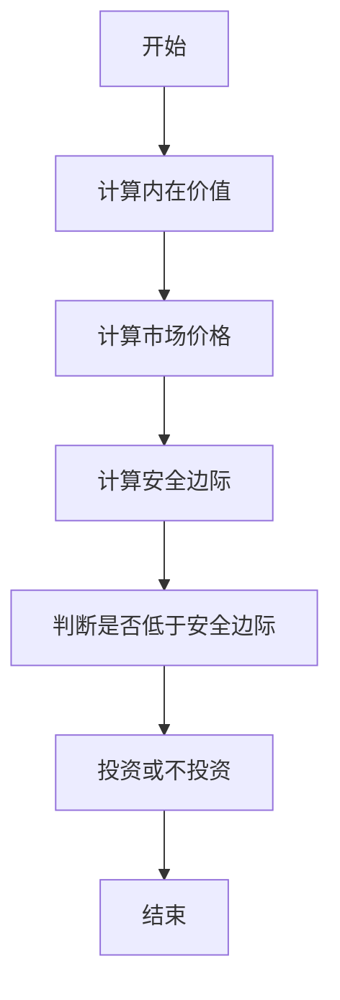
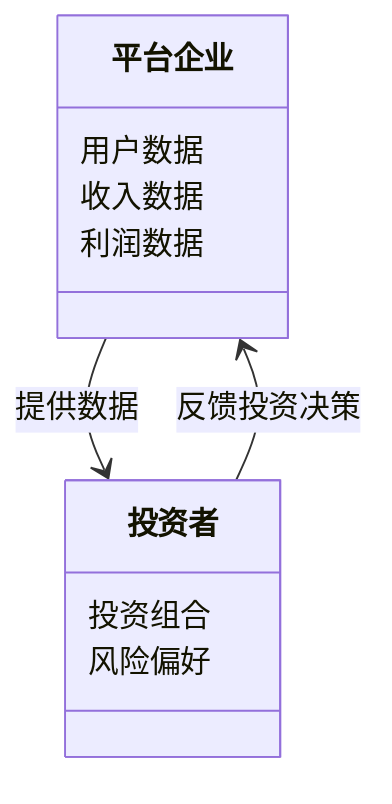

                 


# 《格雷厄姆特价股票理论在平台经济时代的新思考》

## 关键词：格雷厄姆特价股票理论, 平台经济, 价值投资, 算法原理, 系统架构, 项目实战

## 摘要：  
本文深入探讨了格雷厄姆特价股票理论在平台经济时代的应用与演变。通过分析平台经济的特点，结合格雷厄姆的价值投资理念，提出了一套适用于平台企业的投资分析模型。文章从理论基础、算法原理、系统架构到项目实战，全面阐述了如何将传统金融理论与现代经济模式相结合，为投资者提供了新的视角和方法。

---

## 目录大纲

### 第一部分：格雷厄姆特价股票理论的背景与基础

#### 第1章：格雷厄姆特价股票理论概述

##### 1.1 格雷厄姆特价股票理论的起源
- 1.1.1 本杰明·格雷厄姆的生平与贡献
- 1.1.2 格雷厄姆投资理念的核心思想
- 1.1.3 特价股票的定义与特征

##### 1.2 平台经济时代的投资新机遇
- 1.2.1 平台经济的定义与特点
- 1.2.2 平台经济与传统经济的对比
- 1.2.3 平台经济时代投资环境的变化

#### 第2章：格雷厄姆特价股票理论的核心概念

##### 2.1 格雷厄姆投资理论的核心要素
- 2.1.1 安全边际的概念与计算
- 2.1.2 内在价值的定义与计算公式
- 2.1.3 市场先生的比喻与投资决策

##### 2.2 平台经济中的价值评估指标
- 2.2.1 用户规模与粘性的评估方法
- 2.2.2 收入与利润模式的分析
- 2.2.3 技术壁垒与竞争优势的衡量

#### 第3章：格雷厄姆特价股票理论的数学模型与算法原理

##### 3.1 格雷厄姆选股模型的数学公式
- 3.1.1 内在价值的计算公式
  $$ V = \frac{E}{(1 + r)^n} $$
  其中，\( V \) 为内在价值，\( E \) 为未来现金流，\( r \) 为折现率，\( n \) 为时间跨度。

- 3.1.2 安全边际的计算公式
  $$ \text{安全边际} = \frac{\text{内在价值} - \text{市场价格}}{\text{市场价格}} $$

##### 3.2 平台经济中的价值评估算法
- 3.2.1 用户价值评估的公式
  $$ \text{用户价值} = \frac{\text{用户生命周期价值}}{\text{用户获取成本}} $$

- 3.2.2 平台企业的盈利能力分析
  $$ \text{ROE} = \frac{\text{净利润}}{\text{股东权益}} $$

##### 3.3 算法原理的 Mermaid 流程图


---

### 第二部分：平台经济时代格雷厄姆理论的应用

#### 第4章：平台经济中的系统分析与架构设计

##### 4.1 平台经济的系统分析
- 4.1.1 平台经济的核心要素与关系
- 4.1.2 平台经济的业务模式与盈利点

##### 4.2 系统架构设计
- 4.2.1 平台经济的系统功能模块
  - 数据采集模块
  - 估值模型模块
  - 风险评估模块

- 4.2.2 系统架构的 Mermaid 类图


#### 第5章：项目实战与案例分析

##### 5.1 项目背景与目标
- 5.1.1 项目目标：应用格雷厄姆理论分析某平台企业的投资价值
- 5.1.2 数据来源：公开财务数据与用户行为数据

##### 5.2 项目实现
- 5.2.1 数据采集与清洗
  ```python
  import pandas as pd
  data = pd.read_csv('platform_company.csv')
  data_clean = data.dropna()
  ```

- 5.2.2 估值模型的实现
  ```python
  def calculate_intrinsic_value(earnings, discount_rate, years):
      return earnings / (1 + discount_rate) ** years
  ```

##### 5.3 实际案例分析
- 5.3.1 某平台企业的财务数据分析
- 5.3.2 投资价值评估与决策

#### 第6章：最佳实践与投资策略

##### 6.1 投资策略的制定
- 6.1.1 理性投资的重要性
- 6.1.2 风险控制的策略
- 6.1.3 长期持有的意义

##### 6.2 小结与注意事项
- 6.2.1 格雷厄姆理论的局限性
- 6.2.2 平台经济中的特殊风险
- 6.2.3 投资者的自我认知与能力提升

---

### 第三部分：未来展望与总结

#### 第7章：格雷厄姆理论在平台经济中的未来展望

##### 7.1 技术进步对投资理论的影响
- 7.1.1 人工智能在投资分析中的应用
- 7.1.2 大数据技术对价值评估的支持

##### 7.2 平台经济的发展趋势
- 7.2.1 新兴行业的崛起
- 7.2.2 全球化与本地化的平衡

#### 第8章：总结与致谢

##### 8.1 本文的总结
- 格雷厄姆理论的现代应用
- 平台经济中的投资新机遇

##### 8.2 致谢
- 感谢读者的支持
- 感谢研究团队的努力

---

## 总结：
本文通过理论分析、算法设计、系统架构和项目实战，全面探讨了格雷厄姆特价股票理论在平台经济时代的新应用。通过数学模型、Mermaid 流程图和 Python 代码的结合，为投资者提供了新的视角和方法，帮助他们在复杂多变的经济环境中做出明智的投资决策。

