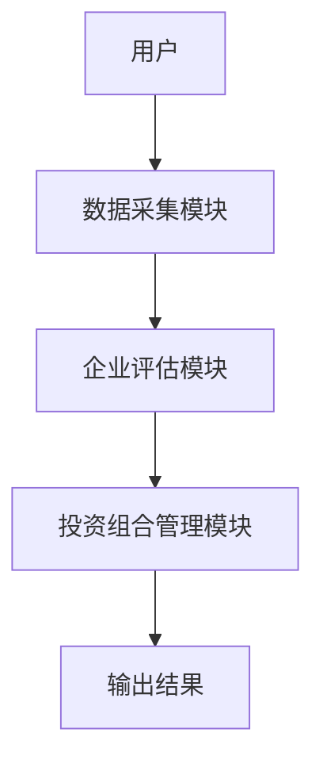
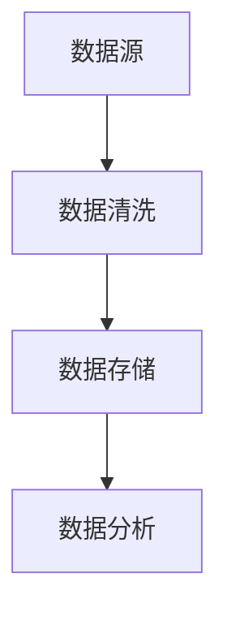
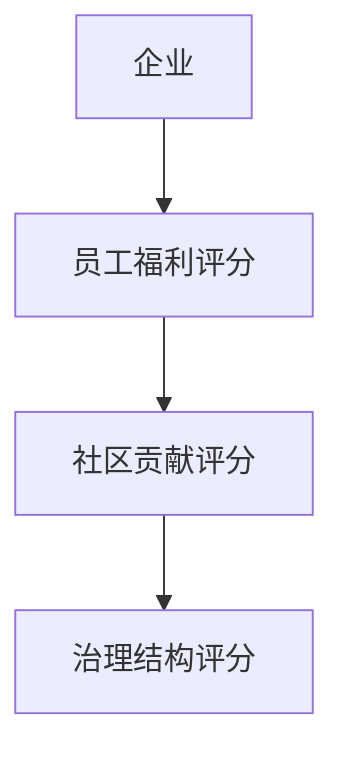

                 

# 格雷厄姆特价股票理论在影响力投资中的应用

> 关键词：格雷厄姆投资理论，影响力投资，特价股票，价值评估，社会责任

> 摘要：本文探讨了格雷厄姆特价股票理论在影响力投资中的应用。通过分析影响力投资的核心概念和格雷厄姆理论的核心要素，结合数学模型和系统架构，详细阐述了如何在影响力投资中应用格雷厄姆的选股策略，构建具有社会责任感和长期价值的投资组合。

---

## 第1章: 影响力投资的背景与核心概念

### 1.1 影响力投资的定义与背景

影响力投资是一种将资金投资于能够产生积极社会和环境影响的企业或项目，同时追求财务回报的投资策略。其核心在于将社会责任与经济效益相结合，推动社会进步和可持续发展。

#### 1.1.1 影响力投资的起源与发展

影响力投资的起源可以追溯到20世纪60年代的环境运动和社会运动。随着全球性问题（如气候变化、贫富差距、环境污染等）的加剧，投资者开始关注企业对社会和环境的影响。2007年，影响力投资的概念首次被正式提出，并逐渐成为全球投资领域的重要趋势。

#### 1.1.2 影响力投资的核心目标

影响力投资的目标是通过投资实现以下三个维度的平衡：
- **环境**：减少碳足迹，保护生态系统。
- **社会**：促进社会公平，支持弱势群体。
- **治理**：提升企业透明度和责任感。

#### 1.1.3 影响力投资与传统投资的对比

与传统投资相比，影响力投资更加注重企业的社会价值和长期可持续性。传统投资通常只关注财务回报，而影响力投资则要求企业在创造经济价值的同时，也要承担社会责任。

---

### 1.2 格雷厄姆特价股票理论的核心要素

格雷厄姆是价值投资的鼻祖，其核心理念是寻找市场低估的股票，即“特价股票”。他认为，市场的短期波动性为投资者提供了以低于内在价值的价格买入优质股票的机会。

#### 1.2.1 格雷厄姆投资理念的概述

格雷厄姆的投资理念可以总结为以下几点：
1. **安全边际**：买入价格低于内在价值的股票，以确保投资的安全性。
2. **长期视角**：忽略市场的短期波动，关注企业的长期价值。
3. **价值评估**：通过分析企业的财务数据，估算其内在价值。

#### 1.2.2 特价股票的定义与特征

特价股票是指市场价格低于其内在价值的股票。以下是特价股票的几个特征：
- **低市盈率**：市盈率低于行业平均水平。
- **低市净率**：市净率低于行业平均水平。
- **高分红率**：股息收益率较高。

#### 1.2.3 格雷厄姆投资策略的优缺点

**优点**：
- 通过安全边际降低投资风险。
- 适合长期投资者。

**缺点**：
- 需要较高的市场分析能力。
- 短期市场波动可能影响投资回报。

---

## 第2章: 格雷厄姆理论与影响力投资的联系

### 2.1 格雷厄姆理论在影响力投资中的应用

格雷厄姆的理论为影响力投资提供了一种新的视角，即在追求社会价值的同时，寻找具有长期投资价值的企业。

#### 2.1.1 格雷厄姆理论与影响力投资的契合点

- **长期价值**：格雷厄姆关注企业的长期价值，而影响力投资也强调企业的长期可持续性。
- **价值评估**：格雷厄姆的内在价值评估方法可以帮助投资者筛选出具有社会价值和投资价值的企业。

#### 2.1.2 影响力投资中的价值评估方法

以下是影响力投资中常用的几种价值评估方法：
- **环境、社会和治理（ESG）评分**：通过对企业在环境、社会和治理方面的表现进行评分，筛选出表现优异的企业。
- **影响力投资指数**：通过构建影响力投资指数，衡量企业的社会影响力。

#### 2.1.3 特价股票筛选的标准与流程

以下是格雷厄姆理论在影响力投资中的应用流程：
1. **筛选企业**：选择具有社会责任感且市场低估的企业。
2. **评估企业价值**：通过内在价值评估方法，估算企业的真正价值。
3. **构建投资组合**：将具有长期投资价值的企业纳入投资组合。

---

### 2.2 影响力投资中的企业评估框架

#### 2.2.1 企业影响力评估指标

以下是影响力投资中常用的几种评估指标：
- **环境指标**：碳排放、能源消耗等。
- **社会指标**：员工福利、社区贡献等。
- **治理指标**：董事会结构、透明度等。

#### 2.2.2 企业治理结构与社会责任

企业治理结构是衡量企业社会责任的重要指标。一个高效的治理结构可以确保企业能够更好地履行社会责任。

#### 2.2.3 企业财务健康状况的评估

财务健康状况是企业长期价值的重要组成部分。以下是常用的财务评估指标：
- **盈利能力**：净利润率、ROE等。
- **偿债能力**：资产负债率、流动比率等。
- **运营效率**：存货周转率、应收账款周转率等。

---

## 第3章: 格雷厄姆特价股票筛选的数学模型与算法

### 3.1 格雷厄姆投资模型的数学公式

#### 3.1.1 内在价值计算公式

格雷厄姆的内在价值计算公式如下：

$$
\text{内在价值} = \frac{\text{每股收益} \times (2.5 \times \text{市盈率} + \text{股息率})}{2}
$$

#### 3.1.2 安全边际计算公式

安全边际可以通过以下公式计算：

$$
\text{安全边际} = \text{内在价值} - \text{市场价格}
$$

#### 3.1.3 市盈率与市净率的比较

市盈率（P/E）和市净率（P/B）是常用的估值指标。以下是两者的比较：

| 指标 | 公式 | 适用场景 |
|------|------|----------|
| P/E  | $$\frac{\text{股价}}{\text{每股收益}}$$ | 适用于盈利稳定的公司 |
| P/B  | $$\frac{\text{股价}}{\text{每股净资产}}$$ | 适用于资产密集型公司 |

---

### 3.2 影响力投资中的评分系统

#### 3.2.1 企业影响力评分模型

以下是影响力投资中常用的企业影响力评分模型：

$$
\text{影响力评分} = \frac{\text{环境评分} + \text{社会评分} + \text{治理评分}}{3}
$$

#### 3.2.2 企业社会责任评分公式

企业社会责任评分公式如下：

$$
\text{社会责任评分} = \frac{\text{员工福利评分} + \text{社区贡献评分} + \text{治理结构评分}}{3}
$$

#### 3.2.3 综合评分与排名算法

综合评分与排名算法如下：

1. 计算企业的影响力评分和财务评分。
2. 综合评分 = $$\frac{\text{影响力评分} \times 0.6 + \text{财务评分} \times 0.4}$$
3. 根据综合评分对企业进行排序。

---

## 第4章: 影响力投资的系统架构与实现

### 4.1 系统功能设计

#### 4.1.1 数据采集模块

数据采集模块负责收集企业的财务数据、ESG评分等信息。

#### 4.1.2 企业评估模块

企业评估模块负责对企业进行影响力评分和财务评分。

#### 4.1.3 投资组合管理模块

投资组合管理模块负责根据评分结果构建投资组合。

---

### 4.2 系统架构设计

以下是系统的总体架构图：

---

## 第5章: 项目实战与案例分析

### 5.1 环境评估指标的选取与分析

#### 5.1.1 环境影响评估标准

以下是常用的环境影响评估标准：
- 碳排放量
- 能源消耗量
- 环保认证

#### 5.1.2 数据采集与处理

以下是数据采集与处理的流程图：

---

### 5.2 社会影响评估与投资组合构建

#### 5.2.1 社会影响评估方法

以下是社会影响评估的流程图：

---

## 第6章: 最佳实践与注意事项

### 6.1 格雷厄姆理论在影响力投资中的应用技巧

#### 6.1.1 投资策略的选择与优化

- 选择具有社会责任感且市场低估的企业。
- 定期评估投资组合的影响力评分和财务评分。

#### 6.1.2 风险管理与组合调整

- 通过分散投资降低风险。
- 定期调整投资组合，确保其符合影响力投资的目标。

---

## 第7章: 总结与展望

通过本文的探讨，我们可以看到，格雷厄姆特价股票理论在影响力投资中的应用具有重要意义。它不仅能够帮助投资者筛选出具有长期投资价值的企业，还能够推动社会的进步和可持续发展。未来，随着影响力投资的不断发展，格雷厄姆理论的应用也将更加广泛和深入。

---

# 关键词

格雷厄姆投资理论，影响力投资，特价股票，价值评估，社会责任

---

# 摘要

本文探讨了格雷厄姆特价股票理论在影响力投资中的应用。通过分析影响力投资的核心概念和格雷厄姆理论的核心要素，结合数学模型和系统架构，详细阐述了如何在影响力投资中应用格雷厄姆的选股策略，构建具有社会责任感和长期价值的投资组合。

