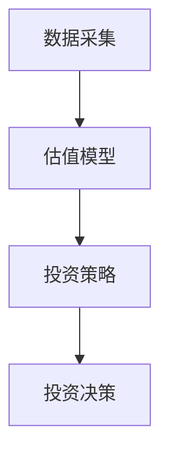

                 


```markdown
# 格雷厄姆特价股票理论在循环经济产业中的应用

> 关键词：格雷厄姆特价股票理论、循环经济产业、投资策略、数学模型、系统架构、项目实战

> 摘要：本文探讨了格雷厄姆特价股票理论在循环经济产业中的应用，分析了循环经济产业的特点，结合格雷厄姆理论的核心概念，构建了适合循环经济产业的数学模型和系统架构，并通过项目实战展示了如何在实际投资中应用这些理论和模型。

---

# 第一部分: 格雷厄姆特价股票理论与循环经济产业的背景介绍

## 第1章: 循环经济产业的定义与特点

### 1.1 循环经济的基本概念
循环经济技术是一种以资源高效利用和循环利用为目标的经济模式，强调减少资源消耗和环境污染，通过延长产品生命周期、废弃物资源化等方式实现可持续发展。

### 1.2 循环经济产业的主要领域
- **资源循环利用**：金属、塑料、电子废弃物等的回收与再利用。
- **产品生命周期管理**：从设计、生产、使用到报废的全生命周期管理。
- **共享经济模式**：共享办公空间、共享交通等模式。

### 1.3 循环经济与传统经济的区别
- **资源消耗**：循环经济强调资源的高效利用，而传统经济往往是一次性消耗。
- **环境污染**：循环经济注重减少废弃物和污染，传统经济往往产生大量污染物。
- **经济模式**：循环经济强调闭环，传统经济往往是线性模式。

## 第2章: 格雷厄姆特价股票理论的核心概念

### 2.1 格雷厄姆投资理论的起源
本杰明·格雷厄姆是价值投资的鼻祖，提出了“安全边际”和“内在价值”等核心概念，强调以低于内在价值的价格买入股票。

### 2.2 特价股票的定义与特征
- **定义**：市场价格低于内在价值的股票。
- **特征**：通常具有较高的安全边际，市场可能低估其价值。

### 2.3 格雷厄姆理论在现代投资中的应用
- **安全边际**：买入时留有安全空间，降低投资风险。
- **内在价值计算**：通过现金流折现法等方法估算股票的内在价值。

---

# 第二部分: 循环经济产业的特点与分析

## 第3章: 循环经济产业的特点与分析

### 3.1 循环经济产业的主要模式
- **资源循环利用模式**：通过回收和再利用资源降低成本。
- **产品生命周期管理**：延长产品生命周期，减少资源浪费。
- **共享经济模式**：通过共享资源提高利用率。

### 3.2 循环经济产业的市场分析
- **市场规模**：随着环保意识的增强，循环经济市场规模逐步扩大。
- **行业分布**：主要分布在制造业、物流业、能源等行业。
- **政策支持**：政府出台多项政策支持循环经济的发展，降低企业成本。

### 3.3 循环经济产业的财务特征
- **资产周转率**：循环经济企业的资产周转率较高，资源利用效率高。
- **成本控制**：通过回收和再利用降低成本，提升竞争力。
- **盈利能力**：由于成本控制，利润率较高，但受市场需求波动影响。

---

# 第三部分: 格雷厄姆特价股票理论在循环经济产业中的应用机制

## 第4章: 格雷厄姆理论的核心原理

### 4.1 安全边际的概念
安全边际是指股票的市场价格低于其内在价值的部分，是投资的安全垫，能够降低投资风险。

### 4.2 股票内在价值的计算
内在价值是基于企业未来现金流的现值，计算公式为：
$$ V = \frac{C}{k} $$
其中，V为内在价值，C为每年的现金流，k为折现率。

### 4.3 市场先生的波动性
市场先生指的是市场的波动性和不确定性，格雷厄姆认为市场先生是投资的敌人，投资者应利用市场的波动性寻找低估的机会。

## 第5章: 循环经济产业的估值模型

### 5.1 市盈率与市净率分析
- **市盈率（P/E）**：市盈率 = 股价 / 每股收益。
- **市净率（P/B）**：市净率 = 股价 / 每股净资产。

### 5.2 现金流折现模型
现金流折现模型（DCF）是计算股票内在价值的重要工具，公式为：
$$ V = \sum_{t=1}^{n} \frac{CF_t}{(1 + r)^t} $$
其中，CF_t为第t年的现金流，r为折现率，n为项目的寿命。

### 5.3 行业特异性估值方法
由于循环经济产业具有行业特性，需要结合行业特点进行估值，例如考虑资源回收率、成本控制能力等。

## 第6章: 格雷厄姆理论与循环经济产业的结合

### 6.1 识别循环经济产业中的特价股票
通过分析循环经济企业的财务指标，如市盈率、市净率、资产周转率等，寻找市场价格低于内在价值的股票。

### 6.2 判断企业的财务健康状况
通过分析企业的财务报表，评估企业的盈利能力、成本控制能力、资产质量等，判断企业的财务健康状况。

### 6.3 把握投资时机与风险控制
根据市场的波动性，寻找合适的买入时机，同时控制投资风险，避免过度集中投资。

---

# 第四部分: 循环经济产业中的数学模型与算法原理

## 第7章: 格雷厄姆股票估值的核心公式

### 7.1 内在价值计算公式
$$ V = \frac{E}{k} $$
其中，V为内在价值，E为预期收益，k为折现率。

### 7.2 现金流折现模型
$$ V = \sum_{t=1}^{n} \frac{CF_t}{(1 + r)^t} $$

### 7.3 安全边际计算公式
$$ \text{安全边际} = V - P $$
其中，V为内在价值，P为市场价格。

---

# 第五部分: 系统分析与架构设计方案

## 第8章: 系统架构设计

### 8.1 系统功能设计
- **数据采集模块**：采集循环经济企业的财务数据和市场数据。
- **估值模型模块**：基于格雷厄姆理论，计算股票的内在价值和安全边际。
- **投资策略模块**：制定投资策略，寻找特价股票。

### 8.2 系统架构图


---

# 第六部分: 项目实战

## 第9章: 环境安装与核心代码实现

### 9.1 环境安装
- **Python环境**：安装Python 3.8及以上版本。
- **数据处理库**：安装Pandas、NumPy、Matplotlib等库。

### 9.2 核心代码实现
```python
import pandas as pd
import numpy as np

# 示例代码：计算股票的内在价值
def calculate_intrinsic_value(enterprise_value, cash_flow):
    return enterprise_value / cash_flow

# 示例代码：计算安全边际
def calculate_margin_of_safety(intrinsic_value, market_price):
    return intrinsic_value - market_price
```

### 9.3 案例分析
假设某循环经济企业的财务数据如下：
- 企业价值：100亿元
- 现金流：10亿元/年
- 折现率：10%

计算内在价值：
$$ V = \frac{10}{0.1} = 100 \text{亿元} $$

如果市场价格为80亿元，则安全边际为：
$$ \text{安全边际} = 100 - 80 = 20 \text{亿元} $$

---

# 第七部分: 最佳实践与总结

## 第10章: 最佳实践 tips

### 10.1 小结
- 格雷厄姆理论在循环经济产业中的应用能够帮助投资者发现低估的股票，实现稳健投资。
- 需要结合循环经济产业的特点，灵活运用格雷厄姆理论。

### 10.2 注意事项
- 投资者需关注循环经济产业的政策变化和市场波动。
- 需要定期复盘和调整投资策略。

### 10.3 拓展阅读
- 《格雷厄姆投资经典》
- 《循环经济的商业模式与实践》

---

# 结语

通过本文的分析，我们可以看到格雷厄姆特价股票理论在循环经济产业中的应用具有广阔的前景。投资者可以通过科学的估值模型和系统的架构设计，发现具有投资价值的企业，实现长期稳健的投资回报。
```

