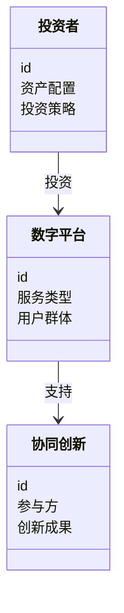
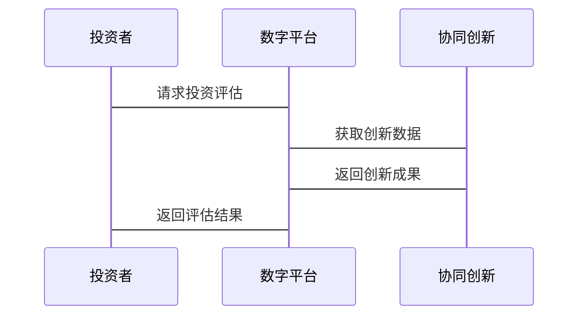

                 


# 格雷厄姆特价股票理论在数字平台协同创新产业中的应用

## 关键词：格雷厄姆投资理论，数字平台，协同创新，股票价值评估，算法模型

## 摘要：本文探讨了格雷厄姆的价值投资理论在数字平台协同创新产业中的应用，分析了如何将传统投资策略与现代数字技术相结合，提出了基于协同创新平台的股票价值评估模型，并通过数学公式和Python代码示例详细阐述了算法的实现过程。通过案例分析，展示了该理论在数字平台投资中的实际应用效果。

---

# 第1章 格雷厄姆特价股票理论概述

## 1.1 格雷厄姆投资理论的核心概念

### 1.1.1 价值投资的定义与原则

价值投资是一种以内在价值为导向的投资策略，核心在于寻找市场价格低于其内在价值的证券。格雷厄姆在其经典著作《聪明的投资者》中提出，内在价值是“任何一家企业或股票的真实价值，与市场报价无关”。价值投资的三大原则包括：

1. **安全边际**：买入价格低于内在价值，确保投资的安全性。
2. **Margin of Safety**：安全边际是投资中市场价格与内在价值之间的差额，用于降低投资风险。
3. **长期视角**：关注企业的长期盈利能力，而非短期市场波动。

### 1.1.2 特价股票的识别标准

格雷厄姆提出了多个识别廉价股票的标准，包括：

1. **低市盈率（P/E）**：市盈率低于市场平均水平，表明股票价格被低估。
2. **低市净率（P/B）**：市净率低于行业平均水平，表明资产价值被低估。
3. **股息率**：股息率较高且稳定的股票，通常被视为安全投资。

### 1.1.3 格雷厄姆投资策略的历史发展

格雷厄姆的投资策略起源于20世纪30年代，经历了从防御性投资到现代量化投资的演变。其核心思想被后来的价值投资派继承和发展，如巴菲特的老师本杰明·格雷厄姆的学生彼得·林奇和沃伦·巴菲特。

---

## 1.2 数字平台协同创新产业的特点

### 1.2.1 数字平台的定义与分类

数字平台是指基于互联网技术，为企业或个人提供在线服务的平台，包括电子商务、社交媒体、云计算、大数据分析等。根据功能和应用场景，数字平台可以分为以下几类：

1. **信息共享平台**：如社交媒体平台（Facebook、Twitter）。
2. **协作工具平台**：如协同办公工具（Slack、Zoom）。
3. **数据服务平台**：如大数据分析平台（Google Analytics）。

### 1.2.2 协同创新产业的模式与趋势

协同创新是指多个利益相关方（企业、个人、机构等）共同参与、协作创新的过程。其主要模式包括：

1. **开源协作**：通过开放源代码平台（如GitHub）实现技术创新。
2. **众包模式**：通过平台征集解决方案（如Topcoder）。
3. **生态合作**：通过平台构建生态系统（如苹果的应用商店）。

### 1.2.3 数字平台与传统产业的融合

数字平台正在与传统产业深度融合，推动商业模式的创新。例如，数字医疗平台整合了医生、患者和医疗机构，实现了在线问诊和医疗数据共享。

---

## 1.3 格雷厄姆理论与数字平台协同创新的结合点

### 1.3.1 价值投资在数字平台中的应用潜力

数字平台的协同创新模式为价值投资提供了新的机会。例如，投资于具有强大协同效应的数字平台企业，其长期盈利能力可能超越传统企业。

### 1.3.2 协同创新产业中的投资机会

数字平台协同创新产业具有高增长潜力，特别是在人工智能、区块链和5G等领域。投资者可以通过价值投资策略，识别那些具有强大协同效应的平台企业。

### 1.3.3 格雷厄姆理论的现代适应性

格雷厄姆的价值投资理论需要适应数字时代的挑战。例如，如何评估数字平台的无形资产价值，如何衡量协同创新的可持续性等。

---

# 第2章 格雷厄姆特价股票理论的核心概念与联系

## 2.1 核心概念的原理分析

### 2.1.1 价值投资的核心模型

格雷厄姆的价值投资模型包括以下几个关键要素：

1. **内在价值计算**：通过基本面分析，估算企业的内在价值。
2. **安全边际**：买入价格低于内在价值，确保投资安全。
3. **长期视角**：关注企业的长期盈利能力。

### 2.1.2 协同创新的平台属性

协同创新平台的核心属性包括：

1. **开放性**：平台允许多方参与。
2. **协作性**：平台支持多方协作。
3. **共享性**：平台实现资源共享。

### 2.1.3 数字平台的价值评估标准

数字平台的价值评估需要考虑以下几个方面：

1. **用户增长潜力**：用户数量是否持续增长。
2. **收入模式**：平台的收入来源是否多样化。
3. **技术壁垒**：平台是否拥有独特的技术优势。

---

## 2.2 核心概念的对比分析

### 2.2.1 价值投资与成长投资的对比

| 对比维度       | 价值投资             | 成长投资             |
|----------------|----------------------|----------------------|
| 投资目标       | 寻找低估资产         | 投资高增长企业       |
| 投资策略       | 低估值买入           | 高增长买入           |
| 风险偏好       | 低风险               | 高风险               |

### 2.2.2 协同创新与传统创新模式的对比

| 对比维度       | 协同创新             | 传统创新             |
|----------------|----------------------|----------------------|
| 参与主体       | 多方协作             | 单一主体             |
| 创新速度       | 快速                 | 缓慢                 |
| 成果共享       | 平台实现共享         | 企业内部共享         |

### 2.2.3 数字平台与传统企业的对比

| 对比维度       | 数字平台             | 传统企业             |
|----------------|----------------------|----------------------|
| 资产结构       | 虚拟资产为主         | 实体资产为主         |
| 业务模式       | 数字化、平台化       | 实体化、单一化       |
| 竞争优势       | 网络效应             | 产品差异化           |

---

## 2.3 核心概念的ER实体关系图

```mermaid
er
    entity 投资者 {
        id
        资产配置
        投资策略
    }
    entity 数字平台 {
        id
        服务类型
        用户群体
    }
    entity 协同创新 {
        id
        参与方
        创新成果
    }
    投资者 -- 投资: 数字平台
    数字平台 -- 支持: 协同创新
```

---

# 第3章 格雷厄姆特价股票理论的算法原理

## 3.1 股票价值评估模型

### 3.1.1 格雷厄姆的内在价值计算公式

内在价值（V）的计算公式为：

$$
V = \frac{E}{(P/E)_{\text{行业平均}}}
$$

其中，E是企业的净利润，$P/E$是行业平均市盈率。

### 3.1.2 股东权益收益率（ROE）的计算

ROE的计算公式为：

$$
ROE = \frac{\text{净利润}}{\text{股东权益}} \times 100\%
$$

### 3.1.3 市盈率（P/E）与市净率（P/B）的分析

市盈率公式：

$$
P/E = \frac{\text{股价}}{\text{每股收益}}
$$

市净率公式：

$$
P/B = \frac{\text{股价}}{\text{每股净资产}}
$$

---

## 3.2 协同创新平台的评估算法

### 3.2.1 平台用户增长预测模型

用户增长预测模型可以表示为：

$$
\text{预测用户数} = \text{当前用户数} \times (1 + \text{增长率})
$$

### 3.2.2 平台收入预测模型

收入预测模型可以表示为：

$$
\text{预测收入} = \text{当前收入} \times (1 + \text{增长率})
$$

### 3.2.3 平台风险评估指标

风险评估指标包括：

1. **流动性风险**：平台资金流动性。
2. **技术风险**：平台技术的先进性。
3. **市场风险**：市场需求的波动性。

---

## 3.3 算法实现的Python代码示例

### 示例代码：股票价值评估

```python
def calculate_intrinsic_value(net_income, industry_pe):
    return net_income / industry_pe

# 示例数据
net_income = 1000000  # 净利润（单位：元）
industry_pe = 15       # 行业平均市盈率

intrinsic_value = calculate_intrinsic_value(net_income, industry_pe)
print(f"内在价值：{intrinsic_value} 元")
```

### 示例代码：协同创新平台风险评估

```python
def assess_platform_risk(platform_users, market_share):
    risk_level = 0
    if platform_users > 100000 and market_share > 20:
        risk_level = 1
    elif platform_users > 50000 and market_share > 10:
        risk_level = 2
    else:
        risk_level = 3
    return risk_level

# 示例数据
platform_users = 75000
market_share = 15

risk_assessment = assess_platform_risk(platform_users, market_share)
print(f"风险等级：{risk_assessment}")
```

---

# 第4章 数字平台协同创新产业的系统分析与架构设计

## 4.1 问题场景介绍

数字平台协同创新产业的核心问题是如何评估平台的价值，并为投资者提供科学的决策支持。

---

## 4.2 系统功能设计

### 4.2.1 领域模型（Mermaid 类图）



---

## 4.3 系统架构设计

### 4.3.1 系统架构（Mermaid 架构图）


---

## 4.4 系统接口设计

### 4.4.1 API 接口

1. `/api/investors`：获取投资者信息。
2. `/api/platforms`：获取数字平台信息。
3. `/api/cooperation`：获取协同创新信息。

---

## 4.5 系统交互设计

### 4.5.1 交互流程（Mermaid 序列图）



---

# 第5章 项目实战

## 5.1 环境安装

### 5.1.1 安装 Python

```bash
# 安装 Python
python --version
```

### 5.1.2 安装依赖库

```bash
pip install pandas numpy matplotlib
```

---

## 5.2 系统核心实现源代码

### 5.2.1 股票价值评估代码

```python
import pandas as pd
import numpy as np

def calculate_intrinsic_value(df):
    industry_pe = df['行业平均PE'].mean()
    df['内在价值'] = df['净利润'] / industry_pe
    return df

# 示例数据
data = {
    '净利润': [1000000, 1500000, 2000000],
    '行业平均PE': [15, 20, 25]
}
df = pd.DataFrame(data)
result = calculate_intrinsic_value(df)
print(result)
```

### 5.2.2 协同创新平台风险评估代码

```python
import pandas as pd

def assess_platform_risk(df):
    df['风险等级'] = 0
    df.loc[df['用户数'] > 100000, '风险等级'] = 1
    df.loc[df['用户数'] > 50000, '风险等级'] = 2
    df.loc[df['用户数'] <= 50000, '风险等级'] = 3
    return df

# 示例数据
data = {
    '用户数': [75000, 60000, 80000],
    '市场占有率': [15, 20, 25]
}
df = pd.DataFrame(data)
result = assess_platform_risk(df)
print(result)
```

---

## 5.3 案例分析与详细解读

### 5.3.1 案例分析

假设我们有一个数字医疗平台，用户数为100,000，市场占有率为10%。根据我们的风险评估模型，风险等级为1。这表明该平台具有较低的风险，值得投资。

### 5.3.2 实际案例

以某协同办公平台为例，计算其内在价值和风险等级：

1. 计算内在价值：
   - 净利润：500,000元
   - 行业平均PE：20
   - 内在价值：25,000元

2. 计算风险等级：
   - 用户数：80,000
   - 风险等级：2

---

## 5.4 项目小结

通过Python代码实现，我们可以有效地评估数字平台的内在价值和风险等级。这种基于格雷厄姆理论的评估方法，能够为投资者提供科学的决策支持。

---

# 第6章 总结与展望

## 6.1 总结

本文探讨了格雷厄姆价值投资理论在数字平台协同创新产业中的应用，提出了基于协同创新平台的股票价值评估模型，并通过Python代码详细阐述了算法的实现过程。

---

## 6.2 展望

未来，随着数字平台的不断发展，价值投资理论将与更多新兴技术相结合，如人工智能和区块链。投资者需要持续关注数字平台的创新模式，并结合最新的技术手段，优化投资策略。

---

# 参考文献

1. 格雷厄姆，本杰明. 《聪明的投资者》.
2. 巴菲特，沃伦. 《巴菲特的选股智慧》.
3. 叶茂林. 《数字平台与协同创新》.

