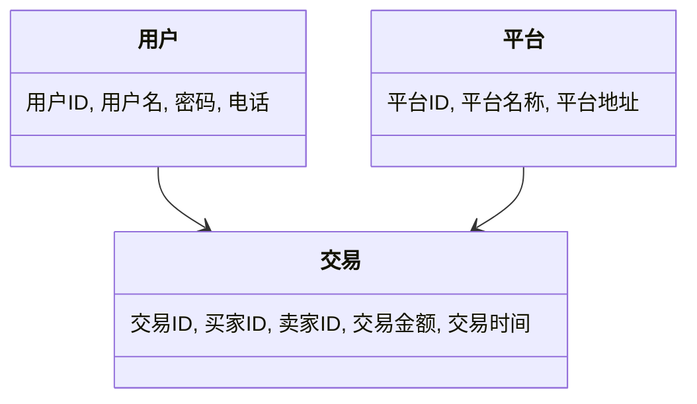
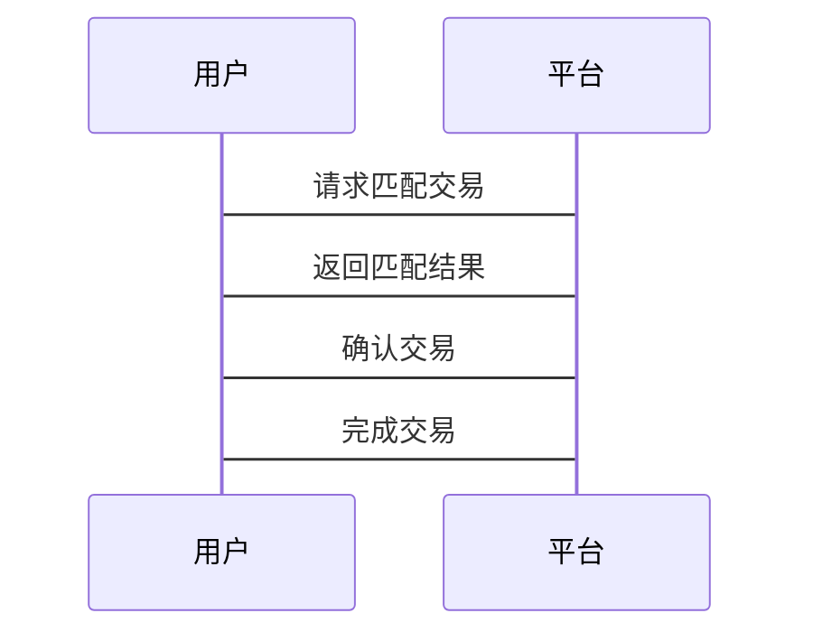

                 


# 格雷厄姆特价股票理论在数字平台协同经济产业中的应用

## 关键词：格雷厄姆特价股票理论、数字平台、协同经济、价值投资、系统架构、数学模型

## 摘要：
本文深入探讨了格雷厄姆特价股票理论在数字平台协同经济产业中的应用，结合价值投资的核心理念与现代数字经济的模式，分析了如何通过数学模型和系统架构设计将格雷厄姆理论应用于数字平台的协同经济产业。文章从理论背景、数学模型、系统设计、项目实战等多个维度展开，结合实际案例，详细解读了格雷厄姆理论在数字平台中的应用前景和实践意义。

---

## 第一部分: 格雷厄姆特价股票理论与数字平台协同经济产业概述

### 第1章: 格雷厄姆特价股票理论的核心概念

#### 1.1 格雷厄姆特价股票理论的背景与起源

##### 1.1.1 价值投资的起源与发展
价值投资是一种长期投资策略，其核心在于寻找市场价格低于其内在价值的股票。该理论由本杰明·格雷厄姆在20世纪初提出，强调安全边际和长期持有的理念。格雷厄姆的学生沃伦·巴菲特继承并发扬了这一理论，使其成为投资界的经典。

##### 1.1.2 格雷厄姆投资理念的核心思想
格雷厄姆的价值投资理论强调以下几点：
1. **安全边际**：购买价格低于内在价值，确保投资的安全性。
2. **内在价值**：股票的真正价值是其未来现金流的现值。
3. **逆向思维**：在市场恐慌时买入，在市场疯狂时卖出。

##### 1.1.3 特价股票的定义与特征
特价股票是指市场价格显著低于其内在价值的股票。其特征包括：
- 市场流动性较低。
- 公司基本面稳定。
- 市场情绪过度悲观。

#### 1.2 数字平台协同经济的定义与特点

##### 1.2.1 协同经济的定义与模式
协同经济是指通过数字平台将分散的供给和需求匹配起来，实现资源共享和效率提升的经济模式。其主要模式包括：
- 共享经济（如滴滴、Airbnb）。
- 平台经济（如淘宝、京东）。
- 零工经济（如滴滴司机、外卖骑手）。

##### 1.2.2 数字平台在协同经济中的作用
数字平台通过技术手段，将分散的供给方和需求方连接起来，降低交易成本，提高资源利用率。其核心功能包括：
- 用户匹配。
- 交易撮合。
- 信任机制。
- 数据分析。

##### 1.2.3 协同经济的核心特征与优势
协同经济的核心特征包括：
- 去中心化。
- 灵活性。
- 规模效应。
其优势在于：
- 降低交易成本。
- 提高资源利用率。
- 创造新的商业模式。

### 第2章: 格雷厄姆特价股票理论与数字平台协同经济的结合

#### 2.1 特价股票理论在现代经济中的适用性

##### 2.1.1 传统经济与现代经济的对比
传统经济主要依赖于实体资源，而现代经济则以数字技术为核心驱动力。数字平台协同经济的崛起，为价值投资提供了新的应用场景。

##### 2.1.2 数字经济时代价值投资的新机遇
数字经济时代，价值投资的核心理念依然适用。数字平台的透明性和数据的可量化特性，使得内在价值的计算更加精确。

##### 2.1.3 协同经济中的价值发现机会
协同经济通过平台效应，将分散的供给和需求集中起来，为价值投资者提供了发现特价股票的新渠道。

#### 2.2 数字平台协同经济中的投资机会

##### 2.2.1 平台经济的商业模式分析
平台经济的核心是通过数字技术实现供需匹配。其商业模式包括：
- 收取交易佣金。
- 收取订阅费用。
- 收取广告费用。

##### 2.2.2 协同经济中的价值评估方法
在协同经济中，价值评估的关键在于：
- 平台的用户粘性。
- 平台的交易规模。
- 平台的盈利模式。

##### 2.2.3 特价股票理论在平台经济中的应用潜力
格雷厄姆的理论可以应用于数字平台的协同经济中，通过分析平台的内在价值和市场价格，寻找投资机会。

---

## 第二部分: 格雷厄姆特价股票理论的核心原理与数学模型

### 第3章: 格雷厄姆特价股票理论的数学模型

#### 3.1 特价股票的内在价值计算

##### 3.1.1 内在价值的定义与公式
内在价值是股票的未来现金流的现值。其计算公式为：
$$ V = \sum_{t=1}^{n} \frac{C_t}{(1 + r)^t} $$
其中，\( C_t \) 是第 \( t \) 年的现金流，\( r \) 是折现率。

##### 3.1.2 内在价值的计算步骤
1. 确定未来的现金流。
2. 选择合适的折现率。
3. 计算未来现金流的现值。

#### 3.2 安全边际的计算方法

##### 3.2.1 安全边际的定义
安全边际是指市场价格与内在价值之间的差额。

##### 3.2.2 安全边际的计算公式
$$ \text{安全边际} = V_{\text{内在}} - P_{\text{市场}} $$

##### 3.2.3 安全边际的意义
安全边际越大，投资风险越小。

#### 3.3 理论与实际的结合

##### 3.3.1 理论在数字平台协同经济中的应用
通过分析平台的内在价值和市场价格，寻找具有安全边际的投资机会。

##### 3.3.2 数学模型的优化与调整
根据协同经济的特点，调整数学模型的参数和假设。

### 第4章: 数字平台协同经济中的价值评估模型

#### 4.1 协同经济中的价值评估指标

##### 4.1.1 用户价值的评估指标
用户价值的评估指标包括：
- 用户活跃度。
- 用户留存率。
- 用户贡献度。

##### 4.1.2 平台效率的评估指标
平台效率的评估指标包括：
- 交易匹配效率。
- 平台运营成本。
- 平台收益增长。

##### 4.1.3 企业价值的综合评估模型
综合评估模型包括：
$$ V = \alpha \cdot E + \beta \cdot S + \gamma \cdot C $$
其中，\( E \) 是用户规模，\( S \) 是平台效率，\( C \) 是成本控制，\( \alpha \)、\( \beta \)、\( \gamma \) 是权重系数。

#### 4.2 数学模型在协同经济中的应用

##### 4.2.1 用户行为分析模型
用户行为分析模型用于预测用户行为，帮助平台优化运营策略。

##### 4.2.2 平台收益预测模型
平台收益预测模型用于预测平台未来的收益情况。

##### 4.2.3 价值评估的动态调整方法
根据市场变化，动态调整价值评估模型的参数和假设。

---

## 第三部分: 数字平台协同经济中的系统分析与架构设计

### 第5章: 系统分析与架构设计方案

#### 5.1 问题场景介绍

##### 5.1.1 协同经济中的价值发现问题
在协同经济中，如何准确评估平台的内在价值，是投资者面临的挑战。

##### 5.1.2 数字平台的协同机制设计
数字平台需要设计高效的协同机制，以实现供需匹配。

##### 5.1.3 价值评估系统的功能需求
价值评估系统需要具备以下功能：
- 数据采集。
- 数据分析。
- 价值评估。
- 报告生成。

#### 5.2 系统功能设计

##### 5.2.1 领域模型设计（Mermaid类图）


##### 5.2.2 系统架构设计（Mermaid架构图）


##### 5.2.3 系统接口设计
系统接口包括：
- 用户注册与登录接口。
- 交易撮合接口。
- 数据采集接口。
- 报告生成接口。

#### 5.3 系统交互设计（Mermaid序列图）


---

## 第四部分: 项目实战

### 第6章: 项目实战与案例分析

#### 6.1 项目介绍
本项目旨在将格雷厄姆特价股票理论应用于数字平台协同经济产业中，通过数学模型和系统架构设计，实现价值评估和投资决策。

#### 6.2 核心实现

##### 6.2.1 环境安装
需要安装以下工具：
- Python 3.x
- Mermaid
- Pandas
- Matplotlib

##### 6.2.2 核心代码实现
```python
def calculate_intrinsic_value(cash_flows, discount_rate):
    present_value = 0
    for t in range(len(cash_flows)):
        present_value += cash_flows[t] / (1 + discount_rate) ** t
    return present_value

# 示例数据
cash_flows = [100, 150, 200, 250]
discount_rate = 0.1

# 计算内在价值
intrinsic_value = calculate_intrinsic_value(cash_flows, discount_rate)
print(f"内在价值为: {intrinsic_value}")
```

##### 6.2.3 代码解读与分析
上述代码通过循环计算未来现金流的现值，得出股票的内在价值。通过调整现金流和折现率，可以实现对不同平台的内在价值评估。

#### 6.3 实际案例分析

##### 6.3.1 案例一：滴滴出行
滴滴出行作为共享经济的代表，其内在价值可以通过上述模型进行评估。

##### 6.3.2 案例二：Airbnb
Airbnb的平台效率和用户规模是其内在价值的重要组成部分。

#### 6.4 项目小结
通过本项目，我们可以看到，格雷厄姆的理论在数字平台协同经济中的应用潜力巨大。

---

## 第五部分: 总结与展望

### 第7章: 总结与展望

#### 7.1 核心结论
通过本文的分析，我们可以得出以下结论：
1. 格雷厄姆特价股票理论在数字平台协同经济中具有广泛的应用前景。
2. 数学模型和系统架构设计是实现理论应用的关键。
3. 价值投资的核心理念在数字经济时代依然具有重要的指导意义。

#### 7.2 最佳实践 tips
1. 在实际投资中，建议结合多种因素进行综合评估。
2. 定期更新数学模型，以适应市场变化。
3. 重视平台的长期价值，而非短期波动。

#### 7.3 小结
本文通过理论分析和实践案例，展示了格雷厄姆特价股票理论在数字平台协同经济中的应用。这为投资者提供了新的思路和方法。

#### 7.4 注意事项
1. 投资有风险，需谨慎决策。
2. 模型的准确性依赖于数据的完整性和可靠性。
3. 市场环境的变化可能影响模型的适用性。

#### 7.5 拓展阅读
1. 《聪明的投资者》——本杰明·格雷厄姆
2. 《平台革命》——戴维·J·凯农
3. 《协同经济：重构商业未来》——谢尔·伊斯雷尔

---

通过以上结构，我们可以看到，格雷厄姆特价股票理论在数字平台协同经济产业中的应用具有深远的意义。随着数字经济的快速发展，这一理论将为投资者提供更多的机会和挑战。未来的研究可以进一步探讨如何优化数学模型，以及如何在更多类型的数字平台中应用这一理论。

