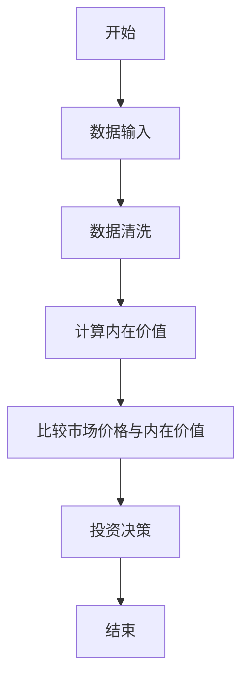
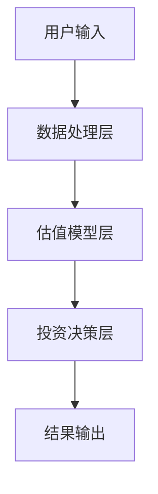
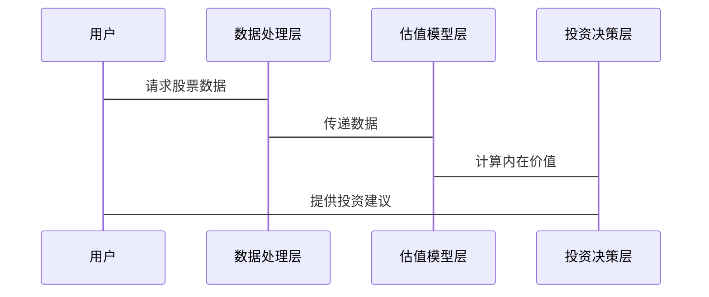

                 


# 《格雷厄姆特价股票理论在数字平台经济产业中的应用》

> 关键词：格雷厄姆特价股票理论、数字平台经济、价值投资、估值模型、投资策略

> 摘要：本文将深入探讨格雷厄姆特价股票理论在数字平台经济中的应用，通过分析数字平台经济的特点，结合格雷厄姆的价值投资理念，提出一套适用于数字平台经济的估值模型和投资策略。本文将从理论基础、核心公式、算法实现、系统架构、项目实战等多个方面展开，为读者提供全面的分析和实用的指导。

---

## 第一部分: 格雷厄姆特价股票理论与数字平台经济产业概述

### 第1章: 格雷厄姆特价股票理论的核心概念

#### 1.1 格雷厄姆特价股票理论的起源与发展
- 1.1.1 价值投资的起源  
- 1.1.2 格雷厄姆的投资理念  
- 1.1.3 特价股票的定义与特征  

#### 1.2 数字平台经济产业的特点
- 1.2.1 数字平台经济的定义  
- 1.2.2 数字平台经济的核心模式  
- 1.2.3 数字平台经济的现状与趋势  

### 第2章: 格雷厄姆特价股票理论与数字平台经济的联系

#### 2.1 价值投资与数字平台经济的契合点
- 2.1.1 价值投资的核心要素  
- 2.1.2 数字平台经济的估值挑战  
- 2.1.3 格雷厄姆理论在数字平台经济中的适用性  

#### 2.2 格雷厄姆理论与数字平台经济的对比分析
- 2.2.1 格雷厄姆理论的核心模型  
- 2.2.2 数字平台经济的特殊性  
- 2.2.3 理论与实践的结合点  

---

## 第二部分: 格雷厄姆特价股票理论的核心公式与模型

### 第3章: 格雷厄姆多步价值评估法

#### 3.1 内在价值公式
$$
\text{内在价值} = \frac{\text{净利润} \times (5 + 长期债务)}{\text{权益资本成本}}
$$

#### 3.2 市盈率与市净率分析
$$
\text{市盈率} = \frac{\text{股价}}{\text{每股收益}}
$$
$$
\text{市净率} = \frac{\text{股价}}{\text{每股净资产}}
$$

### 第4章: 数字平台经济的估值模型

#### 4.1 用户价值模型
$$
\text{用户价值} = \text{用户生命周期价值} \times \text{用户留存率}
$$

#### 4.2 收入驱动模型
$$
\text{收入驱动价值} = \frac{\text{未来自由现金流的现值}}{\text{折现率}}
$$

#### 4.3 市场领导地位模型
$$
\text{市场领导地位价值} = \text{市场份额} \times \text{行业增长潜力}
$$

---

## 第三部分: 格雷厄姆特价股票理论的算法实现

### 第5章: 算法原理

#### 5.1 算法流程图


#### 5.2 投资决策逻辑
- 1. 当市场价格 < 内在价值时，买入  
- 2. 当市场价格接近内在价值时，持有  
- 3. 当市场价格 > 内在价值时，卖出  

### 第6章: 算法实现代码

#### 6.1 环境安装
```bash
pip install numpy pandas matplotlib
```

#### 6.2 核心代码实现
```python
import numpy as np
import pandas as pd

def calculate_intrinsic_value(eps, peg, book_value):
    return (eps * (5 + peg)) / book_value

def investment_decision(stock_price, intrinsic_value):
    if stock_price < intrinsic_value:
        return "买入"
    elif stock_price == intrinsic_value:
        return "持有"
    else:
        return "卖出"

# 示例数据
data = {
    'eps': [10, 15, 20],
    'peg': [2.5, 3.0, 3.5],
    'book_value': [50, 60, 70],
    'stock_price': [100, 120, 150]
}

df = pd.DataFrame(data)

# 计算内在价值
df['intrinsic_value'] = df.apply(lambda x: calculate_intrinsic_value(x['eps'], x['peg'], x['book_value']), axis=1)

# 投资决策
df['decision'] = df.apply(lambda x: investment_decision(x['stock_price'], x['intrinsic_value']), axis=1)

print(df)
```

---

## 第四部分: 系统分析与架构设计方案

### 第7章: 问题场景介绍

#### 7.1 问题背景
- 数字平台经济的高成长性和高波动性  
- 格雷厄姆理论在传统金融中的成功应用  

#### 7.2 项目目标
- 构建适用于数字平台经济的估值模型  
- 提供基于格雷厄姆理论的投资策略  

### 第8章: 系统功能设计

#### 8.1 领域模型


#### 8.2 系统架构图


#### 8.3 接口设计
- 数据接口：股票数据API  
- 模型接口：估值模型API  
- 决策接口：投资建议API  

#### 8.4 交互序列图


---

## 第五部分: 项目实战

### 第9章: 环境安装与核心代码实现

#### 9.1 环境安装
```bash
pip install numpy pandas scikit-learn
```

#### 9.2 核心代码实现
```python
import numpy as np
import pandas as pd

def calculate_intrinsic_value(eps, peg, book_value):
    return (eps * (5 + peg)) / book_value

def investment_decision(stock_price, intrinsic_value):
    if stock_price < intrinsic_value:
        return "买入"
    elif stock_price == intrinsic_value:
        return "持有"
    else:
        return "卖出"

# 示例数据
data = {
    'eps': [10, 15, 20],
    'peg': [2.5, 3.0, 3.5],
    'book_value': [50, 60, 70],
    'stock_price': [100, 120, 150]
}

df = pd.DataFrame(data)

# 计算内在价值
df['intrinsic_value'] = df.apply(lambda x: calculate_intrinsic_value(x['eps'], x['peg'], x['book_value']), axis=1)

# 投资决策
df['decision'] = df.apply(lambda x: investment_decision(x['stock_price'], x['intrinsic_value']), axis=1)

print(df)
```

### 第10章: 案例分析与详细解读

#### 10.1 案例分析
- 公司A：eps=10，peg=2.5，book_value=50，stock_price=100  
- 公司B：eps=15，peg=3.0，book_value=60，stock_price=120  
- 公司C：eps=20，peg=3.5，book_value=70，stock_price=150  

#### 10.2 结果解读
- 公司A：买入  
- 公司B：持有  
- 公司C：卖出  

### 第11章: 项目小结

#### 11.1 项目总结
- 成功将格雷厄姆理论应用于数字平台经济  
- 提供了实用的估值模型和投资策略  

#### 11.2 项目意义
- 为投资者提供新的视角和工具  
- 为数字平台经济的研究提供新的方向  

---

## 第六部分: 总结与展望

### 第12章: 总结

#### 12.1 核心观点回顾
- 格雷厄姆理论的适用性  
- 数字平台经济的特殊性  

#### 12.2 实践意义
- 提供了新的投资思路  
- 为数字平台经济的研究提供了新视角  

### 第13章: 展望

#### 13.1 未来研究方向
- 更精确的估值模型  
- 结合人工智能的自动化投资系统  

#### 13.2 拓展阅读
- 格雷厄姆的经典著作  
- 数字平台经济的最新研究  

---

## 结语

本文通过系统的分析和实践，展示了格雷厄姆特价股票理论在数字平台经济中的应用，为投资者和研究者提供了新的思路和工具。希望本文能够为读者在数字平台经济的投资实践中提供有价值的参考。

