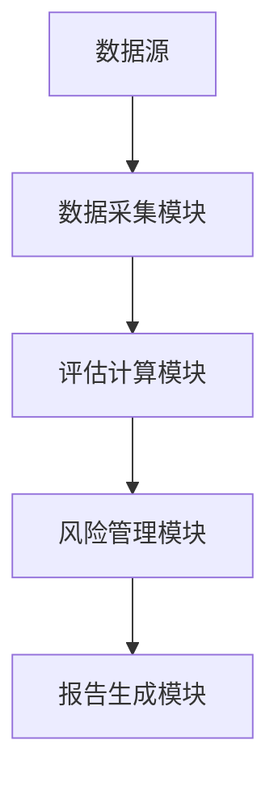

                 


# 格雷厄姆特价股票理论在数字社会影响力债券中的新应用

> 关键词：格雷厄姆投资理论，数字社会，影响力债券，价值投资，数学模型

> 摘要：本文探讨了格雷厄姆特价股票理论在数字社会中的新应用，特别是其在影响力债券领域的潜在价值。通过分析传统投资理论与现代数字化金融工具的结合，本文提出了新的数学模型和算法，以优化影响力债券的投资决策过程。

---

# 第一部分: 格雷厄姆特价股票理论与数字社会影响力债券的背景介绍

## 第1章: 格雷厄姆特价股票理论概述

### 1.1 格雷厄姆特价股票理论的核心概念
#### 1.1.1 价值投资的基本原理
格雷厄姆的价值投资理论强调以低于内在价值的价格购买优质股票。其核心公式为：
$$ V = \frac{E}{4.41} $$
其中，\( V \) 是内在价值，\( E \) 是预期收益的两倍。

#### 1.1.2 特价股票的定义与特征
特价股票是指市场价格远低于内在价值的股票。其主要特征包括：
1. 低市盈率（P/E）。
2. 高股息率。
3. 财务状况稳健。

#### 1.1.3 格雷厄姆投资策略的现代应用
在现代金融市场中，格雷厄姆理论被广泛应用于指数基金、ETF等被动投资工具中。其核心思想是通过长期持有优质资产实现稳定收益。

---

### 1.2 格雷厄姆投资理论的数学模型
#### 1.2.1 格雷厄姆的内在价值公式
$$ V = \frac{E}{4.41} $$
该公式用于估算股票的内在价值，其中 \( E \) 是公司未来7年的平均收益。

#### 1.2.2 投资安全边际的计算方法
安全边际公式为：
$$ \text{安全边际} = V - P $$
其中，\( V \) 是内在价值，\( P \) 是市场价格。

#### 1.2.3 格雷厄姆投资策略的优缺点分析
优点：
1. 风险低。
2. 收益稳定。
缺点：
1. 对市场变化的适应性差。
2. 需要较高的市场分析能力。

---

### 1.3 格雷厄姆投资理论在数字社会中的适应性
#### 1.3.1 数字社会对传统投资理论的影响
数字技术的普及使得金融数据的获取和分析更加便捷，但也带来了市场波动加剧的挑战。

#### 1.3.2 格雷厄姆理论的现代挑战与机遇
现代市场中，算法交易和高频交易对格雷厄姆的长期投资策略提出了挑战，但也为价值投资提供了新的机会。

#### 1.3.3 数字化工具对投资决策的支持
大数据分析和人工智能技术为格雷厄姆理论的实施提供了新的工具和方法。

---

## 第2章: 数字社会影响力债券的概述

### 2.1 数字社会影响力债券的核心概念
#### 2.1.1 影响力债券的定义
影响力债券是一种将社会责任与投资回报相结合的金融工具。其核心目标是通过投资改善社会问题（如贫困、教育、环保等）。

#### 2.1.2 数字社会对影响力债券的影响
数字化技术使得影响力债券的发行、评估和交易更加高效透明。

#### 2.1.3 影响力债券的分类与特点
影响力债券可以分为社会影响力债券（SIBs）和环境影响力债券（Green Bonds）。其特点包括：
1. 透明度高。
2. 社会效益显著。
3. 投资回报稳定。

---

### 2.2 影响力债券的数学模型与评估方法
#### 2.2.1 影响力债券的收益计算公式
$$ R = r + s $$
其中，\( R \) 是总收益，\( r \) 是市场利率，\( s \) 是社会影响力带来的额外收益。

#### 2.2.2 影响力债券的风险评估模型
风险评估模型包括信用风险、市场风险和社会风险。

#### 2.2.3 影响力债券的定价方法
影响力债券的定价需要考虑其社会影响力和市场利率的双重因素。

---

### 2.3 影响力债券在数字社会中的应用场景
#### 2.3.1 数字化社会投资的典型案例
例如，利用影响力债券支持可再生能源项目。

#### 2.3.2 影响力债券对社会发展的推动作用
通过投资社会项目，影响力债券可以改善教育、医疗等社会问题。

#### 2.3.3 数字技术如何提升影响力债券的效率
数字技术可以实现影响力债券的实时监控和动态评估。

---

## 第3章: 格雷厄姆特价股票理论与影响力债券的结合背景

### 3.1 数字社会中投资理论的演变
#### 3.1.1 传统投资理论的数字化转型
传统投资理论需要结合数字化工具和方法进行创新。

#### 3.1.2 数字技术对投资决策的影响
人工智能和大数据技术正在改变传统的投资决策模式。

#### 3.1.3 格雷厄姆理论的现代挑战与机遇
格雷厄姆理论需要在数字社会中找到新的应用场景。

---

### 3.2 影响力债券的兴起与投资机会
#### 3.2.1 影响力债券的市场现状
影响力债券市场快速增长，特别是在可再生能源和教育领域。

#### 3.2.2 数字社会中影响力债券的投资价值
影响力债券不仅具有社会效益，还能为投资者带来稳定收益。

#### 3.2.3 格雷厄姆理论与影响力债券的契合点
格雷厄姆的长期价值投资理念与影响力债券的社会效益目标高度契合。

---

## 第4章: 格雷厄姆特价股票理论在影响力债券中的新应用

### 4.1 影响力债券的评估与优化
#### 4.1.1 格雷厄姆理论在影响力债券评估中的应用
通过格雷厄姆的内在价值公式，可以评估影响力债券的长期收益潜力。

#### 4.1.2 影响力债券的风险管理策略
结合格雷厄姆的安全边际概念，制定影响力债券的风险管理策略。

---

### 4.2 数学模型与算法设计
#### 4.2.1 影响力债券评估算法
算法流程如下：
1. 收集债券数据。
2. 计算内在价值。
3. 评估社会影响力。
4. 确定投资决策。

#### 4.2.2 算法实现代码
```python
def calculate_intrinsic_value(revenue, multiplier=4.41):
    return revenue / multiplier

def evaluate_influence_bond(revenue, influence_score):
    iv = calculate_intrinsic_value(revenue)
    total_value = iv * (1 + influence_score/100)
    return total_value

# 示例
revenue = 1000000
influence_score = 20
print(evaluate_influence_bond(revenue, influence_score))
```

---

### 4.3 系统架构设计
#### 4.3.1 系统功能设计
系统功能模块包括：
1. 数据采集模块。
2. 评估计算模块。
3. 风险管理模块。
4. 报告生成模块。

#### 4.3.2 系统架构图


---

### 4.4 项目实战与案例分析
#### 4.4.1 项目环境安装
安装必要的Python库：
```bash
pip install numpy pandas matplotlib
```

#### 4.4.2 核心功能实现
```python
import pandas as pd
import numpy as np

def calculate_intrinsic_value(revenue, multiplier=4.41):
    return revenue / multiplier

def evaluate_influence_bond(revenue, influence_score):
    iv = calculate_intrinsic_value(revenue)
    total_value = iv * (1 + influence_score/100)
    return total_value

# 数据处理
data = pd.DataFrame({
    '公司': ['A', 'B', 'C'],
    '收益': [1000000, 1500000, 1200000],
    '影响力评分': [20, 15, 25]
})

data['内在价值'] = data['收益'].apply(lambda x: calculate_intrinsic_value(x))
data['总价值'] = data.apply(lambda row: evaluate_influence_bond(row['收益'], row['影响力评分']), axis=1)

print(data)
```

#### 4.4.3 案例分析
以某可再生能源项目为例，计算其影响力债券的投资价值。

---

## 第5章: 总结与展望

### 5.1 核心观点总结
格雷厄姆理论与影响力债券的结合为数字社会中的投资决策提供了新的思路。

### 5.2 未来研究方向
1. 探讨更多数学模型在影响力债券中的应用。
2. 研究人工智能技术对投资决策的支持作用。
3. 推动影响力债券市场的规范化发展。

### 5.3 最佳实践 tips
- 投资者应结合市场环境和自身目标选择合适的投资策略。
- 重视风险管理，合理配置资产。

---

通过以上分析，我们可以看到格雷厄姆特价股票理论在数字社会影响力债券中的新应用具有广阔的前景。未来，随着技术的进步和市场的成熟，这一领域的研究和实践将更加深入。

