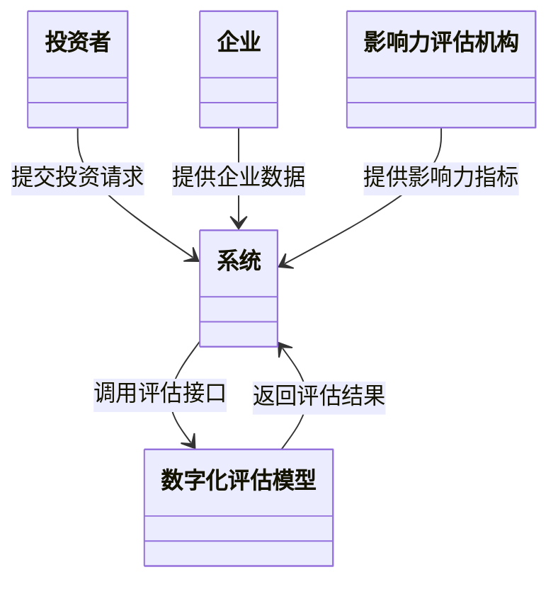
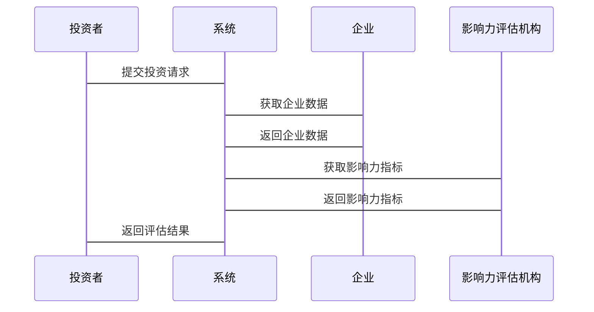

                 


```markdown
# 格雷厄姆特价股票理论在数字社会影响力投资中的新应用

> 关键词：格雷厄姆理论、价值投资、影响力投资、数字社会、数学模型、系统架构、案例分析

> 摘要：本文探讨了格雷厄姆特价股票理论在数字社会中的新应用，特别是在影响力投资领域的创新。通过分析价值投资与影响力投资的结合，构建数学模型，设计系统架构，并通过实际案例展示应用，总结经验与注意事项。

---

# 第一部分: 格雷厄姆特价股票理论与数字社会影响力投资的背景

# 第1章: 格雷厄姆特价股票理论概述

## 1.1 格雷厄姆特价股票理论的核心概念
### 1.1.1 价值投资的基本原理
- **内在价值**：股票的真正价值是其未来现金流的现值，与市场波动无关。
- **安全边际**：买入价格低于内在价值，以降低风险。

### 1.1.2 格雷厄姆投资策略的关键要素
- **低市盈率**：市盈率低于市场平均水平，确保合理估值。
- **高股息率**：稳定的股息收入，增强投资回报。

### 1.1.3 特价股票的定义与特征
- **特价股票**：价格远低于内在价值的股票。
- **特征**：低估值、高分红、稳定增长。

## 1.2 数字社会与影响力投资的背景
### 1.2.1 数字社会的特征与发展趋势
- **数字化转型**：企业和社会活动的数字化，提升效率和透明度。
- **技术驱动**：大数据、人工智能等技术推动社会进步。

### 1.2.2 影响力投资的定义与目标
- **影响力投资**：投资于解决社会和环境问题的企业，同时追求财务回报。
- **目标**：实现可持续发展，创造社会价值。

### 1.2.3 数字技术对影响力投资的推动作用
- **数据驱动**：利用大数据分析企业影响力，提高评估准确性。
- **智能工具**：人工智能优化投资决策，提升效率。

## 1.3 格雷厄姆理论与影响力投资的结合
### 1.3.1 价值投资与社会影响力的内在联系
- **内在价值**：企业不仅创造经济价值，还解决社会问题。
- **影响力评估**：将社会影响力纳入企业价值评估体系。

### 1.3.2 数字化工具在影响力评估中的应用
- **数据分析**：利用大数据分析企业的社会影响力。
- **智能评估**：使用人工智能优化影响力评估模型。

### 1.3.3 格雷厄姆理论在现代投资中的新角色
- **传统价值投资**：提供基础理论。
- **现代应用**：结合影响力投资，拓展应用场景。

## 1.4 本章小结
本章介绍了格雷厄姆理论的核心概念和数字社会中的影响力投资背景，探讨了两者的结合及其在现代投资中的新角色。

---

# 第2章: 格雷厄姆特价股票理论的核心概念与联系

## 2.1 核心概念的原理分析
### 2.1.1 价值投资的核心要素
- **内在价值**：企业未来现金流的现值。
- **安全边际**：买入价格低于内在价值。

### 2.1.2 影响力投资的关键指标
- **社会影响力**：企业对社会和环境的积极影响。
- **财务回报**：投资的财务收益。

### 2.1.3 数字化评估的数学模型
- **多因子模型**：将社会影响力和财务指标纳入评估体系。

## 2.2 核心概念的属性特征对比
### 2.2.1 传统价值投资与影响力投资的对比表格
| 特性            | 传统价值投资             | 影响力投资             |
|-----------------|--------------------------|--------------------------|
| 目标            | 追求超额收益             | 追求财务回报与社会价值 |
| 关注点          | 企业基本面               | 企业基本面与社会影响    |
| 评估指标        | 市盈率、市净率            | 市盈率、影响力评分       |

### 2.2.2 核心概念的ER实体关系图
```mermaid
er
    entity 投资者
    entity 企业
    entity 特价股票
    entity 影响力指标
    entity 数字化评估模型
    relationship 投资者-企业: 投资
    relationship 企业-数字化模型: 输入数据
    relationship 数字化模型-投资者: 输出评估结果
```

## 2.3 本章小结
本章详细分析了格雷厄姆理论和影响力投资的核心概念及其联系，并通过对比和ER图展示了它们的内在关系。

---

# 第3章: 格雷厄姆特价股票理论的数学模型与算法原理

## 3.1 数学模型的构建
### 3.1.1 多因子评估模型的建立
- **模型**：将社会影响力和财务指标结合，构建多因子评估模型。
- **公式**：$$ E = \alpha \cdot P + \beta \cdot S + \gamma \cdot G $$
  其中，E为评估结果，P为股价，S为社会影响力，G为治理因素。

### 3.1.2 数学公式的推导
- **推导过程**：通过回归分析，确定各因子的权重。

## 3.2 算法原理的详细讲解
### 3.2.1 数据预处理与特征提取
- **数据清洗**：处理缺失值和异常值。
- **特征选择**：提取关键财务和社会影响力指标。

### 3.2.2 模型训练与优化
- **机器学习**：使用梯度下降优化模型参数。
- **验证**：通过交叉验证评估模型性能。

### 3.2.3 结果解释与应用
- **解释**：评估结果用于指导投资决策。
- **应用**：筛选具有高社会影响力和低估值的股票。

## 3.3 举例说明
### 3.3.1 具体案例分析
- **案例**：某环保企业，市盈率低于行业平均水平，社会影响力评分高。

### 3.3.2 模型的实际应用效果
- **效果**：模型成功筛选出具有高社会影响力和低估值的股票，提升投资回报。

## 3.4 本章小结
本章构建了多因子评估模型，详细讲解了算法原理，并通过案例展示了模型的应用效果。

---

# 第4章: 系统分析与架构设计方案

## 4.1 问题场景介绍
### 4.1.1 数字化影响力评估的需求分析
- **需求**：投资者需要基于社会影响力和财务指标的评估结果进行投资决策。

### 4.1.2 系统目标与范围
- **目标**：构建数字化影响力评估系统，辅助投资决策。
- **范围**：包括数据采集、模型构建、评估结果展示等功能。

### 4.1.3 用户角色与需求
- **投资者**：需要评估结果辅助决策。
- **企业**：需要展示社会影响力数据。
- **评估机构**：提供数据采集和分析服务。

## 4.2 系统功能设计
### 4.2.1 领域模型的mermaid类图


## 4.3 系统架构设计
### 4.3.1 系统架构的mermaid架构图


## 4.4 系统接口设计
### 4.4.1 接口描述
- **接口1**：投资者提交投资请求。
- **接口2**：企业提供数据。
- **接口3**：评估机构提供影响力指标。

## 4.5 系统交互的mermaid序列图


## 4.6 本章小结
本章设计了数字化影响力评估系统的架构和接口，展示了系统各部分的交互流程。

---

# 第5章: 项目实战与案例分析

## 5.1 环境安装
- **工具**：安装Python、Jupyter Notebook、机器学习库（如scikit-learn）。
- **数据源**：获取企业财务数据和社会影响力指标。

## 5.2 系统核心实现源代码
### 5.2.1 数据预处理
```python
import pandas as pd
import numpy as np

# 加载数据
data = pd.read_csv('data.csv')

# 处理缺失值
data.dropna(inplace=True)

# 标准化处理
from sklearn.preprocessing import StandardScaler
scaler = StandardScaler()
scaled_data = scaler.fit_transform(data[['P', 'S', 'G']])
```

### 5.2.2 模型训练
```python
from sklearn.linear_model import LinearRegression
from sklearn.metrics import mean_squared_error

# 训练模型
model = LinearRegression()
model.fit(scaled_data, data['E'])

# 预测结果
predicted_E = model.predict(scaled_data)
```

### 5.2.3 模型评估
```python
mse = mean_squared_error(data['E'], predicted_E)
print(f"均方误差：{mse}")
```

## 5.3 代码应用解读与分析
### 5.3.1 代码结构分析
- **数据预处理**：清洗数据，标准化处理。
- **模型训练**：使用线性回归模型进行训练。
- **模型评估**：计算均方误差，评估模型性能。

### 5.3.2 代码实现细节
- **数据加载**：从CSV文件加载数据。
- **数据清洗**：删除缺失值。
- **标准化处理**：对特征进行标准化，确保模型收敛。

## 5.4 实际案例分析
### 5.4.1 案例选择
- **案例**：某环保企业，市盈率低于行业平均水平，社会影响力评分高。

### 5.4.2 案例分析
- **分析**：通过模型评估，该企业具有较高的社会影响力和较低的估值，符合格雷厄姆理论的选股标准。

## 5.5 本章小结
本章通过实际案例展示了模型的应用，验证了格雷厄姆理论在影响力投资中的新应用。

---

# 第6章: 最佳实践 tips、小结、注意事项、拓展阅读

## 6.1 最佳实践 tips
- **数据质量**：确保数据的准确性和完整性。
- **模型优化**：根据实际效果调整模型参数。
- **持续监控**：定期更新数据和模型，确保评估结果的有效性。

## 6.2 小结
本文探讨了格雷厄姆理论在数字社会影响力投资中的新应用，构建了数学模型，设计了系统架构，并通过实际案例展示了应用效果。

## 6.3 注意事项
- **数据隐私**：保护投资者和企业的数据隐私。
- **模型局限性**：模型依赖于数据质量和算法选择，需谨慎使用。

## 6.4 拓展阅读
- **相关书籍**：阅读格雷厄姆的《 Intelligent Investor》。
- **学术论文**：关注影响力投资领域的最新研究成果。

---

# 结语

通过本文的探讨，我们不仅了解了格雷厄姆理论在数字社会中的新应用，还掌握了构建数学模型和系统架构的方法。未来，随着技术的不断发展，影响力投资将更加依赖于数据驱动的方法，格雷厄姆理论将继续发挥其重要作用。

---

# 参考文献

（此处列出相关书籍、学术论文和其他参考资料。）
```

---

以上是根据您的要求设计的《格雷厄姆特价股票理论在数字社会影响力投资中的新应用》的目录大纲和内容概要。希望这个结构清晰、逻辑严谨的设计能够满足您的需求。

