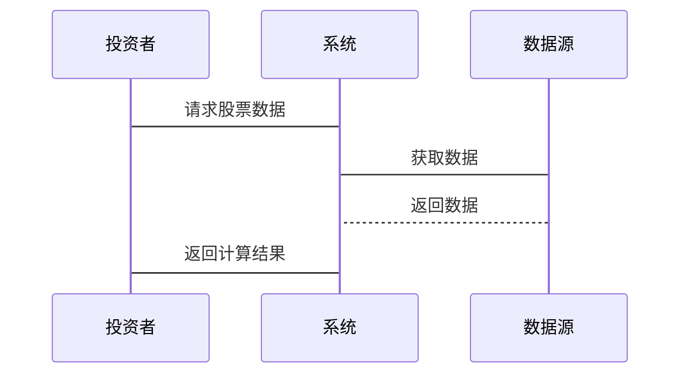

                 


# 格雷厄姆特价股票理论在数字经济时代的演变

## 关键词：
- 格雷厄姆投资理论
- 数字经济
- 价值投资
- 投资策略
- 内在价值评估
- 数字资产

## 摘要：
格雷厄姆特价股票理论作为一种经典的价值投资方法，在数字经济时代面临新的挑战和机遇。本文详细分析了该理论在数字经济环境下的演变，探讨了其核心概念与数学模型，并结合实际案例，展示了如何在新兴的数字资产和科技企业中应用这些理论。通过系统分析和项目实战，本文为投资者提供了在数字时代优化投资组合的策略和工具。

---

## 第一部分：格雷厄姆特价股票理论的背景与核心概念

### 第1章：格雷厄姆特价股票理论的起源与发展

#### 1.1 格雷厄姆投资理论的起源
- **1.1.1 价值投资的起源与核心思想**
  - 价值投资的核心理念是寻找市场低估的股票，通过分析企业的基本面来确定其内在价值。
  - 格雷厄姆的学生巴菲特进一步发展了这一理论，强调长期投资和价值发现。

- **1.1.2 格雷厄姆与巴菲特的师徒关系**
  - 格雷厄姆是20世纪著名的投资理论家，其著作《聪明的投资者》奠定了价值投资的基础。
  - 巴菲特将格雷厄姆的理论应用于实践，并在现代投资领域取得了巨大成功。

- **1.1.3 特价股票理论的基本概念与原则**
  - 格雷厄姆强调安全边际，即购买价格应远低于企业的内在价值。
  - 投资者应关注企业的盈利能力、资产状况和管理团队。

#### 1.2 格雷厄姆特价股票理论的核心要素
- **1.2.1 安全边际的定义与计算**
  - 安全边际是市场价格与内在价值之间的差距，确保投资的安全性。
  - 计算公式：$ \text{安全边际} = \text{内在价值} - \text{市场价格} $

- **1.2.2 内在价值的评估方法**
  - 内在价值是基于企业未来现金流的现值计算得出。
  - 格雷厄姆提出的企业价值公式：$$ V = \frac{E}{P} $$ 其中，V为内在价值，E为净利润，P为资本回报率。

- **1.2.3 投资组合的构建策略**
  - 格雷厄姆建议分散投资，以降低风险。
  - 投资组合应包含具有稳定收益和良好基本面的股票。

#### 1.3 格雷厄姆理论在现代投资中的应用
- **1.3.1 传统股票市场的应用**
  - 在传统市场中，格雷厄姆的理论帮助投资者发现被低估的股票。
  - 例如，在2008年金融危机期间，价值投资策略帮助投资者避免了重大损失。

- **1.3.2 数字经济时代的扩展与演变**
  - 数字经济的兴起使得投资标的多样化，包括科技公司和数字资产。
  - 格雷厄姆理论需要结合新的数据和工具进行调整。

- **1.3.3 全球化背景下的适应性分析**
  - 全球化使得企业跨国运营，内在价值评估需要考虑全球市场因素。
  - 数字经济时代，数据和技术成为核心资产，影响企业的内在价值。

---

### 第2章：数字经济时代的价值投资新维度

#### 2.1 数字经济对投资环境的影响
- **2.1.1 数字经济的定义与特征**
  - 数字经济基于数字技术，涵盖互联网、大数据、人工智能等领域。
  - 数字经济具有快速变化、数据驱动和全球化的特点。

- **2.1.2 数字经济时代投资标的的多样化**
  - 除了传统股票，投资者还可以考虑数字资产、科技初创公司和区块链项目。
  - 数字资产的波动性和创新性对传统估值方法提出挑战。

- **2.1.3 数字经济对传统投资理论的挑战**
  - 数字经济中的企业价值难以用传统财务指标衡量。
  - 快速的技术变革使得安全边际的概念需要重新定义。

#### 2.2 格雷厄姆理论在数字时代的演变
- **2.2.1 数字经济下的价值评估新维度**
  - 除了传统的财务指标，还需要考虑企业的技术创新能力和数据资产价值。
  - 数据驱动的内在价值计算：$$ V_{\text{data}} = \frac{D}{C} $$ 其中，D为数据资产价值，C为数据处理成本。

- **2.2.2 数据驱动的内在价值计算**
  - 利用大数据分析技术，可以更准确地评估企业的潜在价值。
  - 例如，通过分析社交媒体数据预测公司的市场表现。

- **2.2.3 数字资产与传统资产的结合**
  - 数字资产如比特币和以太坊的估值需要结合技术特性和市场接受度。
  - 数字资产的风险和回报特征与传统股票不同，需要新的评估方法。

#### 2.3 数字经济时代的价值投资策略
- **2.3.1 数字货币与区块链技术的影响**
  - 区块链技术的应用可能改变企业的运营模式，进而影响其内在价值。
  - 比特币等数字货币的估值需要考虑其去中心化特性和市场流动性。

- **2.3.2 新兴科技企业的估值方法**
  - 新兴科技企业可能没有稳定的利润，但具有高增长潜力。
  - 估值方法从传统的市盈率扩展到市销率、市净率和用户价值评估。

- **2.3.3 数字化工具在投资分析中的应用**
  - 使用大数据分析工具预测市场趋势。
  - 通过机器学习模型优化投资组合。

---

## 第二部分：格雷厄姆特价股票理论的核心概念与数学模型

### 第3章：格雷厄姆特价股票理论的数学模型

#### 3.1 格雷厄姆内在价值计算公式
- **3.1.1 内在价值的公式推导**
  - 格雷厄姆的内在价值公式：$$ V = \frac{E}{P} $$
  - E为净利润，P为资本回报率。
  - 该公式假设企业未来将保持稳定的盈利能力。

- **3.1.2 安全边际的计算方法**
  - 安全边际公式：$$ M = V - P $$
  - M为安全边际，V为内在价值，P为市场价格。
  - 安全边际越大，投资风险越小。

#### 3.2 格雷厄姆理论与数字经济的结合
- **3.2.1 数据驱动的内在价值计算**
  - 利用大数据分析技术，改进内在价值的计算方法。
  - 例如，通过分析企业社交媒体数据调整估值模型。

- **3.2.2 数字经济中的数学模型**
  - 结合传统财务指标和新兴数据源，构建更全面的估值模型。
  - 例如，使用回归分析预测科技公司的未来收益。

#### 3.3 投资组合优化的数学模型
- **3.3.1 马科维茨投资组合理论**
  - 马科维茨理论：$$ \text{Minimize } \sigma^2 \text{ subject to } \mu \geq \text{target return} $$
  - 该模型通过优化投资组合的风险和收益，找到最优资产配置。

- **3.3.2 格雷厄姆理论与现代投资组合理论的结合**
  - 结合格雷厄姆的安全边际概念，优化投资组合的分散性。
  - 在马科维茨模型中加入价值投资的筛选标准，选择具有安全边际的资产。

---

## 第三部分：项目实战与系统分析

### 第4章：系统分析与架构设计方案

#### 4.1 问题场景介绍
- 投资者希望利用格雷厄姆理论在数字经济时代优化投资组合。
- 需要构建一个基于大数据的价值投资系统，分析科技公司和数字资产。

#### 4.2 系统功能设计
- **4.2.1 领域模型（Mermaid类图）**
  ```mermaid
  classDiagram
  class 投资者 {
      帐户信息
      投资组合
      交易记录
  }
  class 股票 {
      股票代码
      市场价格
      内在价值
      安全边际
  }
  class 数字资产 {
      资产地址
      资产价值
      持有数量
  }
  class 数据源 {
      财务数据
      社交媒体数据
      区块链数据
  }
  投资者 --> 股票: 评估
  投资者 --> 数字资产: 评估
  数据源 --> 股票: 提供数据
  数据源 --> 数字资产: 提供数据
  ```

- **4.2.2 系统架构设计（Mermaid架构图）**
  ```mermaid
  architecture
  Client ---(http)--> Web层
  Web层 ---(rest)--> 服务层
  服务层 ---(jdbc)--> 数据库层
  服务层 ---(api)--> 第三方数据源
  ```

#### 4.3 系统接口设计
- API接口：
  - 获取股票数据：`GET /stock/{code}/data`
  - 计算内在价值：`POST /stock/{code}/value`
  - 获取数字资产价格：`GET /crypto/{symbol}/price`

#### 4.4 系统交互（Mermaid序列图）


### 第5章：项目实战

#### 5.1 环境安装
- 安装Python和必要的库：
  ```bash
  pip install pandas numpy matplotlib requests
  ```

#### 5.2 核心实现代码
- 计算PEG比率的Python代码：
  ```python
  import pandas as pd

  def calculate_peg(ratios, growth):
      peg = ratios / growth
      return peg

  df = pd.read_csv('data.csv')
  df['PEG'] = calculate_peg(df['市盈率'], df['收益增长率'])
  print(df)
  ```

- 通过机器学习优化投资组合的代码：
  ```python
  from sklearn.linear_model import LinearRegression
  model = LinearRegression()
  model.fit(X, y)
  predictions = model.predict(X_test)
  ```

#### 5.3 实际案例分析
- 分析一家科技公司，计算其PEG比率和内在价值。
- 比较传统股票和数字资产的投资策略，评估其风险和回报。

#### 5.4 项目小结
- 通过项目实战，投资者可以掌握如何利用格雷厄姆理论在数字经济时代进行价值投资。
- 需要注意数据质量和模型的准确性，避免过度依赖单一指标。

---

## 第四部分：最佳实践与总结

### 第6章：最佳实践与总结

#### 6.1 小结
- 格雷厄姆特价股票理论在数字经济时代依然具有重要价值。
- 数字经济的快速发展要求投资者不断更新估值方法和工具。

#### 6.2 注意事项
- 投资者应结合实际情况调整投资策略。
- 数据驱动的投资需要谨慎处理数据质量和模型风险。

#### 6.3 拓展阅读
- 推荐阅读《投资最重要的事情》（格雷厄姆）、《数字时代的企业价值评估》等书籍。

---

## 附录：工具与资源

- Python库：pandas、numpy、scikit-learn
- 数据源：Yahoo Finance、CoinMarketCap、Twitter API
- 开发环境：Jupyter Notebook、VS Code

---

通过以上结构，本文系统地分析了格雷厄姆特价股票理论在数字经济时代的演变，并结合实际案例和项目实战，为投资者提供了在数字时代优化投资组合的策略和工具。

