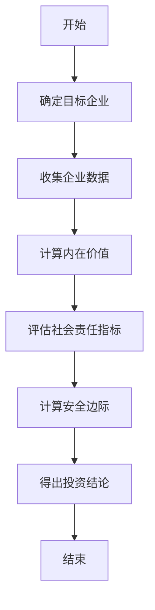

                 

# 格雷厄姆特价股票理论在社会企业投资中的应用

## 关键词：格雷厄姆，特价股票，社会企业，投资，价值投资

## 摘要：本文探讨了格雷厄姆的特价股票理论在社会企业投资中的应用，通过分析社会企业的定义、核心概念、算法原理、系统架构、项目实战以及最佳实践，揭示了如何将传统价值投资理念与社会责任投资相结合，实现长期稳健的投资回报。

---

## 第一部分: 格雷厄姆特价股票理论与社会企业投资概述

### 第1章: 格雷厄姆特价股票理论的核心概念

#### 1.1 格雷厄姆特价股票理论的背景与起源

- **价值投资的起源与发展**：格雷厄姆是价值投资之父，其理论起源于20世纪初，强调以低于内在价值的价格购买优质资产。
- **格雷厄姆投资理念的核心思想**：安全边际、市场先生理论、买入并持有策略。
- **特价股票的定义与特征**：价格远低于内在价值的股票，具有较高的投资潜力。

#### 1.2 社会企业的定义与特点

- **社会企业的基本定义**：以实现社会价值为目标，兼顾经济效益和可持续发展的企业。
- **社会企业的核心特征**：社会责任感强、注重环境保护、员工福利好、透明度高。
- **社会企业与传统企业的区别**：传统企业以利润最大化为目标，而社会企业注重可持续发展和社会影响。

#### 1.3 格雷厄姆理论与社会企业投资的结合

- **格雷厄姆理论在社会企业投资中的适用性**：格雷厄姆的理论强调安全边际和内在价值，适用于寻找被低估的社会企业。
- **社会企业投资的特殊性与挑战**：社会责任指标难以量化、可持续性评估复杂、市场流动性较低。
- **格雷厄姆理论的延展性与创新点**：引入社会责任指标、优化评估模型、平衡财务与社会价值。

### 第2章: 格雷厄姆特价股票理论的核心原理

#### 2.1 格雷厄姆投资的三要素

- **安全边际的定义与计算**：安全边际 = 内在价值 - 市场价格，确保投资的安全性。
- **内在价值的评估方法**：通过分析企业财务状况、行业地位和未来盈利能力，估算其内在价值。
- **市场先生的概念与应用**：市场先生代表市场情绪，投资者应理性应对市场的波动。

#### 2.2 社会企业投资的核心要素

- **社会责任的量化评估**：通过ESG（环境、社会、治理）指标，评估企业的社会责任表现。
- **企业治理结构的优化**：良好的治理结构是企业长期发展的基础。
- **可持续发展能力的分析**：企业是否具备长期可持续发展的能力。

#### 2.3 格雷厄姆理论与社会企业投资的结合模型

- **核心概念原理**：将格雷厄姆的安全边际和内在价值理论与社会企业的ESG指标相结合。
- **概念属性特征对比表格**：对比传统企业和社会企业在价值评估、社会责任等方面的差异。
- **ER实体关系图架构**：展示企业、投资者、社会责任等实体之间的关系。

### 第3章: 格雷厄姆特价股票理论的数学模型与算法原理

#### 3.1 内在价值的数学模型

- **内在价值公式**：
  $$ V = \frac{E}{k} $$
  其中，$E$ 是企业的预期收益，$k$ 是资本成本。

#### 3.2 安全边际的计算方法

- **安全边际公式**：
  $$ \text{安全边际} = \text{内在价值} - \text{市场价格} $$

#### 3.3 社会企业投资的优化算法

- **基于社会责任的权重分配**：将社会责任指标赋予一定的权重，融入整体评估体系。
- **多目标优化模型**：
  $$ \max \sum_{i=1}^n w_i x_i $$
  其中，$w_i$ 是目标权重，$x_i$ 是目标变量。

#### 3.4 算法原理的 Mermaid 流程图

---

## 第二部分: 格雷厄姆特价股票理论在社会企业投资中的应用

### 第4章: 社会企业投资的核心要素

#### 4.1 社会企业投资的核心要素

- **社会责任的量化评估**：通过ESG指标量化企业的社会责任表现。
- **企业治理结构的优化**：优化企业治理结构，提高透明度和责任感。
- **可持续发展能力的分析**：评估企业是否具备长期可持续发展的能力。

#### 4.2 格雷厄姆理论在社会企业投资中的应用模型

- **核心概念原理**：将格雷厄姆的安全边际和内在价值理论与社会企业的ESG指标相结合。
- **概念属性特征对比表格**：对比传统企业和社会企业在价值评估、社会责任等方面的差异。
- **ER实体关系图架构**：展示企业、投资者、社会责任等实体之间的关系。

### 第5章: 格雷厄姆特价股票理论的数学模型与算法原理

#### 5.1 内在价值的数学模型

- **内在价值公式**：
  $$ V = \frac{E}{k} $$
  其中，$E$ 是企业的预期收益，$k$ 是资本成本。

#### 5.2 安全边际的计算方法

- **安全边际公式**：
  $$ \text{安全边际} = \text{内在价值} - \text{市场价格} $$

#### 5.3 社会企业投资的优化算法

- **基于社会责任的权重分配**：将社会责任指标赋予一定的权重，融入整体评估体系。
- **多目标优化模型**：
  $$ \max \sum_{i=1}^n w_i x_i $$
  其中，$w_i$ 是目标权重，$x_i$ 是目标变量。

#### 5.4 算法原理的 Mermaid 流程图

---

## 第三部分: 项目实战与最佳实践

### 第6章: 项目实战分析

#### 6.1 项目背景与目标

- **项目背景**：选择一家社会企业作为案例，分析其投资价值。
- **项目目标**：通过格雷厄姆理论和ESG指标，评估其投资价值。

#### 6.2 数据收集与分析

- **环境安装**：安装必要的数据分析工具，如Python、Pandas等。
- **数据收集**：收集目标企业的财务数据、ESG评分、行业地位等。
- **分析过程**：
  1. 计算内在价值和市场价格。
  2. 评估社会责任指标。
  3. 计算安全边际，得出投资结论。

#### 6.3 项目总结与启示

- **项目总结**：案例分析的结论和经验教训。
- **投资启示**：如何在实际中应用格雷厄姆理论和ESG指标，平衡财务表现和社会责任。

### 第7章: 最佳实践与注意事项

#### 7.1 投资策略的优化

- **平衡财务与社会价值**：在选择社会企业时，需综合考虑财务表现和社会责任。
- **长期投资的重要性**：社会企业的价值可能在长期体现，需耐心持有。

#### 7.2 小结

- **核心内容回顾**：格雷厄姆理论与社会企业投资的结合。
- **注意事项**：社会责任指标的量化难度、市场流动性低的风险。

#### 7.3 拓展阅读

- **推荐书籍**：《格雷厄姆证券分析》、《社会责任投资指南》。
- **相关文章**：深入探讨价值投资与社会责任的结合。

---

## 第四部分: 结论与展望

### 第8章: 结论与展望

#### 8.1 核心观点总结

- 格雷厄姆的特价股票理论为社会企业投资提供了科学的框架，结合ESG指标，能够更好地平衡财务回报与社会责任。
- 社会企业的投资需要综合考虑企业的内在价值、安全边际和可持续发展能力。

#### 8.2 未来展望

- **技术创新**：利用大数据和人工智能技术，优化社会企业评估模型。
- **市场发展**：随着社会责任投资的兴起，社会企业的投资机会将不断增加。

---

## 关键词：格雷厄姆，特价股票，社会企业，投资，价值投资

## 摘要：本文探讨了格雷厄姆的特价股票理论在社会企业投资中的应用，通过分析社会企业的定义、核心概念、算法原理、系统架构、项目实战以及最佳实践，揭示了如何将传统价值投资理念与社会责任投资相结合，实现长期稳健的投资回报。

