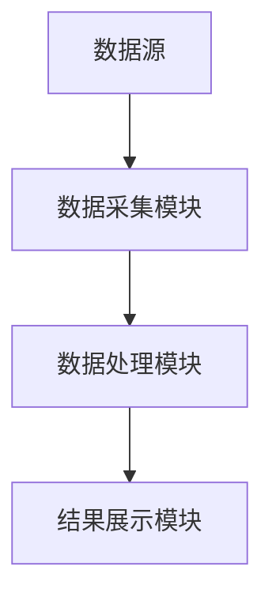

                 


```markdown
# 格雷厄姆特价股票理论在社会影响力债券中的新应用

> 关键词：格雷厄姆投资理论，社会影响力债券，安全边际，内在价值，算法原理

> 摘要：本文探讨了将格雷厄姆的价值投资理论应用于社会影响力债券的可能性，通过分析安全边际和内在价值等核心概念，结合算法原理和系统架构设计，提出了一种创新的投资策略。文章详细讲解了从理论到实践的全过程，为投资者提供了新的视角和方法。

---

## 第一部分: 背景介绍

### 第1章: 格雷厄姆特价股票理论与社会影响力债券的背景

#### 1.1 格雷厄姆投资理论的背景与起源
- **1.1.1 价值投资的鼻祖：本杰明·格雷厄姆**
  格雷厄姆是价值投资的先驱，提出安全边际、内在价值等概念，强调以低于内在价值的价格买入股票。
- **1.1.2 格雷厄姆投资理论的核心理念**
  格雷厄姆主张以长期视角进行投资，注重安全边际，避免市场波动的影响。
- **1.1.3 格雷厄姆安全边际概念的提出与意义**
  安全边际是指投资标的内在价值与市场价格的差额，确保投资的安全性。

#### 1.2 社会影响力债券的基本概念
- **1.2.1 社会影响力债券的定义与特点**
  社会影响力债券是一种将社会效益与经济效益结合的金融工具，用于资助社会公益项目。
- **1.2.2 社会影响力债券与传统债券的区别**
  社会影响力债券不仅关注财务回报，还关注社会效益，具有双重目标。
- **1.2.3 社会影响力债券的市场现状与发展前景**
  随着社会对可持续发展的关注增加，社会影响力债券市场迅速发展。

#### 1.3 格雷厄姆理论与社会影响力债券的结合
- **1.3.1 格雷厄姆理论在社会影响力债券中的适用性分析**
  格雷厄姆的理论注重内在价值和安全边际，适合用于评估社会影响力债券的投资价值。
- **1.3.2 社会影响力债券的内在价值评估方法**
  内在价值评估需要考虑债券的现金流、期限、信用风险等因素。
- **1.3.3 格雷厄姆安全边际在社会影响力债券投资中的应用**
  通过计算安全边际，投资者可以避免过度依赖市场波动，确保投资的稳健性。

---

## 第二部分: 核心概念与联系

### 第2章: 格雷厄姆理论的核心概念与社会影响力债券的联系

#### 2.1 格雷厄姆理论的核心概念
- **2.1.1 安全边际**
  安全边际 = 内在价值 - 市场价格
- **2.1.2 内在价值**
  内在价值 = 现金流的现值
- **2.1.3 市场先生**
  市场波动由“市场先生”引发，投资者应避免受其影响。

#### 2.2 社会影响力债券的核心概念
- **2.2.1 发行主体**
  社会影响力债券通常由政府或非营利组织发行，用于资助教育、医疗等项目。
- **2.2.2 收益率与风险**
  社会影响力债券的收益率较低，但风险主要来自项目的社会效益实现情况。
- **2.2.3 评级体系**
  债券评级综合考虑财务状况和社会效益实现的可能性。

#### 2.3 格雷厄姆理论与社会影响力债券的联系
- **2.3.1 安全边际在投资中的应用**
  通过计算安全边际，投资者可以选择被低估的社会影响力债券。
- **2.3.2 内在价值评估的重要性**
  正确评估内在价值有助于识别高潜力的社会影响力债券。
- **2.3.3 市场波动的应对策略**
  格雷厄姆的市场先生理论提醒投资者关注长期价值，避免短期波动的影响。

---

## 第三部分: 算法原理

### 第3章: 格雷厄姆理论在社会影响力债券中的算法实现

#### 3.1 安全边际算法
- **3.1.1 算法步骤**
  1. 计算债券的内在价值。
  2. 确定债券的市场价格。
  3. 计算安全边际 = 内在价值 - 市场价格。
- **3.1.2 实现代码**
  ```python
  def calculate_margin(intrinsic_value, market_price):
      return intrinsic_value - market_price
  ```
- **3.1.3 示例**
  如果内在价值为100，市场价格为90，则安全边际为10。

#### 3.2 内在价值评估算法
- **3.2.1 算法步骤**
  1. 确定债券的现金流。
  2. 计算折现率。
  3. 计算现金流的现值，得到内在价值。
- **3.2.2 实现代码**
  ```python
  def calculate_intrinsic_value(cash_flows, discount_rate):
      return sum(flow / (1 + discount_rate)**t for t, flow in enumerate(cash_flows))
  ```
- **3.2.3 示例**
  现金流为100，折现率为5%，则内在价值为95.24。

#### 3.3 结合算法
- **3.3.1 算法步骤**
  1. 计算内在价值和市场价格。
  2. 计算安全边际。
  3. 选择安全边际为正的债券进行投资。
- **3.3.2 实现代码**
  ```python
  def select_bonds(bonds):
      selected = []
      for bond in bonds:
          margin = bond['intrinsic_value'] - bond['market_price']
          if margin > 0:
              selected.append(bond)
      return selected
  ```

---

## 第四部分: 系统架构设计

### 第4章: 格雷厄姆理论在社会影响力债券中的系统设计

#### 4.1 系统架构概述
- **4.1.1 系统目标**
  开发一个基于格雷厄姆理论的社会影响力债券评估系统。
- **4.1.2 功能模块**
  - 数据采集模块：收集债券信息。
  - 数据处理模块：计算内在价值和安全边际。
  - 结果展示模块：显示评估结果。

#### 4.2 系统功能模块设计
- **4.2.1 数据采集模块**
  使用API接口获取债券数据。
- **4.2.2 数据处理模块**
  实现内在价值和安全边际的计算。
- **4.2.3 结果展示模块**
  以图表形式展示评估结果。

#### 4.3 系统架构图


---

## 第五部分: 项目实战

### 第5章: 格雷厄姆理论在社会影响力债券中的实际应用

#### 5.1 环境配置
- 安装必要的Python库，如numpy、pandas。

#### 5.2 核心代码实现
- 内在价值计算：
  ```python
  import numpy as np

  def calculate_intrinsic_value(cash_flows, discount_rate):
      return np.npv(discount_rate, cash_flows)
  ```

#### 5.3 实例分析
- 以某社会影响力债券为例，详细讲解评估过程。

#### 5.4 项目小结
- 总结项目实现的关键点和经验教训。

---

## 第六部分: 总结与展望

### 第6章: 总结与展望

#### 6.1 总结
- 格雷厄姆理论为社会影响力债券的投资提供了新的思路。
- 通过算法和系统设计，可以有效评估债券的内在价值和安全边际。

#### 6.2 展望
- 进一步研究社会影响力债券的评级体系。
- 开发更复杂的评估模型，结合更多因素进行分析。

---

通过本文的详细分析，我们展示了如何将格雷厄姆的价值投资理论应用于社会影响力债券，为投资者提供了新的视角和方法。未来的研究可以进一步探索更多应用场景，为可持续投资提供更多的理论支持和实践指导。
```

