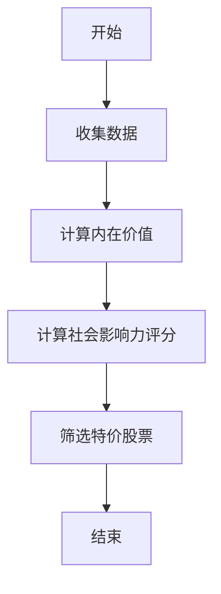
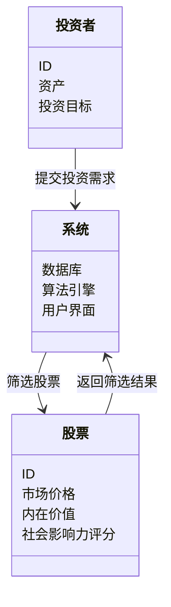
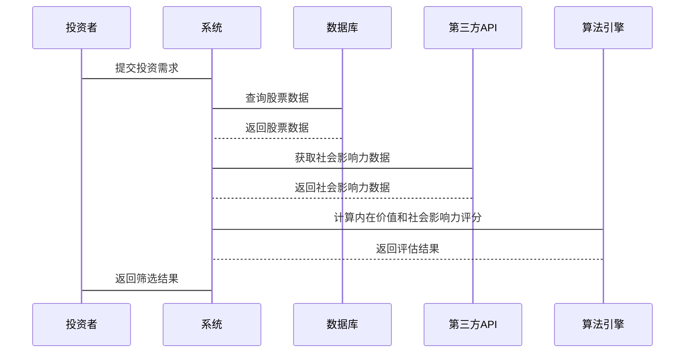

                 


# 《格雷厄姆特价股票理论在社会影响力投资中的新应用》

> 关键词：格雷厄姆，特价股票，社会影响力，投资策略，价值评估

> 摘要：本文探讨了格雷厄姆特价股票理论在社会影响力投资中的新应用，分析了传统价值投资与社会责任投资的结合方式，提出了基于社会影响力的特价股票筛选标准和评估模型，结合实际案例，展示了如何将格雷厄姆理论应用于社会影响力投资中，以实现经济效益与社会责任的统一。

---

## 第1章 格雷厄姆特价股票理论概述

### 1.1 格雷厄姆投资理论的核心理念

#### 1.1.1 价值投资的基本原则
- **内在价值**：股票的真正价值是其未来现金流的现值。
- **安全边际**：以低于内在价值的价格买入股票，以降低投资风险。

#### 1.1.2 格雷厄姆的"安全边际"概念
- 安全边际 = 内在价值 - 市场价格
- 通过安全边际，投资者可以在市场波动中保持投资的稳定性。

#### 1.1.3 投资组合的构建与管理
- 投资组合分散化：避免过度集中，降低风险。
- 定期调整：根据市场变化和公司情况，动态优化投资组合。

### 1.2 特价股票的定义与特征

#### 1.2.1 特价股票的定义
- 特价股票是指市场价格低于其内在价值的股票。
- 具备长期增长潜力，但当前市场价格被低估。

#### 1.2.2 特价股票的市场特征
- 市场价格波动大，但内在价值稳定。
- 投资者可以通过深入分析发现潜在价值。

#### 1.2.3 特价股票的投资机会与风险
- 机会：低价买入，高价卖出，获取超额收益。
- 风险：市场波动可能导致短期亏损，需要耐心和长期持有。

### 1.3 格雷厄姆理论在现代投资中的应用

#### 1.3.1 格雷厄姆理论的演变
- 从格雷厄姆的经典理论到现代价值投资的演变。
- 结合现代金融工具和市场环境，理论的应用更加多样化。

#### 1.3.2 格雷厄姆理论在机构投资中的应用
- 机构投资者利用格雷厄姆理论构建稳健的投资组合。
- 结合量化分析和基本面分析，提高投资决策的科学性。

#### 1.3.3 格雷厄姆理论与个人投资者的结合
- 个人投资者可以通过格雷厄姆理论，实现理性投资。
- 理解安全边际和内在价值，避免盲目跟风。

### 1.4 本章小结
本章介绍了格雷厄姆投资理论的核心理念，包括价值投资的基本原则和安全边际的概念。同时，详细阐述了特价股票的定义、特征及其在现代投资中的应用，为后续章节奠定了理论基础。

---

## 第2章 社会影响力投资的背景与现状

### 2.1 社会影响力投资的定义与特征

#### 2.1.1 社会影响力投资的定义
- 社会影响力投资是指将资金投资于能够产生社会价值和经济回报的项目或企业。
- 投资目标不仅包括财务回报，还包括社会影响力。

#### 2.1.2 社会影响力投资的核心特征
- **双重目标**：追求财务回报和社会价值。
- **长期性**：注重长期的社会影响力，而非短期收益。
- **多样性**：覆盖多个行业和领域，具有较高的灵活性。

#### 2.1.3 社会影响力投资的分类
- 慈善投资（Philanthropy）：以慈善为目的，不追求财务回报。
- 社会责任投资（SRI）：关注企业社会责任，结合财务回报。
- 可持续投资（Sustainable Investment）：注重环境保护和可持续发展。

### 2.2 社会影响力投资的兴起与发展趋势

#### 2.2.1 社会影响力投资的兴起背景
- 全球化背景下，社会问题日益突出，如贫富差距、环境污染等。
- 投资者开始关注企业对社会的贡献，推动社会影响力投资的发展。

#### 2.2.2 社会影响力投资的全球发展趋势
- 全球范围内，越来越多的机构和个人投资者开始关注社会影响力投资。
- 相关政策和法规逐步完善，推动社会影响力投资的规范化发展。

#### 2.2.3 社会影响力投资的未来展望
- 随着技术的进步和社会的发展，社会影响力投资将更加多元化和专业化。
- 更多的投资者将加入社会影响力投资，推动社会问题的解决。

### 2.3 社会影响力投资与传统投资的对比

#### 2.3.1 投资目标的差异
- 传统投资：以财务回报为主要目标。
- 社会影响力投资：以双重目标为核心。

#### 2.3.2 投资策略的差异
- 传统投资：注重短期收益，可能忽视企业社会责任。
- 社会影响力投资：注重长期价值，强调企业社会责任。

#### 2.3.3 投资效果的差异
- 传统投资：可能对社会问题产生负面影响。
- 社会影响力投资：通过投资促进社会问题的解决，实现正向循环。

### 2.4 本章小结
本章分析了社会影响力投资的定义、特征和分类，并对比了社会影响力投资与传统投资的差异。通过了解社会影响力投资的背景和趋势，为后续章节中将格雷厄姆理论应用于社会影响力投资奠定了基础。

---

## 第3章 格雷厄姆特价股票理论与社会影响力投资的结合

### 3.1 格雷厄姆理论与社会影响力投资的契合点

#### 3.1.1 价值投资与社会价值的结合
- 格雷厄姆的内在价值理念与社会影响力投资的双重目标相契合。
- 通过分析企业的内在价值，同时关注其社会影响力，实现投资的双重收益。

#### 3.1.2 安全边际与社会影响力的匹配
- 格雷厄姆的安全边际概念可以用于评估社会影响力的稳定性。
- 通过安全边际，确保投资的社会影响力不会因短期市场波动而受损。

#### 3.1.3 投资组合优化与社会责任的统一
- 格雷厄姆的投资组合优化方法可以应用于社会影响力投资。
- 通过分散投资，降低风险，同时实现社会责任的目标。

### 3.2 社会影响力投资中的特价股票筛选标准

#### 3.2.1 社会影响力评估指标
- **企业社会责任（CSR）**：企业是否积极参与社会公益事业。
- **环境影响**：企业对环境的影响程度。
- **社会贡献**：企业对社会的直接或间接贡献。

#### 3.2.2 特价股票的筛选标准
- 市场价格低于内在价值。
- 具备长期增长潜力。
- 符合社会影响力投资的目标。

#### 3.2.3 特价股票的社会影响力评分体系
- 通过量化社会影响力指标，对股票进行评分。
- 根据评分结果，筛选出符合社会影响力投资标准的特价股票。

### 3.3 格雷厄姆理论在社会影响力投资中的创新应用

#### 3.3.1 特价股票的社会影响力溢价
- 由于社会影响力投资的需求增加，具备社会影响力的特价股票可能享有溢价。
- 投资者可以通过分析社会影响力溢价，优化投资组合。

#### 3.3.2 社会影响力投资中的价值重估
- 传统价值评估方法与社会影响力评估相结合。
- 对企业的社会影响力进行重新评估，调整其内在价值。

#### 3.3.3 特价股票的社会影响力投资策略
- 结合格雷厄姆的特价股票筛选标准，制定社会影响力投资策略。
- 通过长期持有和分散投资，实现财务回报与社会影响力的统一。

### 3.4 本章小结
本章探讨了格雷厄姆理论与社会影响力投资的契合点，并提出了社会影响力投资中的特价股票筛选标准和评估模型。通过创新应用格雷厄姆理论，为社会影响力投资提供了新的思路和方法。

---

## 第4章 格雷厄姆特价股票理论与社会影响力投资的核心概念

### 4.1 核心概念的定义与属性对比

#### 4.1.1 格雷厄姆理论的核心概念
- **内在价值**：股票的未来现金流的现值。
- **安全边际**：内在价值与市场价格的差额。

#### 4.1.2 社会影响力投资的核心概念
- **社会影响力**：企业对社会的贡献和影响。
- **双重目标**：财务回报与社会价值的统一。

#### 4.1.3 核心概念的属性对比表格
| 核心概念       | 格雷厄姆理论             | 社会影响力投资         |
|----------------|--------------------------|------------------------|
| 定义           | 股票的内在价值和安全边际 | 财务回报与社会价值     |
| 属性           | 稳定性、可测性           | 长期性、多样性         |

### 4.2 核心概念的ER实体关系图

```mermaid
erd
    组织/企业 --> 内在价值
    内在价值 --> 市场价格
    市场价格 --> 安全边际
    安全边际 --> 投资决策
    投资决策 --> 社会影响力
    社会影响力 --> 财务回报
```

### 4.3 核心概念的数学模型与公式

#### 4.3.1 格雷厄姆理论的数学模型
$$ \text{内在价值} = \sum_{t=1}^{n} \frac{\text{现金流}}{(1 + r)^t} $$
其中，\( r \) 是折现率。

#### 4.3.2 社会影响力评分的数学公式
$$ \text{社会影响力评分} = \frac{\text{社会贡献} + \text{环境影响} + \text{企业社会责任}}{3} $$
其中，各项指标的权重相等。

### 4.4 本章小结
本章通过定义和对比核心概念，构建了格雷厄姆理论与社会影响力投资之间的关系模型，并通过数学公式展示了内在价值、安全边际和社会影响力评分的计算方法。

---

## 第5章 格雷厄姆特价股票理论与社会影响力投资的算法原理

### 5.1 算法原理的概述

#### 5.1.1 格雷厄姆理论的算法基础
- 基于内在价值和安全边际的算法。
- 通过量化分析，筛选出具备安全边际的特价股票。

#### 5.1.2 社会影响力投资的算法框架
- 结合社会影响力评分，筛选出具备社会影响力的特价股票。
- 通过算法优化，实现投资组合的最优化。

### 5.2 算法的详细讲解

#### 5.2.1 格雷厄姆理论的算法实现
1. 计算股票的内在价值。
2. 比较市场价格与内在价值，计算安全边际。
3. 筛选出具备安全边际的特价股票。

#### 5.2.2 社会影响力评分的算法实现
1. 收集企业的社会影响力相关数据。
2. 计算社会影响力评分。
3. 根据评分结果，筛选出具备社会影响力的股票。

#### 5.2.3 算法流程图



### 5.3 数学公式与算法结合

#### 5.3.1 内在价值公式
$$ \text{内在价值} = \sum_{t=1}^{n} \frac{\text{现金流}}{(1 + r)^t} $$
其中，\( r \) 是折现率。

#### 5.3.2 社会影响力评分公式
$$ \text{社会影响力评分} = \frac{\text{社会贡献} + \text{环境影响} + \text{企业社会责任}}{3} $$

### 5.4 本章小结
本章详细讲解了格雷厄姆理论与社会影响力投资的算法原理，通过流程图和数学公式展示了算法的实现过程，为后续章节的系统设计奠定了基础。

---

## 第6章 格雷厄姆特价股票理论与社会影响力投资的系统架构设计

### 6.1 问题场景介绍

#### 6.1.1 问题背景
- 投资者希望在追求财务回报的同时，实现社会影响力。
- 如何将格雷厄姆理论应用于社会影响力投资，成为投资者关注的焦点。

#### 6.1.2 问题描述
- 构建一个基于格雷厄姆理论的社会影响力投资系统，实现特价股票的筛选和评估。

### 6.2 系统功能设计

#### 6.2.1 领域模型设计


#### 6.2.2 系统架构设计


#### 6.2.3 系统交互设计


### 6.3 本章小结
本章通过系统架构设计，展示了如何将格雷厄姆理论应用于社会影响力投资。通过构建领域模型和系统架构，明确了系统的核心功能和交互流程。

---

## 第7章 格雷厄姆特价股票理论与社会影响力投资的项目实战

### 7.1 环境安装与配置

#### 7.1.1 安装Python
- 安装Python 3.x 版本。
- 配置Python环境变量。

#### 7.1.2 安装依赖库
- 使用pip安装必要的库：
  ```
  pip install numpy pandas matplotlib
  ```

### 7.2 核心实现代码

#### 7.2.1 计算内在价值
```python
import numpy as np

def calculate_intrinsic_value(cash_flows, discount_rate):
    return np.npv(discount_rate, cash_flows)
```

#### 7.2.2 计算社会影响力评分
```python
def calculate_social_impact_score(company_data):
    social_contribution = company_data['社会贡献']
    environmental_impact = company_data['环境影响']
    csr = company_data['企业社会责任']
    return (social_contribution + environmental_impact + csr) / 3
```

#### 7.2.3 筛选特价股票
```python
def screen_special_stocks(stocks, discount_rate):
    special_stocks = []
    for stock in stocks:
        intrinsic_value = calculate_intrinsic_value(stock['现金流'], discount_rate)
        market_price = stock['市场价格']
        social_impact_score = calculate_social_impact_score(stock['公司数据'])
        if market_price < intrinsic_value and social_impact_score > 0.7:
            special_stocks.append(stock)
    return special_stocks
```

### 7.3 代码应用解读与分析

#### 7.3.1 计算内在价值
- 使用NPV函数计算股票的内在价值。
- 折现率的选择对内在价值的计算影响较大。

#### 7.3.2 计算社会影响力评分
- 根据公司数据中的社会贡献、环境影响和企业社会责任三项指标，计算社会影响力评分。
- 评分越高，说明公司的社会影响力越大。

#### 7.3.3 筛选特价股票
- 筛选出市场价格低于内在价值且社会影响力评分较高的股票。
- 通过参数调整，可以优化筛选结果。

### 7.4 实际案例分析

#### 7.4.1 案例背景
- 某投资者希望在科技行业筛选具备社会影响力的特价股票。

#### 7.4.2 数据准备
- 收集科技行业的公司数据，包括现金流、市场价格和社会影响力相关指标。

#### 7.4.3 筛选过程
- 使用上述代码计算内在价值和社会影响力评分。
- 筛选出符合标准的特价股票。

#### 7.4.4 分析结果
- 筛选出的股票具备较高的社会影响力和投资价值。
- 投资者可以根据分析结果制定投资策略。

### 7.5 本章小结
本章通过实际案例展示了如何将格雷厄姆理论应用于社会影响力投资。通过编写和运行代码，投资者可以筛选出具备社会影响力的特价股票，实现财务回报与社会影响力的统一。

---

## 第8章 最佳实践与总结

### 8.1 最佳实践

#### 8.1.1 格雷厄姆理论的应用
- 选择具备安全边际的特价股票，降低投资风险。
- 定期调整投资组合，保持稳健收益。

#### 8.1.2 社会影响力投资的实践
- 关注企业的社会责任和环境影响，选择具备社会影响力的股票。
- 长期持有，避免短期波动影响投资决策。

#### 8.1.3 综合策略
- 结合格雷厄姆理论和社会影响力投资，制定综合策略。
- 根据市场变化和企业情况，动态优化投资组合。

### 8.2 小结
通过本文的探讨，我们可以看到，格雷厄姆特价股票理论与社会影响力投资的结合，为投资者提供了新的思路和方法。投资者可以在追求财务回报的同时，关注企业的社会责任，实现经济效益与社会影响力的统一。

### 8.3 注意事项

#### 8.3.1 市场风险
- 特价股票的价格波动较大，投资者需注意市场风险。

#### 8.3.2 数据准确性
- 社会影响力评分依赖于数据的准确性，投资者需确保数据来源可靠。

#### 8.3.3 长期投资
- 社会影响力投资需要长期持有，投资者需具备耐心和信心。

### 8.4 拓展阅读
- 格雷厄姆的经典著作《聪明的投资者》。
- 社会影响力投资的相关文献和报告。

---

## 附录

### 附录A 格雷厄姆理论与社会影响力投资的相关文献

### 附录B 项目代码与数据集

---

通过以上结构，我们可以看到，本文系统地探讨了格雷厄姆特价股票理论在社会影响力投资中的新应用，从理论到实践，从概念到算法，为投资者提供了全面的指导和参考。

