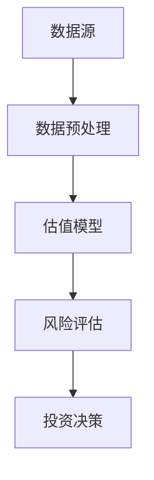

                 


```markdown
# 格雷厄姆特价股票理论在私募股权投资中的新应用

## 关键词：格雷厄姆投资理论，私募股权投资，价值投资，安全边际，内在价值，DCF模型

## 摘要：
本文探讨了格雷厄姆的经典价值投资理论在私募股权投资领域中的创新应用。通过分析格雷厄姆的安全边际和内在价值评估等核心理念，结合私募股权投资的特殊机制，提出了新的估值方法和投资策略。文章结合实际案例，详细阐述了如何在私募股权中应用格雷厄姆的理论，并通过数学模型和系统架构的设计，展示了其在实践中的具体实现。此外，本文还探讨了如何利用现代技术手段，如大数据和机器学习，进一步优化私募股权投资的决策过程。

---

## 第一章：格雷厄姆投资理论基础

### 1.1 格雷厄姆投资理论的核心概念

#### 1.1.1 价值投资的定义与特点
- **定义**：价值投资是一种以低于内在价值的价格买入优质资产的投资策略。
- **特点**：
  - 长期投资视角。
  - 侧重于基本面分析。
  - 寻找市场先生的错误定价。

#### 1.1.2 格雷厄姆的安全边际理论
- **定义**：安全边际是指买入价格与内在价值之间的差距，用以缓冲市场波动带来的风险。
- **计算公式**：
  $$ \text{安全边际} = \text{内在价值} - \text{买入价格} $$
- **作用**：确保即使估值有误，也能获得正收益。

#### 1.1.3 内在价值与市场价值的对比
| **维度** | **内在价值** | **市场价值** |
|----------|---------------|--------------|
| 定义     | 公司未来现金流的现值 | 市场交易价格 |
| 受控因素 | 公司基本面 | 市场情绪 |
| 稳定性   | 较稳定 | 易波动 |

#### 1.1.4 投资组合构建原则
- **分散投资**：降低单一资产的风险。
- **长期持有**：避免短期波动的干扰。
- **逆向投资**：在市场恐慌时买入，在市场狂热时卖出。

### 1.2 格雷厄姆投资策略的关键要素

#### 1.2.1 股票估值的基本方法
- **相对估值法**：市盈率（P/E）、市净率（P/B）。
- **绝对估值法**：现金流折现法（DCF）。

#### 1.2.2 购买价格与安全边际的关系
- **安全边际的重要性**：确保估值错误的容忍空间。
- **买入决策**：买入价格 ≤ 内在价值 × (1 - 安全边际率)。

#### 1.2.3 投资组合的优化
- **资产配置**：股票、债券、现金的合理比例。
- **再平衡**：定期调整投资比例以维持目标配置。

### 1.3 格雷厄姆理论的现代发展与争议

#### 1.3.1 理论在不同市场环境下的适用性
- **牛市**：安全边际较小，需更谨慎。
- **熊市**：安全边际较大，适合买入。

#### 1.3.2 理论与现代金融学的结合
- **CAPM模型**：资本资产定价模型。
- **APT模型**：套利定价理论。

#### 1.3.3 当代对格雷厄姆理论的误解与修正
- **误区**：误以为价值投资等于买入低市盈率股票。
- **修正**：强调深入基本面分析，而非简单指标筛选。

---

## 第二章：私募股权投资的核心机制

### 2.1 私募股权投资的定义与特点

#### 2.1.1 私募股权的定义
- **定义**：投资者通过私募方式购买非公开公司的股权。
- **特点**：
  - 不可公开交易。
  - 投资期限较长。
  - 风险较高，回报潜力大。

#### 2.1.2 私募股权投资与公开市场的区别
| **维度** | **私募股权** | **公开市场** |
|----------|---------------|--------------|
| 交易方式 | 私密协商 | 公开竞价 |
| 流动性   | 较低 | 较高 |
| 信息透明度 | 较低 | 较高 |

### 2.2 私募股权投资的核心要素

#### 2.2.1 投资目标的选择标准
- **行业选择**：高成长行业。
- **管理层质量**：经验丰富。
- **财务状况**：低杠杆，高现金流。

#### 2.2.2 投资期限与流动性要求
- **投资期限**：通常5-10年。
- **流动性**：退出机制复杂，需提前规划。

#### 2.2.3 投资收益的分配机制
- **收益分配**：按协议分配，通常为“瀑布式”分配。

### 2.3 私募股权投资的风险与收益分析

#### 2.3.1 私募股权投资的主要风险来源
- **市场风险**：经济波动影响企业价值。
- **流动性风险**：难以快速变现。
- **信用风险**：公司违约风险。

#### 2.3.2 风险与收益的权衡分析
- **高风险高回报**：私募股权的收益通常高于公开市场。
- **风险对冲**：通过多元化投资降低风险。

#### 2.3.3 预期回报率
- **平均回报率**：10%-20%。
- **优秀基金**：20%以上。

---

## 第三章：格雷厄姆理论在私募股权投资中的新应用

### 3.1 格雷厄姆安全边际理论在私募股权投资中的应用

#### 3.1.1 安全边际的定义与计算方法
- **定义**：私募股权的内在价值与预期购买价格之间的差额。
- **计算公式**：
  $$ \text{安全边际} = \text{DCF估值} - \text{购买价格} $$

#### 3.1.2 安全边际在私募股权估值中的作用
- **降低估值错误**：通过安全边际缓冲潜在的低估。
- **提高投资信心**：确保在合理范围内买入。

#### 3.1.3 安全边际与投资风险的平衡
- **安全边际越大**：风险越小，回报可能越低。
- **安全边际合理**：平衡风险与回报。

### 3.2 内在价值评估方法在私募股权投资中的创新

#### 3.2.1 内在价值的定义与计算公式
- **定义**：私募股权未来现金流的现值。
- **计算公式**：
  $$ \text{DCF估值} = \sum_{t=1}^{n} \frac{\text{现金流}}{(1 + r)^t} + \frac{\text{终值}}{(1 + r)^n} $$
  其中，r为折现率，n为投资期限。

#### 3.2.2 私募股权内在价值的特殊性
- **非流动性折扣**：由于流动性差，估值可能低于公开市场。
- **控制权溢价**：控股投资可能带来额外价值。

#### 3.2.3 内在价值评估与市场周期的关系
- **牛市**：市场估值偏高，内在价值可能被低估。
- **熊市**：市场估值偏低，内在价值可能被高估。

### 3.3 格雷厄姆投资策略在私募股权选择中的应用

#### 3.3.1 股票选择标准的移植与调整
- **低市盈率**：寻找被低估的企业。
- **高ROE**：关注roe高的企业。
- **稳健财务状况**：低负债，高现金流。

#### 3.3.2 私募股权目标公司的筛选策略
- **行业筛选**：选择高成长行业。
- **管理层评估**：经验丰富的管理团队。
- **竞争优势**：强大的护城河。

#### 3.3.3 投资组合优化的理论指导
- **分散投资**：不同行业、阶段的投资。
- **动态调整**：根据市场变化调整权重。

### 3.4 数学模型与算法的创新

#### 3.4.1 格雷厄姆DCF模型的优化
- **动态调整折现率**：根据市场环境调整r。
- **情景分析**：不同假设下的DCF估值对比。

#### 3.4.2 机器学习的应用
- **预测现金流**：利用历史数据预测未来现金流。
- **分类模型**：识别高潜力公司。

### 3.5 系统架构与接口设计

#### 3.5.1 系统功能设计
- **数据采集**：收集企业财务数据。
- **估值计算**：DCF模型。
- **风险评估**：量化投资风险。
- **投资决策**：基于模型生成建议。

#### 3.5.2 系统架构图


#### 3.5.3 接口设计
- **API接口**：提供外部数据接入。
- **内部接口**：模块间通信。

---

## 第四章：项目实战与案例分析

### 4.1 环境安装与配置

#### 4.1.1 软件安装
- **Python**：3.8+
- **库安装**：pandas, numpy, matplotlib

### 4.2 核心代码实现

#### 4.2.1 DCF估值函数
```python
def dc

