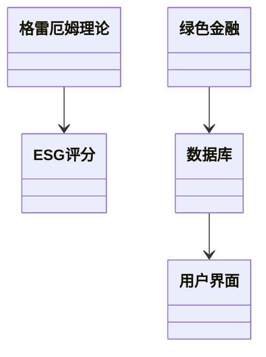

                 


# 《格雷厄姆特价股票理论在绿色金融中的应用》

> 关键词：价值投资、绿色金融、ESG评分、数学模型、系统架构

> 摘要：本文探讨了格雷厄姆的价值投资理论在绿色金融中的应用，通过分析绿色金融的核心指标和格雷厄姆特价股票理论的数学模型，结合系统架构设计和实际案例，展示了如何在绿色金融中实践价值投资策略。

---

# 第一部分: 引言

## 第1章: 背景介绍

### 1.1 格雷厄姆特价股票理论概述
#### 1.1.1 价值投资的核心理念
格雷厄姆的价值投资理论强调以低于内在价值的价格购买股票。他认为，市场短期是投票机，长期是称重机。投资者应关注企业的基本面，寻找那些被市场低估的股票。

#### 1.1.2 格雷厄姆投资策略的特点
格雷厄姆的投资策略以保守、稳健著称。他提出了一系列筛选指标，如安全边际、内在价值、市盈率等。这些指标帮助投资者识别那些具有长期稳定收益潜力的股票。

#### 1.1.3 特价股票的定义与筛选标准
特价股票是指市场价格远低于其内在价值的股票。格雷厄姆通常寻找那些市盈率低于某个阈值（如15倍）且具备较强财务实力的公司。

### 1.2 绿色金融的定义与背景
#### 1.2.1 绿色金融的定义
绿色金融是指将环境、社会和治理（ESG）因素纳入投资决策的金融活动。它旨在通过投资于可持续发展项目和公司，促进环境保护和社会责任。

#### 1.2.2 绿色金融的发展历程
绿色金融的概念起源于20世纪60年代的环境运动。随着全球气候变化和环境问题的加剧，绿色金融逐渐成为全球关注的焦点，尤其是在《巴黎协定》签署后，绿色金融得到了快速发展。

#### 1.2.3 绿色金融与可持续发展的关系
绿色金融是实现可持续发展的重要工具。通过投资于绿色企业，可以推动环境保护、减少碳排放、促进社会公平和正义。

### 1.3 格雷厄姆特价股票理论与绿色金融的结合
#### 1.3.1 价值投资与绿色金融的契合点
绿色金融关注企业的可持续性，而格雷厄姆的价值投资也关注企业的基本面。两者在寻找具有长期价值的企业这一点上不谋而合。

#### 1.3.2 绿色金融对传统投资理论的挑战
传统投资理论往往忽视环境和社会成本，而绿色金融则要求投资者将这些因素纳入考量。这不仅是对传统理论的挑战，也是对投资实践的创新。

#### 1.3.3 格雷厄姆理论在绿色金融中的应用前景
随着全球对可持续发展的重视，绿色金融的需求不断增加。格雷厄姆的价值投资理论可以为绿色金融提供一套科学的选股方法，帮助投资者在绿色金融市场中找到真正具有长期价值的企业。

---

# 第二部分: 核心概念与理论分析

## 第2章: 核心概念与联系

### 2.1 核心概念原理
#### 2.1.1 格雷厄姆特价股票理论的核心要素
- **内在价值**：企业未来现金流的现值。
- **安全边际**：市场价格与内在价值之间的差距。
- **筛选指标**：市盈率、市净率、股息率等。

#### 2.1.2 绿色金融的核心评价指标
- **环境因素（E）**：碳排放强度、能源效率等。
- **社会因素（S）**：员工关系、社会责任等。
- **治理因素（G）**：公司治理结构、高管薪酬等。

#### 2.1.3 两者结合的逻辑框架
格雷厄姆的价值投资关注企业的内在价值，而绿色金融关注企业的可持续性。两者结合的逻辑框架是通过筛选具有长期价值且符合可持续发展理念的企业。

### 2.2 核心概念对比分析
#### 2.2.1 价值投资与绿色投资的对比
| 对比维度 | 价值投资 | 绿色投资 |
|----------|----------|----------|
| 核心目标 | 寻找被低估的股票 | 投资于可持续发展的企业 |
| 关注点 | 企业基本面、财务数据 | 环境、社会、治理因素 |
| 风险控制 | 通过安全边际降低风险 | 通过ESG评分降低风险 |

#### 2.2.2 格雷厄姆筛选标准与绿色金融指标的异同
- **相同点**：两者都关注企业的长期价值。
- **不同点**：格雷厄姆更关注财务指标，而绿色金融更关注非财务指标。

#### 2.2.3 实体关系图（Mermaid流程图）

```mermaid
graph TD
A[价值投资] --> B[绿色金融]
B --> C[环境、社会、治理(ESG)指标]
A --> D[内在价值]
D --> C
```

---

## 第3章: 数学模型与公式

### 3.1 格雷厄姆特价股票理论的数学模型
#### 3.1.1 内在价值公式
$$ V = \frac{E}{1 + r} $$
其中，\( E \) 是企业未来现金流的现值，\( r \) 是折现率。

#### 3.1.2 安全边际计算
$$ \text{安全边际} = \frac{\text{内在价值} - \text{市场价格}}{\text{市场价格}} $$

### 3.2 绿色金融的数学模型
#### 3.2.1 碳排放强度
$$ \text{碳排放强度} = \frac{\text{总碳排放}}{\text{企业收入}} $$

#### 3.2.2 ESG评分公式
$$ \text{ESG评分} = \alpha \cdot E + \beta \cdot S + \gamma \cdot G $$
其中，\( \alpha, \beta, \gamma \) 是权重系数，\( E, S, G \) 分别代表环境、社会和治理评分。

---

## 第4章: 系统分析与架构设计

### 4.1 系统分析
#### 4.1.1 问题场景介绍
我们需要设计一个系统，将格雷厄姆的价值投资理论与绿色金融的ESG评分相结合，筛选出具有长期价值且符合可持续发展理念的企业。

#### 4.1.2 领域模型（Mermaid类图）



---

## 第5章: 项目实战

### 5.1 环境安装
- **安装Python**：建议使用Python 3.8及以上版本。
- **安装相关库**：`pandas`, `numpy`, `scipy`, `matplotlib`。

### 5.2 核心实现

#### 5.2.1 数据清洗与预处理
```python
import pandas as pd
import numpy as np

# 加载数据
df = pd.read_csv('stock_data.csv')

# 删除缺失值
df.dropna(inplace=True)

# 标准化数据
df['市盈率'] = df['市盈率'].apply(lambda x: x if x < 30 else np.nan)
```

#### 5.2.2 格雷厄姆筛选指标计算
```python
def calculate_intrinsic_value(enterprise_value, free_cash_flow, discount_rate):
    return enterprise_value / (1 + discount_rate)

def calculate_margin_of_safety(intrinsic_value, market_price):
    return (intrinsic_value - market_price) / market_price
```

#### 5.2.3 ESG评分计算
```python
def calculate_esg_score(environment_score, social_score, governance_score):
    return environment_score * 0.4 + social_score * 0.3 + governance_score * 0.3
```

---

## 第6章: 挑战与未来展望

### 6.1 挑战
- **数据获取难度**：ESG数据获取较难，且不同数据源可能有不同的评分标准。
- **模型准确性**：绿色金融的评价指标较为复杂，模型的准确性可能受到限制。

### 6.2 未来展望
随着绿色金融的不断发展，格雷厄姆理论在其中的应用将更加广泛。未来，可以通过引入机器学习算法，进一步提高模型的准确性和预测能力。

---

## 第7章: 总结

通过本文的分析，我们可以看到格雷厄姆的价值投资理论在绿色金融中具有广阔的应用前景。结合ESG评分和传统的财务指标，可以帮助投资者在绿色金融市场中找到具有长期价值的企业。

---

# 《格雷厄姆特价股票理论在绿色金融中的应用》

以上是文章的完整目录大纲和详细内容。希望这篇文章能够为读者提供清晰的思路和实践指导。

