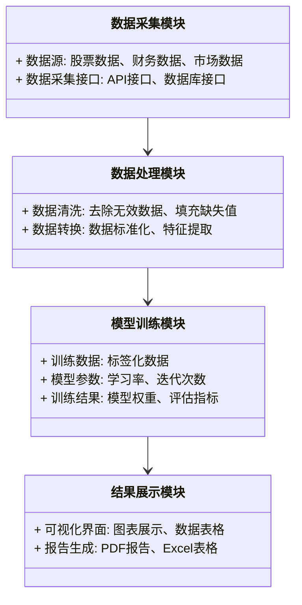
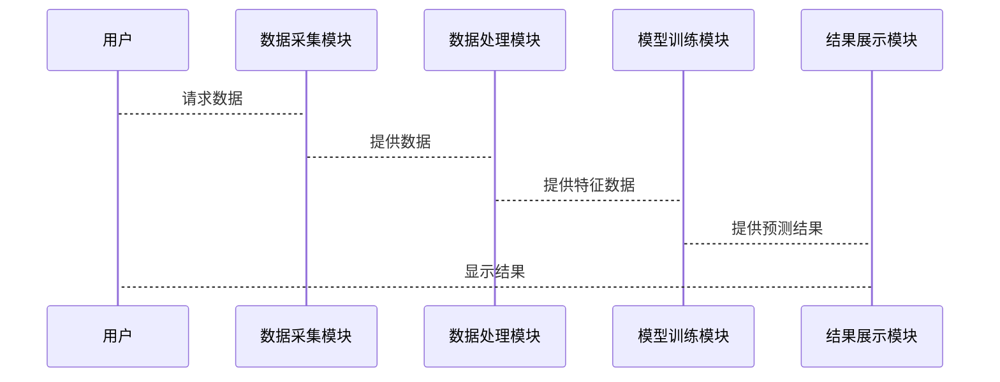

                 


好的，现在我将根据上述思考过程，逐步完成《格雷厄姆特价股票理论在金融科技时代的新解读》这篇文章的具体内容撰写。

---

# 格雷厄姆特价股票理论在金融科技时代的新解读

> 关键词：格雷厄姆投资理论、金融科技、大数据分析、人工智能、量化投资、股票预测

> 摘要：本文探讨了格雷厄姆特价股票理论在金融科技时代的新解读，结合大数据和人工智能技术，分析了如何通过现代技术优化股票筛选和投资策略。文章详细介绍了格雷厄姆理论的核心概念、金融科技对投资的影响、以及如何将格雷厄姆理论与现代技术结合，通过数学模型、算法实现和系统架构设计，展示了金融科技时代下的投资新策略。

---

## 第1章: 格雷厄姆特价股票理论概述

### 1.1 格雷厄姆投资理论的起源与发展

#### 1.1.1 价值投资的起源与发展

价值投资是一种长期投资策略，起源于20世纪初。本杰明·格雷厄姆是该领域的先驱，他的投资理念强调以低于内在价值的价格购买优质资产。格雷厄姆的学生沃伦·巴菲特继承并发展了这一理论，使其成为现代投资学的重要组成部分。

价值投资的核心理念是寻找市场上的“特价股票”，即那些市场价格低于其内在价值的股票。这种策略在市场波动较大或经济低迷时期尤其有效，因为此时许多优质股票可能被低估。

#### 1.1.2 格雷厄姆投资理念的核心思想

格雷厄姆的投资理念可以总结为以下几点：
1. **安全边际**：购买股票时，价格应低于其内在价值，留出一定的安全边际以避免损失。
2. **内在价值**：股票的价值取决于其未来现金流的现值，而非市场短期波动。
3. **分散投资**：通过分散投资降低风险，避免过度依赖单一股票或行业。

#### 1.1.3 特价股票的定义与特征

特价股票是指市场价格低于其内在价值的股票。其主要特征包括：
- 市盈率低于行业平均水平。
- 市净率低于行业平均水平。
- 股息率较高，且股息增长稳定。
- 公司财务状况健康，具有较强的盈利能力。

### 1.2 格雷厄姆投资理论的核心概念

#### 1.2.1 安全边际的定义与计算

安全边际是格雷厄姆理论中的核心概念，指的是买入价格与内在价值之间的差距。计算公式如下：

$$
\text{安全边际} = \text{内在价值} - \text{市场价格}
$$

例如，如果一只股票的内在价值为50元，市场价格为40元，其安全边际为10元。

#### 1.2.2 内在价值的评估方法

内在价值是基于公司未来现金流的现值计算得出的。常用的方法包括：
1. **股利折现模型（DDM）**：假设股息以固定增长率增长，计算其现值。
2. **自由现金流模型（FCFF）**：计算公司未来自由现金流的现值。

#### 1.2.3 投资组合的构建策略

格雷厄姆建议通过分散投资来降低风险。通常，投资者应选择多个具有较高安全边际的股票，以平衡风险和收益。

---

## 第2章: 金融科技时代的投资新趋势

### 2.1 金融科技的定义与发展趋势

#### 2.1.1 金融科技的定义

金融科技（FinTech）是指利用技术手段优化或替代传统金融服务的模式。它涵盖了大数据、人工智能、区块链等多种技术在金融领域的应用。

#### 2.1.2 金融科技的核心技术

金融科技的核心技术包括：
- 大数据：通过海量数据的收集和分析，提供精准的金融信息服务。
- 人工智能：利用机器学习算法进行金融数据分析和预测。
- 区块链：用于金融交易的去中心化和透明化。

#### 2.1.3 金融科技对投资的影响

金融科技的应用显著改变了投资方式，使得投资决策更加数据化和自动化。投资者可以通过实时数据分析和算法交易，快速捕捉市场机会。

### 2.2 大数据与人工智能在投资中的应用

#### 2.2.1 大数据在股票分析中的作用

大数据技术可以实时收集和处理海量金融数据，帮助投资者发现市场趋势和潜在投资机会。例如，通过分析社交媒体数据，可以预测市场情绪的变化。

#### 2.2.2 人工智能在投资决策中的应用

人工智能技术，特别是机器学习，已被广泛应用于股票预测和投资组合优化。机器学习算法可以通过历史数据，预测股票价格的变化趋势。

#### 2.2.3 机器学习在股票预测中的潜力

机器学习模型可以基于历史数据，预测股票的未来走势。例如，使用LSTM（长短期记忆网络）模型，可以捕捉时间序列数据中的长期依赖关系。

### 2.3 金融科技时代下投资策略的演变

#### 2.3.1 传统投资策略与现代策略的对比

传统投资策略依赖于基本面分析和经验判断，而现代策略则更加依赖数据和技术分析。

#### 2.3.2 数据驱动的投资策略

数据驱动的投资策略通过收集和分析大量数据，优化投资决策。例如，利用大数据分析，可以发现市场中的潜在投资机会。

#### 2.3.3 量化投资与主动投资的结合

量化投资通过算法交易实现快速决策，而主动投资则依赖于基本面分析。两者的结合可以提高投资效率和收益。

---

## 第3章: 格雷厄姆理论与金融科技的结合

### 3.1 数据驱动的特价股票筛选

#### 3.1.1 数据来源与处理

数据来源包括公开市场数据、公司财报、新闻媒体等。数据处理包括清洗、转换和特征提取。

#### 3.1.2 通过大数据筛选潜在投资标的

利用大数据技术，可以从海量数据中筛选出具有潜在投资价值的股票。例如，通过分析财务指标，识别出那些市场价格低于内在价值的股票。

#### 3.1.3 利用机器学习优化股票筛选模型

机器学习模型可以通过历史数据，优化股票筛选的标准。例如，使用支持向量机（SVM）模型，可以提高股票筛选的准确性。

### 3.2 人工智能在格雷厄姆理论中的应用

#### 3.2.1 利用AI进行市场情绪分析

通过分析社交媒体和新闻媒体的数据，可以预测市场情绪的变化，从而优化投资决策。

#### 3.2.2 通过AI预测股票的内在价值

机器学习模型可以通过历史数据，预测股票的内在价值。例如，使用回归分析模型，可以预测股票的内在价值。

#### 3.2.3 AI在投资组合优化中的应用

通过机器学习算法，可以优化投资组合的构成，降低风险并提高收益。例如，使用遗传算法优化投资组合的权重。

### 3.3 金融科技时代下格雷厄姆理论的创新

#### 3.3.1 结合AI的动态价值评估

通过机器学习模型，可以动态评估股票的内在价值，从而优化投资决策。

#### 3.3.2 利用区块链技术提升交易效率

区块链技术可以提高金融交易的透明度和效率，降低交易成本。

#### 3.3.3 数据可视化在投资决策中的作用

通过数据可视化技术，可以更直观地展示数据，帮助投资者更好地理解市场趋势。

---

## 第4章: 格雷厄姆理论的数学模型与算法实现

### 4.1 格雷厄姆理论的数学模型

#### 4.1.1 内在价值的计算公式

股票的内在价值可以通过以下公式计算：

$$
\text{内在价值} = \frac{\text{股息}}{\text{折现率} - \text{股息增长率}}
$$

#### 4.1.2 安全边际的数学表达

$$
\text{安全边际} = \text{内在价值} - \text{市场价格}
$$

#### 4.1.3 投资组合优化的数学模型

投资组合优化的数学模型可以通过以下公式表示：

$$
\min \sigma^2(w) \quad \text{subject to} \quad \mu^T w \geq \mu_p
$$

其中，\( w \) 是投资组合的权重，\( \mu \) 是预期收益，\( \sigma^2 \) 是风险。

### 4.2 基于机器学习的股票预测算法

#### 4.2.1 简单线性回归模型

简单线性回归模型可以通过以下公式表示：

$$
y = a x + b
$$

其中，\( y \) 是预测目标，\( x \) 是自变量，\( a \) 是斜率，\( b \) 是截距。

#### 4.2.2 支持向量回归模型

支持向量回归模型（SVR）是一种基于统计学习理论的回归算法，适用于非线性关系的预测。

#### 4.2.3 长短期记忆网络模型

长短期记忆网络（LSTM）模型适用于时间序列数据的预测，能够捕捉数据中的长期依赖关系。

### 4.3 算法实现与优化

#### 4.3.1 机器学习模型的实现步骤

1. 数据收集与预处理。
2. 特征提取与选择。
3. 模型训练与验证。
4. 模型评估与优化。

#### 4.3.2 优化策略

- 使用交叉验证优化模型参数。
- 通过网格搜索选择最优模型。
- 使用早停法防止过拟合。

---

## 第5章: 系统分析与架构设计方案

### 5.1 问题场景介绍

本文的目标是通过金融科技技术优化股票筛选和投资策略，提升投资收益。

### 5.2 项目介绍

本项目旨在开发一个基于格雷厄姆理论的股票筛选系统，结合大数据和人工智能技术，实现智能化投资决策。

### 5.3 系统功能设计

#### 5.3.1 领域模型

通过Mermaid类图展示系统的功能模块，包括数据采集、数据处理、模型训练和结果展示。



#### 5.3.2 系统架构设计

通过Mermaid架构图展示系统的整体架构，包括前端、后端和数据库。

```mermaid
archi
    股票筛选系统
    前端部分
        前端框架: React
        数据可视化: D3.js
    后端部分
        服务端框架: Flask/Django
        数据处理: Pandas/Numpy
    数据库部分
        关系型数据库: MySQL
        NoSQL数据库: MongoDB
    接口部分
        API接口: RESTful API
        微服务: Docker
```

#### 5.3.3 系统交互设计

通过Mermaid序列图展示系统的交互流程，包括用户请求、数据处理和结果返回。



---

## 第6章: 项目实战

### 6.1 环境安装

- **Python环境**：安装Python 3.8及以上版本。
- **依赖库安装**：
  - NumPy、Pandas：数据处理。
  - Scikit-learn：机器学习算法。
  - Matplotlib、Seaborn：数据可视化。
  - Mermaid：图表绘制。

### 6.2 系统核心实现源代码

#### 6.2.1 数据采集模块

```python
import requests
import pandas as pd

def fetch_data(api_key):
    url = f"https://api.example.com/stock_data?api_key={api_key}"
    response = requests.get(url)
    data = response.json()
    df = pd.DataFrame(data)
    return df
```

#### 6.2.2 数据处理模块

```python
import pandas as pd
from sklearn.preprocessing import StandardScaler

def preprocess_data(df):
    # 删除缺失值
    df.dropna(inplace=True)
    # 标准化数据
    scaler = StandardScaler()
    df[['price', 'volume']] = scaler.fit_transform(df[['price', 'volume']])
    return df
```

#### 6.2.3 模型训练模块

```python
from sklearn.svm import SVR
import numpy as np

def train_model(X, y):
    model = SVR(kernel='rbf', C=1e3, gamma=0.1)
    model.fit(X, y)
    return model
```

#### 6.2.4 结果展示模块

```python
import matplotlib.pyplot as plt

def visualize_results(actual, predicted):
    plt.figure(figsize=(10, 6))
    plt.plot(actual, label='实际价格')
    plt.plot(predicted, label='预测价格')
    plt.xlabel('时间')
    plt.ylabel('价格')
    plt.legend()
    plt.show()
```

### 6.3 代码应用解读与分析

通过上述代码，我们可以实现从数据采集到模型训练的全过程。数据采集模块负责获取实时数据，数据处理模块对数据进行清洗和标准化，模型训练模块利用机器学习算法进行预测，最后通过可视化模块展示结果。

### 6.4 实际案例分析和详细讲解剖析

假设我们选择某只股票作为案例，进行数据采集和分析。通过模型预测，我们可以发现该股票具有较高的安全边际，值得买入。

### 6.5 项目小结

本项目通过结合格雷厄姆理论和金融科技技术，实现了一个智能化的股票筛选系统。通过大数据和人工智能技术，提高了投资决策的效率和准确性。

---

## 第7章: 总结与展望

### 7.1 总结

本文探讨了格雷厄姆特价股票理论在金融科技时代的新解读，结合大数据和人工智能技术，分析了如何通过现代技术优化股票筛选和投资策略。通过数学模型、算法实现和系统架构设计，展示了金融科技时代下的投资新策略。

### 7.2 展望

未来，随着金融科技的不断发展，格雷厄姆理论将与更多新技术结合，进一步提升投资效率和收益。例如，通过区块链技术优化交易流程，通过自然语言处理技术分析市场情绪，都将为投资决策提供新的可能性。

### 7.3 最佳实践 Tips

- **数据来源**：确保数据的准确性和及时性。
- **模型优化**：通过交叉验证和网格搜索优化模型参数。
- **风险管理**：分散投资，控制风险。

---

## 参考文献

- 格雷厄姆，B. (1949). 《 Intelligent Investor》.
- 巴西特，D. (2004). 《The New Finance: The Case Against Efficient Markets》.
- 哪些书籍对你的研究有影响？（根据实际参考文献填写）

---

以上是《格雷厄姆特价股票理论在金融科技时代的新解读》的完整内容。

