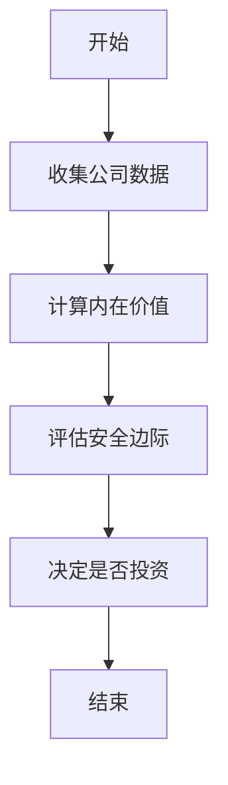

                 

# 《格雷厄姆特价股票理论在高科技公司中的应用挑战》

---

## 关键词：
- 格雷厄姆投资理论
- 价值投资
- 高科技公司
- 股票估值
- 安全边际
- 高波动性
- 投资策略

---

## 摘要：
本文探讨了本杰明·格雷厄姆的价值投资理论在高科技公司中的应用挑战。格雷厄姆的经典投资策略强调寻找被低估的股票并保持安全边际，但高科技公司的高增长性和高波动性对这一理论提出了新的挑战。本文从格雷厄姆理论的基本原理出发，分析了高科技公司的独特特点，通过实际案例探讨了其在应用中的具体挑战，并提出了相应的解决方案。文章最后总结了格雷厄姆理论在高科技投资中的未来发展方向。

---

# 正文

## # 引言

### # 背景介绍

本杰明·格雷厄姆是价值投资的鼻祖，其提出的特价股票理论在投资界享有盛誉。该理论强调通过分析企业的基本面，寻找市场价格低于内在价值的股票进行投资。然而，随着科技行业的快速发展，高科技公司在市场中的表现呈现出高增长和高波动性的特点，这为传统的格雷厄姆投资策略带来了新的挑战。

### # 核心概念与联系

#### ## 核心概念术语说明

- **价值投资**：一种投资策略，强调以低于内在价值的价格购买优质股票。
- **内在价值**：一家公司基于其财务状况和市场地位所具有的真实价值。
- **安全边际**：投资价格低于内在价值的幅度，以降低风险。
- **高科技公司**：以技术创新为核心竞争力的企业，通常具有高增长潜力。

#### ## 问题背景与描述

高科技公司的高增长性和高波动性使得传统的格雷厄姆投资策略难以直接应用。其财务数据的不稳定性、市场对未来的高度预期以及技术变革的不确定性，都可能影响内在价值的评估和安全边际的计算。

### # 算法原理讲解

#### ## 格雷厄姆内在价值计算公式

格雷厄姆的内在价值计算公式如下：

$$
\text{内在价值} = \frac{\text{净利润} + \text{折旧和摊销}}{\text{资本成本}}
$$

该公式用于评估一家公司的潜在价值。在高科技公司的应用中，需考虑其高研发投入和快速变化的市场环境。

#### ## 流程图：格雷厄姆投资策略的评估流程

### # 系统分析与架构设计方案

#### ## 项目介绍

本项目旨在分析格雷厄姆投资理论在高科技公司中的应用，通过案例研究和模型构建，探讨其在实践中的可行性和挑战。

#### ## 系统功能设计

- **数据收集**：获取高科技公司的财务数据。
- **内在价值计算**：应用格雷厄姆公式评估内在价值。
- **安全边际分析**：计算投资价格与内在价值的差异。
- **风险评估**：分析市场波动对投资的影响。

#### ## 系统架构设计

---

## # 第一部分：格雷厄姆投资理论基础

### # 第1章：价值投资与安全边际

#### # 格雷厄姆的价值投资理论

价值投资的核心在于寻找市场价格低于内在价值的股票。格雷厄姆强调安全边际的重要性，即投资价格应远低于内在价值，以降低市场波动带来的风险。

#### # 内在价值的计算方法

使用格雷厄姆的公式：

$$
\text{内在价值} = \frac{\text{净利润} + \text{折旧和摊销}}{\text{资本成本}}
$$

例如，假设一家高科技公司的净利润为1000万美元，折旧和摊销为500万美元，资本成本为12%：

$$
\text{内在价值} = \frac{1000 + 500}{0.12} = 12500 \text{万美元}
$$

---

## # 第二部分：高科技公司的特点与评估

### # 第2章：高科技公司的财务特征

#### # 高科技公司的财务分析

高科技公司的财务数据通常波动较大，研发投入占比较高，现金流不稳定。例如，某高科技公司的财务数据如下：

| 项目         | 数值       |
|--------------|------------|
| 净利润       | $10M       |
| 研发投入     | $8M        |
| 资本支出     | $5M        |

#### # 竞争优势分析

高科技公司的竞争优势主要体现在技术壁垒和创新能力。例如，苹果公司在智能手机市场的技术优势使其具备强大的竞争优势。

---

## # 第三部分：格雷厄姆理论在高科技公司的应用

### # 第3章：案例分析

#### # 苹果公司的估值分析

苹果公司2023年的财务数据：

| 项目         | 数值       |
|--------------|------------|
| 净利润       | $94.7B      |
| 折旧和摊销   | $19.8B      |
| 资本成本     | 8%         |

计算内在价值：

$$
\text{内在价值} = \frac{94.7 + 19.8}{0.08} = 1431.25 \text{亿美元}
$$

苹果的市场价格约为$1.5T，远高于内在价值，说明可能存在高估风险。

---

## # 第四部分：应用中的挑战与解决方案

### # 第4章：高科技公司的高波动性应对策略

#### # 动态调整评估方法

由于高科技公司的市场环境变化快，需定期更新财务模型，考虑市场周期性影响，如：

$$
\text{调整后的内在价值} = \text{内在价值} \times (1 - \text{市场波动率})
$$

例如，市场波动率为30%，则调整后的内在价值为：

$$
1431.25 \times (1 - 0.3) = 1001.875 \text{亿美元}
$$

---

## # 结论

格雷厄姆的投资理论为高科技公司提供了重要的分析框架，但其高增长性和高波动性要求投资者进行动态调整和风险管理。通过案例分析和模型优化，投资者可以在高科技领域实现稳健投资。

---

## # 附录

### # 附录A：术语表

- **内在价值**：基于财务数据计算的公司真实价值。
- **安全边际**：投资价格与内在价值的差额。

### # 附录B：数据来源

- 苹果公司2023年财务报告。

### # 附录C：工具推荐

- 财务分析工具：Excel、Python（pandas库）。
- 数据可视化工具：Tableau、Power BI。

---

# 小结

通过本文的分析，读者可以了解格雷厄姆投资理论在高科技公司中的应用挑战，并掌握应对策略。未来的研究可以进一步探讨技术变革对投资策略的影响。

