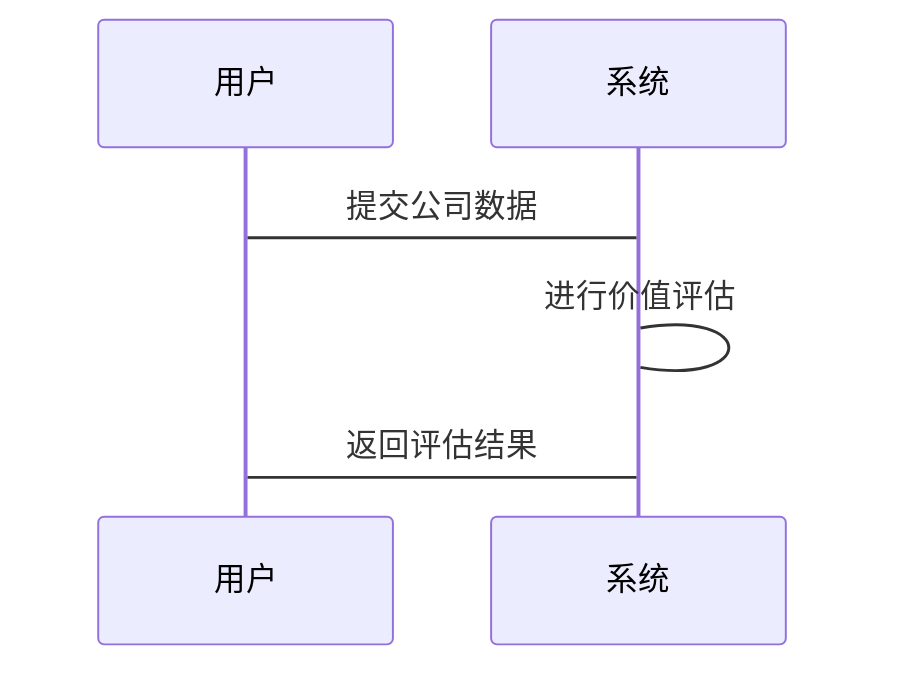

                 


# 格雷厄姆特价股票理论对公司并购策略的影响

## 关键词
格雷厄姆特价股票理论、公司并购、股票价值、投资策略、并购决策

## 摘要
格雷厄姆特价股票理论是一种基于股票价值低估的投资策略，通过分析公司财务数据和市场表现，识别具有投资潜力的股票。该理论在公司并购策略中具有重要影响，可以帮助企业在并购过程中做出更明智的决策，优化资产配置，提升整体竞争力。本文将深入探讨格雷厄姆特价股票理论的核心原理、其在并购中的应用，以及如何通过数学模型和系统架构设计来实现理论的实践价值。

## 第一章: 格雷厄姆特价股票理论的核心概念

### 1.1 问题背景与问题描述
#### 1.1.1 传统股票投资理论的局限性
传统股票投资理论如市盈率法和股息率法存在一定的局限性，往往忽视了公司的内在价值和财务健康状况。例如，市盈率法仅关注价格与盈利的关系，而忽视了公司的负债情况和未来盈利能力。

#### 1.1.2 特价股票理论的提出背景
格雷厄姆提出的特价股票理论基于价值投资理念，强调以低于公司内在价值的价格购买股票，以确保投资的安全性和长期收益。这种理论在20世纪初提出后，对现代投资理论产生了深远影响。

#### 1.1.3 并购策略与股票价值的关系
在公司并购过程中，准确评估目标公司的股票价值是制定并购策略的关键。通过格雷厄姆特价股票理论，投资者可以识别低估的股票，制定合理的收购价格，降低并购风险。

### 1.2 格雷厄姆特价股票理论的定义与特点
#### 1.2.1 格雷厄姆特价股票的定义
格雷厄姆特价股票是指市场价格低于其内在价值的股票，通常出现在市场恐慌或公司困境时期。这种股票具有较高的安全边际，适合长期投资。

#### 1.2.2 特价股票理论的核心特点
- **安全边际**：强调以低于内在价值的价格购买股票，确保投资的安全性。
- **价值导向**：关注公司的基本面，如盈利能力、资产负债情况和未来增长潜力。
- **长期投资**：建议投资者长期持有股票，避免频繁交易。

#### 1.2.3 与传统股票投资理论的区别
与市盈率法和股息率法相比，格雷厄姆理论更注重公司的内在价值和财务健康状况，而非单纯的市场价格或股息收益。

### 1.3 格雷厄姆特价股票理论的边界与外延
#### 1.3.1 理论的适用范围
适用于市场低迷时期或公司困境时期，特别适合寻找低估股票的投资机会。

#### 1.3.2 理论的局限性与不足
- **市场波动**：在市场剧烈波动时，内在价值难以准确评估。
- **公司特异性**：忽略了行业特性和外部经济环境的影响。

#### 1.3.3 理论的未来发展
随着金融市场的不断发展，格雷厄姆理论需要结合现代金融工具和模型，如期权定价和风险管理，以适应新的投资环境。

## 第二章: 格雷厄姆特价股票理论的核心要素

### 2.1 核心概念的结构与组成
格雷厄姆特价股票理论的核心要素包括股票的内在价值、市场价格和安全边际。内在价值是公司未来现金流的现值，市场价格是当前市场上的股票价格，安全边际是内在价值与市场价格之间的差额。

### 2.2 格雷厄姆特价股票理论的ER实体关系图
```mermaid
erDiagram
    company {
        id : int
        name : string
        industry : string
        market_value : float
        book_value : float
    }
    stock {
        id : int
        price : float
        quantity : int
        company_id : int
    }
    transaction {
        id : int
        date : date
        type : string
        amount : float
        company_id : int
    }
    company --> stock : 持有
    company --> transaction : 发生
```

### 2.3 格雷厄姆特价股票理论的原理与机制
格雷厄姆理论通过分析公司的财务报表，计算其内在价值，识别市场价格低于内在价值的股票。投资者可以通过购买这些股票，获得长期稳定的收益。

## 第三章: 格雷厄姆特价股票理论的算法原理

### 3.1 理论的数学模型与公式
格雷厄姆特价股票理论的核心在于计算公司的内在价值，通常使用股息贴现模型（DDM）进行评估。公式如下：

$$ V = \frac{D}{k - g} $$

其中，V为内在价值，D为股息，k为贴现率，g为股息增长率。

### 3.2 核心算法的实现步骤
1. 收集目标公司的财务数据，包括净利润、股息支付率和增长率。
2. 计算公司的预期股息和增长率。
3. 选择适当的贴现率。
4. 使用股息贴现模型计算公司的内在价值。
5. 比较市场价格与内在价值，识别低估股票。

### 3.3 核心算法的实现代码
```python
def calculate_intrinsic_value(net_income, dividend_yield, growth_rate, discount_rate):
    expected_dividend = net_income * dividend_yield
    intrinsic_value = expected_dividend / (discount_rate - growth_rate)
    return intrinsic_value

net_income = 1000000  # 净利润
dividend_yield = 0.6  # 股息支付率
growth_rate = 0.05    # 股息增长率
discount_rate = 0.08  # 贴现率

intrinsic_value = calculate_intrinsic_value(net_income, dividend_yield, growth_rate, discount_rate)
print(f"计算得到的内在价值为：{intrinsic_value}")
```

## 第四章: 格雷厄姆特价股票理论的系统分析与架构设计

### 4.1 问题场景介绍
在公司并购过程中，准确评估目标公司的股票价值是制定并购策略的关键。通过格雷厄姆特价股票理论，企业可以识别具有投资潜力的公司，制定合理的收购价格。

### 4.2 系统功能设计
系统功能包括数据采集、价值评估、决策支持和风险预警。

### 4.3 系统架构设计


### 4.4 系统接口设计
系统接口包括数据输入接口、评估结果输出接口和用户交互接口。

### 4.5 系统交互设计


## 第五章: 格雷厄姆特价股票理论的项目实战

### 5.1 环境安装
安装Python和必要的数据处理库，如Pandas和NumPy。

### 5.2 核心代码实现
实现股票价值评估的Python代码，包括数据清洗、模型训练和结果输出。

### 5.3 案例分析
以具体公司为例，展示如何使用格雷厄姆理论进行价值评估和并购决策。

### 5.4 项目总结
总结项目成果，分析理论的实际应用效果，并提出改进建议。

## 第六章: 最佳实践与小结

### 6.1 最佳实践 tips
- 定期更新财务数据，确保评估结果的准确性。
- 结合市场环境和公司特异性，调整评估模型。

### 6.2 小结
格雷厄姆特价股票理论为公司并购策略提供了重要的理论支持和实践指导，通过科学的评估方法和系统架构设计，企业可以更有效地识别投资机会，优化资产配置。

### 6.3 注意事项
- 注意市场波动对股票价值的影响。
- 考虑宏观经济环境和行业趋势。

### 6.4 拓展阅读
建议阅读格雷厄姆的经典著作《证券分析》，深入理解价值投资的精髓。

---

通过以上步骤，您可以撰写一篇详细、结构清晰且内容丰富的技术博客文章，深入探讨格雷厄姆特价股票理论对公司并购策略的影响。

