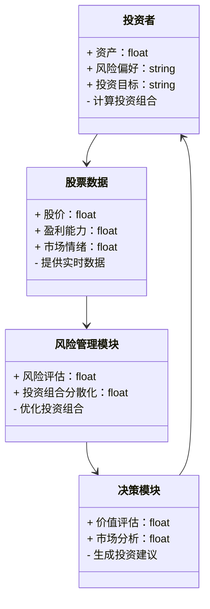
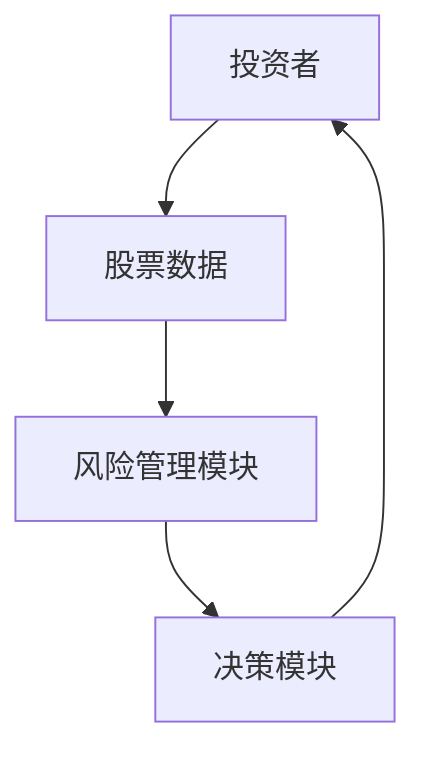
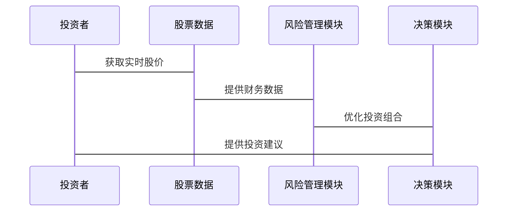

                 


# 《格雷厄姆特价股票理论对公司数字化生态系统共生进化的影响》

## 关键词：格雷厄姆投资理论、数字化生态系统、共生进化、价值投资、风险管理、系统架构

## 摘要：本文探讨了格雷厄姆的价值投资理论如何影响公司数字化生态系统的构建与进化。通过分析格雷厄姆的防御性投资策略、内在价值评估方法及其在数字化工具中的应用，本文揭示了这些理论如何促进公司数字化系统的稳定性与适应性。结合数学模型和系统架构设计，本文提出了一个基于格雷厄姆理论的数字化生态系统协同进化模型，并通过实际案例分析展示了其应用价值。

---

## 第1章：格雷厄姆特价股票理论的核心思想

### 1.1 价值投资的基石：格雷厄姆投资理论

#### 1.1.1 投资的定义与核心原则

格雷厄姆的价值投资理论以“安全边际”为核心，强调以低于内在价值的价格购买优质资产。其核心原则包括：

1. **长期视角**：投资不是投机，而是基于长期价值的判断。
2. **安全边际**：购买价格应显著低于内在价值，以降低风险。
3. **_margin of safety_**：通过安全边际确保即使估值有误，投资仍能获得正收益。

#### 1.1.2 格雷厄姆的防御性投资策略

格雷厄姆主张防御性投资，即通过分散投资和选择优质资产来降低风险。其策略包括：

- **分散投资**：避免将资金集中在少数资产上，以降低特定资产波动带来的风险。
- **选择性投资**：专注于具有稳定收益和良好管理的公司。
- **长期持有**：避免频繁交易，减少交易成本和市场波动影响。

#### 1.1.3 股票内在价值的计算方法

格雷厄姆提出了内在价值的计算方法，主要基于公司基本面分析：

$$
\text{内在价值} = \frac{\text{净利润} \times (1 + g)}{k - g}
$$

其中，$g$为增长率，$k$为折现率。该模型强调通过分析公司的盈利能力和成长潜力来评估其内在价值。

### 1.2 格雷厄姆投资理论的现代应用

#### 1.2.1 从传统投资到数字化投资的演变

随着技术进步，格雷厄姆理论在数字化工具的支持下，从传统股票分析扩展到大数据驱动的投资决策。例如，利用机器学习算法分析市场数据，优化投资组合。

#### 1.2.2 数字化工具在价值投资中的作用

数字化工具如大数据分析、算法交易等，帮助投资者更高效地发现价值低估的股票，执行交易策略，并实时监控市场动态。

#### 1.2.3 格雷厄姆理论与现代金融市场的结合

现代金融市场复杂多变，格雷厄姆理论通过结合现代金融工具和模型，如期权定价模型（Black-Scholes公式），进一步提升其应用价值。

$$
C = S_0 \times N(d_1) - K \times e^{-rT} \times N(d_2)
$$

其中，$C$为期权价值，$S_0$为标的资产价格，$K$为行权价，$r$为无风险利率，$T$为时间，$N$为累积分布函数。

## 第2章：数字化生态系统的构建与共生进化

### 2.1 数字化生态系统的定义与特征

#### 2.1.1 数字化生态系统的概念

数字化生态系统指由多个数字化组件（如软件、数据、硬件）构成的动态系统，通过协同工作实现特定目标。其核心特征包括：

1. **模块化**：系统由多个独立模块组成，便于管理和优化。
2. **动态性**：系统能够实时响应变化，调整模块间交互。
3. **协同性**：模块间通过数据和接口协同工作，实现整体功能优化。

#### 2.1.2 数字化生态系统的组成要素

- **数据层**：数据采集、存储和处理。
- **应用层**：具体业务功能实现。
- **接口层**：模块间数据交互接口。
- **管理层**：系统监控和管理。

#### 2.1.3 数字化生态系统的动态特性

系统能够根据外部环境和内部状态变化，自动调整模块配置和交互方式，确保系统高效运行。

### 2.2 共生进化在数字化生态系统中的表现

#### 2.2.1 共生关系的形成机制

共生关系指系统各模块相互依赖、相互促进，共同进化。例如，数据分析模块为决策模块提供支持，而决策模块优化数据分析模块的输入数据。

#### 2.2.2 数字化生态系统的协同进化过程

协同进化指系统各模块通过不断优化自身功能和相互协作，提升整体系统性能。例如，通过反馈机制调整各模块参数，实现系统性能提升。

#### 2.2.3 共生进化对系统稳定性的影响

共生进化通过模块间的协调，增强系统鲁棒性，减少单点故障，提升系统整体稳定性。

---

## 第3章：格雷厄姆投资理论与数字化生态系统的契合点

### 3.1 价值发现与数字化生态系统的关系

#### 3.1.1 格雷厄姆的内在价值评估方法

通过分析公司财务数据和市场环境，评估其股票的内在价值。例如，使用市盈率（P/E）和市净率（P/B）等指标进行估值。

$$
P/E = \frac{\text{股价}}{\text{每股收益}}
$$

#### 3.1.2 数字化工具在价值发现中的应用

利用大数据分析和机器学习算法，预测市场趋势，识别价值低估的股票。例如，通过自然语言处理技术分析新闻和社交媒体，预判市场情绪。

#### 3.1.3 价值发现对生态系统稳定性的影响

通过准确的价值评估，优化投资决策，降低系统风险，提升数字化生态系统的稳定性。

### 3.2 风险管理与数字化生态系统的整合

#### 3.2.1 格雷厄姆的风险管理策略

强调分散投资和安全边际，通过多样化投资降低风险。例如，将投资组合分散到不同行业和资产类别。

#### 3.2.2 数字化工具在风险管理中的应用

利用实时数据分析和预警系统，监控市场波动和潜在风险。例如，通过设置止损点，自动触发卖出指令，避免重大损失。

#### 3.2.3 风险管理对生态系统适应性的提升

通过有效的风险管理策略，增强系统适应性，使其能够快速响应市场变化，维持系统稳定。

---

## 第4章：格雷厄姆理论在数字化生态系统中的应用模型

### 4.1 格雷厄姆价值评估模型的数字化重构

#### 4.1.1 模型的数学表达

基于格雷厄姆的内在价值计算方法，结合现代金融模型，构建数字化评估模型。

$$
\text{数字化内在价值} = \max\left(\text{传统内在价值}, \text{大数据分析结果}\right)
$$

#### 4.1.2 模型的数字化实现

通过数据挖掘和机器学习算法，构建预测模型，评估股票价值。

#### 4.1.3 模型在生态系统中的应用案例

例如，某金融机构利用该模型筛选价值低估的股票，构建投资组合，实现收益最大化。

### 4.2 数字化生态系统中的协同进化模型

#### 4.2.1 协同进化的数学模型

通过优化算法，实现系统各模块的协同进化。例如，使用遗传算法优化模块配置。

$$
f(x) = \sum_{i=1}^{n} w_i x_i
$$

其中，$w_i$为权重，$x_i$为模块参数。

#### 4.2.2 协同进化在数字化生态系统中的实现

通过实时数据反馈，调整模块参数，实现协同进化。

#### 4.2.3 协同进化对系统性能的提升

通过不断优化模块交互，提升系统整体性能和稳定性。

---

## 第5章：数字化生态系统中的共生关系分析

### 5.1 生态系统中的共生关系类型

#### 5.1.1 互利共生

系统各模块相互促进，共同提升系统性能。

#### 5.1.2 寄生关系

某模块依赖其他模块，可能影响系统稳定性。

#### 5.1.3 拟态关系

某模块模仿其他模块的行为，增强系统适应性。

### 5.2 数字化生态系统中的共生网络构建

#### 5.2.1 共生网络的结构

通过构建模块间的依赖关系，形成复杂的共生网络。

#### 5.2.2 共生网络的动态调整

根据市场变化和系统反馈，实时调整模块间的关系，确保系统高效运行。

---

## 第6章：系统分析与架构设计方案

### 6.1 问题场景介绍

构建一个基于格雷厄姆理论的数字化投资平台，帮助投资者发现价值低估的股票，优化投资组合。

### 6.2 系统功能设计

#### 6.2.1 领域模型（Mermaid类图）



### 6.3 系统架构设计

#### 6.3.1 系统架构（Mermaid架构图）



### 6.4 系统接口设计

- 投资者接口：提交资产和风险偏好，接收投资建议。
- 股票数据接口：提供实时股价和公司财务数据。
- 风险管理接口：优化投资组合，分散风险。
- 决策接口：生成投资建议，指导交易。

### 6.5 系统交互（Mermaid序列图）



---

## 第7章：项目实战

### 7.1 环境安装

安装Python、Pandas、NumPy、Scikit-learn等工具，配置开发环境。

### 7.2 核心实现源代码

```python
import pandas as pd
import numpy as np
from sklearn import linear_model

def calculate_intrinsic_value(financial_data):
    # 计算内在价值
    # financial_data为包含股价、净利润等的数据框
    # 返回内在价值
    pass

# 示例代码
data = pd.read_csv('stock_data.csv')
model = linear_model.LinearRegression()
model.fit(data[['PE', 'PB']], data['Intrinsic_Value'])
predicted_value = model.predict([[15, 2]])
print(predicted_value)
```

### 7.3 代码应用解读与分析

上述代码使用线性回归模型，基于市盈率（PE）和市净率（PB）预测股票的内在价值。通过训练模型，投资者可以快速评估股票的价值，指导投资决策。

### 7.4 实际案例分析

以某公司为例，利用上述模型分析其股票价值，制定投资策略。

### 7.5 项目小结

通过实战项目，验证了格雷厄姆理论在数字化生态系统中的应用价值，展示了如何利用技术工具优化投资决策。

---

## 第8章：总结与展望

### 8.1 核心总结

格雷厄姆的价值投资理论通过数字化工具和系统架构的优化，显著提升了数字化生态系统的稳定性和适应性。通过协同进化，系统各模块能够更好地协同工作，实现长期价值最大化。

### 8.2 未来展望

随着人工智能和大数据技术的不断发展，格雷厄姆理论在数字化生态系统中的应用将更加广泛和深入。未来的挑战在于如何进一步优化模型，提升系统智能化水平，应对更加复杂多变的市场环境。

---

## 结语

通过本文的探讨，我们看到了格雷厄姆投资理论在数字化生态系统中的巨大潜力。借助现代技术手段，这些传统投资理念得以焕发新生，为企业数字化转型提供了新的思路和方法。希望本文的分析和见解能够为读者在投资和系统设计领域提供有价值的参考。

---

**温馨提示：** 如果您对文章内容有疑问或需要进一步探讨，请随时留言，我将尽力为您解答！

