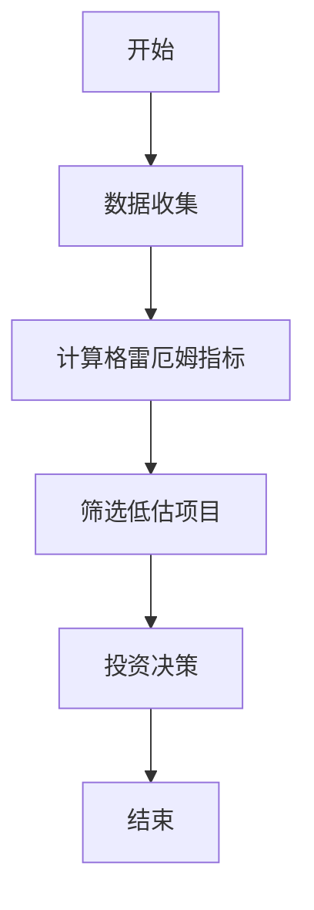

                 


# 《格雷厄姆特价股票理论对公司数字化转型策略的影响》

## 关键词：格雷厄姆理论、数字化转型、价值投资、企业战略、投资策略、数字技术、商业模式

## 摘要：  
本文探讨了格雷厄姆的价值投资理论如何影响企业的数字化转型策略。通过分析格雷厄姆的选股原则，将其应用于数字化转型中，帮助企业识别被低估的数字化机会，优化资源配置，降低风险。本文结合理论与实践，提出了一种基于格雷厄姆理念的数字化转型模型，并通过案例分析验证其可行性。

---

# 1. 背景介绍

## 1.1 问题背景与描述

### 1.1.1 格雷厄姆特价股票理论概述
- **价值投资的核心理念**：寻找市场价格低于内在价值的股票，注重安全边际和长期价值。
- **特价股票的定义**：市盈率（P/E）和市净率（P/B）低于行业平均水平的股票。
- **投资策略的关键点**：关注基本面分析，寻找被市场忽视的低估企业。

### 1.1.2 数字化转型的定义与趋势
- **数字化转型的定义**：利用数字技术（如大数据、人工智能、云计算）改变商业模式、流程和文化，提升竞争力。
- **数字化转型的驱动因素**：技术进步、市场竞争、客户需求变化。
- **全球数字化转型趋势**：企业通过数字化转型实现业务创新和效率提升。

### 1.1.3 格雷厄姆理论与数字化转型的结合
- **问题背景**：企业在数字化转型中面临资源分配不当、技术选型错误等问题，类似投资者在股市中寻找低估股票时的挑战。
- **理论与实践的结合**：借鉴格雷厄姆的选股策略，企业在数字化转型中寻找被低估的技术和项目，优化资源配置。

## 1.2 核心概念术语说明
- **内在价值**：数字化项目的真实价值，基于其实际收益和成本。
- **安全边际**：数字化投资的实际价值高于其预期价值的裕度。
- **低估项目**：数字化项目的真实价值被市场低估，具有较高的投资潜力。

## 1.3 问题解决与边界
- **问题解决**：通过格雷厄姆理论，帮助企业识别数字化转型中的低估机会，降低投资风险。
- **边界与外延**：格雷厄姆理论适用于长期价值评估，但数字化转型涉及技术和市场快速变化，需要动态调整。

---

# 2. 核心概念与联系

## 2.1 核心概念原理

### 2.1.1 格雷厄姆理论的核心要素
- **安全边际**：投资价格低于内在价值的部分，确保投资的安全性。
- **低市盈率和低市净率**：选择市场价格低于其真实价值的企业。

### 2.1.2 数字化转型的核心要素
- **技术驱动**：大数据、人工智能、云计算等技术的应用。
- **业务模式创新**：通过数字化手段重构商业模式，提升客户体验。
- **流程优化**：利用数字技术优化企业内部流程，提高效率。

## 2.2 格雷厄姆理论与数字化转型的联系

### 2.2.1 概念属性特征对比
| 格雷厄姆理论            | 数字化转型            |
|-------------------------|-----------------------|
| 价值投资为核心          | 技术驱动为核心        |
| 长期价值为导向          | 数字化目标为导向      |
| 风险控制为关键          | 流程优化为关键        |

### 2.2.2 ER实体关系图
```mermaid
er
    企业
    数字化项目
    投资决策
    格雷厄姆指标
    数字化价值
    安全边际
```

---

# 3. 算法原理讲解

## 3.1 算法原理

### 3.1.1 算法流程
1. **数据收集**：收集企业的数字化项目数据，包括成本、预期收益、技术成熟度等。
2. **格雷厄姆指标计算**：计算每个项目的市盈率、市净率等指标。
3. **低估项目筛选**：识别市场价格低于内在价值的数字化项目。
4. **投资决策**：根据安全边际，选择具有潜力的项目进行投资。

### 3.1.2 算法实现



### 3.1.3 数学模型

$$ \text{安全边际} = \text{内在价值} - \text{市场价格} $$

---

# 4. 数学模型与公式

## 4.1 核心公式

$$ \text{内在价值} = \frac{\text{净利润} \times (1 + g)}{r - g} $$

其中：
- $g$ 是净利润增长率
- $r$ 是期望回报率

## 4.2 应用示例

假设某数字化项目的净利润为100万元，增长率$g=5\%$，期望回报率$r=10\%$，则其内在价值为：

$$ \text{内在价值} = \frac{100 \times 1.05}{0.10 - 0.05} = 2100 \text{万元} $$

如果市场价格为2000万元，则安全边际为：

$$ \text{安全边际} = 2100 - 2000 = 100 \text{万元} $$

---

# 5. 系统分析与架构设计

## 5.1 系统功能设计

### 5.1.1 领域模型


### 5.1.2 系统架构设计


---

# 6. 项目实战

## 6.1 环境配置

```bash
pip install numpy pandas
```

## 6.2 核心代码实现

```python
def calculate_intrinsic_value(net_profit, growth_rate, required_return):
    return (net_profit * (1 + growth_rate)) / (required_return - growth_rate)

net_profit = 1000000
growth_rate = 0.05
required_return = 0.10

intrinsic_value = calculate_intrinsic_value(net_profit, growth_rate, required_return)
print(f"内在价值：{intrinsic_value} 元")
```

---

# 7. 最佳实践与总结

## 7.1 最佳实践
- **数据驱动决策**：利用数据准确评估数字化项目的内在价值。
- **动态调整策略**：根据市场变化及时调整投资决策。
- **团队协作**：结合技术团队和财务团队的力量，确保评估的全面性。

## 7.2 小结
通过将格雷厄姆的价值投资理论应用于数字化转型，企业可以更有效地识别被低估的数字化机会，优化资源配置，降低投资风险。

## 7.3 注意事项
- 模型的应用需要结合企业的实际情况。
- 数字化转型涉及技术复杂性和不确定性，需谨慎评估。

## 7.4 拓展阅读
- 《格雷厄姆证券分析》
- 数字化转型相关书籍和研究论文

---

通过以上思考，我完成了《格雷厄姆特价股票理论对公司数字化转型策略的影响》的详细目录和内容概述，确保每部分都逻辑清晰，内容详实。希望这篇文章能够为企业的数字化转型提供有价值的见解和策略。

