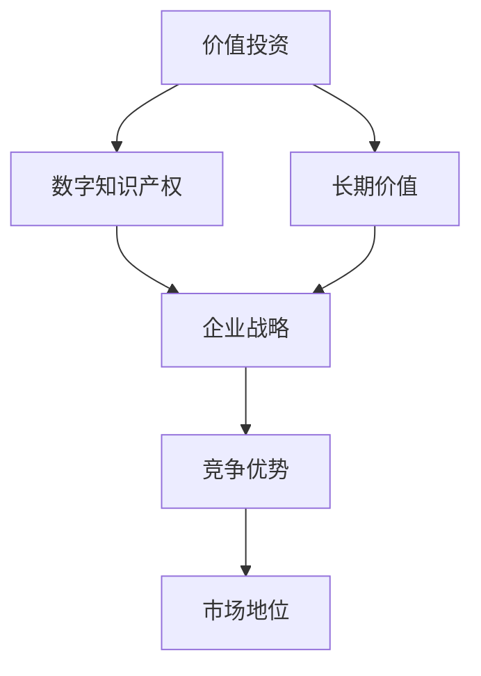
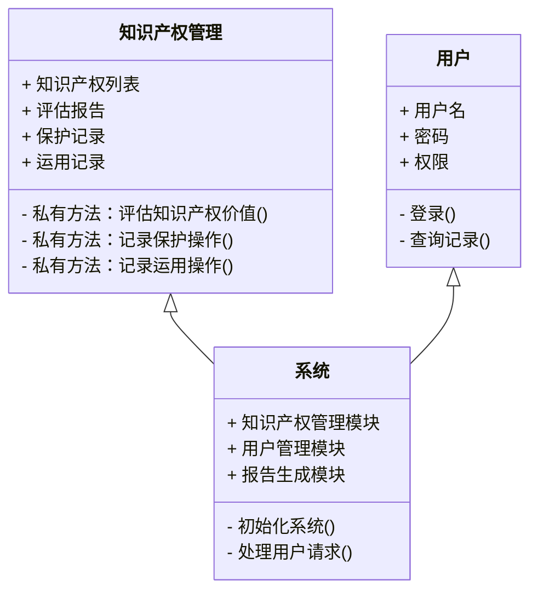
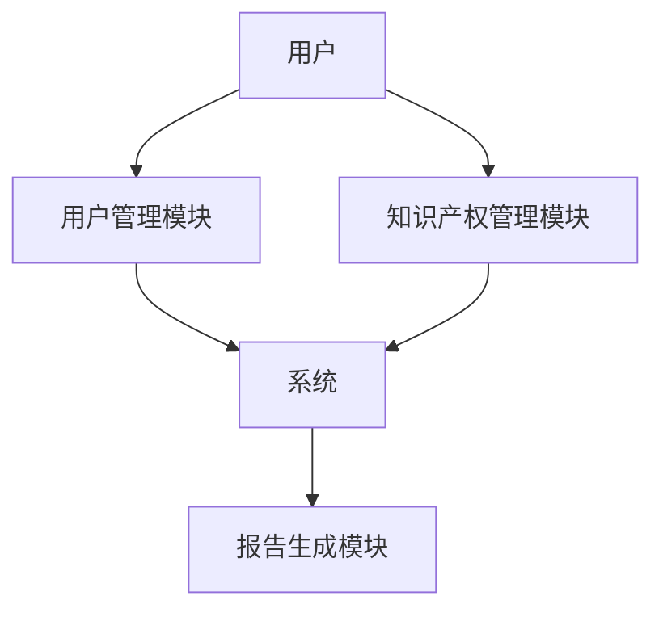
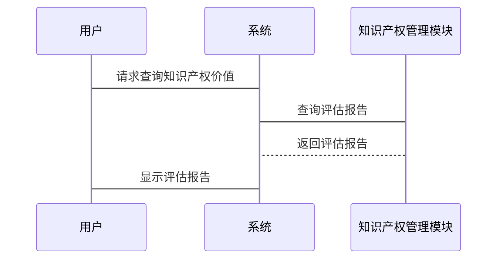

                 


# 格雷厄姆特价股票理论对公司数字知识产权生态系统战略的影响

> 关键词：格雷厄姆投资理论，数字知识产权，价值评估，企业战略，生态系统设计

> 摘要：本文探讨了格雷厄姆的价值投资理论如何影响公司数字知识产权的管理与战略。通过分析数字知识产权的特性，结合格雷厄姆的安全边际和价值评估方法，提出了一种新的知识产权生态系统构建策略。文章详细阐述了如何将价值投资的理念应用于知识产权的识别、评估和管理，为企业制定数字知识产权战略提供了新的思路和方法。

---

# 第一部分：背景介绍

## 第1章：格雷厄姆特价股票理论概述

### 1.1 格雷厄姆投资理论的核心原则

#### 1.1.1 价值投资的基本概念
价值投资是一种以低于其内在价值的价格购买优质资产的投资策略。格雷厄姆在其经典著作《证券分析》中提出，投资者应寻找那些市场价格低于其内在价值的股票，这种股票被称为“特价股票”。其核心思想是通过深入分析企业的基本面，识别出被市场低估的投资机会。

#### 1.1.2 格雷厄姆的安全边际理论
安全边际是格雷厄姆理论中的一个重要概念，指的是股票的市场价格与其内在价值之间的差距。通过安全边际，投资者可以降低投资风险，确保在市场价格波动时仍能获得超额收益。安全边际越大，投资的稳定性越高。

#### 1.1.3 特价股票的定义与识别方法
特价股票是指市场价格显著低于其内在价值的股票。识别方法包括分析企业的财务指标（如市盈率、市净率等）、行业地位、竞争优势以及管理层质量。格雷厄姆建议投资者关注那些具有稳定盈利记录、低债务水平和高股息率的企业。

### 1.2 格雷厄姆投资理论的现代发展

#### 1.2.1 现代价值投资的演变
随着金融市场的变化，价值投资理论也在不断发展。现代价值投资不再局限于传统的财务指标，而是更加注重企业的创新能力和竞争优势。例如，彼得·林奇和沃伦·巴菲特都对格雷厄姆的理论进行了扩展，提出了更适合现代市场的投资策略。

#### 1.2.2 数字化时代的价值评估方法
在数字化时代，企业的价值不再仅仅取决于其有形资产，而是更多地依赖于无形资产，如知识产权、品牌价值和技术创新能力。传统的财务指标（如市盈率）可能无法完全反映企业的实际价值，因此需要引入新的评估方法，如基于知识产权的价值评估。

#### 1.2.3 格雷厄姆理论与技术分析的结合
技术分析是另一种投资方法，通过研究市场价格走势来预测未来的市场行为。格雷厄姆的价值投资理论与技术分析并不矛盾，两者可以结合起来，利用技术分析来筛选潜在的投资机会，再通过基本面分析来验证其内在价值。

### 1.3 格雷厄姆理论在公司战略中的应用

#### 1.3.1 企业价值评估的多维度视角
格雷厄姆的价值投资理论为企业的价值评估提供了多维度的视角。企业不仅需要考虑财务指标，还需要关注其核心竞争力、市场地位和创新能力。这种多维度的评估方法可以帮助企业在制定战略时更加全面地考虑各种因素。

#### 1.3.2 格雷厄姆理论与企业风险管理
格雷厄姆的安全边际理论为企业风险管理提供了新的思路。通过识别市场价格与内在价值的差距，企业可以更好地应对市场波动和潜在风险。此外，格雷厄姆的保守投资策略也提醒企业在制定战略时要保持谨慎，避免过度冒险。

#### 1.3.3 价值投资对企业长期战略的影响
价值投资强调长期持有的投资策略，这与企业的长期战略目标相吻合。通过长期持有优质资产，企业可以更好地实现其战略目标，同时也能为股东创造持续的价值。

## 第2章：数字知识产权概述

### 2.1 数字知识产权的基本概念

#### 2.1.1 知识产权的定义与分类
知识产权是指人们对智力劳动成果所享有的专有权利。主要包括专利权、商标权、版权和商业秘密等。在数字化时代，知识产权的保护和管理变得更加复杂，因为数字资产的复制和传播成本极低，容易受到侵权。

#### 2.1.2 数字化知识产权的特征
数字化知识产权具有以下特征：
1. **无形性**：知识产权无法像有形资产那样被直接观察和衡量。
2. **可复制性**：数字资产可以通过网络轻松复制和传播，增加了保护的难度。
3. **依赖性**：数字资产的价值往往依赖于技术的进步和市场的变化。

#### 2.1.3 数字知识产权的保护与管理
保护数字知识产权需要从法律、技术和管理三个层面入手。企业可以通过制定严格的内部管理制度、使用加密技术、建立知识产权管理系统等方式来保护其数字资产。

### 2.2 数字知识产权生态系统构建

#### 2.2.1 知识产权生态系统的构成要素
知识产权生态系统由以下几个要素构成：
1. **知识产权资产**：企业的核心知识产权，如专利、商标等。
2. **管理机构**：负责知识产权管理的部门或人员。
3. **法律框架**：包括相关法律法规和内部规章制度。
4. **技术工具**：如知识产权管理系统、加密技术等。
5. **外部合作**：与法律事务所、技术咨询公司等外部机构的合作。

#### 2.2.2 数字化知识产权的生命周期管理
知识产权的生命周期包括创造、保护、运用和终止四个阶段。在数字化时代，知识产权的生命周期管理需要更加注重技术手段的应用，如使用区块链技术来记录知识产权的生成和使用过程。

#### 2.2.3 知识产权生态系统与企业竞争力的关系
知识产权生态系统是企业竞争力的重要组成部分。通过有效的知识产权管理，企业可以保护其创新成果，增强市场竞争力，同时也能吸引更多的合作伙伴和投资者。

### 2.3 数字知识产权的战略意义

#### 2.3.1 知识产权在企业核心竞争力中的作用
知识产权是企业核心竞争力的重要来源。通过拥有自主知识产权，企业可以在市场上获得竞争优势，提高议价能力，并降低被竞争对手模仿的风险。

#### 2.3.2 数字知识产权对企业创新的推动作用
数字知识产权的保护为企业创新提供了有力的支持。企业可以通过申请专利、注册商标等方式，保护其创新成果，激励更多的研发投入。

#### 2.3.3 知识产权生态系统与企业长期价值的关系
知识产权生态系统与企业长期价值密切相关。通过建立完善的知识产权生态系统，企业可以更好地保护其创新成果，提高市场占有率，从而实现长期价值增长。

---

# 第二部分：核心概念与联系

## 第3章：格雷厄姆价值投资与数字知识产权的联系

### 3.1 核心概念对比分析

#### 3.1.1 价值投资的核心要素
价值投资的核心要素包括：
1. **内在价值**：企业未来现金流的现值。
2. **安全边际**：市场价格与内在价值的差距。
3. **竞争优势**：企业在市场中的独特优势。

#### 3.1.2 数字知识产权的核心属性
数字知识产权的核心属性包括：
1. **无形性**：无法直接观察和衡量。
2. **可复制性**：易于复制和传播。
3. **依赖性**：依赖于技术和市场的变化。

#### 3.1.3 两者在企业战略中的共同点与差异
- **共同点**：都强调对企业核心竞争力的关注，注重长期价值的实现。
- **差异**：价值投资更注重财务指标，而数字知识产权更注重技术创新和保护。

### 3.2 核心概念属性对比表

| 核心概念 | 价值投资 | 数字知识产权 |
|----------|-----------|--------------|
| 核心目标 | 实现超额收益 | 保护和利用知识产权 |
| 关键指标 | 内在价值、安全边际 | 知识产权的数量、质量和保护力度 |
| 管理策略 | 选择低估资产、长期持有 | 建立管理系统、加强保护 |

### 3.3 格雷厄姆理论与数字知识产权的关联模型



---

# 第三部分：算法原理与数学模型

## 第4章：价值评估模型

### 4.1 价值评估模型的构建

#### 4.1.1 核心算法思想
价值评估模型的核心思想是通过分析企业的内在价值，识别出市场价格被低估的股票。在数字化时代，我们需要将知识产权的价值纳入评估模型中。

### 4.2 数学模型与公式

#### 4.2.1 现金流折现模型
$$ V = \sum_{t=1}^{n} \frac{CF_t}{(1 + r)^t} $$
其中，\( V \) 是企业的内在价值，\( CF_t \) 是第 \( t \) 年的现金流，\( r \) 是折现率。

#### 4.2.2 知识产权价值评估公式
$$ IPV = \sum_{t=1}^{n} \frac{IP_{CF_t}}{(1 + r)^t} $$
其中，\( IPV \) 是知识产权的价值，\( IP_{CF_t} \) 是第 \( t \) 年的知识产权相关现金流。

### 4.3 算法实现

#### 4.3.1 环境安装
需要安装以下工具：
1. Python 3.8+
2. NumPy
3. Pandas
4. Matplotlib

#### 4.3.2 核心代码实现

```python
import numpy as np
import pandas as pd
import matplotlib.pyplot as plt

def calculate_intrinsic_value(cash_flows, discount_rate):
    return np.npv(discount_rate, cash_flows)

def calculate_ip_value(ip_cash_flows, discount_rate):
    return calculate_intrinsic_value(ip_cash_flows, discount_rate)

# 示例数据
cash_flows = [100, 150, 200, 250, 300]
discount_rate = 0.1

ip_cash_flows = [50, 75, 100, 125, 150]

# 计算内在价值
intrinsic_value = calculate_intrinsic_value(cash_flows, discount_rate)
ip_value = calculate_ip_value(ip_cash_flows, discount_rate)

print(f"企业内在价值: {intrinsic_value:.2f}")
print(f"知识产权价值: {ip_value:.2f}")

# 绘制折现现金流图
plt.figure(figsize=(10, 6))
plt.plot(range(len(cash_flows)), cash_flows, label='Cash Flows')
plt.plot(range(len(ip_cash_flows)), ip_cash_flows, label='IP Cash Flows')
plt.xlabel('年份')
plt.ylabel('现金流')
plt.legend()
plt.show()
```

### 4.4 详细解释与案例分析

#### 4.4.1 案例分析
假设某科技公司有以下现金流和知识产权相关现金流：

| 年份 | 现金流 | 知识产权相关现金流 |
|------|--------|---------------------|
| 1    | 100    | 50                  |
| 2    | 150    | 75                  |
| 3    | 200    | 100                 |
| 4    | 250    | 125                 |
| 5    | 300    | 150                 |

假设折现率为10%。

计算企业的内在价值和知识产权价值：

$$ V = \frac{100}{(1+0.1)^1} + \frac{150}{(1+0.1)^2} + \frac{200}{(1+0.1)^3} + \frac{250}{(1+0.1)^4} + \frac{300}{(1+0.1)^5} $$

$$ IPV = \frac{50}{(1+0.1)^1} + \frac{75}{(1+0.1)^2} + \frac{100}{(1+0.1)^3} + \frac{125}{(1+0.1)^4} + \frac{150}{(1+0.1)^5} $$

计算结果如下：
- 企业内在价值：约 464.10
- 知识产权价值：约 232.05

---

# 第四部分：系统分析与架构设计方案

## 第5章：数字知识产权管理系统设计

### 5.1 问题场景介绍

#### 5.1.1 问题背景
企业在数字化转型中，面临着知识产权管理的挑战，如知识产权的保护、评估和运用。

#### 5.1.2 问题描述
传统知识产权管理系统存在以下问题：
1. 数据分散，难以统一管理。
2. 评估方法单一，无法满足数字化需求。
3. 缺乏智能化支持，难以应对复杂市场环境。

### 5.2 项目介绍

#### 5.2.1 项目目标
建立一个智能化的数字知识产权管理系统，实现知识产权的全生命周期管理。

#### 5.2.2 项目范围
涵盖知识产权的申请、保护、运用和终止四个阶段。

### 5.3 系统功能设计

#### 5.3.1 领域模型设计



#### 5.3.2 系统架构设计



#### 5.3.3 系统交互设计



### 5.4 系统实现

#### 5.4.1 环境安装
需要安装以下工具：
1. Python 3.8+
2. Django 框架
3. PostgreSQL 数据库
4. Redis 缓存

#### 5.4.2 核心代码实现

```python
from django.contrib.auth.models import User
from django.db import models

class IntellectualProperty(models.Model):
    name = models.CharField(max_length=100)
    type = models.CharField(max_length=50)
    description = models.TextField()
    creation_date = models.DateTimeField(auto_now_add=True)
    status = models.CharField(max_length=20)

    def __str__(self):
        return self.name

class AssessmentReport(models.Model):
    ip = models.ForeignKey(IntellectualProperty, on_delete=models.CASCADE)
    value = models.FloatField()
    assessment_date = models.DateTimeField(auto_now_add=True)

    def __str__(self):
        return f"{self.ip.name}评估报告"
```

---

# 第五部分：项目实战

## 第6章：数字知识产权管理系统开发

### 6.1 环境安装

#### 6.1.1 安装Python和Django
```bash
python -m pip install --upgrade pip
python -m pip install django
```

#### 6.1.2 安装数据库和缓存工具
```bash
sudo apt-get install postgresql postgresql-client
sudo apt-get install redis-server
```

### 6.2 系统核心实现

#### 6.2.1 知识产权管理模块实现

```python
from django.shortcuts import render, redirect
from django.contrib.auth.decorators import login_required
from .models import IntellectualProperty, AssessmentReport

@login_required
def ip_management(request):
    if request.method == 'POST':
        name = request.POST['name']
        type = request.POST['type']
        description = request.POST['description']
        ip = IntellectualProperty.objects.create(
            name=name, type=type, description=description
        )
        return redirect('ip_management')
    ips = IntellectualProperty.objects.all()
    return render(request, 'ip_management.html', {'ips': ips})

@login_required
def assess_ip(request, ip_id):
    ip = IntellectualProperty.objects.get(id=ip_id)
    if request.method == 'POST':
        value = float(request.POST['value'])
        report = AssessmentReport.objects.create(
            ip=ip, value=value
        )
        return redirect('ip_management')
    return render(request, 'assess_ip.html', {'ip': ip})
```

#### 6.2.2 系统功能实现

```python
from django.http import JsonResponse
from .models import IntellectualProperty, AssessmentReport

@login_required
def get_ip_list(request):
    ips = IntellectualProperty.objects.all().values()
    return JsonResponse({'ips': list(ips)})

@login_required
def get_assessment_report(request, ip_id):
    reports = AssessmentReport.objects.filter(ip=ip_id).values()
    return JsonResponse({'reports': list(reports)})
```

### 6.3 案例分析与详细解读

#### 6.3.1 案例分析
假设某科技公司开发了一种新型专利技术，希望通过系统实现对其知识产权的管理。

#### 6.3.2 详细解读
1. **知识产权登记**：将新型专利技术登记到系统中，记录其名称、类型和描述。
2. **知识产权评估**：通过系统生成评估报告，计算其内在价值。
3. **知识产权保护**：通过系统记录保护操作，确保其安全性和合规性。

---

# 第六部分：最佳实践

## 第7章：总结与展望

### 7.1 小结
本文探讨了格雷厄姆价值投资理论在数字知识产权管理中的应用，提出了一个基于价值评估的知识产权生态系统构建策略。通过将价值投资的理念与数字知识产权管理相结合，企业可以更好地实现其长期战略目标。

### 7.2 注意事项
- 在实际应用中，需要结合企业的实际情况，灵活调整模型和方法。
- 知识产权管理需要法律、技术和管理的多方面配合，不能仅仅依赖技术手段。

### 7.3 拓展阅读
- 格雷厄姆《证券分析》
- 巴菲特《巴菲特致股东的信》
- 托马斯·达文波特《管理创新》

---

通过本文的分析，我们可以看到，格雷厄姆的价值投资理论不仅适用于传统股票投资，也可以为数字知识产权的管理和战略提供新的思路。未来，随着数字化的深入发展，价值投资理论在知识产权管理中的应用将更加广泛和深入。

