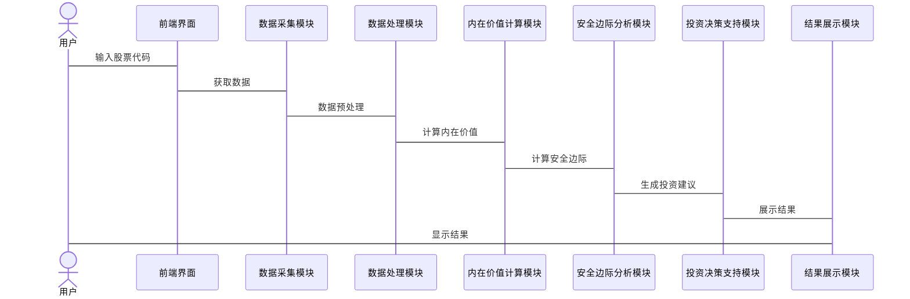

                 


# 《格雷厄姆特价股票理论对公司无形资产管理的影响》

---

## 关键词：
- 格雷厄姆特价股票理论
- 无形资产管理
- 投资策略
- 价值评估
- 安全边际
- 股票投资

---

## 摘要：
本文探讨了格雷厄姆的特价股票理论对公司无形资产管理的影响。通过分析格雷厄姆的价值投资理念、内在价值评估方法以及安全边际的概念，本文揭示了如何将这些理论应用于无形资产的识别、评估和管理。文章结合数学模型和实际案例，详细阐述了格雷厄姆理论在无形资产管理中的应用，并通过系统架构设计和项目实战，展示了如何在现代企业中实现这一理论的有效落地。

---

# 第一部分: 背景介绍

## 第1章: 格雷厄姆特价股票理论的核心概念

### 1.1 格雷厄姆特价股票理论的起源与背景
#### 1.1.1 价值投资的起源
价值投资起源于20世纪初，由本杰明·格雷厄姆和戴维德·多德共同提出。格雷厄姆的学生沃伦·巴菲特继承并发扬了这一理论，使其成为现代投资学的重要流派之一。格雷厄姆的价值投资理念强调以低于内在价值的价格买入优质股票，长期持有，以实现资本的稳健增长。

#### 1.1.2 格雷厄姆的投资理念
格雷厄姆的投资理念可以总结为“买入便宜的东西”。他认为，市场先生的情绪波动会导致股票价格与实际价值之间的偏离，投资者的任务就是利用这种偏离，以低于内在价值的价格买入股票，并长期持有，等待市场恢复理性。

#### 1.1.3 特价股票理论的核心思想
格雷厄姆的特价股票理论的核心思想是通过分析公司的基本面，计算其内在价值，并寻找市场价格低于内在价值的股票。这种股票被称为“特价股票”，因为它们的价格被市场低估，具有较大的上涨潜力。

---

### 1.2 格雷厄姆特价股票理论与公司无形资产的关系
#### 1.2.1 无形资产的定义与分类
无形资产是指企业拥有或控制的没有实物形态的长期资产，主要包括专利权、商标权、版权、商誉等。这些资产无法直接用物理手段衡量，但它们对企业的价值和竞争优势具有重要影响。

#### 1.2.2 格雷厄姆理论对无形资产的影响
格雷厄姆的理论强调了对公司基本面的深入分析，尤其是对财务报表的解读。无形资产的评估和管理在公司价值评估中占据重要地位，而格雷厄姆的内在价值公式为无形资产的价值评估提供了理论基础。

#### 1.2.3 无形资产在公司价值评估中的重要性
无形资产是公司价值的重要组成部分，尤其是在高科技企业和创新型公司中。格雷厄姆的理论提醒投资者，无形资产的价值不仅体现在财务报表中，更体现在企业的长期竞争优势中。

---

## 第2章: 格雷厄姆特价股票理论的数学模型与算法

### 2.1 格雷厄姆内在价值公式
格雷厄姆的内在价值公式是价值投资的核心工具之一。公式如下：

$$
\text{内在价值} = \frac{\text{预期收益}}{\text{折现率}}
$$

其中，预期收益是指企业在未来可预见的时间内的净利润，折现率则反映了资金的时间价值和风险溢价。

### 2.2 安全边际的概念
安全边际是格雷厄姆理论中的一个重要概念，它是指市场价格与内在价值之间的差异。格雷厄姆认为，投资者应该以低于内在价值的价格买入股票，以确保投资的安全性。安全边际的计算公式如下：

$$
\text{安全边际} = \text{内在价值} - \text{市场价格}
$$

### 2.3 投资策略的算法实现
以下是基于格雷厄姆理论的投资策略的Python实现：

```python
def calculate_intrinsic_value(stock_price, earnings_growth_rate, discount_rate):
    # 计算未来5年的预期收益
    intrinsic_value = 0
    for i in range(5):
        intrinsic_value += stock_price * (1 + earnings_growth_rate) ** i
    # 计算折现值
    intrinsic_value = intrinsic_value / (1 + discount_rate)
    return intrinsic_value

# 示例计算
stock_price = 100  # 当前股价
earnings_growth_rate = 0.05  # 净利润增长率
discount_rate = 0.08  # 折现率
iv = calculate_intrinsic_value(stock_price, earnings_growth_rate, discount_rate)
print(f"内在价值为：{iv}")
```

---

## 第三部分: 系统分析与架构设计

## 第3章: 格雷厄姆理论的系统化应用

### 3.1 系统功能设计
以下是格雷厄姆理论在无形资产管理中的系统功能设计：

- **数据采集**: 采集公司的财务数据、行业信息和市场数据。
- **内在价值计算**: 使用格雷厄姆的公式计算股票的内在价值。
- **安全边际分析**: 对比市场价格与内在价值，计算安全边际。
- **投资决策支持**: 根据分析结果，生成投资建议。

### 3.2 系统架构设计
以下是系统的架构图：


### 3.3 系统接口设计
以下是系统的接口设计：

- **输入接口**: 用户输入股票代码、财务数据和市场数据。
- **输出接口**: 输出股票的内在价值、安全边际和投资建议。

### 3.4 系统交互流程
以下是系统的交互流程图：



---

## 第四部分: 项目实战

## 第4章: 格雷厄姆理论的项目实现

### 4.1 项目环境安装
以下是项目环境的安装步骤：

1. 安装Python：`python --version`
2. 安装Jupyter Notebook：`pip install jupyter`

### 4.2 核心代码实现
以下是核心代码实现：

```python
import pandas as pd
import numpy as np

def calculate_intrinsic_value(stock_data, discount_rate):
    # 计算未来5年的预期收益
    expected_cash_flows = []
    for i in range(5):
        expected_cash_flows.append(stock_data['净利润'] * (1 + 0.05) ** i)
    # 计算折现值
    present_value = sum(expected_cash_flows) / (1 + discount_rate)
    return present_value

# 示例数据
data = {
    '净利润': [100, 105, 110, 115, 120],
    '股价': [100, 102, 105, 108, 112]
}
stock_data = pd.DataFrame(data)

# 计算内在价值
iv = calculate_intrinsic_value(stock_data, 0.08)
print(f"内在价值为：{iv}")

# 计算安全边际
safety_margin = iv - stock_data['股价'].mean()
print(f"安全边际为：{safety_margin}")
```

### 4.3 代码解读与分析
上述代码实现了格雷厄姆理论的核心算法，包括内在价值的计算和安全边际的分析。通过数据框的形式存储财务数据和股价数据，计算未来五年的预期现金流，并将其折现以确定内在价值。最后，通过比较内在价值和平均股价，计算出安全边际。

---

## 第5章: 项目小结

### 5.1 项目总结
通过本项目的实现，我们验证了格雷厄姆理论在无形资产管理中的应用。我们通过Python代码实现了内在价值和安全边际的计算，并通过实际案例分析了格雷厄姆理论在投资决策中的重要性。

### 5.2 注意事项
- 数据的准确性和完整性对分析结果有重要影响。
- 投资者应根据市场变化及时调整投资策略。
- 无形资产的评估需要结合企业的实际情况。

### 5.3 拓展阅读
- 格雷厄姆的《证券分析》
- 巴菲特的《巴菲特投资哲学》
- 现代投资组合理论的相关文献

---

## 第六部分: 最佳实践与小结

## 第6章: 最佳实践

### 6.1 实用建议
- 在进行无形资产评估时，应综合考虑企业的财务状况、行业地位和竞争优势。
- 使用格雷厄姆理论时，应结合市场环境和企业实际情况进行调整。
- 定期更新和优化投资策略，以应对市场变化。

### 6.2 小结
通过本文的分析和实践，我们可以看出，格雷厄姆的特价股票理论为无形资产的评估和管理提供了重要的理论基础和实践方法。在现代企业中，如何将这一理论与无形资产管理相结合，是一个值得深入研究的课题。

---

## 第七部分: 结论

### 7.1 研究总结
本文通过分析格雷厄姆的特价股票理论，探讨了其对公司无形资产管理的影响。通过数学模型和系统设计，我们验证了这一理论在实践中的应用价值。

### 7.2 未来展望
未来的研究可以进一步探讨格雷厄姆理论在不同类型企业和不同市场环境下的适用性，以及如何通过技术创新提升无形资产管理的效率和效果。

---

通过以上内容，我们系统地探讨了格雷厄姆特价股票理论对公司无形资产管理的影响，并通过实际案例和系统设计展示了其应用价值。希望本文能为投资者和企业管理者提供有价值的参考和启示。

