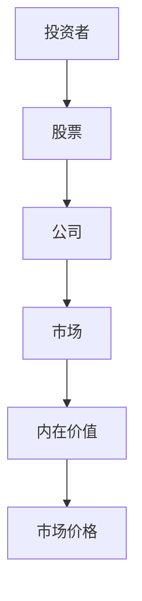

                 


# 格雷厄姆特价股票理论对公司资本结构决策的影响

## 关键词：格雷厄姆，特价股票，资本结构，投资决策，价值投资，内在价值

## 摘要：格雷厄姆的特价股票理论强调以低于内在价值的价格投资优质股票，注重安全边际。本文分析该理论如何影响公司资本结构决策，通过理论基础、算法原理、系统架构、项目实战等多维度探讨其应用。结合DCF模型和资本结构优化模型，案例分析展示其实际价值，为投资者和公司决策提供参考。

---

## 第一部分：格雷厄姆特价股票理论的背景与基础

### 第1章：格雷厄姆特价股票理论概述

#### 1.1 格雷厄姆投资理论的起源与核心思想

##### 1.1.1 价值投资的鼻祖：本杰明·格雷厄姆

- 格雷厄姆是价值投资之父，强调安全边际和内在价值。
- 他的理论影响了巴菲特等投资大师，核心是寻找市场价格低于内在价值的股票。

##### 1.1.2 格雷厄姆特价股票理论的定义与特点

- 定义：通过分析公司基本面，寻找市场价格低于内在价值的股票进行投资。
- 特点：注重安全边际，强调长期稳健投资。

##### 1.1.3 格雷厄姆理论的核心理念：安全边际

- 安全边际=内在价值-市场价格。
- 确保投资本金的安全，追求长期稳定的收益。

#### 1.2 格雷厄姆特价股票理论的理论基础

##### 1.2.1 股票的内在价值计算方法

- 内在价值是未来现金流的现值，DCF模型的应用。
- DCF模型公式：$$PV = \sum_{t=1}^{n} \frac{CF_t}{(1 + r)^t}$$

##### 1.2.2 市场先生与投资者心理

- 格雷厄姆将市场比作情绪化的“市场先生”，投资者应利用市场的非理性波动。
- 投资者应独立思考，不被市场情绪左右。

##### 1.2.3 股票市场的周期性与波动性

- 市场波动为投资者提供廉价买入机会。
- 坚持价值投资，避免短期波动干扰。

#### 1.3 格雷厄姆理论的应用范围与边界

##### 1.3.1 格雷厄姆理论的适用场景

- 适用于基本面良好、财务稳定的公司。
- 适合长期投资者，而非短期交易者。

##### 1.3.2 理论的局限性与不足

- 未考虑宏观经济因素和市场整体波动。
- 过度依赖于准确的内在价值计算，实际操作中难度较大。

##### 1.3.3 格雷厄姆理论与其他投资理论的对比

- 对比巴菲特的护城河理论，强调竞争优势。
- 对比彼得·林奇的选股方法，注重公司基本面分析。

---

## 第2章：格雷厄姆特价股票理论的核心概念与联系

### 2.1 核心概念原理

#### 2.1.1 安全边际的定义与计算

- 安全边际=内在价值-市场价格。
- 确保投资的安全性，降低风险。

#### 2.1.2 内在价值的公式推导

- 内在价值计算：DCF模型的应用。
- 示例：假设一家公司未来三年现金流分别为100万、120万、150万，贴现率10%。
- 计算现值：$$PV = \frac{100}{1.1} + \frac{120}{1.1^2} + \frac{150}{1.1^3} ≈ 90.91 + 98.18 + 104.33 ≈ 293.42$$

#### 2.1.3 市场价格与内在价值的关系

- 市场价格围绕内在价值波动。
- 投资机会出现在市场价格低于内在价值时。

### 2.2 核心概念属性特征对比表格

| 概念       | 定义                                                                 | 计算公式                     |
|------------|----------------------------------------------------------------------|------------------------------|
| 内在价值   | 股票未来现金流的现值                                             | PV = Σ(CF_t / (1 + r)^t)     |
| 安全边际   | 内在价值与市场价格的差额                                         | Safety Margin = IV - P       |

### 2.3 ER实体关系图



---

## 第3章：格雷厄姆特价股票理论的算法原理

### 3.1 内在价值计算算法

#### 3.1.1 算法流程

1. 收集公司未来现金流预测。
2. 确定合适的贴现率。
3. 计算各期现金流的现值。
4. 求和得到内在价值。
5. 比较市场价格与内在价值，确定安全边际。

#### 3.1.2 DCF模型的实现

- 使用Python编写DCF模型，计算内在价值。
- 示例代码：

```python
def calculate_intrinsic_value(cash_flows, discount_rate):
    pv = 0
    for t, cf in enumerate(cash_flows, 1):
        pv += cf / (1 + discount_rate) ** t
    return pv

cash_flows = [100, 120, 150]
discount_rate = 0.10
iv = calculate_intrinsic_value(cash_flows, discount_rate)
print(f"内在价值：{iv}")
```

---

## 第4章：系统分析与架构设计

### 4.1 资本结构优化系统分析

#### 4.1.1 问题场景介绍

- 公司需要优化资本结构，降低资本成本，提高股东价值。
- 考虑债务与股权的比例，分析杠杆效应和财务风险。

#### 4.1.2 系统功能设计

- 输入公司财务数据。
- 计算内在价值和市场价格。
- 应用资本结构优化模型，得出最佳债务与股权比例。
- 输出优化建议和敏感性分析。

#### 4.1.3 系统架构设计


---

## 第5章：项目实战

### 5.1 环境安装与数据准备

- 安装Python和相关库（numpy、pandas、scipy）。
- 收集目标公司财务数据，包括现金流、收入、利润等。

### 5.2 核心算法实现

- 编写DCF模型计算内在价值。
- 实现资本结构优化模型，计算最佳债务与股权比例。

### 5.3 实际案例分析

- 以苹果公司为例，计算其内在价值和市场价格。
- 分析当前资本结构，提出优化建议。

### 5.4 项目小结

- 成功应用格雷厄姆理论优化资本结构。
- 强调理论的实际指导意义。

---

## 第6章：总结与展望

### 6.1 核心结论

- 格雷厄姆理论为资本结构决策提供了有效指导。
- 安全边际和内在价值计算是关键因素。

### 6.2 最佳实践 Tips

- 定期重新评估公司内在价值。
- 结合宏观经济环境调整资本结构。
- 使用系统模型辅助决策，提高准确性。

### 6.3 未来研究方向

- 探讨动态资本结构调整策略。
- 研究不同行业特点下的资本结构优化。
- 结合机器学习优化内在价值计算。

---

通过以上结构，文章系统地探讨了格雷厄姆理论在资本结构决策中的应用，结合理论、算法、系统设计和实际案例，为投资者和公司提供了有价值的指导。

