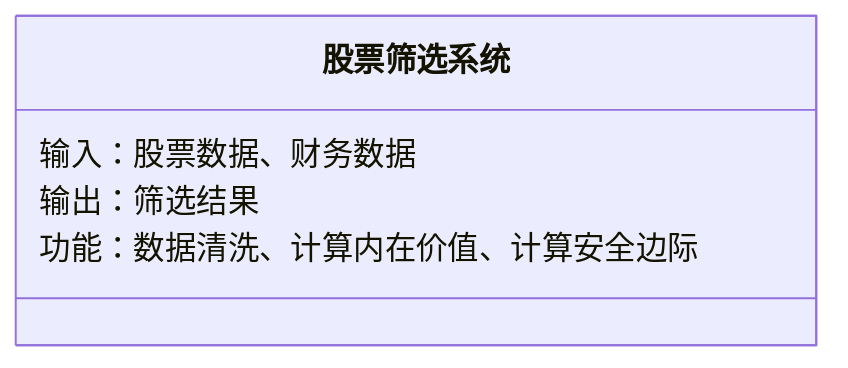
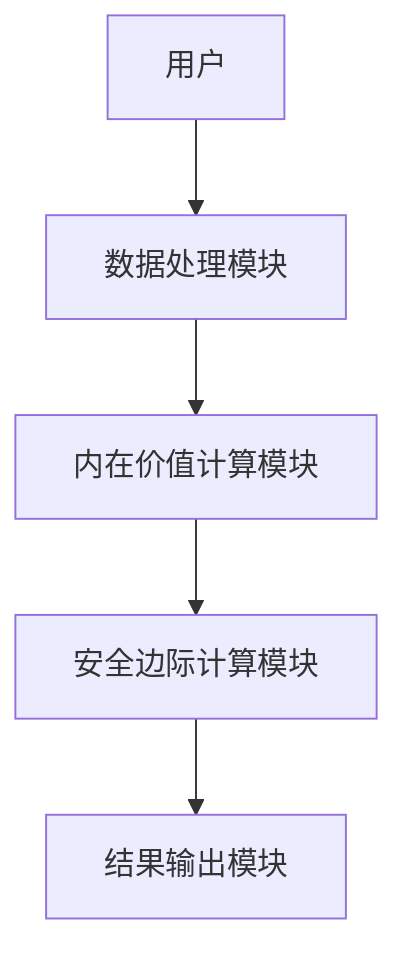

                 


# 《格雷厄姆特价股票理论对投资者教育的启示》

> **关键词**：格雷厄姆投资理论，特价股票，价值投资，安全边际，内在价值，投资者教育，股票筛选系统

> **摘要**：本文深入探讨了格雷厄姆的特价股票理论，分析其核心概念如内在价值和安全边际，结合算法原理和系统架构设计，构建了一个基于价值投资的股票筛选系统。文章通过实际案例分析和最佳实践，为投资者教育提供了系统的指导和启示。

---

## 第一部分: 格雷厄姆特价股票理论的背景与核心概念

### 第1章: 价值投资的起源与格雷厄姆的理论基础

#### 1.1 价值投资的起源
价值投资作为一种投资策略，其历史可以追溯到20世纪初。本杰明·格雷厄姆（Benjamin Graham）和戴维·多德（David Dodd）是这一理论的奠基人。他们的研究表明，市场先生（Mr. Market）的情绪波动会导致股票价格与实际价值的偏离，从而为投资者提供了以低于内在价值的价格买入优质股票的机会。

#### 1.2 格雷厄姆的理论基础
格雷厄姆的理论强调安全边际和长期投资。他认为，投资者应关注企业的内在价值，而非市场的短期波动。内在价值是企业未来现金流的现值，可以通过基本分析计算得出。

#### 1.3 特价股票的定义与特点
特价股票是指市场价格低于其内在价值的股票。这类股票通常具有较高的安全边际，适合长期投资者买入并持有。

#### 1.4 特价股票与传统投资的区别
传统投资往往关注短期价格波动和技术指标，而价值投资则注重企业的基本面和长期潜力。特价股票的筛选基于企业的内在价值和市场低估的状况。

---

### 第2章: 格雷厄姆特价股票理论的核心概念与联系

#### 2.1 核心概念
- **内在价值**：企业未来现金流的现值。
- **安全边际**：市场价格与内在价值的差距，提供了风险缓冲。
- **市场先生**：市场的波动性和不可预测性。
- **股东权益**：企业的净资产价值，反映了其实际价值。

#### 2.2 核心概念之间的关系
格雷厄姆的理论中，内在价值是核心，安全边际是保障，市场先生是外在因素，股东权益是企业的基础。这四个概念相互关联，构成了价值投资的完整框架。

#### 2.3 对比分析
下表对比了内在价值与市场价值、安全边际与投资风险、股东权益与企业价值的主要区别：

| **概念**       | **内在价值**          | **市场价值**          |
|----------------|-----------------------|-----------------------|
| 定义           | 未来现金流的现值     | 市场交易的当前价格   |
| 计算方式       | 基于基本面分析        | 市场供需决定          |
| 相关性         | 内在价值驱动市场价值  | 市场波动影响市场价值  |

---

## 第二部分: 格雷厄姆特价股票理论的算法原理

### 第3章: 内在价值的计算模型

#### 3.1 内在价值公式
$$ V = \frac{C}{r} $$
其中：
- \( V \)：内在价值
- \( C \)：年现金流
- \( r \)：折现率

#### 3.2 安全边际计算
安全边际可以通过以下步骤计算：
1. 计算股票的内在价值 \( V \)。
2. 找出当前市场价格 \( P \)。
3. 计算安全边际 \( SM = V - P \)。

### 第4章: 系统分析与架构设计方案

#### 4.1 项目目标
构建一个基于格雷厄姆理论的股票筛选系统，帮助投资者识别具有安全边际的特价股票。

#### 4.2 领域模型


#### 4.3 系统架构


---

## 第三部分: 项目实战与最佳实践

### 第5章: 项目实战

#### 5.1 环境安装
安装Python和相关库：
```bash
pip install pandas numpy matplotlib
```

#### 5.2 核心代码实现
```python
import pandas as pd
import numpy as np

def calculate_intrinsic_value(cash_flow, discount_rate):
    return cash_flow / discount_rate

def calculate_margin_of_safety(intrinsic_value, market_price):
    return intrinsic_value - market_price

# 示例数据
cash_flow = 100
discount_rate = 0.1
market_price = 80

iv = calculate_intrinsic_value(cash_flow, discount_rate)
mos = calculate_margin_of_safety(iv, market_price)

print(f"内在价值: {iv:.2f}")
print(f"安全边际: {mos:.2f}")
```

#### 5.3 实际案例分析
假设某公司年现金流为100万元，折现率为10%，当前股价为80万元。计算得出内在价值为100万元，安全边际为20万元，提示该股票具有较高的投资价值。

#### 5.4 项目小结
通过代码实现，投资者可以快速筛选出具有安全边际的特价股票，从而做出明智的投资决策。

### 第6章: 最佳实践与注意事项

#### 6.1 投资建议
- 长期投资：避免频繁交易，降低交易成本。
- 分散投资：降低单一股票的风险。
- 持续学习：关注企业基本面和市场变化。

#### 6.2 注意事项
- 安全边际并非绝对保证，市场波动仍可能带来损失。
- 确保数据来源可靠，避免错误分析。

#### 6.3 拓展阅读
推荐书籍：
- 《The Intelligent Investor》 by Benjamin Graham
- 《价值投资实战策略》 by 巴菲特

---

## 第四部分: 结论与展望

### 6.1 结论
格雷厄姆的特价股票理论为投资者提供了科学的分析框架，帮助识别低估股票，实现稳健投资。通过系统化的筛选和分析，投资者可以提升决策的准确性。

### 6.2 展望
未来，价值投资将结合人工智能和大数据技术，进一步优化股票筛选模型，为投资者提供更精准的指导。

---

通过本文的系统分析和实战指导，投资者可以更好地理解和应用格雷厄姆的特价股票理论，成为一个理性、耐心和独立的投资者。

