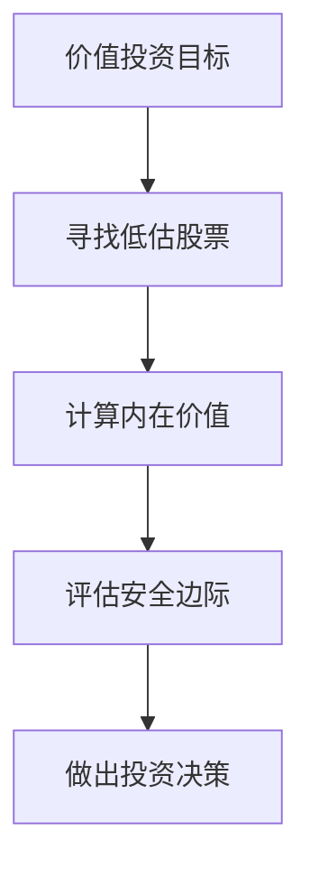
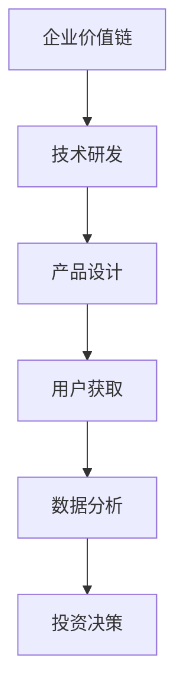
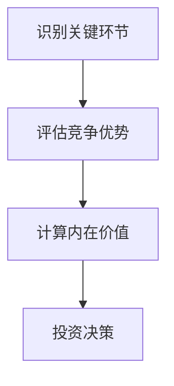
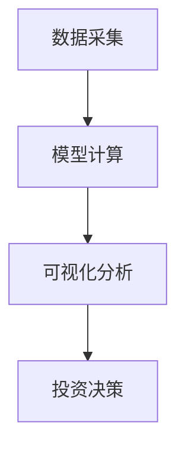

                 

# 《格雷厄姆特价股票理论对数字原生企业价值链的启示》

---

## 关键词：  
- 格雷厄姆价值投资理论  
- 数字原生企业  
- 企业价值链  
- 安全边际  
- 内在价值  
- 现金流折现模型  

---

## 摘要：  
本文探讨了格雷厄姆价值投资理论在数字原生企业价值链分析中的应用。通过结合经典价值投资理念与现代数字企业的特点，揭示了如何利用安全边际、内在价值等核心概念，优化数字企业的价值评估与投资决策。文章还通过案例分析和系统架构设计，展示了理论在实践中的具体应用，为数字原生企业的投资策略提供了新的视角。

---

## 正文：

---

### 第一部分: 引言

#### 第1章: 背景与核心概念

##### 1.1 价值投资与数字原生企业的结合

###### 1.1.1 格雷厄姆价值投资理论概述
格雷厄姆的价值投资理论是投资领域的经典理论，强调以低于内在价值的价格购买优质资产。其核心理念包括：  
1. **安全边际**：买入价格应远低于内在价值，以降低风险。  
2. **内在价值**：企业未来现金流的现值，可通过DCF（现金流折现模型）计算。  
3. **三步投资法**：  
   - 确定投资目标：关注企业基本面，寻找被低估的股票。  
   - 评估安全边际：计算内在价值与市场价格的差距。  
   - 投资决策：基于安全边际和企业竞争优势决定投资。  

通过 Mermaid 图展示格雷厄姆理论的核心要素：  

###### 1.1.2 数字原生企业的定义与特点
数字原生企业是指从互联网或数字技术起家的公司，如亚马逊、谷歌、微软等。其特点包括：  
1. **轻资产模式**：依赖数据和技术，而非实体资产。  
2. **高成长性**：通过数字化产品和服务快速扩张。  
3. **竞争优势**：依托技术壁垒和网络效应。  

数字原生企业的价值链包括：技术研发、产品设计、用户获取、数据分析等环节。  

###### 1.1.3 价值投资理论与数字企业的契合点
数字企业的高成长性和数据驱动的特性，为价值投资提供了新的应用场景。通过分析企业的长期现金流和竞争优势，投资者可以更精准地评估其内在价值。  

---

#### 第2章: 核心概念与联系

##### 2.1 格雷厄姆价值投资理论的核心原理

###### 2.1.1 安全边际的计算与应用
安全边际是格雷厄姆理论的核心，其计算公式为：  

$$ \text{安全边际} = \text{内在价值} - \text{市场价格} $$  

通过安全边际，投资者可以降低市场波动带来的风险。在数字企业中，安全边际的计算需要考虑企业的未来增长潜力。  

##### 2.2 数字原生企业的竞争优势分析

###### 2.2.1 企业竞争优势的三维度模型
数字企业的竞争优势可从以下三个维度分析：  
1. **技术壁垒**：企业的技术专利和研发能力。  
2. **网络效应**：用户数量的增加带来的边际成本下降。  
3. **数据资产**：大数据分析能力带来的竞争优势。  

通过表格对比数字企业和传统企业的竞争优势：  

| 维度       | 数字企业                | 传统企业                |
|------------|------------------------|-------------------------|
| 技术壁垒   | 强，依赖技术创新         | 弱，依赖成本控制         |
| 网络效应   | 强，用户增长带来价值     | 弱，用户增长成本上升     |
| 数据资产   | 强，数据驱动决策         | 弱，数据来源有限         |

##### 2.3 价值投资与企业价值链的关系

###### 2.3.1 价值投资对企业价值链的影响
价值投资通过优化企业价值链的各个环节（研发、生产、销售、服务），提升企业的内在价值。  

通过 Mermaid 图展示企业价值链与价值投资的关系：  

---

### 第二部分: 格雷厄姆价值投资理论的核心原理

#### 第3章: 格雷厄姆价值投资理论的核心原理

##### 3.1 内在价值的评估方法

###### 3.1.1 内在价值的计算公式
内在价值的计算公式为：  

$$ V = \sum_{t=1}^{n} \frac{CF_t}{(1 + r)^t} $$  

其中，\( CF_t \) 是第 \( t \) 年的现金流，\( r \) 是折现率，\( n \) 是预计的持有年限。  

通过案例分析，以亚马逊为例，计算其内在价值：  

假设：  
- 未来5年现金流分别为100亿、120亿、150亿、180亿、200亿。  
- 折现率为8%。  

计算结果：  

$$ V = \frac{100}{1.08} + \frac{120}{(1.08)^2} + \frac{150}{(1.08)^3} + \frac{180}{(1.08)^4} + \frac{200}{(1.08)^5} \approx 450 \text{亿美元} $$  

---

### 第三部分: 数字原生企业的分析与投资策略

#### 第4章: 数字原生企业的特点与竞争优势

##### 4.1 数字原生企业的特点

###### 4.1.1 轻资产模式的优势
数字企业通过技术和服务创造价值，而非依赖实体资产。这种模式具有更高的灵活性和扩展性。  

---

### 第四部分: 理论与实践的结合

#### 第5章: 理论与实践的结合

##### 5.1 数字原生企业的价值链分析

###### 5.1.1 价值链分析的三步法
1. **识别关键环节**：技术研发、产品设计、用户获取、数据分析。  
2. **评估竞争优势**：技术壁垒、网络效应、数据资产。  
3. **计算内在价值**：使用DCF模型评估企业价值。  

通过 Mermaid 图展示价值链分析的三步法：  

---

### 第五部分: 系统架构设计与项目实战

#### 第6章: 系统架构设计与项目实战

##### 6.1 系统架构设计

###### 6.1.1 系统功能设计
- **数据采集**：收集企业的财务数据和市场数据。  
- **模型计算**：使用DCF模型计算内在价值。  
- **可视化分析**：展示计算结果和投资建议。  

通过 Mermaid 图展示系统架构：  

---

### 第六部分: 结论

#### 第7章: 结论

##### 7.1 总结与展望
通过本文的分析，格雷厄姆价值投资理论为数字原生企业的价值评估和投资决策提供了新的思路。未来的研究可以进一步结合人工智能和大数据技术，优化内在价值的计算模型。  

---

### 致谢

感谢读者的耐心阅读，希望本文能为价值投资者和数字企业从业者提供新的视角和启发。  

---

**温馨提示：** 本文内容较多，建议读者按章节逐步阅读，结合实际案例加深理解。

