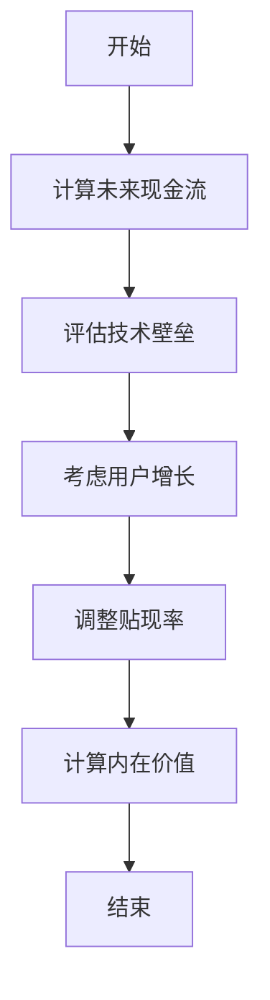
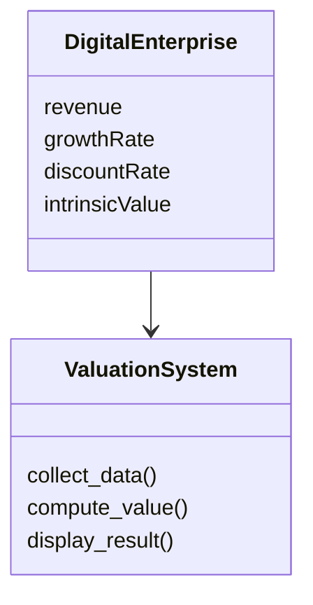
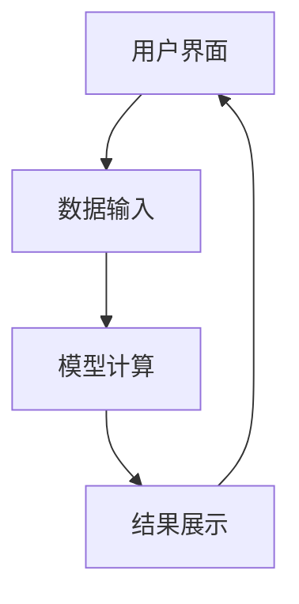

                 


# 格雷厄姆特价股票理论对数字原生企业估值的启示

## 关键词：格雷厄姆特价股票理论、数字原生企业、企业估值、价值投资、投资策略、技术分析

## 摘要：  
本文探讨了本杰明·格雷厄姆的价值投资理论在数字原生企业估值中的应用。通过分析数字企业的独特特性，本文提出了对传统格雷厄姆模型的改进方法，以更好地适应数字化时代的投资需求。文章结合数学模型、系统架构和实际案例，详细阐述了如何将格雷厄姆理论与现代技术相结合，为数字原生企业的估值提供新的思路和方法。

---

# 正文

## 第1章 背景介绍

### 1.1 格雷厄姆特价股票理论的起源  
本杰明·格雷厄姆是价值投资的鼻祖，他的“特价股票”理论强调以低于内在价值的价格购买股票，长期持有，等待市场回归理性。格雷厄姆认为，股票的内在价值可以通过企业的资产、盈利能力和市场地位等基本面指标来评估。然而，传统格雷厄姆模型主要适用于实体经济中的企业，对数字原生企业的适用性存在局限性。

### 1.2 数字原生企业的特点  
数字原生企业是指那些从一开始就以数字化技术为核心驱动力的企业，例如互联网公司、软件即服务（SaaS）企业等。这类企业的特点是轻资产、高增长、依赖数据和技术，且其价值更多体现在未来的盈利潜力而非当前的资产状况。

### 1.3 格雷厄姆理论与数字企业的结合  
随着数字经济的崛起，传统格雷厄姆模型的局限性日益显现。数字企业的价值创造模式与实体经济企业截然不同，因此需要对格雷厄姆理论进行调整和创新，以适应数字时代的投资需求。

---

## 第2章 核心概念与联系

### 2.1 核心概念的解释  
格雷厄姆理论的核心在于“安全边际”和“内在价值”。内在价值是企业未来现金流的现值，而安全边际则是市场价格与内在价值之间的差距。数字企业的内在价值需要考虑其技术壁垒、用户粘性和数据资产等因素。

### 2.2 格雷厄姆理论与数字企业的属性对比  

| 核心概念         | 传统企业       | 数字原生企业       |
|------------------|----------------|--------------------|
| 资产结构         | 实体资产为主     | 数据和技术为主      |
| 盈利模式         | 制造或服务     | 数据变现、订阅模式  |
| 价值驱动因素     | 资产和利润     | 用户增长和技术迭代  |
| 风险因素         | 市场波动、成本  | 技术风险、政策风险  |

### 2.3 ER实体关系图  

```mermaid
er
    customer
    |
    +(1:N)
    |
    order
    |
    +(1:N)
    |
    product
    |
    +(1:1)
    |
    company
```

---

## 第3章 格雷厄姆理论的数学模型与算法

### 3.1 格雷厄姆模型的数学表达  
格雷厄姆的内在价值公式为：  
$$ V = \frac{E}{(1 + r)^t} $$  
其中，$E$ 是未来现金流，$r$ 是贴现率，$t$ 是时间跨度。

### 3.2 数字企业估值的改进算法  



### 3.3 Python代码实现  

```python
def compute_intrinsic_value(revenue, growth_rate, discount_rate):
    # 计算未来现金流
    cash_flows = []
    for i in range(5):
        cash_flows.append(revenue * (1 + growth_rate)**i)
    # 计算现值
    pv = sum([cf / (1 + discount_rate)**i for i, cf in enumerate(cash_flows)])
    return pv

# 示例
revenue = 100
growth_rate = 0.2
discount_rate = 0.1
iv = compute_intrinsic_value(revenue, growth_rate, discount_rate)
print(f"内在价值为：{iv}")
```

---

## 第4章 系统分析与架构设计

### 4.1 系统功能设计  
数字企业估值系统需要包括数据采集、模型计算、结果展示等功能。  



### 4.2 系统架构设计  



---

## 第5章 项目实战与案例分析

### 5.1 实战环境安装  
需要安装Python和相关库（如numpy、pandas）。

### 5.2 代码实现  

```python
import numpy as np

def calculate_intrinsic_value(fcf, growth_rate, discount_rate):
    # 计算未来现金流
    fcf_projection = []
    for i in range(5):
        fcf_projection.append(fcf * (1 + growth_rate)**i)
    # 计算现值
    iv = sum([cf / (1 + discount_rate)**i for i, cf in enumerate(fcf_projection)])
    return iv

# 示例：以亚马逊为例
fcf = 20  # 自由现金流
growth_rate = 0.15
discount_rate = 0.1
iv = calculate_intrinsic_value(fcf, growth_rate, discount_rate)
print(f"亚马逊的内在价值为：{iv}")
```

### 5.3 案例分析  
以亚马逊为例，分析其技术壁垒、用户增长和数据资产，调整格雷厄姆模型的参数，计算其内在价值。

---

## 第6章 最佳实践与总结

### 6.1 总结  
本文将格雷厄姆理论与数字原生企业结合，提出了改进的估值方法，并通过案例分析验证了其可行性。

### 6.2 注意事项  
在实际应用中，需注意数据的准确性和模型的适应性。

### 6.3 未来研究方向  
未来可以探索将机器学习算法与格雷厄姆模型结合，进一步提高估值的准确性。

### 6.4 拓展阅读  
推荐阅读《价值投资实战》和《数字企业的价值评估》。

---

## 结语  
通过本文的分析，我们可以看到，格雷厄姆理论在数字原生企业估值中的应用具有广阔前景。未来，随着技术的不断进步，价值投资将更加依赖于对数字企业的深刻理解和对技术的灵活运用。

