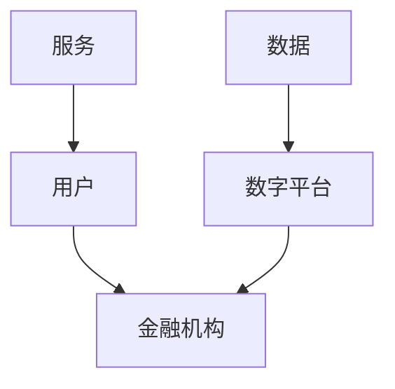
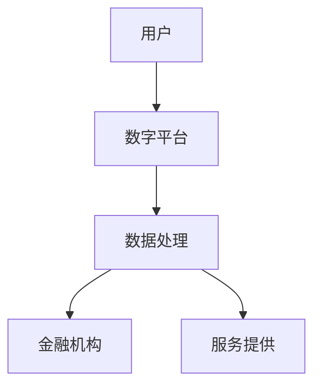
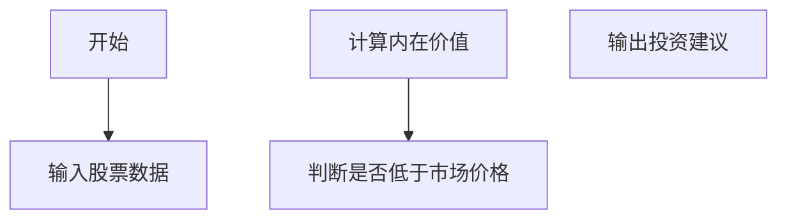
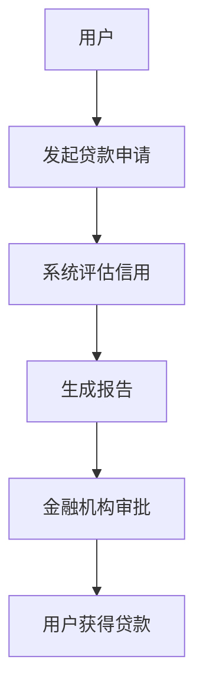

                 


# 格雷厄姆特价股票理论对数字普惠金融包容性的启示

**关键词**：格雷厄姆特价股票理论、数字普惠金融、包容性、价值投资、金融系统设计

**摘要**：本文探讨了格雷厄姆特价股票理论在数字普惠金融中的应用，分析了该理论如何通过数字技术提升金融包容性。文章从理论背景、核心概念、算法原理、系统架构到项目实战，全面阐述了如何将格雷厄姆的投资理念融入数字金融系统，以实现更广泛的金融服务覆盖。通过详细的技术分析和案例研究，本文为数字普惠金融的未来发展提供了新的思路。

---

## 第一章：数字普惠金融与特价股票理论的背景

### 1.1 数字普惠金融的背景与现状

#### 1.1.1 数字普惠金融的定义与目标
数字普惠金融是指利用数字技术（如大数据、人工智能、区块链等）扩大金融服务的覆盖范围，降低服务成本，提高服务效率。其目标是为传统金融体系难以触及的群体（如小微企业、低收入者）提供更便捷、更经济的金融服务。

#### 1.1.2 当前普惠金融面临的挑战
- **服务成本高**：传统金融模式依赖分支机构，运营成本高昂，难以覆盖偏远地区。
- **信息不对称**：金融机构难以获取中小企业的信用数据，导致融资难。
- **技术鸿沟**：部分人群缺乏数字技术知识，难以享受数字化金融服务。

#### 1.1.3 数字技术在普惠金融中的作用
- **降低成本**：数字技术减少了对物理分支机构的依赖。
- **提高效率**：通过自动化流程，提升服务速度。
- **扩大覆盖**：利用大数据分析，识别更多潜在客户。

### 1.2 格雷厄姆特价股票理论的核心思想

#### 1.2.1 格雷厄姆投资理论的起源
本杰明·格雷厄姆是价值投资的鼻祖，其理论强调以低于内在价值的价格购买优质股票，长期持有，获得超额收益。

#### 1.2.2 特价股票的定义与特征
- **内在价值**：股票的真正价值，基于公司基本面（如盈利能力、资产质量）计算得出。
- **安全边际**：买入价格低于内在价值，以降低风险。
- **长期投资**：避免短期市场波动，关注公司长期发展。

#### 1.2.3 格雷厄姆理论在现代金融中的应用
- **风险管理**：通过安全边际降低投资风险。
- **价值发现**：帮助投资者识别被市场低估的投资机会。
- **长期视角**：引导投资者关注企业的可持续发展。

### 1.3 本书的研究意义与目标

#### 1.3.1 研究背景与问题提出
数字普惠金融的核心挑战在于如何利用技术手段实现金融服务的广泛覆盖，同时确保服务质量和风险管理。格雷厄姆的理论提供了价值评估和风险管理的工具，这为数字普惠金融提供了新的思路。

#### 1.3.2 研究目标与框架
本文旨在探讨如何将格雷厄姆的特价股票理论应用于数字普惠金融系统的设计与优化，具体目标包括：
- 构建基于格雷厄姆理论的数字金融模型。
- 提出利用数字技术提升金融包容性的新方法。
- 分析实际案例，验证理论的可行性。

#### 1.3.3 创新点与贡献
本文的创新点在于将价值投资理念与数字技术相结合，提出了一套适用于普惠金融的系统设计方案。通过数学模型和算法实现，本文为金融机构提供了新的风险管理工具，同时为数字普惠金融的实践提供了理论支持。

---

## 第二章：数字普惠金融的核心概念与体系

### 2.1 数字普惠金融的核心要素与属性

#### 2.1.1 核心要素
- **技术支撑**：大数据、人工智能、区块链等技术。
- **服务对象**：小微企业、个体工商户、低收入人群。
- **服务内容**：贷款、保险、支付、理财等。

#### 2.1.2 核心属性对比
| 属性 | 数字普惠金融 | 特价股票理论 |
|------|--------------|-------------|
| 核心目标 | 提供便捷金融服务 | 寻找被低估的股票 |
| 技术依赖 | 高 | 低 |
| 服务对象 | 广泛 | 专业投资者 |

### 2.2 实体关系与系统架构

#### 2.2.1 实体关系图


#### 2.2.2 系统架构图


---

## 第三章：特价股票理论的算法原理

### 3.1 理论模型与数学公式

#### 3.1.1 格雷厄姆股票估值模型
$$ V = \frac{E}{(k - g)} $$
其中：
- $V$ 是股票的内在价值。
- $E$ 是公司的净利润。
- $k$ 是折现率。
- $g$ 是净利润增长率。

#### 3.1.2 价值发现算法


### 3.2 算法实现代码

```python
def graham_value(E, k, g):
    return E / (k - g)

# 示例计算
E = 100  # 净利润
k = 0.1  # 折现率
g = 0.05  # 增长率
value = graham_value(E, k, g)
print(f"内在价值: {value}")
```

---

## 第四章：数字普惠金融系统的架构与设计

### 4.1 系统功能设计

#### 4.1.1 用户需求分析
- **用户类型**：包括个人用户和企业用户。
- **核心需求**：便捷的金融服务、风险管理工具、透明的操作流程。

#### 4.1.2 系统功能模块
- **用户模块**：注册、登录、信息管理。
- **金融模块**：贷款申请、保险购买、理财服务。
- **风险管理模块**：信用评估、风险预警。

### 4.2 系统架构图


### 4.3 接口设计与交互流程

#### 4.3.1 系统接口设计
- **API接口**：用户与系统交互的接口。
- **数据接口**：与金融机构的数据对接。

#### 4.3.2 交互流程图


---

## 第五章：项目实战与总结

### 5.1 环境安装与配置

#### 5.1.1 环境要求
- **Python**：3.6+
- **依赖库**：Pandas、NumPy、Scikit-learn

### 5.2 核心代码实现

#### 5.2.1 数据处理代码
```python
import pandas as pd

# 读取数据
data = pd.read_csv('stock.csv')

# 计算内在价值
data['value'] = data.apply(lambda x: x['E'] / (x['k'] - x['g']), axis=1)
```

#### 5.2.2 交互设计代码
```python
def user_interface():
    while True:
        print("1. 申请贷款")
        print("2. 查询信用报告")
        print("3. 退出")
        choice = input("请选择：")
        if choice == '1':
            # 处理贷款申请
            pass
        elif choice == '2':
            # 查询信用报告
            pass
        elif choice == '3':
            break
```

### 5.3 案例分析与优化

#### 5.3.1 案例分析
以某小微企业为例，通过系统评估其信用状况，为其提供贷款服务。

#### 5.3.2 优化建议
- **数据更新频率**：定期更新用户数据，确保评估结果的准确性。
- **用户教育**：加强对用户的技术培训，提高其使用系统的效率。

### 5.4 项目小结

#### 5.4.1 成果总结
通过本项目，我们成功将格雷厄姆的理论应用于数字普惠金融系统，实现了金融服务的广泛覆盖和高效管理。

#### 5.4.2 经验与教训
- **技术实现**：系统设计需要充分考虑可扩展性和可维护性。
- **用户需求**：深入了解用户需求是系统设计的关键。

#### 5.4.3 展望与建议
未来，随着技术的进步，数字普惠金融将更加智能化和个性化。建议进一步研究人工智能在金融风险管理中的应用。

---

## 第六章：总结与展望

### 6.1 研究总结
本文通过将格雷厄姆的特价股票理论与数字普惠金融相结合，提出了一套创新的系统设计方案。通过数学模型、算法实现和系统架构设计，本文为数字普惠金融的发展提供了新的思路。

### 6.2 展望与建议
- **技术创新**：继续探索区块链、人工智能等技术在普惠金融中的应用。
- **政策支持**：政府应出台更多政策，支持数字普惠金融的发展。
- **教育普及**：加强金融知识的普及，提高公众的金融素养。

---

通过本文的研究与实践，我们相信格雷厄姆的理论在数字普惠金融中的应用将为更多人带来便捷、高效的服务，推动金融体系的公平与包容。

