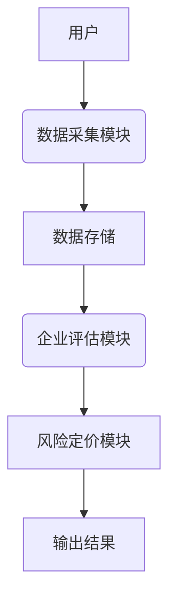
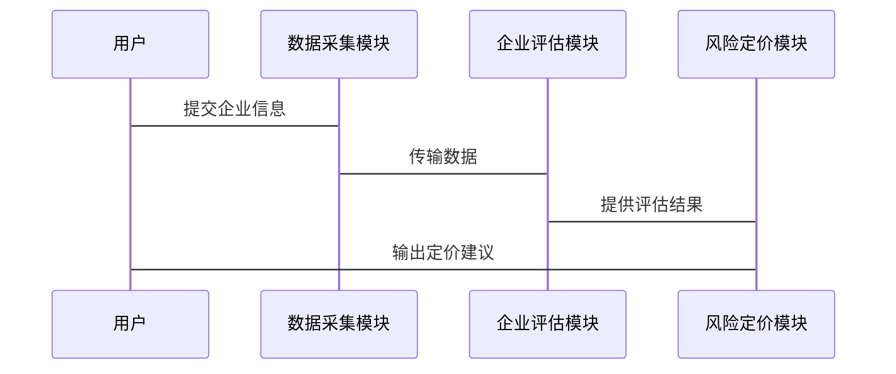

                 


# 《格雷厄姆特价股票理论对数字普惠金融可持续性的启示》

## 关键词：格雷厄姆理论，数字普惠金融，价值投资，风险管理，可持续性

## 摘要：本文探讨格雷厄姆的特价股票理论如何为数字普惠金融的可持续性提供启示。通过分析数字普惠金融的背景、核心挑战以及格雷厄姆理论的核心概念，文章提出将价值投资理念应用于数字普惠金融的业务模式优化和风险管理。结合系统架构设计和算法实现，本文展示了如何通过技术创新实现金融普惠的可持续性目标。

---

## 第一章：引言

### 1.1 数字普惠金融的背景与重要性
- 1.1.1 数字普惠金融的定义：利用数字技术扩大金融服务的可及性，尤其是对低收入群体和中小微企业的支持。
- 1.1.2 当前发展现状：全球范围内数字普惠金融的快速推进及其在疫情中的重要作用。
- 1.1.3 意义：通过数字技术降低金融服务成本，提高效率，促进金融包容性增长。

### 1.2 格雷厄姆特价股票理论的背景
- 1.2.1 格雷厄姆的定义：价值投资的鼻祖，强调安全边际和内在价值。
- 1.2.2 核心观点：市场波动中存在低估股票，长期投资实现超额收益。
- 1.2.3 理论价值：为理性投资提供了科学的方法论。

### 1.3 本文的研究意义与结构安排
- 1.3.1 研究意义：探讨如何将价值投资理念应用于普惠金融，提升其可持续性。
- 1.3.2 结构安排：从理论分析到系统设计，再到算法实现，最后总结启示。

---

## 第二章：数字普惠金融的核心挑战与分析框架

### 2.1 数字普惠金融的业务模式
- 2.1.1 基于数字技术的金融服务模式：移动支付、在线信贷、保险科技等。
- 2.1.2 业务模式特点：成本低、覆盖广、效率高。

### 2.2 格雷厄姆理论在普惠金融中的潜在应用
- 2.2.1 价值投资理念：寻找有长期成长潜力的企业。
- 2.2.2 安全边际：降低投资风险，确保资金安全。

---

## 第三章：系统分析与架构设计

### 3.1 问题场景介绍
- 数字普惠金融中的数据获取、企业评估和风险定价问题。

### 3.2 系统功能设计
- 数据采集模块：收集企业财务数据和市场信息。
- 企业评估模块：基于格雷厄姆模型评估内在价值。
- 风险定价模块：结合市场波动进行动态调整。

### 3.3 系统架构设计


### 3.4 系统交互流程


---

## 第四章：算法实现与案例分析

### 4.1 格雷厄姆模型的数学公式
$$ V = \text{收入} \times (1 + g) / (r - g) $$
其中，$V$为内在价值，$g$为收入增长率，$r$为折现率。

### 4.2 算法实现
```python
def calculate_intrinsic_value(revenue, growth_rate, discount_rate):
    return revenue * (1 + growth_rate) / (discount_rate - growth_rate)
```

### 4.3 案例分析
分析某小微企业的数据，计算其内在价值，并与市场价格对比，判断是否为低估股票。

---

## 第五章：项目实战与优化建议

### 5.1 环境安装与数据准备
- 安装Python和相关库（pandas, numpy）。
- 准备企业财务数据和市场信息。

### 5.2 核心算法实现
实现格雷厄姆模型，并结合实际数据进行测试。

### 5.3 案例分析与结果解读
通过具体案例展示算法的应用效果，并分析结果对普惠金融业务的启示。

---

## 第六章：最佳实践与总结

### 6.1 格雷厄姆理论的启示
- 价值投资理念在普惠金融中的应用。
- 强调长期投资，降低风险。

### 6.2 潜在风险与应对策略
- 数据质量风险：确保数据准确性和完整性。
- 模型局限性：结合其他方法进行综合评估。

### 6.3 实际应用中的注意事项
- 保持对市场的敏感性，及时调整模型参数。
- 定期进行模型更新和优化。

### 6.4 未来研究方向
- 结合人工智能技术，提升评估精度。
- 探讨更复杂的金融模型在普惠金融中的应用。

---

## 第七章：结论

通过系统化的分析和实践，本文证明了格雷厄姆的特价股票理论能够为数字普惠金融的可持续性提供有力支持。结合理论与技术，数字普惠金融可以在风险可控的前提下，实现高效、可持续的金融服务模式。

---

## 参考文献
- [1] 格雷厄姆《证券分析》
- [2] 数字普惠金融相关研究文献
- [3] 机器学习与金融应用相关书籍

---

## 附录
### A. 术语表
- 内在价值：企业未来现金流的现值。
- 安全边际：市场价格低于内在价值的部分。

### B. 数据集
- 示例企业财务数据和市场信息。

---

通过以上结构和内容，本文详细探讨了格雷厄姆理论在数字普惠金融中的应用，结合理论分析、系统设计和算法实现，为读者提供了全面的视角和实践指导。

