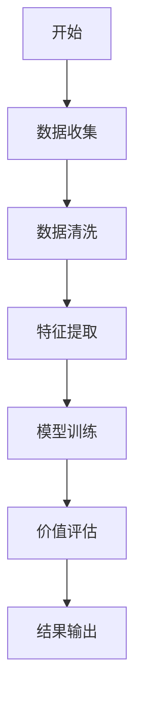
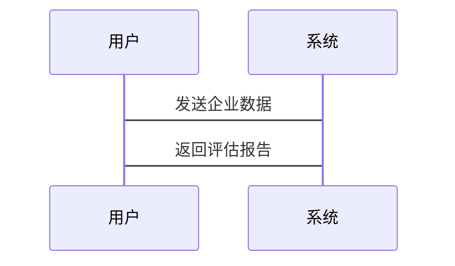

                 


```markdown
# 格雷厄姆特价股票理论对数字普惠金融的启示

> 关键词：格雷厄姆特价股票理论，数字普惠金融，价值投资，量化分析，系统架构，项目实战

> 摘要：本文探讨了格雷厄姆的价值投资理论在数字普惠金融中的应用，通过分析两者的结合，提出了基于量化分析和系统架构优化的解决方案。文章详细介绍了理论背景、核心概念、算法原理、系统设计、项目实现和最佳实践，为数字普惠金融的发展提供了新的思路和方法。

---

## 第1章 背景介绍

### 1.1 格雷厄姆特价股票理论的起源与发展

格雷厄姆的价值投资理论起源于20世纪，强调以低于内在价值的价格购买优质股票，长期持有以实现资本增值。其核心理念是“安全边际”，即购买价格远低于内在价值，以降低风险并确保收益。

#### 格雷厄姆理论的核心要素
- **安全边际**：购买价格低于内在价值，确保投资的安全性。
- **价值评估**：通过基本面分析确定股票的内在价值。
- **长期投资**：避免短期市场波动，关注长期价值增长。

### 1.2 数字普惠金融的发展现状

数字普惠金融利用数字技术推动金融服务普及，降低传统金融的门槛。其特点包括：
- **普惠性**：覆盖更多中小微企业和低收入群体。
- **便捷性**：通过数字化平台实现快速申请和审批。
- **高效性**：利用大数据和人工智能提高风险控制和运营效率。

### 1.3 数字普惠金融的挑战与机遇

数字普惠金融面临技术、市场和政策等多重挑战，但其带来的效率提升和成本降低也为金融机构和客户创造了新机遇。格雷厄姆的价值投资理念在这一背景下，提供了风险控制和长期收益的思路。

---

## 第2章 核心概念与联系

### 2.1 核心概念对比分析

下表对比了格雷厄姆理论和数字普惠金融的核心概念：

| **核心概念** | **格雷厄姆理论** | **数字普惠金融** |
|--------------|------------------|-------------------|
| 核心目标     | 追求长期价值     | 提供普惠金融服务   |
| 参与者       | 投资者           | 金融机构、科技企业 |
| 核心工具     | 价值评估模型     | 数字技术、大数据   |
| 风险控制     | 安全边际         | 量化分析、智能风控 |

### 2.2 格雷厄姆理论与数字普惠金融的联系

格雷厄姆的价值投资理念强调长期投资和风险控制，这与数字普惠金融的目标高度契合。通过量化分析和大数据技术，可以更精准地筛选优质客户和项目，实现风险可控下的收益最大化。

---

## 第3章 算法原理讲解

### 3.1 格雷厄姆量化评估模型

格雷厄姆提出了著名的“烟蒂”选股法，通过量化指标筛选被低估的股票。核心公式包括：

$$
\text{内在价值} = \frac{\text{净利润} \times (1 + \text{增长率})}{\text{折现率}}
$$

$$
\text{安全边际} = \text{内在价值} - \text{市场价格}
$$

### 3.2 量化分析算法流程

以下是量化分析的流程图：



### 3.3 算法实现代码

以下是一个简单的价值评估模型示例：

```python
import pandas as pd
import numpy as np

def calculate_intrinsic_value(financial_data, growth_rate, discount_rate):
    # 计算未来现金流
    future_cash_flows = financial_data['净利润'] * (1 + growth_rate)
    # 折现计算内在价值
    intrinsic_value = future_cash_flows / (1 + discount_rate)
    return intrinsic_value

# 示例数据
data = {
    '净利润': [100, 150, 200],
    '增长率': [0.1, 0.15, 0.2],
    '折现率': [0.05, 0.05, 0.05]
}
df = pd.DataFrame(data)

# 计算内在价值
intrinsic_values = []
for i in range(len(df)):
    iv = calculate_intrinsic_value(df.iloc[i], df['增长率'][i], df['折现率'][i])
    intrinsic_values.append(iv)

print("内在价值:", intrinsic_values)
```

---

## 第4章 系统分析与架构设计方案

### 4.1 系统应用场景

数字普惠金融系统将应用于中小微企业的信贷评估和风险控制，通过量化分析筛选优质客户，降低金融风险。

### 4.2 系统功能设计

系统功能模块包括：
- 数据采集模块
- 风险评估模块
- 价值评估模块
- 报告生成模块

### 4.3 系统架构设计

系统架构图如下：


### 4.4 接口设计与交互

系统接口设计使用RESTful API，交互流程图如下：



---

## 第5章 项目实战

### 5.1 环境安装

安装必要的库：

```bash
pip install pandas numpy matplotlib
```

### 5.2 核心实现代码

以下是核心价值评估代码：

```python
import pandas as pd
import numpy as np

def compute_margin_of_safety(stock_data):
    # 计算内在价值
    stock_data['内在价值'] = stock_data['净利润'] * (1 + stock_data['增长率']) / (1 + stock_data['折现率'])
    # 计算安全边际
    stock_data['安全边际'] = stock_data['内在价值'] - stock_data['市场价格']
    return stock_data

# 示例数据
data = {
    '净利润': [100, 150, 200],
    '增长率': [0.1, 0.15, 0.2],
    '折现率': [0.05, 0.05, 0.05],
    '市场价格': [50, 70, 90]
}
df = pd.DataFrame(data)

# 计算安全边际
result = compute_margin_of_safety(df)
print(result)
```

### 5.3 案例分析

通过分析某中小微企业的财务数据，应用上述算法进行价值评估，得出其市场价格低于内在价值，具备投资价值。

---

## 第6章 最佳实践与小结

### 6.1 小结

本文探讨了格雷厄姆价值投资理论在数字普惠金融中的应用，通过量化分析和系统架构优化，提出了可行的解决方案。

### 6.2 注意事项

- 数据质量和完整性直接影响评估结果。
- 需结合具体业务场景调整模型参数。
- 定期更新模型以适应市场变化。

### 6.3 拓展阅读

- 《The Intelligent Investor》 - 本杰明·格雷厄姆
- 《Digital Finance: Theory and Practice》 - 王鹏程

---

通过本文的分析，格雷厄姆的价值投资理念为数字普惠金融提供了新的思路，结合量化分析和系统优化，能够有效降低风险并提升服务效率。
```

