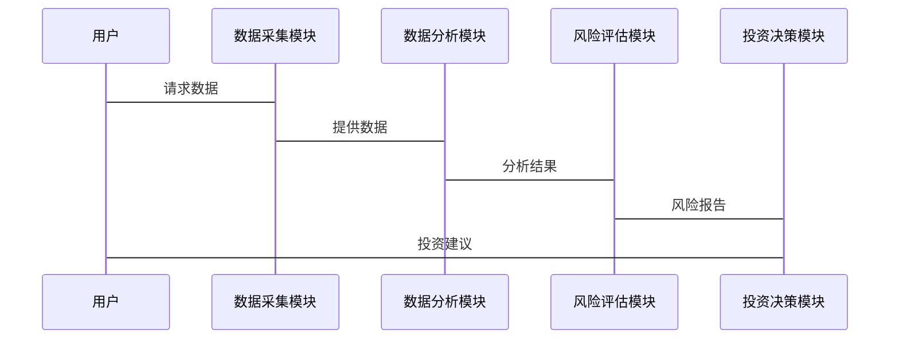

                 


# 格雷厄姆特价股票理论对普惠金融科技的启示

## 关键词
- 格雷厄姆投资理论
- 普惠金融科技
- 价值投资
- 大数据技术
- 人工智能

## 摘要
格雷厄姆的投资理论，尤其是其价值投资和安全边际的概念，为现代普惠金融科技的发展提供了宝贵的启示。本文探讨了格雷厄姆理论在普惠金融中的应用，结合金融科技的技术手段，如大数据和人工智能，分析了如何通过技术手段实现格雷厄姆理论的核心理念，从而推动普惠金融的发展。

---

# 第一部分: 格雷厄姆特价股票理论基础

## 第1章: 格雷厄姆特价股票理论概述

### 1.1 格雷厄姆投资理论的核心概念
格雷厄姆的价值投资理论强调以低于内在价值的价格购买优质股票。以下是其核心概念的详细阐述：

#### 1.1.1 价值投资的定义与核心原则
价值投资是一种长期投资策略，核心在于寻找市场低估的股票。格雷厄姆提出的价值投资原则包括：
1. **安全边际**：购买价格远低于内在价值，以降低风险。
2. **长期视角**：关注企业的内在价值，而非短期市场波动。
3. **分散投资**：通过分散投资降低风险。

#### 1.1.2 特价股票的定义与特征
特价股票是指市场价格低于其内在价值的股票。其特征包括：
- 低市盈率（P/E比率）。
- 低市净率（P/B比率）。
- 高股息率。

#### 1.1.3 格雷厄姆投资理论的历史背景
格雷厄姆的投资理论在20世纪30年代经济大萧条期间形成，强调在市场恐慌时寻找低估股票的投资机会。

### 1.2 格雷厄姆投资理论的数学模型
格雷厄姆的理论中，现值计算和内部收益率是关键的数学工具。

#### 1.2.1 现值计算公式
$$ PV = \frac{C}{(1 + r)^n} $$
其中：
- \( PV \)：现值。
- \( C \)：未来现金流。
- \( r \)：折现率。
- \( n \)：时间期限。

#### 1.2.2 内部收益率的计算
$$ IRR = r \text{ 满足 } NPV = 0 $$
内部收益率是使净现值为零的折现率，用于评估投资项目的回报率。

## 第2章: 格雷厄姆投资理论的核心要素

### 2.1 格雷厄姆投资理论的三要素
格雷厄姆理论中的三个核心要素：安全边际、内在价值和市场先生。

#### 2.1.1 安全边际
安全边际是市场价格与内在价值之间的差距，用于降低投资风险。公式为：
$$ \text{安全边际} = \text{内在价值} - \text{市场价格} $$

#### 2.1.2 股票的内在价值
内在价值是基于企业未来现金流的现值计算得出的股票价值。

#### 2.1.3 市场先生的概念
市场先生是格雷厄姆用来描述市场波动的隐喻，强调投资者应独立于市场波动做出理性决策。

### 2.2 格雷厄姆投资理论的ER实体关系图
```mermaid
erDiagram
    投资者++o--"投资"++ 股票 :投资者与股票的关系
    股票++o--"评估"++ 价值 :股票与价值的关系
    价值++o--"决定"++ 决策 :价值与决策的关系
```

---

# 第二部分: 普惠金融科技的核心概念

## 第3章: 普惠金融科技的基本概念

### 3.1 普惠金融的定义与目标
普惠金融旨在为所有人提供平等的金融服务，包括小额信贷、储蓄和保险等。

#### 3.1.1 普惠金融的定义
普惠金融是由联合国提出，旨在通过金融体系的改革，使所有人都能以可负担的成本获得金融服务。

#### 3.1.2 普惠金融的目标
- 提供金融服务的可及性。
- 降低金融服务的成本。
- 提高金融教育水平。

#### 3.1.3 普惠金融与传统金融的区别
传统金融主要服务于高净值客户，而普惠金融关注的是中小微企业和个人。

### 3.2 金融科技的核心技术
金融科技（FinTech）利用新技术改进金融服务的提供方式，包括大数据、人工智能和区块链等技术。

#### 3.2.1 大数据技术
大数据技术用于分析海量数据，识别市场趋势和客户行为。

#### 3.2.2 人工智能技术
人工智能技术用于自动化决策和预测，提高金融服务的效率。

#### 3.2.3 区块链技术
区块链技术用于构建去中心化的金融系统，提高交易透明度和安全性。

## 第4章: 普惠金融科技的现状与挑战

### 4.1 普惠金融科技的现状
普惠金融科技在支付、借贷和保险等领域取得了显著进展。

#### 4.1.1 数字支付的发展
移动支付如支付宝和微信支付的普及，提高了金融服务的可及性。

#### 4.1.2 互联网借贷的兴起
P2P借贷平台通过技术手段降低融资成本，提高效率。

#### 4.1.3 金融数据的开放
开放金融数据提高了金融机构之间的协作效率。

### 4.2 普惠金融科技的挑战
普惠金融科技的发展面临技术、监管和数据隐私等多重挑战。

#### 4.2.1 技术风险
技术漏洞可能导致数据泄露和系统崩溃。

#### 4.2.2 数据隐私问题
数据的收集和使用可能侵犯用户隐私。

#### 4.2.3 监管问题
新兴的金融科技模式可能与现有监管框架不兼容。

---

# 第三部分: 格雷厄姆理论与普惠金融科技的结合

## 第5章: 格雷厄姆理论在普惠金融科技中的应用

### 5.1 格雷厄姆理论在普惠金融中的核心应用
格雷厄姆理论中的价值投资和安全边际概念在普惠金融科技中具有重要的应用价值。

#### 5.1.1 安全边际的应用
在普惠金融中，安全边际用于评估贷款的违约风险，确保贷款质量。

#### 5.1.2 内在价值的评估
通过大数据和人工智能技术，评估客户的内在价值，降低风险。

#### 5.1.3 市场先生的模型
市场先生的模型帮助投资者理解市场波动，做出理性决策。

### 5.2 格雷厄姆理论与普惠金融科技的结合案例
以下是一些具体的结合案例：

#### 5.2.1 互联网借贷平台的风险评估
互联网借贷平台利用大数据技术，分析借款人的信用状况，评估其内在价值。

#### 5.2.2 区块链技术在股票评估中的应用
区块链技术用于构建透明的股票交易系统，提高交易的可信度。

#### 5.2.3 人工智能在安全边际计算中的应用
人工智能技术用于预测市场价格波动，计算安全边际，降低投资风险。

## 第6章: 格雷厄姆理论在普惠金融科技中的算法实现

### 6.1 格雷厄姆理论的算法模型
以下是格雷厄姆理论的算法实现示例：

#### 6.1.1 内在价值计算算法
计算企业的内在价值，可以使用现金流折现法（DCF）。

```python
def calculate_intrinsic_value(cash_flows, discount_rate):
    present_value = 0
    for year in range(len(cash_flows)):
        cash_flow = cash_flows[year]
        present_value += cash_flow / (1 + discount_rate) ** (year + 1)
    return present_value
```

#### 6.1.2 安全边际计算算法
计算安全边际，比较市场价格和内在价值。

```python
def calculate_margin_of_safety(intrinsic_value, market_price):
    return intrinsic_value - market_price
```

#### 6.1.3 市场波动预测算法
利用机器学习模型预测市场波动，调整投资策略。

```python
from sklearn.ensemble import RandomForestClassifier

model = RandomForestClassifier()
model.fit(features, labels)
predicted_labels = model.predict(new_features)
```

---

## 第7章: 系统架构设计与实现

### 7.1 系统功能设计
系统功能模块包括数据采集、数据分析、风险评估和投资决策。

#### 7.1.1 数据采集模块
采集市场数据、企业财务数据和客户行为数据。

#### 7.1.2 数据分析模块
使用大数据和人工智能技术，分析数据，评估内在价值。

#### 7.1.3 风险评估模块
评估安全边际，计算风险等级。

#### 7.1.4 投资决策模块
基于分析结果，制定投资策略。

### 7.2 系统架构设计
系统架构采用分层设计，包括数据层、服务层和应用层。


### 7.3 系统接口设计
系统接口包括数据接口、算法接口和用户接口。

#### 7.3.1 数据接口
接口用于与外部数据源交互，获取市场和企业数据。

#### 7.3.2 算法接口
接口用于调用机器学习模型，进行预测和分析。

#### 7.3.3 用户接口
接口用于与用户交互，展示分析结果和投资建议。

### 7.4 系统交互设计
系统交互流程包括数据采集、分析、评估和决策。



---

## 第8章: 项目实战与案例分析

### 8.1 环境安装
安装所需的开发环境，包括Python、机器学习库和数据分析工具。

#### 8.1.1 安装Python
```bash
python --version
pip install numpy pandas scikit-learn
```

#### 8.1.2 安装机器学习库
```bash
pip install scikit-learn xgboost
```

### 8.2 核心实现源代码
以下是核心算法的实现代码：

#### 8.2.1 内在价值计算
```python
import numpy as np
import pandas as pd

def calculate_intrinsic_value(cash_flows, discount_rate):
    present_value = 0
    for year, cf in enumerate(cash_flows):
        present_value += cf / (1 + discount_rate) ** (year + 1)
    return present_value

# 示例数据
cash_flows = [100, 150, 200, 250]
discount_rate = 0.10

iv = calculate_intrinsic_value(cash_flows, discount_rate)
print(f"内在价值: {iv:.2f}")
```

#### 8.2.2 安全边际计算
```python
def calculate_margin_of_safety(iv, price):
    return iv - price

# 示例数据
price = 50
print(f"安全边际: {calculate_margin_of_safety(iv, price):.2f}")
```

#### 8.2.3 市场波动预测
```python
from sklearn.ensemble import RandomForestClassifier
from sklearn.model_selection import train_test_split

# 示例数据
data = pd.DataFrame({
    'feature1': [1, 2, 3, 4],
    'feature2': [5, 6, 7, 8],
    'label': [0, 1, 0, 1]
})

X = data.drop('label', axis=1)
y = data['label']

X_train, X_test, y_train, y_test = train_test_split(X, y, test_size=0.2)

model = RandomForestClassifier()
model.fit(X_train, y_train)

predicted_labels = model.predict(X_test)
print(predicted_labels)
```

### 8.3 案例分析与解读
以某互联网借贷平台为例，分析如何应用格雷厄姆理论进行风险评估和投资决策。

#### 8.3.1 案例背景
该平台提供小额信贷服务，用户基数庞大，但风险较高。

#### 8.3.2 数据分析
通过大数据分析，评估客户的内在价值和安全边际，识别高风险客户。

#### 8.3.3 投资决策
基于分析结果，制定风险控制策略，调整贷款利率和期限。

### 8.4 项目小结
通过项目实战，验证了格雷厄姆理论在普惠金融科技中的有效性，提高了风险控制能力。

---

## 第9章: 总结与展望

### 9.1 格雷厄姆理论与普惠金融科技的结合
格雷厄姆的价值投资理论与现代金融科技的结合，为普惠金融的发展提供了新的思路。

### 9.2 技术展望
未来，随着人工智能和大数据技术的进一步发展，格雷厄姆理论在普惠金融科技中的应用将更加广泛和深入。

### 9.3 最佳实践 tips
- 采用大数据和人工智能技术，提高分析效率。
- 注重风险控制，确保投资安全。
- 加强金融教育，提高投资者的金融素养。

### 9.4 小结
本文通过分析格雷厄姆投资理论的核心概念，探讨了其在普惠金融科技中的应用，结合实际案例，展示了如何通过技术手段实现理论的指导价值。

---

通过以上分析，格雷厄姆投资理论与普惠金融科技的结合，不仅为投资者提供了新的思路，也为普惠金融的发展注入了新的活力。未来，随着技术的进步，这一结合将更加紧密，推动金融行业的进一步发展。

