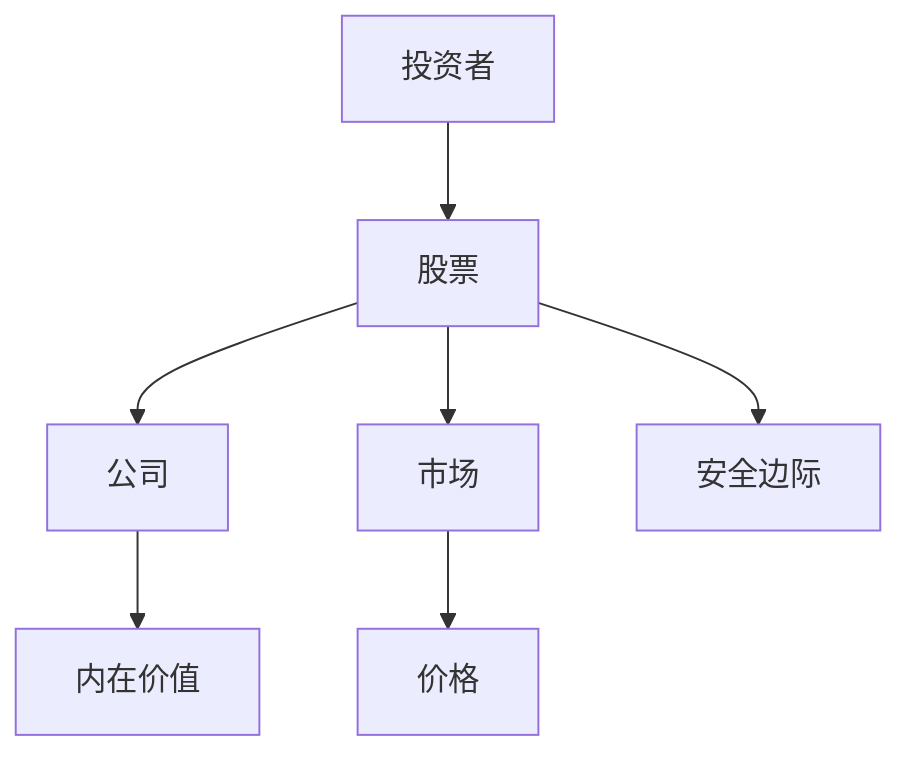
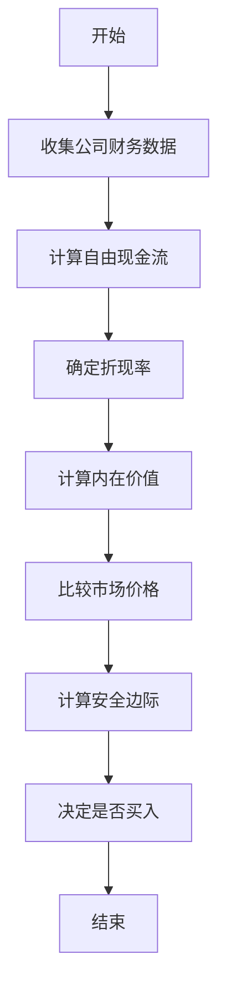
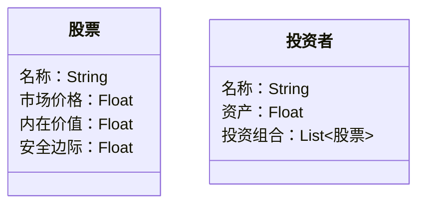
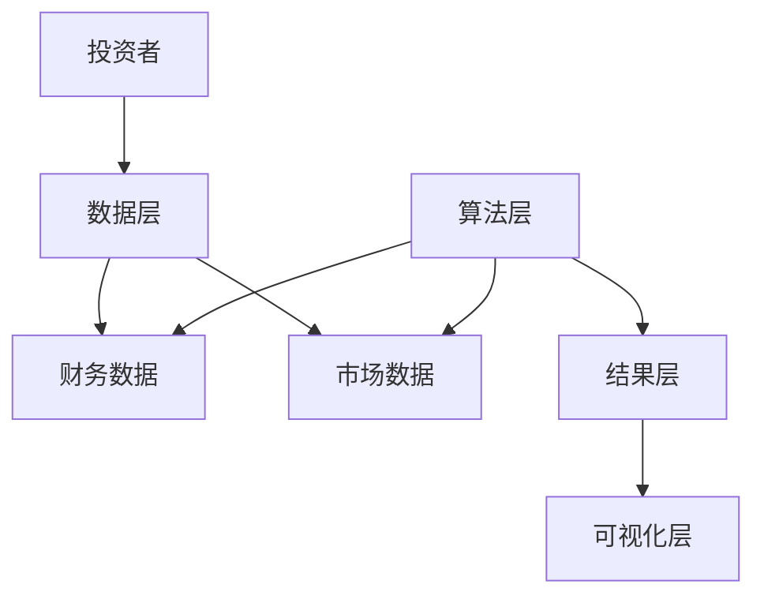
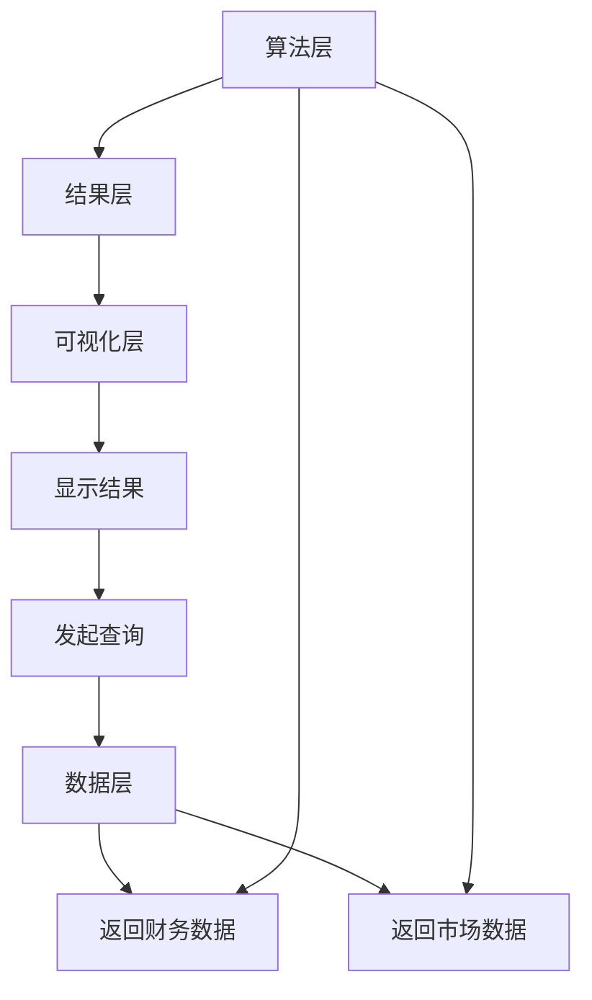

                 


# 格雷厄姆特价股票理论对现代公司估值的启示

> 关键词：格雷厄姆、特价股票、公司估值、价值投资、安全边际、数学模型

> 摘要：本文从格雷厄姆特价股票理论的核心概念出发，结合现代公司估值的实践，系统性地分析了该理论的数学模型、算法原理、系统架构及其在实际投资中的应用。通过对比分析、案例研究和系统设计，探讨了格雷厄姆理论在现代投资环境下的适用性及其对量化投资的启示。

---

# 第一部分: 格雷厄姆特价股票理论基础

## 第1章: 格雷厄姆特价股票理论概述

### 1.1 格雷厄姆生平与投资理念

格雷厄姆（Benjamin Graham）是20世纪最著名的投资理论家之一，被誉为“价值投资之父”。他于1894年出生于纽约，早年便展现出了对金融市场的敏锐洞察力。格雷厄姆的职业生涯始于1920年代，当时他与合作伙伴戴维斯（David Dodd）共同开发了基于基本面分析的股票估值方法。他的投资理念强调安全性和确定性，主张以低于内在价值的价格买入股票，并长期持有。

**问题背景**：在20世纪初，金融市场缺乏系统性估值方法，投资者往往依赖市场情绪或短期价格波动进行决策。格雷厄姆的理论为投资者提供了一种基于公司基本面的理性投资框架。

**问题解决**：格雷厄姆通过研究企业的财务报表，提出了内在价值的概念，并强调安全边际的重要性。这种方法使投资者能够在市场恐慌或低估时，以合理的价格买入优质资产。

**边界与外延**：格雷厄姆的理论适用于长期投资，尤其在市场波动较大时更具价值。其外延包括量化投资、风险管理等领域。

### 1.2 特价股票的定义与特点

**核心概念**：特价股票是指市场价格显著低于其内在价值的股票。这种低估通常源于市场的非理性或公司暂时的困境。

**属性特征对比表**：

| 特性       | 特价股票特点 | 普通股票特点 |
|------------|--------------|---------------|
| 市场价格   | 远低于内在价值 | 接近或高于内在价值 |
| 投资风险   | 较低（安全边际高） | 较高（安全边际低或无） |
| 投资回报   | 高（长期） | 中等或低（取决于市场波动） |
| 适用场景   | 市场低估或恐慌时 | 市场理性或牛市时 |

**ER实体关系图**：



### 1.3 格雷厄姆选股标准

**核心要素**：

1. **安全边际**：买入价格与内在价值的差距。公式为：
   $$ \text{安全边际} = \text{内在价值} - \text{市场价格} $$

2. **低市盈率与低市净率**：通过比较市盈率（P/E）和市净率（P/B），筛选出被市场低估的股票。

3. **其他标准**：如股息率、ROE（净资产收益率）等。

### 1.4 格雷厄姆理论的现代应用

**与量化投资的结合**：格雷厄姆的理论为量化模型提供了基础，现代投资者可以通过算法筛选符合安全边际条件的股票。

**局限性**：在市场高度波动或结构性变化（如科技股泡沫）中，格雷厄姆理论可能失效，需结合其他分析方法。

---

## 第2章: 格雷厄姆特价股票理论的核心概念

### 2.1 格雷厄姆理论的核心要素

**内在价值**：公司未来现金流的现值。公式为：
$$ \text{内在价值} = \sum_{t=1}^{n} \frac{\text{现金流}_t}{(1 + r)^t} $$

其中，$r$为折现率，$n$为预测年数。

**安全边际**：通过比较市场价格与内在价值，确保投资的安全性。

### 2.2 格雷厄姆理论的数学模型

**内在价值的公式推导**：

以自由现金流为例，内在价值可表示为：
$$ V = \frac{CF_1}{(1 + r)^1} + \frac{CF_2}{(1 + r)^2} + \dots + \frac{CF_n}{(1 + r)^n} $$

其中，$CF_t$为第$t$年的自由现金流。

**安全边际的计算公式**：
$$ \text{安全边际} = \frac{\text{内在价值} - \text{市场价格}}{\text{内在价值}} \times 100\% $$

### 2.3 格雷厄姆理论的对比分析

**与道氏理论的对比**：
- **道氏理论**：基于市场趋势和波动进行预测。
- **格雷厄姆理论**：基于公司基本面进行估值。

**与技术分析的对比**：
- **技术分析**：依赖价格和成交量数据。
- **格雷厄姆理论**：依赖财务报表和内在价值。

### 2.4 格雷厄姆理论的ER实体关系图


---

## 第3章: 格雷厄姆特价股票理论的数学模型与算法原理

### 3.1 格雷厄姆理论的数学模型

**内在价值的计算公式**：
$$ V = \sum_{t=1}^{n} \frac{CF_t}{(1 + r)^t} $$

**安全边际的计算公式**：
$$ \text{安全边际} = \frac{V - P}{V} \times 100\% $$

其中，$V$为内在价值，$P$为市场价格。

### 3.2 格雷厄姆理论的算法流程图



### 3.3 格雷厄姆理论的Python实现

```python
def calculate_intrinsic_value(cash_flows, discount_rate):
    return sum(cf / (1 + discount_rate)**t for t, cf in enumerate(cash_flows, start=1))

def calculate_margin_of_safety(intrinsic_value, market_price):
    return (intrinsic_value - market_price) / intrinsic_value * 100

# 示例：以自由现金流和折现率计算内在价值
cash_flows = [100, 120, 150]
discount_rate = 0.08
intrinsic_value = calculate_intrinsic_value(cash_flows, discount_rate)
market_price = 200
margin_of_safety = calculate_margin_of_safety(intrinsic_value, market_price)
print(f"内在价值: {intrinsic_value:.2f}")
print(f"安全边际: {margin_of_safety:.2f}%")
```

---

## 第4章: 格雷厄姆理论的系统分析与架构设计

### 4.1 问题场景介绍

现代投资者需要构建一个自动化系统，基于格雷厄姆理论筛选特价股票。系统需整合财务数据、市场数据和算法模型。

### 4.2 系统功能设计

**领域模型**：


**系统架构**：


### 4.3 系统接口设计

**API接口**：
```http
GET /api/intrinsic_value? ticker=MSFT
```

**响应示例**：
```json
{
    "名称": "微软",
    "市场价格": 200.0,
    "内在价值": 220.5,
    "安全边际": 9.25
}
```

### 4.4 系统交互流程图



---

## 第5章: 格雷厄姆理论的项目实战

### 5.1 环境安装与配置

安装Python和必要的库：
```bash
pip install pandas numpy matplotlib
```

### 5.2 核心算法实现

```python
def calculate_intrinsic_value(cash_flows, discount_rate):
    return sum(cf / (1 + discount_rate)**t for t, cf in enumerate(cash_flows, start=1))

# 示例：以微软为例
cash_flows = [100, 120, 150]
discount_rate = 0.08
intrinsic_value = calculate_intrinsic_value(cash_flows, discount_rate)
market_price = 200
margin_of_safety = (intrinsic_value - market_price) / intrinsic_value * 100
print(f"微软的内在价值为：{intrinsic_value:.2f}")
print(f"微软的安全边际为：{margin_of_safety:.2f}%")
```

### 5.3 案例分析与解读

以微软为例，计算其内在价值和安全边际。假设其自由现金流为每年100、120、150美元，折现率为8%，市场价格为200美元。计算结果表明，微软的内在价值为220.5美元，安全边际为9.25%。

### 5.4 项目小结

通过本项目，我们验证了格雷厄姆理论在实际投资中的应用价值。投资者可以利用该理论筛选出具有安全边际的股票，从而降低投资风险并提高回报率。

---

## 第6章: 格雷厄姆理论的现代启示

### 6.1 格雷厄姆理论的现代启示

1. **量化投资的基石**：格雷厄姆的安全边际概念为量化模型提供了基础。
2. **风险管理的重要性**：通过安全边际控制投资风险。
3. **动态调整**：结合市场变化，动态调整估值模型。

### 6.2 格雷厄姆理论的局限性

1. **假设市场的非理性**：在市场高度理性或泡沫时期，格雷厄姆理论可能失效。
2. **忽略市场情绪**：低估了市场情绪对股票价格的影响。

### 6.3 未来研究方向

1. **结合行为金融学**：将市场情绪纳入估值模型。
2. **多因子模型**：结合其他因子（如动量、价值）进行综合估值。

### 6.4 最佳实践 tips

1. **定期复盘**：定期检查投资组合，确保符合安全边际要求。
2. **分散投资**：避免过度集中，降低风险。
3. **结合技术分析**：将格雷厄姆理论与技术分析结合，提高准确性。

---

## 第7章: 总结与展望

### 7.1 总结

格雷厄姆的特价股票理论为现代公司估值提供了重要的理论基础。通过安全边际和内在价值的计算，投资者可以在市场低估时买入优质资产，实现长期收益。

### 7.2 展望

未来，格雷厄姆理论将与更多现代技术结合，如人工智能和大数据分析，进一步提升其在投资中的应用价值。

---

# 附录

### 附录A: 格雷厄姆理论的经典书籍

1. 《聪明的投资者》
2. 《证券分析》

### 附录B: 格雷厄姆理论的Python代码库

[提供GitHub链接或代码示例]

---

# 结束语

通过本文的系统分析和实战案例，我们深入探讨了格雷厄姆特价股票理论在现代公司估值中的应用。希望读者能够从中获得启发，并将该理论与实际投资相结合，实现稳健的投资收益。

