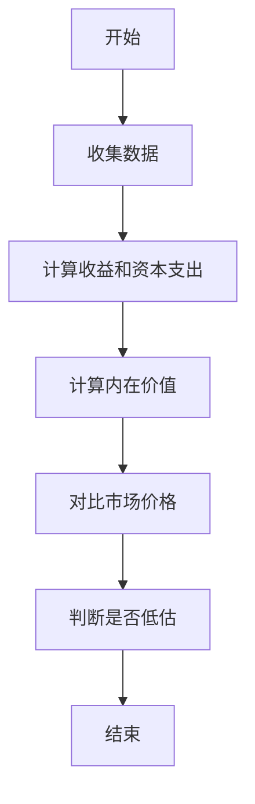
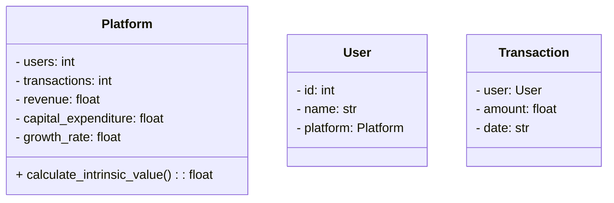
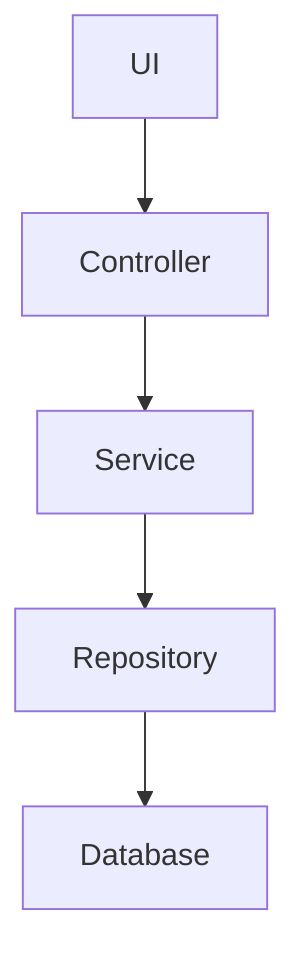

                 


# 格雷厄姆特价股票理论对现代平台经济的启示

## 关键词：
- 格雷厄姆特价股票理论
- 平台经济
- 价值投资
- 数字经济
- 共享经济

## 摘要：
本文探讨了格雷厄姆的特价股票理论在现代平台经济中的应用，通过分析价值投资的核心思想，结合数字平台的特征，提出了一套适用于平台经济的评估方法。文章详细阐述了理论与实践的结合，提供了系统的解决方案和实际案例，为投资者和企业管理者提供了新的视角和工具。

---

## 第1章: 格雷厄姆特价股票理论的背景与核心概念

### 1.1 格雷厄姆特价股票理论的起源

#### 1.1.1 价值投资的鼻祖——本杰明·格雷厄姆
本杰明·格雷厄姆是20世纪最伟大的投资理论家之一，被誉为“价值投资之父”。他的投资理念的核心在于寻找市场价格低于其内在价值的股票，即“特价股票”。他认为，市场短期是投票器，长期是称重机，真正的价值最终会反映在价格上。

#### 1.1.2 特价股票理论的核心思想
格雷厄姆的理论强调安全边际和margin of safety（安全边际）。他认为，投资者应该购买那些市场价格显著低于其内在价值的股票，以降低投资风险。内在价值的计算基于企业的基本面，包括盈利能力、资产状况和行业地位等因素。

#### 1.1.3 理论的演变与现代应用
格雷厄姆的理论经过几十年的发展，逐步融入现代投资学，成为价值投资的重要基石。在现代金融市场上，格雷厄姆的理论不仅适用于传统股票投资，还可以扩展到对新兴经济模式的分析，如平台经济。

---

### 1.2 现代平台经济的定义与特点

#### 1.2.1 平台经济的定义与模式
平台经济是一种新兴的经济形态，通过数字技术构建平台，连接供需双方，实现资源的高效匹配。典型的平台包括电子商务平台、共享经济平台（如滴滴出行、Airbnb）和社交平台（如Facebook、Twitter）。

#### 1.2.2 平台经济的核心特征
1. **双边市场**：平台连接两个或多个群体（如买家和卖家），通过撮合交易创造价值。
2. **网络效应**：用户数量的增加会提升平台的整体价值，产生正反馈效应。
3. **数据驱动**：平台通过收集和分析用户数据，优化匹配算法，提升效率。
4. **轻资产模式**：平台本身不持有实体资产，而是通过技术和服务实现价值。

#### 1.2.3 平台经济与传统经济的对比
平台经济与传统经济在商业模式、价值创造方式和资源分配效率上有显著差异。平台经济更注重数据和技术，而传统经济更依赖实物资产和人力资源。

---

### 1.3 格雷厄姆理论与平台经济的结合

#### 1.3.1 理论背景与平台经济的契合点
格雷厄姆的理论关注内在价值和市场价格的差异，而平台经济的核心在于通过技术创新和模式创新实现价值最大化。两者的结合点在于如何通过数据和技术手段发现平台的内在价值。

#### 1.3.2 平台经济中的价值发现
在平台经济中，价值不仅体现在交易撮合上，还包括数据资产、用户粘性和网络效应。格雷厄姆的内在价值理论可以帮助投资者识别那些市场价格被低估的平台。

#### 1.3.3 理论的边界与外延
虽然格雷厄姆的理论适用于平台经济，但其外延性和适用性需要进一步研究。例如，如何衡量平台的网络效应和数据资产的价值，是传统股票估值方法难以直接解决的问题。

---

## 第2章: 格雷厄姆特价股票理论的核心概念与联系

### 2.1 核心概念的原理

#### 2.1.1 格雷厄姆的内在价值公式
格雷厄姆提出了内在价值的计算公式，用于评估企业的实际价值。公式如下：

$$
\text{内在价值} = \frac{\text{收益} \times (10 / (\text{资本支出} \times (1 + \text{增长率})))
}
$$

其中，收益为企业过去几年的平均收益，资本支出是企业每年的资本支出，增长率是企业的年增长率。

#### 2.1.2 市盈率与市净率的计算
市盈率（P/E）和市净率（P/B）是衡量股票价值的重要指标。格雷厄姆认为，市盈率低于15、市净率低于2的股票具有投资价值。

$$
\text{市盈率} = \frac{\text{股价}}{\text{每股收益}}
$$

$$
\text{市净率} = \frac{\text{股价}}{\text{每股净资产}}
$$

---

### 2.2 核心概念与平台经济的联系

#### 2.2.1 平台经济的核心要素
平台经济的核心要素包括用户、数据和技术。这些要素构成了平台的内在价值。

#### 2.2.2 平台经济的估值模型
为了将格雷厄姆的理论应用到平台经济中，我们需要构建一个适用于平台的估值模型。模型需要考虑平台的用户数量、交易频率、数据资产和网络效应等因素。

---

### 2.3 核心概念的ER图架构

```mermaid
erDiagram
    user{1}-(n)->order
    order{1}-(n)->product
    user{1}-(n)->review
    product{1}-(n)->category
    user{1}-(n)->platform
    platform{1}-(n)->service
```

上述图展示了平台经济中的核心实体关系，包括用户、订单、产品、评论、平台和服务。

---

## 第3章: 格雷厄姆特价股票理论的算法原理与实现

### 3.1 算法原理

#### 3.1.1 算法的步骤
1. 收集目标平台的基本数据，包括用户数量、交易额、成本等。
2. 计算平台的收益和资本支出。
3. 使用格雷厄姆的内在价值公式计算平台的理论价值。
4. 对比市场价格与内在价值，判断是否低估。

#### 3.1.2 算法的流程图



---

### 3.2 算法的数学模型

#### 3.2.1 内在价值公式
$$
\text{内在价值} = \frac{\text{收益} \times (10 / (\text{资本支出} \times (1 + \text{增长率})))
}
$$

#### 3.2.2 价格与价值对比
$$
\text{安全边际} = \frac{\text{内在价值} - \text{市场价格}}{\text{内在价值}} \times 100\%
$$

---

### 3.3 算法的Python实现

```python
def calculate_intrinsic_value(revenue, capital_expenditure, growth_rate):
    return (revenue * (10 / (capital_expenditure * (1 + growth_rate))))

# 示例数据
revenue = 100  # 收益
capital_expenditure = 50  # 资本支出
growth_rate = 0.1  # 增长率

iv = calculate_intrinsic_value(revenue, capital_expenditure, growth_rate)
print(f"内在价值: {iv}")
```

---

## 第4章: 系统分析与架构设计方案

### 4.1 系统功能设计

#### 4.1.1 领域模型类图



---

### 4.2 系统架构设计

#### 4.2.1 系统架构图



---

## 第5章: 项目实战与案例分析

### 5.1 项目实战

#### 5.1.1 安装必要的库
```bash
pip install pandas numpy matplotlib
```

#### 5.1.2 核心代码实现

```python
import pandas as pd

def calculate_intrinsic_value(df):
    df['Intrinsic Value'] = df.apply(lambda x: (x['Revenue'] * (10 / (x['Capital Expenditure'] * (1 + x['Growth Rate'])))), axis=1)
    return df

# 示例数据
data = {
    'Revenue': [100, 200, 150],
    'Capital Expenditure': [50, 75, 60],
    'Growth Rate': [0.1, 0.15, 0.1]
}
df = pd.DataFrame(data)
result = calculate_intrinsic_value(df)
print(result)
```

---

## 第6章: 格雷厄姆理论对平台经济的启示与应用

### 6.1 启示与应用

#### 6.1.1 投资者视角
投资者可以利用格雷厄姆的理论筛选出具有投资价值的平台，重点关注那些市场价格低于内在价值的平台。

#### 6.1.2 企业视角
平台企业可以通过格雷厄姆的理论优化自身的商业模式，提升内在价值，从而在竞争中获得优势。

---

## 第7章: 总结与展望

### 7.1 总结

格雷厄姆的特价股票理论为现代平台经济提供了重要的启示。通过将价值投资的理念应用到平台经济中，投资者和企业可以更好地识别价值，优化决策。

### 7.2 展望

随着平台经济的不断发展，格雷厄姆的理论需要进一步扩展和创新，以适应新的经济模式和技术变革。

---

## 第8章: 最佳实践与注意事项

### 8.1 小结

本文通过分析格雷厄姆的特价股票理论，探讨了其在平台经济中的应用，提出了系统的解决方案和实际案例。

### 8.2 注意事项

1. 数据的准确性和完整性对评估结果至关重要。
2. 理论的应用需要结合具体平台的特点和行业环境。
3. 投资者应保持长期视角，关注平台的可持续发展。

### 8.3 拓展阅读

- 《The Intelligent Investor》——本杰明·格雷厄姆
- 《平台革命》—— Geoffrey A. Parker

---

通过本文的分析，读者可以更好地理解格雷厄姆的理论，并将其应用到现代平台经济的实践中，为投资决策和企业战略提供有力支持。

