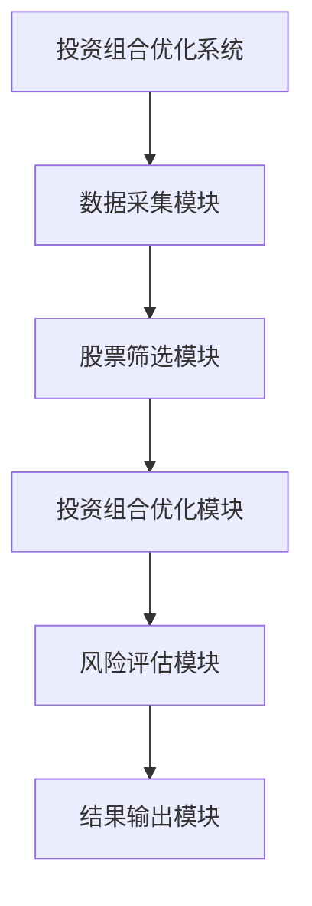

                 


# 格雷厄姆特价股票理论对现代投资组合理论的补充

> 关键词：格雷厄姆投资理论，现代投资组合理论，安全边际，内在价值，投资组合优化，价值投资

> 摘要：本文深入探讨了格雷厄姆的价值投资理论及其对现代投资组合理论的补充作用。通过分析安全边际、内在价值等核心概念，结合数学模型和实际案例，展示了如何将格雷厄姆理论与现代投资组合理论相结合，优化投资组合，降低风险，实现长期稳定收益。

---

## 第1章：格雷厄姆特价股票理论的核心概念

### 1.1 格雷厄姆投资理论的背景与起源

格雷厄姆是价值投资的鼻祖，其理论起源于20世纪初的美国经济动荡时期。他通过分析市场波动和企业基本面，提出了“安全边际”的概念，强调以低于内在价值的价格买入股票。

#### 1.1.1 价值投资的起源与发展

价值投资起源于19世纪末，但在格雷厄姆的推动下，特别是在1934年出版的《证券分析》中，该理论得到了系统化的发展。当时，经济大萧条导致市场恐慌，投资者急需稳定的投资策略，格雷厄姆的价值投资理论应运而生。

#### 1.1.2 格雷厄姆的投资理念与方法

格雷厄姆的核心理念是“买入便宜的东西”。他强调以低于内在价值的价格买入股票，通过安全边际来降低风险。他认为市场先生（Mr. Market）的情绪波动为投资者提供了低价买入优质资产的机会。

#### 1.1.3 格雷厄姆理论的核心思想与特点

- **核心思想**：投资的本质是购买企业的一部分，而非参与市场博弈。安全边际是实现长期稳定收益的关键。
- **特点**：
  - 重视企业基本面分析。
  - 强调安全边际。
  - 倾向于投资低估股票。

### 1.2 现代投资组合理论的基本框架

现代投资组合理论由哈里·马科维茨在1952年提出，强调通过分散投资来降低风险，并通过优化投资组合来实现收益与风险的最佳平衡。

#### 1.2.1 现代投资组合理论的提出与演变

马科维茨的理论奠定了现代投资学的基础，后续研究者如夏普、特雷纳等人进一步发展了资本资产定价模型（CAPM）和投资组合风险度量方法。

#### 1.2.2 马科维茨投资组合理论的核心内容

- **有效边界**：在给定风险水平下，找到收益最大的投资组合；在给定收益下，找到风险最小的投资组合。
- **分散化的优势**：通过投资不同资产或股票，降低非系统性风险。

#### 1.2.3 格雷厄姆理论与现代投资组合理论的联系与区别

- **联系**：
  - 都强调风险控制。
  - 都重视资产配置。
- **区别**：
  - 格雷厄姆注重长期价值和安全边际。
  - 现代投资组合理论注重短期市场波动和风险分散。

---

## 第2章：格雷厄姆特价股票理论的核心要素

### 2.1 安全边际的概念与计算

#### 2.1.1 安全边际的定义与作用

安全边际是指股票的市场价格低于其内在价值的部分。它为投资者提供了缓冲空间，确保在市场波动时仍能实现收益。

#### 2.1.2 安全边际的计算方法

安全边际 = 内在价值 - 市场价格

#### 2.1.3 安全边际在投资决策中的应用

投资者应选择安全边际较高的股票，以降低投资风险。

### 2.2 内在价值的评估与分析

#### 2.2.1 内在价值的定义与计算公式

内在价值是基于企业基本面分析得出的合理估值。格雷厄姆常用市盈率、市净率等指标进行评估。

$$
\text{内在价值} = \frac{\text{企业未来现金流的现值}}{\text{折现率}}
$$

#### 2.2.2 格雷厄姆内在价值评估模型

格雷厄姆提出，内在价值应基于企业的盈利能力和财务状况进行评估。

#### 2.2.3 内在价值评估中的关键因素分析

- 盈利能力（ROE、净利率）。
- 财务状况（资产负债率、流动比率）。
- 行业地位。

### 2.3 低估股票的识别与筛选

#### 2.3.1 低估股票的定义与特征

低估股票是指市场价格低于内在价值的股票。

#### 2.3.2 低估股票的筛选标准与方法

- 市盈率低于行业平均水平。
- 市净率低于行业平均水平。

#### 2.3.3 低估股票与投资组合构建的关系

低估股票是构建价值投资组合的核心资产。

---

## 第3章：格雷厄姆理论与现代投资组合理论的联系

### 3.1 格雷厄姆理论对现代投资组合理论的补充作用

#### 3.1.1 格雷厄姆理论在风险控制中的应用

通过安全边际降低投资组合的整体风险。

#### 3.1.2 格雷厄姆理论在资产配置中的作用

注重长期价值，减少短期波动对投资组合的影响。

#### 3.1.3 格雷厄姆理论对投资组合稳定性的贡献

通过选择低估股票，提升投资组合的稳定性。

### 3.2 格雷厄姆理论与现代投资组合理论的对比分析

#### 3.2.1 格雷厄姆理论与现代投资组合理论的核心差异

- 格雷厄姆注重长期价值和安全边际。
- 现代投资组合理论注重短期波动和风险分散。

#### 3.2.2 两者的共同点与互补性

- 共同点：都强调风险控制和资产配置。
- 互补性：格雷厄姆理论提供长期价值视角，现代投资组合理论提供技术分析工具。

#### 3.2.3 在实际投资中的综合应用策略

结合两者的优势，构建稳健的投资组合。

---

## 第4章：格雷厄姆理论的数学模型与公式

### 4.1 内在价值计算的数学公式

$$
\text{内在价值} = \sum_{t=1}^{n} \frac{\text{现金流}_t}{(1 + r)^t}
$$

其中，\( r \) 是折现率，\( \text{现金流}_t \) 是第 \( t \) 年的现金流。

### 4.2 安全边际的数学计算与分析

$$
\text{安全边际} = \text{内在价值} - \text{市场价格}
$$

### 4.3 投资组合优化的数学模型

马科维茨的投资组合优化模型：

$$
\min_w \left( \frac{1}{2} w^T \Sigma w \right) \quad \text{subject to} \quad w^T \mu = \text{目标收益}, \quad w^T 1 = 1
$$

其中，\( w \) 是权重向量，\( \Sigma \) 是协方差矩阵，\( \mu \) 是收益向量。

---

## 第5章：格雷厄姆理论在投资组合优化中的应用

### 5.1 格雷厄姆投资策略在投资组合中的应用

#### 5.1.1 价值投资策略在投资组合中的实施步骤

1. 筛选低估股票。
2. 计算安全边际。
3. 构建投资组合。

#### 5.1.2 低估股票在投资组合中的配置比例

建议配置资产的30%-50%。

#### 5.1.3 安全边际在投资组合风险控制中的应用

通过安全边际筛选，降低投资组合的整体风险。

### 5.2 格雷厄姆理论与现代投资组合理论的结合

#### 5.2.1 结合安全边际与风险分散

通过选择低估股票并分散投资，降低整体风险。

#### 5.2.2 结合内在价值与市场趋势

利用内在价值评估，结合市场趋势进行动态调整。

---

## 附录：系统架构与代码实现

### 附录A：系统架构设计



### 附录B：Python代码实现

```python
import pandas as pd

def calculate_intrinsic_value(financials):
    # 简单示例：基于市盈率计算内在价值
    pe_ratio = financials['pe_ratio']
    industry_pe = financials['industry_pe']
    return industry_pe * pe_ratio

def calculate_margin_of_safety(intrinsic_value, market_price):
    return intrinsic_value - market_price

# 示例数据
data = {
    'pe_ratio': 12,
    'industry_pe': 10,
    'market_price': 50
}

iv = calculate_intrinsic_value(data)
mos = calculate_margin_of_safety(iv, data['market_price'])
print(f"内在价值: {iv}, 安全边际: {mos}")
```

---

## 总结与展望

本文通过分析格雷厄姆的价值投资理论，探讨了其对现代投资组合理论的补充作用。通过结合安全边际、内在价值等核心概念，优化投资组合，降低风险。未来的研究可以进一步探索两者在不同市场环境下的应用效果。

--- 

**致谢**：感谢读者的耐心阅读，希望本文能为投资组合优化提供新的视角和思路。

