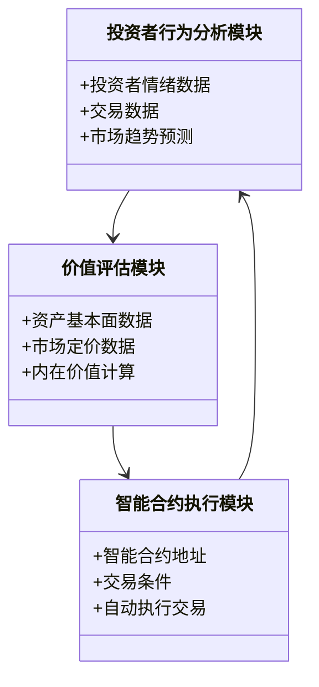
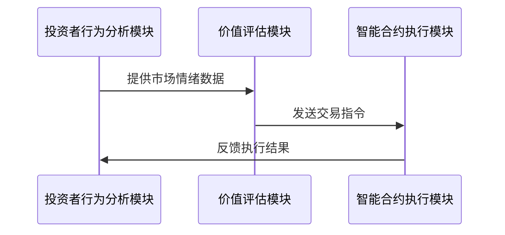

                 


# 格雷厄姆特价股票理论对行为经济学的Web3.0补充

> 关键词：格雷厄姆投资理论，行为经济学，Web3.0，区块链，智能合约，价值投资

> 摘要：本文系统地探讨了格雷厄姆的特价股票理论如何通过行为经济学的视角，在Web3.0环境下得到新的补充和应用。文章从基础理论出发，结合行为经济学与Web3.0技术，构建了一个融合价值评估、投资者行为分析和去中心化金融的综合体系，最终通过具体案例和系统设计展示了这一理论的创新与实践价值。

---

## 第1章: 格雷厄姆特价股票理论概述

### 1.1 格雷厄姆投资理论的核心概念

#### 1.1.1 价值投资的基本原理

- **定义**：价值投资是一种以内在价值为导向的投资策略，强调以低于内在价值的价格购买优质资产。
- **核心观点**：
  - 市场价格与内在价值的分离为投资提供了机会。
  - 投资者应关注企业的基本面，而非市场的短期波动。
- **数学模型**：
  $$ V = \text{企业未来现金流的现值} $$
  其中，V是企业的内在价值，现金流通过折现率（反映风险）计算。

#### 1.1.2 特价股票的定义与特征

- **定义**：特价股票是指市场价格显著低于其内在价值的股票。
- **特征**：
  - 价格低估：市场未能充分反映企业的实际价值。
  - 低估值的原因：市场恐慌、信息不对称或投资者情绪影响。
- **案例**：2008年金融危机期间，某些优质银行股的市场价格远低于其账面价值，为投资者提供了介入机会。

#### 1.1.3 格雷厄姆投资策略的历史演变

- **早期阶段**：格雷厄姆在20世纪初提出“捡烟蒂”策略，强调寻找被市场忽视的廉价股票。
- **发展与演变**：后期引入更多基本面分析指标，如市盈率（P/E）、市净率（P/B）等，以更精确地评估内在价值。
- **现代应用**：结合量化分析和大数据技术，进一步优化选股策略。

### 1.2 行为经济学基础

#### 1.2.1 行为经济学的定义与研究范围

- **定义**：行为经济学是研究人类决策行为及其在经济和金融领域中应用的交叉学科。
- **研究范围**：
  - 个体决策：消费者行为、投资决策。
  - 市场行为：价格形成、市场波动。
- **与传统经济学的区别**：
  | 传统经济学 | 行为经济学 |
  |------------|------------|
  | 假设：理性人 | 假设：有限理性 |
  | 假设：完全信息 | 假设：信息不完美 |
  | 假设：自利最大化 | 假设：情感与认知影响决策 |

#### 1.2.2 人类决策的非理性特征

- **典型偏差**：
  - 过度自信：投资者倾向于高估自己的判断能力。
  - 拇球效应：在亏损时加码，盈利时减仓。
  - 羊群效应：跟随市场趋势，忽视独立分析。
- **认知偏差对投资决策的影响**：
  $$ P = f(B, E) $$
  其中，P是市场价格，B是基本面因素，E是投资者情绪。

#### 1.2.3 行为经济学与投资决策的关系

- **互动机制**：
  - 情绪影响价格：投资者情绪波动导致市场价格偏离内在价值。
  - 价格反馈情绪：市场走势反过来影响投资者情绪。
- **案例**：2021年GameStop事件，Reddit社区的散户情绪推动股价剧烈波动，展示了非理性行为对市场的放大效应。

---

## 第2章: Web3.0技术与投资行为的变革

### 2.1 Web3.0的核心技术与特点

#### 2.1.1 区块链技术的原理与应用

- **区块链**：一种去中心化的分布式账本技术，确保数据的安全性和不可篡改性。
- **应用场景**：
  - 资产交易记录：确保交易透明可追溯。
  - 智能合约：自动执行预设条件的金融工具。

#### 2.1.2 智能合约的功能与优势

- **智能合约**：在区块链上运行的自动化程序，根据预设条件自动执行合同条款。
- **优势**：
  - 去中心化：避免传统金融中介的中间环节。
  - 自动化：减少人为干预，降低操作风险。
  - 可编程性：支持复杂的投资策略和风险管理规则。

#### 2.1.3 去中心化金融（DeFi）的概念与模式

- **DeFi**：基于区块链技术构建的去中心化金融服务，包括借贷、交易、融资等。
- **典型模式**：
  - 去中心化交易所：如Uniswap，基于智能合约实现点对点交易。
  - 去中心化借贷平台：如Aave，利用智能合约自动处理抵押和借还流程。

### 2.2 Web3.0对投资行为的影响

#### 2.2.1 投资者行为的数字化与透明化

- **数据驱动决策**：
  - 利用区块链数据实时追踪市场参与者的行为。
  - 通过大数据分析识别市场趋势和潜在机会。
- **案例**：利用智能合约分析DeFi平台的流动性挖矿行为，识别市场泡沫和风险。

#### 2.2.2 去中心化对市场信息的影响

- **信息对称性提升**：
  - 区块链的透明性减少了信息不对称，提高了市场效率。
  - 智能合约的可编程性允许投资者根据实时数据调整策略。
- **挑战**：
  - 数据隐私问题：如何在保证透明性的同时保护隐私。
  - 技术复杂性：普通投资者难以理解区块链技术的细节。

#### 2.2.3 Web3.0环境下的新型投资工具

- **NFT投资**：非同质化代币成为新的资产类别，投资者可以投资于数字艺术品、虚拟土地等。
- **DeFi协议**：通过参与DeFi协议，投资者可以赚取流动性收益或参与治理。

---

## 第3章: 格雷厄姆理论与行为经济学在Web3.0中的应用

### 3.1 格雷厄姆理论在Web3.0环境下的适应性

#### 3.1.1 价值评估的数字化与自动化

- **数字资产评估**：
  - 利用区块链技术评估NFT的内在价值，考虑其流动性、市场需求和创作者声誉等因素。
  - 通过智能合约自动计算和更新价值评估模型。
- **案例**：某NFT项目通过智能合约自动调整其价格，根据市场需求和持有者数量进行动态定价。

#### 3.1.2 智能合约在价值投资中的作用

- **自动化投资策略**：
  - 设置智能合约在特定条件下自动执行交易，如当某个资产的价格低于其评估价值时自动买入。
  - 根据市场波动自动调整投资组合，减少人为干预。
- **风险管理**：
  - 利用智能合约实时监控市场风险，如市场下跌时自动平仓或调整头寸。

#### 3.1.3 Web3.0环境下的市场周期分析

- **周期识别**：
  - 通过区块链数据分析市场周期，识别市场顶部和底部。
  - 结合行为经济学中的投资者情绪指标，预测市场的拐点。
- **案例**：2021年加密货币市场的崩盘，通过智能合约分析市场情绪和交易量，提前预警风险。

### 3.2 行为经济学在Web3.0投资中的应用

#### 3.2.1 行为数据的收集与分析

- **数据来源**：
  - 区块链交易数据：记录投资者的买卖行为。
  - 社交媒体数据：分析投资者情绪和市场舆论。
- **分析方法**：
  - 使用自然语言处理（NLP）分析社交媒体文本，提取情感指标。
  - 通过机器学习模型预测市场趋势，识别非理性行为。

#### 3.2.2 投资者心理模型的构建

- **模型构建**：
  - 利用行为经济学理论，构建投资者心理模型，模拟其决策过程。
  - 通过A/B测试验证模型的有效性。
- **应用**：
  - 根据投资者心理模型设计个性化投资策略。
  - 预测市场参与者的反应，优化投资组合。

#### 3.2.3 Web3.0环境下的风险管理

- **风险识别**：
  - 识别市场中的非理性行为，如过度杠杆、盲目跟风。
  - 监测市场参与者的行为模式，预测潜在的系统性风险。
- **风险管理工具**：
  - 利用智能合约自动执行风险管理策略，如设置止损点、动态调整杠杆率。

### 3.3 格雷厄姆理论与行为经济学的协同效应

#### 3.3.1 价值评估与投资者心理的结合

- **动态调整**：
  - 根据市场情绪和行为数据，动态调整价值评估模型。
  - 结合基本面分析和行为分析，制定更精准的投资决策。
- **案例**：某投资者利用行为数据和价值评估模型，识别出一个被市场低估的NFT项目，提前介入获得超额收益。

#### 3.3.2 市场情绪与市场定价的关系

- **互动机制**：
  - 市场情绪影响价格，价格反过来影响情绪。
  - 通过智能合约和行为分析工具，实时监控市场情绪的变化。
- **应用**：
  - 利用情绪指标预测市场走势，优化投资策略。
  - 结合情绪分析和价值评估，制定长期投资计划。

#### 3.3.3 行为因素对投资策略的影响

- **投资决策优化**：
  - 根据投资者行为数据，优化投资组合的构成。
  - 结合行为经济学理论，制定个性化的风险管理策略。
- **案例**：某投资者通过分析社交媒体数据，发现某加密货币项目存在大量炒作，选择避免投资，从而规避了随后的大幅亏损。

---

## 第4章: 系统分析与架构设计

### 4.1 问题场景介绍

- **背景**：投资者在Web3.0环境下，需要结合格雷厄姆理论和行为经济学制定投资策略。
- **挑战**：
  - 如何实时监控市场情绪和交易数据。
  - 如何自动化执行投资策略并进行风险控制。
- **目标**：构建一个基于Web3.0的智能化投资系统，整合格雷厄姆理论和行为经济学的分析方法。

### 4.2 系统功能设计

#### 4.2.1 领域模型设计



#### 4.2.2 系统架构设计


### 4.3 系统接口设计

- **接口1**：投资者行为分析模块与价值评估模块之间的数据交互。
- **接口2**：价值评估模块与智能合约执行模块之间的指令传递。
- **接口3**：智能合约执行模块与外部市场的数据同步。

### 4.4 系统交互流程



---

## 第5章: 项目实战

### 5.1 环境安装

- **工具**：
  - 区块链开发环境：如Solidity、Web3.js。
  - 数据分析工具：Python、Pandas、Scikit-learn。
  - 可视化工具：Matplotlib、Seaborn。

### 5.2 核心实现

#### 5.2.1 智能合约开发

```solidity
// SPDX-License-Identifier: MIT
pragma solidity ^0.8.0;

contract PriceMonitor {
    uint256 public targetPrice;
    address payable public owner;

    constructor(uint256 _targetPrice) {
        targetPrice = _targetPrice;
        owner = payable(msg.sender);
    }

    function checkPrice() public view returns (bool) {
        return msg.sender == owner;
    }

    function executeTrade() external payable {
        require(checkPrice(), "Unauthorized");
        // 执行交易逻辑
    }
}
```

#### 5.2.2 行为数据分析

```python
import pandas as pd
from sklearn.model_selection import train_test_split
from sklearn.metrics import accuracy_score

# 加载数据
data = pd.read_csv('behavior.csv')
X = data[['情绪指标', '交易量']]
y = data['价格变动']

# 划分训练集和测试集
X_train, X_test, y_train, y_test = train_test_split(X, y, test_size=0.2)

# 训练模型
from sklearn.tree import DecisionTreeClassifier
model = DecisionTreeClassifier()
model.fit(X_train, y_train)

# 预测和评估
y_pred = model.predict(X_test)
print(accuracy_score(y_test, y_pred))
```

### 5.3 案例分析

#### 5.3.1 案例选择

- **案例1**：某NFT项目的市场情绪分析与价格预测。
- **案例2**：某DeFi平台的流动性挖矿行为分析。

#### 5.3.2 实施过程

- **数据收集**：从区块链和社交媒体获取相关数据。
- **模型训练**：使用机器学习模型进行预测和分析。
- **策略执行**：通过智能合约自动执行交易策略。

### 5.4 小结

- **成功经验**：
  - 通过智能合约实现了自动化交易，提高了投资效率。
  - 行为数据分析帮助识别市场趋势，降低了投资风险。
- **改进建议**：
  - 进一步优化模型，提高预测精度。
  - 增强系统的可解释性，便于投资者理解。

---

## 第6章: 最佳实践与展望

### 6.1 最佳实践

#### 6.1.1 投资者行为分析

- **建议**：结合市场情绪和基本面分析，制定综合投资策略。
- **工具**：使用NLP和机器学习技术分析社交媒体数据。

#### 6.1.2 价值评估模型

- **建议**：动态调整模型参数，适应市场变化。
- **工具**：利用区块链技术实现模型的实时更新和优化。

#### 6.1.3 智能合约设计

- **建议**：确保合约的安全性和可扩展性。
- **工具**：使用形式化验证工具检查合约逻辑。

### 6.2 小结

- **总结**：本文通过将格雷厄姆理论与行为经济学相结合，并引入Web3.0技术，构建了一个创新的投资分析框架。
- **展望**：未来的研究可以进一步探索更多应用场景，如去中心化自治组织（DAO）的投资决策、元宇宙中的资产定价等。

---

## 第7章: 结论

### 7.1 核心观点回顾

- 格雷厄姆的特价股票理论在Web3.0环境下通过行为经济学的视角得到了新的补充。
- 区块链技术和智能合约的应用为投资行为的分析和管理提供了新的工具和方法。
- 结合价值评估、投资者行为分析和去中心化金融，构建了一个更加智能化和动态化的投资体系。

### 7.2 未来研究方向

- **技术层面**：进一步研究区块链技术在投资分析中的应用，如利用零知识证明保护数据隐私。
- **理论层面**：探索行为经济学与Web3.0技术的更多结合点，如去中心化环境下的群体决策模型。
- **实践层面**：开发更多基于Web3.0的投资工具和平台，帮助投资者更好地应用这些理论和方法。

---

## 参考文献

（此处列出相关文献和资源，如书籍、学术论文、技术文档等。）

---

通过以上目录结构和内容安排，文章系统地探讨了格雷厄姆特价股票理论与行为经济学在Web3.0环境下的结合，既有理论分析，又有实践指导，为投资者提供了新的思路和方法。

