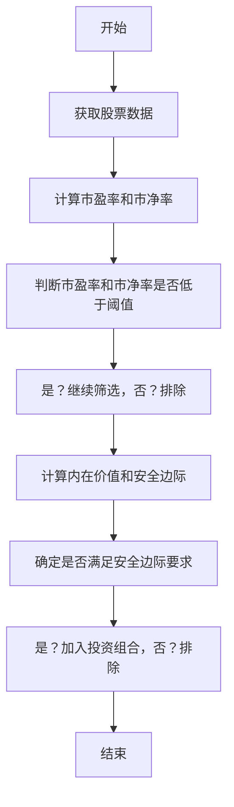
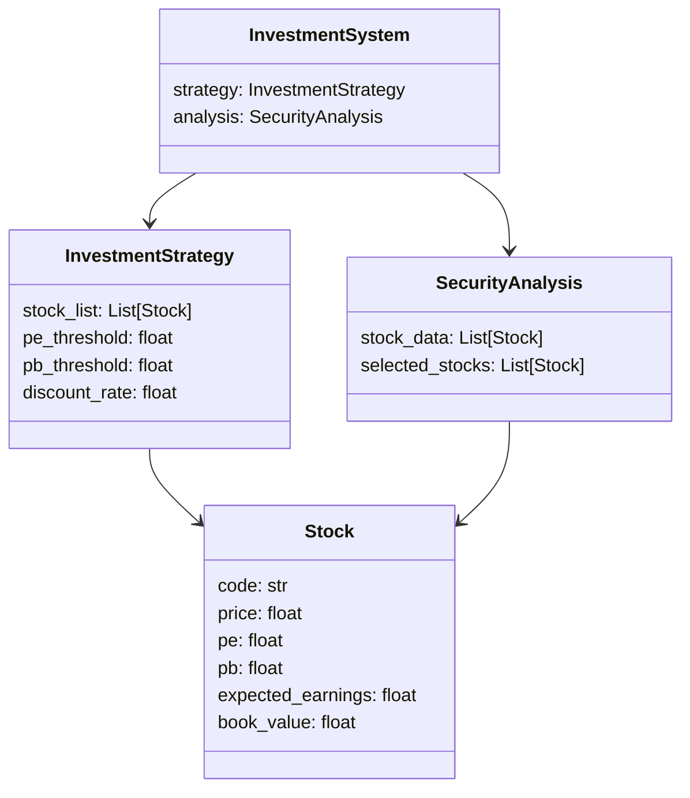

                 


# 格雷厄姆特价股票理论对金融普惠的启示

> 关键词：格雷厄姆投资理论、特价股票、金融普惠、价值投资、安全边际、股票筛选、投资策略

> 摘要：本文深入探讨了格雷厄姆的价值投资理论，特别是其特价股票理论，及其对金融普惠的启示。通过分析格雷厄姆的投资理念，结合数学模型和算法，展示了如何通过特价股票实现金融普惠。文章从理论基础、算法实现、系统架构到实际案例，全面阐述了格雷厄姆理论的应用及其对中小投资者的启示。

---

# 第一部分：格雷厄姆特价股票理论基础

## 第1章：证券市场与投资概述

### 1.1 证券市场的基本概念

#### 1.1.1 证券市场的定义与分类
证券市场是资金流动的重要场所，分为一级市场和二级市场。一级市场是新证券发行市场，二级市场是已发行证券的交易市场。证券市场的主要参与者包括投资者、上市公司、券商、交易所等。

#### 1.1.2 股票市场的功能与作用
股票市场为公司融资提供了渠道，也为投资者提供了投资机会。它通过价格机制实现资源的优化配置，同时为经济发展提供了资金支持。

#### 1.1.3 投资者类型与市场参与
投资者分为机构投资者和个人投资者。机构投资者包括基金、保险公司、券商等，而个人投资者包括散户和高净值客户。不同类型的投资者在市场中的行为和策略有所不同。

### 1.2 投资的基本原理

#### 1.2.1 资产定价理论
资产定价理论试图解释资产价格的决定因素，主要包括内在价值、市场情绪、流动性等因素。资产的内在价值是其未来现金流的现值，而市场价格则反映了市场参与者的预期。

#### 1.2.2 风险与收益的关系
投资中的风险与收益成正比。高风险的资产通常有较高的预期收益，而低风险的资产则预期收益较低。投资者需要在风险和收益之间找到平衡点。

#### 1.2.3 投资组合理论
通过分散投资可以降低风险，这是投资组合理论的核心思想。合理的资产配置能够降低非系统性风险，提高投资组合的整体收益。

## 第2章：格雷厄姆投资理论的核心理念

### 2.1 价值投资的基本原则

#### 2.1.1 安全边际的概念
安全边际是格雷厄姆理论的核心，指的是买入价格与内在价值之间的差距。通过安全边际，投资者可以在市场价格波动时保护自己，避免因市场情绪影响决策。

#### 2.1.2 买入价格低于内在价值
格雷厄姆强调以低于内在价值的价格买入股票。他认为，市场先生（Market先生）的情绪波动为理性投资者提供了廉价买入的机会。

#### 2.1.3 长期投资的重要性
格雷厄姆主张长期投资，避免频繁交易。他认为，短期市场的波动性使得频繁交易难以获得稳定的收益。

### 2.2 格雷厄姆的选股标准

#### 2.2.1 低市盈率股票
市盈率（P/E）=股价/每股收益。格雷厄姆倾向于选择市盈率低于某个阈值的股票，认为这些股票可能被市场低估。

#### 2.2.2 低市净率股票
市净率（P/B）=股价/每股净资产。格雷厄姆认为，市净率低于一定倍数的股票具有较高的投资价值。

#### 2.2.3 高股息率股票
股息率=每股股息/股价。格雷厄姆重视股息的稳定性，认为高股息率的股票具有较高的投资价值。

## 第3章：特价股票的定义与特征

### 3.1 特价股票的定义

#### 3.1.1 特价股票的内涵
特价股票是指那些市场价格低于内在价值的股票。这些股票通常被市场忽视或低估，具有较大的上涨潜力。

#### 3.1.2 特价股票的外延
特价股票不仅包括低价股票，还包括那些基本面良好但市场关注度低的股票。这些股票可能因为行业周期或其他因素而被市场低估。

### 3.2 特价股票的特征

#### 3.2.1 价格低于内在价值
特价股票的市场价格通常低于其内在价值，为投资者提供了安全边际。

#### 3.2.2 市场关注度低
这些股票往往不受市场关注，交易量低，波动性小，为长期投资者提供了较好的投资环境。

#### 3.2.3 具备长期增长潜力
尽管当前价格被低估，但这些股票所在的行业或公司具有长期增长潜力，能够为投资者带来稳定收益。

## 第4章：格雷厄姆理论与金融普惠的联系

### 4.1 金融普惠的概念

#### 4.1.1 金融普惠的定义
金融普惠是指让所有人都能以可负担的成本获得必要的金融服务，包括储蓄、信贷、投资等。它强调金融服务的普及性和可及性，旨在缩小金融鸿沟。

#### 4.1.2 金融普惠的目标
金融普惠的目标是实现金融资源的公平分配，促进经济发展和社会稳定。它不仅关注个人，还关注中小企业和欠发达地区的金融需求。

#### 4.1.3 金融普惠的意义
金融普惠有助于促进经济发展，提高个人和企业的财务稳定性，减少贫困和不平等。

### 4.2 格雷厄姆理论在普惠金融中的应用

#### 4.2.1 通过低价股票实现普惠投资
格雷厄姆的特价股票理论为普惠金融提供了新的思路。通过投资低价股票，中小投资者可以以较低的成本参与股市，实现资产增值。

#### 4.2.2 降低投资门槛
格雷厄姆的理论强调分散投资和长期持有，这降低了投资的门槛。中小投资者可以通过投资多个低价股票，构建一个分散的投资组合。

#### 4.2.3 提高中小投资者的收益
通过格雷厄姆的选股标准，中小投资者可以发现被低估的股票，获得较高的投资收益。这种投资策略不仅适合机构投资者，也适合个人投资者。

---

# 第二部分：格雷厄姆特价股票理论的数学模型与算法

## 第5章：格雷厄姆选股模型的数学分析

### 5.1 格雷厄姆选股模型的公式

#### 5.1.1 内在价值的计算公式
格雷厄姆的内在价值计算公式为：
$$ V = \frac{E}{1 + r} $$
其中，$V$ 表示内在价值，$E$ 是未来预期收益，$r$ 是折现率。

#### 5.1.2 安全边际的计算公式
安全边际的计算公式为：
$$ \text{安全边际} = V - P $$
其中，$V$ 是内在价值，$P$ 是市场价格。安全边际越大，投资的安全性越高。

### 5.2 格雷厄姆选股模型的算法实现

#### 5.2.1 算法流程图
以下是格雷厄姆选股模型的流程图：



#### 5.2.2 Python代码实现

以下是实现格雷厄姆选股模型的Python代码：

```python
import pandas as pd

def calculate_intrinsic_value(company_data, discount_rate):
    """
    计算公司的内在价值
    :param company_data: 包含预期收益和账面价值的数据
    :param discount_rate: 折现率
    :return: 内在价值
    """
    expected_earnings = company_data['expected_earnings']
    book_value = company_data['book_value']
    intrinsic_value = (expected_earnings + book_value) / (1 + discount_rate)
    return intrinsic_value

def greaham_stock_screening(stock_list, pe_threshold, pb_threshold, discount_rate):
    """
    格雷厄姆股票筛选
    :param stock_list: 股票列表，包含股票代码、市盈率、市净率、预期收益和账面价值
    :param pe_threshold: 市盈率阈值
    :param pb_threshold: 市净率阈值
    :param discount_rate: 折现率
    :return: 筛选出符合条件的股票列表
    """
    selected_stocks = []
    for stock in stock_list:
        # 计算内在价值
        iv = calculate_intrinsic_value(stock['data'], discount_rate)
        # 计算安全边际
        margin_of_safety = iv - stock['price']
        # 判断是否满足条件
        if stock['pe'] < pe_threshold and stock['pb'] < pb_threshold and margin_of_safety > 0:
            selected_stocks.append(stock)
    return selected_stocks
```

---

## 第6章：格雷厄姆投资理论的系统分析与架构设计

### 6.1 系统功能设计

#### 6.1.1 领域模型
以下是领域模型的Mermaid类图：



#### 6.1.2 系统架构
以下是系统架构的Mermaid图：

```mermaid
container InvestmentSystem {
    Service Layer
    {
        Service Layer --> InvestmentStrategy
        Service Layer --> SecurityAnalysis
    }
    Data Layer
    {
        Data Layer --> Stock Database
    }
    User Interface
    {
        User Interface --> Service Layer
    }
}
```

---

## 第7章：项目实战与案例分析

### 7.1 环境安装

#### 7.1.1 安装Python和相关库
```bash
pip install pandas numpy matplotlib
```

### 7.2 核心实现

#### 7.2.1 代码实现
```python
import pandas as pd

def main():
    # 数据加载
    stock_data = pd.read_csv('stocks.csv')
    # 筛选条件
    pe_threshold = 15
    pb_threshold = 2
    discount_rate = 0.1
    # 股票筛选
    selected_stocks = greaham_stock_screening(stock_data, pe_threshold, pb_threshold, discount_rate)
    # 输出结果
    print("筛选出的股票：", selected_stocks)

if __name__ == "__main__":
    main()
```

### 7.3 案例分析

#### 7.3.1 数据来源
假设我们从某个股票数据库中获取了以下股票数据：

| 股票代码 | 市盈率 | 市净率 | 价格 | 预期收益 | 账面价值 |
|----------|--------|--------|------|----------|----------|
| A        | 14     | 1.8    | 10   | 5        | 5        |
| B        | 16     | 2.0    | 12   | 6        | 6        |
| C        | 10     | 1.5    | 8    | 4        | 4        |

#### 7.3.2 筛选过程
根据格雷厄姆的选股标准，我们设定市盈率阈值为15，市净率阈值为2，折现率为10%。

股票A的市盈率为14，小于15；市净率为1.8，小于2；预期收益为5，账面价值为5，折现后内在价值为：
$$ V_A = \frac{5 + 5}{1 + 0.1} = \frac{10}{1.1} \approx 9.09 $$
安全边际为：
$$ \text{安全边际}_A = 9.09 - 10 = -0.91 $$
由于安全边际为负，股票A不符合筛选条件。

股票B的市盈率为16，大于15，不符合筛选条件。

股票C的市盈率为10，小于15；市净率为1.5，小于2；预期收益为4，账面价值为4，折现后内在价值为：
$$ V_C = \frac{4 + 4}{1 + 0.1} = \frac{8}{1.1} \approx 7.27 $$
安全边际为：
$$ \text{安全边际}_C = 7.27 - 8 = -0.73 $$
由于安全边际为负，股票C也不符合筛选条件。

#### 7.3.3 结论
在本案例中，没有股票符合格雷厄姆的选股标准。这可能意味着当前市场中没有被低估的股票，或者筛选条件需要调整。

---

## 第8章：最佳实践与总结

### 8.1 投资建议

#### 8.1.1 长期投资
格雷厄姆强调长期投资，避免短期市场的波动影响决策。投资者应保持耐心，坚持价值投资的理念。

#### 8.1.2 分散投资
通过分散投资可以降低风险，避免将所有资金投入单一股票或行业。格雷厄姆的理论也为分散投资提供了依据。

#### 8.1.3 定期调整
尽管强调长期投资，但定期检查投资组合的表现和市场环境仍有必要。根据市场变化调整投资策略，以保持投资组合的健康。

### 8.2 注意事项

#### 8.2.1 市场波动
市场波动是不可避免的，投资者应具备心理承受能力，避免因短期波动而做出错误决策。

#### 8.2.2 数据质量
数据的准确性和完整性对投资决策至关重要。投资者应选择可靠的 数据源，并确保数据的及时更新。

#### 8.2.3 税费和交易成本
税费和交易成本会影响最终收益，投资者应尽量减少不必要的交易，降低投资成本。

### 8.3 拓展阅读

#### 8.3.1 格雷厄姆的经典著作
- 《证券分析》
- 《聪明的投资者》

#### 8.3.2 价值投资的相关书籍
- 彼得·林奇的《战胜市场的投资者》
- 约翰·邓普顿的《投资的成功公式》

#### 8.3.3 金融普惠的研究论文
- 世界银行关于金融普惠的研究报告
- 其他学者关于金融普惠的学术论文

---

# 结语

格雷厄姆的特价股票理论为金融普惠提供了新的思路。通过价值投资，中小投资者可以以较低的成本参与股市，实现资产增值。本文从理论到实践，详细阐述了格雷厄姆理论的应用及其对金融普惠的启示。希望本文能够为投资者和金融从业者提供有益的参考和启示。

---

**附录**

- 本文所有代码和数据均以示例形式呈现，实际投资需结合实时数据和市场环境进行综合判断。
- 本文的数学公式和流程图均为简化示例，实际应用中需根据具体情况调整。

---

