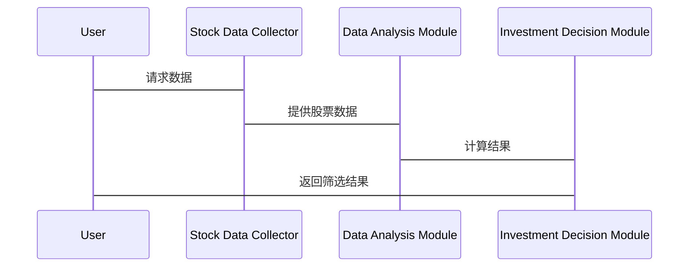

                 


# 《格雷厄姆特价股票理论对金融科技的启示》

## 关键词：格雷厄姆、股票理论、金融科技、价值投资、算法、数据分析

## 摘要：格雷厄姆的价值投资理论强调安全边际和内在价值，为金融科技的发展提供了深刻的启示。本文从理论背景、核心概念、数学模型、系统设计、项目实战等多个角度，详细探讨了格雷厄姆理论如何在金融科技中应用，特别是在算法和数据分析领域的创新，为投资者和科技从业者提供了新的视角和方法。

---

## 第一章: 格雷厄姆特价股票理论的背景与核心概念

### 1.1 格雷厄姆投资理论的起源与发展

#### 1.1.1 价值投资的起源
- 价值投资起源于20世纪初，本杰明·格雷厄姆是这一理论的奠基人。
- 格雷厄姆在1934年出版的《证券分析》一书中首次系统阐述了价值投资的理念。

#### 1.1.2 格雷厄姆的学术贡献
- 格雷厄姆是哥伦比亚大学商学院的教授，培养了包括沃伦·巴菲特在内的众多投资大师。
- 他提出了“安全边际”和“内在价值”等核心概念，为价值投资奠定了理论基础。

#### 1.1.3 格雷厄姆理论的核心思想
- 投资的本质是购买企业的一部分，而非参与市场波动。
- 通过分析企业的基本面，寻找市场价格低于内在价值的股票。

### 1.2 特价股票的定义与特征

#### 1.2.1 特价股票的定义
- 特价股票是指市场价格显著低于其内在价值的股票。
- 这种股票通常被认为具有较高的投资安全边际。

#### 1.2.2 特价股票的市场特征
- 市场价格与内在价值的差异较大。
- 股票通常处于低估状态，可能由于市场情绪或短期因素导致。

#### 1.2.3 特价股票与非特价股票的对比
| 特性 | 特价股票 | 非特价股票 |
|------|----------|-------------|
| 市场价格 | 低于内在价值 | 接近或高于内在价值 |
| 投资风险 | 较低 | 较高 |
| 投资回报 | 预期较高 | 预期较低 |

### 1.3 格雷厄姆理论的核心要素

#### 1.3.1 安全边际的概念
- 安全边际是指市场价格与内在价值之间的差距。
- 通过计算安全边际，投资者可以评估投资的风险和潜在回报。

#### 1.3.2 内在价值的计算
- 内在价值是基于企业基本面的估值，包括盈利能力、资产价值等因素。
- 格雷厄姆提出了多种估值方法，如市盈率、市净率等。

#### 1.3.3 市场情绪与股票定价
- 市场情绪会影响股票价格，但长期来看，价格会回归内在价值。
- 格雷厄姆强调投资者应避免被市场情绪左右，坚持基本面分析。

---

## 第二章: 格雷厄姆理论在金融科技中的应用前景

### 2.1 金融科技的定义与发展

#### 2.1.1 金融科技的定义
- 金融科技（FinTech）是指利用技术创新来改善传统金融服务的效率和体验。
- 包括支付、借贷、投资、保险等多个领域。

#### 2.1.2 金融科技的发展历程
- 从传统的金融服务到互联网金融，再到现在的区块链、人工智能等技术驱动的金融创新。

#### 2.1.3 金融科技的核心技术
- 大数据、人工智能、区块链、云计算等技术在金融领域的应用。

### 2.2 格雷厄姆理论与金融科技的结合

#### 2.2.1 数据驱动的投资决策
- 利用大数据技术分析股票的内在价值和市场情绪。
- 通过数据挖掘发现潜在的特价股票。

#### 2.2.2 人工智能在股票分析中的应用
- 使用机器学习模型预测股票价格和识别价值低估的股票。
- 人工智能可以快速处理大量数据，辅助投资者做出决策。

#### 2.2.3 区块链技术对股票市场的潜在影响
- 区块链技术可以提高交易的透明度和效率。
- 通过智能合约实现自动化的价值评估和交易。

### 2.3 金融科技对格雷厄姆理论的创新

#### 2.3.1 数据挖掘与股票筛选
- 利用数据挖掘技术从海量数据中筛选出具有安全边际的股票。
- 通过算法优化股票筛选过程，提高效率和准确性。

#### 2.3.2 机器学习在价值评估中的应用
- 使用回归分析和聚类分析等机器学习方法评估股票的内在价值。
- 通过模型预测股票价格的变化趋势。

#### 2.3.3 分布式金融对传统投资理论的挑战
- 分布式金融（DeFi）通过去中心化的方式重新定义金融服务。
- 金融科技的发展正在改变传统的价值投资模式，提供新的投资机会。

---

## 第三章: 格雷厄姆理论的核心原理

### 3.1 安全边际的数学模型

#### 3.1.1 安全边际的定义
- 安全边际 = 内在价值 - 市场价格

#### 3.1.2 安全边际的计算公式
$$ \text{安全边际} = \text{内在价值} - \text{市场价格} $$

#### 3.1.3 安全边际与股票价格的关系
- 当安全边际为正时，股票具有投资价值。
- 当安全边际为负时，股票价格可能被高估。

### 3.2 内在价值的计算方法

#### 3.2.1 内在价值的定义
- 内在价值是基于企业基本面的估值，不考虑市场情绪。

#### 3.2.2 内在价值的计算公式
$$ \text{内在价值} = \frac{\text{净利润}}{\text{资本成本} - \text{增长率}} $$

#### 3.2.3 内在价值与市场价格的对比
- 如果市场价格低于内在价值，股票具有投资价值。
- 如果市场价格高于内在价值，股票可能被高估。

### 3.3 市场情绪与股票定价的关系

#### 3.3.1 市场情绪的定义
- 市场情绪是投资者对市场的看法和预期，影响股票价格的波动。

#### 3.3.2 市场情绪与股票定价的关系
- 市场情绪会影响短期价格波动，但长期价格回归内在价值。

---

## 第四章: 格雷厄姆理论在金融科技中的算法实现

### 4.1 数据驱动的股票筛选算法

#### 4.1.1 数据来源
- 股票的历史数据，包括价格、成交量、财务指标等。

#### 4.1.2 算法步骤
1. 数据清洗与预处理
2. 计算内在价值
3. 计算安全边际
4. 筛选出安全边际为正的股票

#### 4.1.3 代码实现
```python
import pandas as pd
import numpy as np

# 假设data为包含股票数据的DataFrame
# 包含columns：'price', 'net_profit', 'market_value'

# 计算内在价值
data['intrinsic_value'] = data['net_profit'] / (0.1 - 0.05)  # 假设资本成本为10%，增长率5%
# 计算安全边际
data['margin_of_safety'] = data['intrinsic_value'] - data['price']
# 筛选出安全边际为正的股票
cheap_stocks = data[data['margin_of_safety'] > 0]
```

### 4.2 机器学习在股票分析中的应用

#### 4.2.1 数据准备
- 收集股票的历史价格、财务数据、市场情绪等。

#### 4.2.2 模型训练
- 使用回归模型预测股票价格
- 使用聚类模型识别价值低估的股票

#### 4.2.3 模型实现
```python
from sklearn.linear_model import LinearRegression
from sklearn.metrics import mean_squared_error

# 训练回归模型
model = LinearRegression()
model.fit(X_train, y_train)

# 预测股票价格
y_pred = model.predict(X_test)

# 评估模型性能
mse = mean_squared_error(y_test, y_pred)
print('均方误差:', mse)
```

### 4.3 区块链技术在股票交易中的应用

#### 4.3.1 区块链技术的特点
- 去中心化、不可篡改、透明性。

#### 4.3.2 区块链在股票交易中的应用
- 实现智能合约，自动执行交易。
- 提高交易透明度和效率。

#### 4.3.3 区块链实现
```python
# 智能合约示例
def buy_stock(from_address, to_address, amount):
    transfer(from_address, to_address, amount)
    update_stock_owner(to_address)
```

---

## 第五章: 系统分析与架构设计方案

### 5.1 问题场景介绍
- 投资者希望通过系统筛选出具有安全边际的股票。
- 系统需要结合格雷厄姆理论和金融科技技术。

### 5.2 系统功能设计
- 数据采集模块：收集股票数据、财务数据等。
- 数据分析模块：计算内在价值和安全边际。
- 投资决策模块：筛选出具有安全边际的股票。

### 5.3 系统架构设计


### 5.4 系统接口设计
- 数据接口：与数据源对接，获取股票数据。
- 用户接口：提供用户查询和筛选功能。

### 5.5 系统交互设计


---

## 第六章: 项目实战

### 6.1 环境安装
- 安装Python和相关库（pandas、numpy、scikit-learn等）。

### 6.2 系统核心实现源代码
```python
import pandas as pd
import numpy as np

# 数据采集
data = pd.read_csv('stock_data.csv')

# 数据分析
data['intrinsic_value'] = data['net_profit'] / (0.1 - 0.05)
data['margin_of_safety'] = data['intrinsic_value'] - data['price']

# 筛选出具有安全边际的股票
cheap_stocks = data[data['margin_of_safety'] > 0]
print(cheap_stocks)
```

### 6.3 代码应用解读与分析
- 数据采集模块：读取股票数据文件。
- 数据分析模块：计算内在价值和安全边际。
- 筛选模块：输出具有安全边际的股票列表。

### 6.4 实际案例分析
- 以某只股票为例，展示如何通过代码筛选出具有安全边际的股票。

### 6.5 项目小结
- 通过项目实战，验证了格雷厄姆理论在金融科技中的应用可行性。
- 提供了具体的代码实现和应用案例。

---

## 第七章: 总结与展望

### 7.1 核心总结
- 格雷厄姆的价值投资理论为金融科技的发展提供了重要的理论基础。
- 通过结合金融科技技术，可以进一步提升投资决策的科学性和效率。

### 7.2 投资者与科技从业者的启示
- 投资者应关注金融科技的发展，利用新技术提升投资能力。
- 科技从业者应深入理解金融理论，开发出更有效的金融科技解决方案。

### 7.3 未来展望
- 随着人工智能和区块链技术的发展，格雷厄姆理论的应用将更加广泛和深入。
- 金融科技将继续推动金融行业的创新和变革。

---

## 第八章: 最佳实践与注意事项

### 8.1 投资策略建议
- 结合格雷厄姆理论和金融科技技术，制定科学的投资策略。
- 定期评估和调整投资组合。

### 8.2 风险提示
- 市场波动和政策变化可能影响投资结果。
- 技术缺陷和数据质量问题可能影响模型的准确性。

### 8.3 学习与成长
- 持续学习金融理论和金融科技技术，提升自身的专业能力。
- 关注行业动态，抓住金融科技带来的投资机会。

---

## 第九章: 拓展阅读与进一步学习

### 9.1 推荐书籍
- 《证券分析》——本杰明·格雷厄姆
- 《穷爸爸富爸爸》——罗伯特·清崎
- 《机器学习实战》——亚当·沙维奇

### 9.2 在线课程与资源
- Coursera上的金融分析课程。
- edX上的区块链技术课程。

### 9.3 行业报告与白皮书
- 金融科技行业报告。
- 区块链在金融领域的应用白皮书。

---

## 结语

格雷厄姆的价值投资理论为金融科技的发展提供了重要的理论基础，而金融科技技术则为格雷厄姆理论的实践应用提供了新的可能性。通过结合两者的优势，投资者和科技从业者可以共同推动金融行业的创新和发展，实现更高效、更科学的投资决策。

