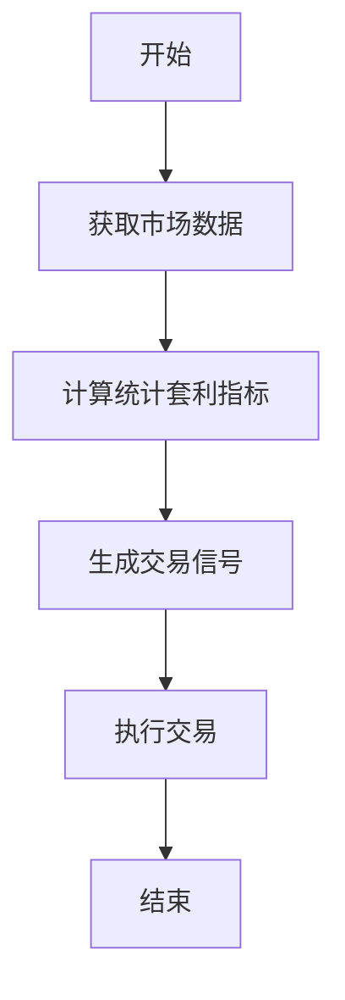

                 


# 格雷厄姆特价股票理论对高频算法交易的影响

> 关键词：格雷厄姆投资理论、高频交易、算法交易、价值投资、统计套利

> 摘要：本文探讨了本杰明·格雷厄姆的价值投资理论，特别是其特价股票策略，如何影响现代高频算法交易。文章从理论背景、数学模型、系统架构、项目实战等多角度分析，揭示了传统投资理念与现代技术的结合，及其对金融市场的深远影响。

---

# 第1章 格雷厄姆投资理论概述

## 1.1 格雷厄姆投资理念的起源与发展

### 1.1.1 价值投资的起源与发展

价值投资是一种以基本面分析为基础的投资策略，其核心在于识别市场中被低估的资产。本杰明·格雷厄姆作为价值投资的奠基人，提出了“安全边际”和“内在价值”等关键概念，为投资者提供了评估股票价值的框架。格雷厄姆的方法强调通过分析财务报表、市盈率、市净率等指标，寻找市场价格低于内在价值的股票。

### 1.1.2 格雷厄姆的“安全边际”概念

格雷厄姆的安全边际概念是指在购买股票时，确保市场价格远低于其内在价值，从而降低投资风险。这种策略要求投资者具有耐心，并在市场恐慌时寻找机会。

### 1.1.3 特价股票的定义与筛选标准

格雷厄姆定义的特价股票是市场价格显著低于其内在价值的股票。他提出了一套筛选标准，包括低市盈率、低市净率、高股息率等，以识别这些股票。

## 1.2 格雷厄姆投资策略的核心要素

### 1.2.1 股票内在价值的计算方法

格雷厄姆的内在价值计算基于企业的基本面数据，如净利润、现金流等。他提出了著名的“格雷厄姆公式”，用于估算股票的合理价值。

$$内在价值 = \frac{E}{P}$$

其中，E为每股收益，P为市盈率。

### 1.2.2 市场价格与内在价值的偏离

格雷厄姆强调市场情绪的波动会导致市场价格偏离内在价值。他建议投资者在市场低估时买入，在高估时卖出。

### 1.2.3 投资组合构建与风险管理

格雷厄姆的策略要求分散投资，避免过度集中。他建议投资者构建一个包含多种股票的投资组合，并定期重新评估其价值。

---

# 第2章 高频算法交易的定义与特点

## 2.1 高频交易的基本概念

高频交易是指通过计算机算法在极短时间内进行大量交易的行为。它依赖于高速网络和先进的交易系统，能够在毫秒级别完成订单处理。

### 2.1.1 高频交易的核心特征

- **速度**：高频交易依赖于极快的执行速度。
- **算法驱动**：使用复杂的算法来决策交易。
- **高频数据**：依赖高频市场数据进行实时分析。

## 2.2 算法交易的核心特征

算法交易通过数学模型和算法进行自动化的交易决策。它包括统计套利、算法执行和高频交易等多种策略。

## 2.3 高频交易与传统交易的对比

### 2.3.1 交易速度

高频交易依赖毫秒级执行，而传统交易通常以秒或分钟为单位。

### 2.3.2 数据处理

高频交易依赖实时数据流，传统交易则依赖于定期更新的市场数据。

### 2.3.3 风险管理

高频交易通过算法自动进行风险管理，而传统交易通常依赖人工判断。

---

# 第3章 格雷厄姆理论与高频交易的联系

## 3.1 核心概念对比

以下是格雷厄姆理论与高频交易的核心概念对比：

| **概念**       | **格雷厄姆理论**                          | **高频交易**                          |
|----------------|-----------------------------------------|----------------------------------------|
| **目标**       | 寻找被低估的股票                        | 利用市场短期波动获利                  |
| **时间框架**   | 长期投资                                | 短期高频交易                          |
| **数据依赖**   | 基本面数据（如利润、股息）               | 市场数据（如价格、成交量）              |
| **策略类型**   | 价值投资                                | 统计套利、算法套利                    |

## 3.2 实体关系图（ER图）

以下是格雷厄姆理论与高频交易的实体关系图：

```mermaid
erd
actor 投资者
actor 算法交易员
class 股票
class 市场数据
class 基本面数据
class 投资策略
class 交易信号

关系：
- 投资者 -> 股票：评估内在价值
- 算法交易员 -> 市场数据：分析短期波动
- 股票 <-基本关系-> 基本面数据
- 股票 <-基本关系-> 市场数据
- 投资策略 -> 股票：生成投资信号
- 交易信号 -> 交易执行
```

---

# 第4章 格雷厄姆理论与高频交易的数学模型

## 4.1 格雷厄姆内在价值计算公式

格雷厄姆的内在价值计算公式：

$$内在价值 = \frac{E}{P}$$

其中，E为每股收益，P为市盈率。

### 例子：计算某股票的内在价值

假设某股票的每股收益为 $2，市盈率为10，则其内在价值为 $2/10 = $0.2。

## 4.2 高频交易中的统计套利模型

统计套利模型通过寻找资产价格的短期偏离来获利。

### 均值回归模型

$$回归方程：y_t = \alpha + \beta x_t + \epsilon_t$$

其中，$y_t$为当前价格，$x_t$为参考价格，$\epsilon_t$为误差项。

### 例子：计算均值回归策略

假设当前价格为 $100，参考价格为 $95，则回归方程显示当前价格高于参考价格，可能触发卖出信号。

---

# 第5章 高频交易算法的实现

## 5.1 统计套利算法

以下是统计套利算法的流程图：



### Python代码示例

以下是实现统计套利算法的Python代码：

```python
import pandas as pd
import numpy as np

# 示例数据
data = pd.DataFrame({'price': [100, 98, 99, 101, 100]})

# 计算均值回归指标
data['mean'] = data['price'].rolling(3).mean()
data['signal'] = np.where(data['price'] > data['mean'], 'sell', 'buy')

print(data)
```

---

# 第6章 系统架构设计

## 6.1 高频交易系统的架构

以下是高频交易系统的架构图：


---

# 第7章 项目实战

## 7.1 环境安装

需要安装以下库：

```bash
pip install pandas numpy matplotlib
```

## 7.2 核心代码实现

以下是实现格雷厄姆策略的Python代码：

```python
import pandas as pd
import numpy as np

# 示例数据
data = pd.DataFrame({'price': [100, 98, 99, 101, 100], 'value': [80, 90, 95, 100, 98]})

# 计算安全边际
data['margin'] = data['value'] - data['price']

print(data)
```

## 7.3 实际案例分析

以下是一个实际案例分析：

某股票的内在价值为 $90，市场价格为 $85，安全边际为 $5。根据格雷厄姆策略，这是一只特价股票，值得买入。

---

# 第8章 总结与最佳实践

## 8.1 总结

本文探讨了格雷厄姆的价值投资理论如何影响高频算法交易。通过分析两者的联系，展示了传统投资理念与现代技术的结合。

## 8.2 最佳实践

- **风险管理**：无论采用何种策略，风险管理都是最重要的。
- **数据质量**：确保数据的准确性和及时性。
- **算法优化**：根据市场变化不断优化算法。

## 8.3 小结

格雷厄姆的理论为高频交易提供了新的视角，但其成功依赖于技术实现和市场环境。

---

# 参考文献

1. 格雷厄姆《证券分析》
2. 史蒂夫·克拉斯尼《算法交易》
3. 各大金融学术期刊相关论文

---

通过本文的分析，读者可以更好地理解格雷厄姆理论与高频交易的结合，及其对现代金融的影响。

