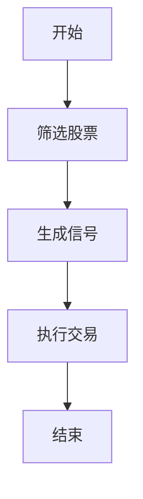
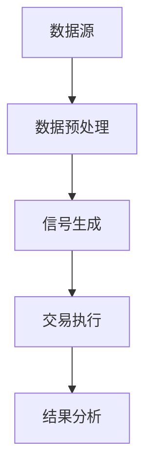

                 


# 《格雷厄姆特价股票理论对高频量化交易的影响》

---

## 关键词：格雷厄姆投资理论，高频量化交易，价值投资，算法交易，低市盈率策略

---

## 摘要：本文探讨了格雷厄姆特价股票理论与高频量化交易的结合，分析了其对现代投资策略的影响。通过背景介绍、理论分析、算法实现和项目案例，揭示了格雷厄姆理论在量化交易中的应用潜力。

---

# 第1章 引言

## 1.1 背景介绍

### 1.1.1 格雷厄姆投资理论的背景
- 本杰明·格雷厄姆是价值投资的鼻祖，提出“ intrinsic value ”概念。
- 格雷厄姆策略注重基本面分析，寻找被市场低估的股票。

### 1.1.2 高频量化交易的兴起
- 高频交易利用算法在极短时间内完成交易，依赖数学模型和高性能计算。
- 量化交易的优势：高效性、精确性、低人为干预。

### 1.1.3 格雷厄姆理论与高频交易的结合
- 传统价值投资与现代技术的结合，开拓了新的投资维度。

---

## 1.2 核心概念与联系

### 1.2.1 格雷厄姆的选股标准
- 低市盈率（P/E < 15）。
- 低市净率（P/B < 1.5）。
- 高股息率（Dividend Yield > 3%）。

### 1.2.2 格雷厄姆策略与高频交易的联系
- 格雷厄姆策略筛选出低估股票，作为高频交易的信号源。
- 高频交易利用技术手段快速捕捉市场机会。

---

## 1.3 格雷厄姆策略对高频交易的影响

### 1.3.1 提供新的交易信号
- 格雷厄姆策略筛选出潜在的低估股票，作为高频交易的切入点。

### 1.3.2 结合技术分析
- 将基本面分析与技术分析结合，提高交易策略的有效性。

### 1.3.3 数据驱动的策略优化
- 利用大数据分析优化格雷厄姆策略，适应市场变化。

---

# 第2章 格雷厄姆特价股票理论的核心原理

## 2.1 格雷厄姆投资理论的数学模型

### 2.1.1 市盈率（P/E）计算
$$ P/E = \frac{\text{股价}}{\text{每股收益}} $$

### 2.1.2 市净率（P/B）计算
$$ P/B = \frac{\text{股价}}{\text{每股净资产}} $$

### 2.1.3 股息率计算
$$ \text{股息率} = \frac{\text{每股股息}}{\text{股价}} \times 100\% $$

---

## 2.2 格雷厄姆投资策略的优缺点

### 2.2.1 优点
- 风险较低，安全边际高。
- 适合长期投资。

### 2.2.2 缺点
- 短期可能跑输市场。
- 过滤掉部分高成长性股票。

---

# 第3章 高频量化交易的基本原理

## 3.1 高频交易的定义与特点

### 3.1.1 高频交易的定义
- 利用算法和高速网络在极短时间内进行大量交易。

### 3.1.2 高频交易的特点
- 高速执行。
- 高频数据处理。
- 算法多样性。

---

## 3.2 高频交易的数学模型

### 3.2.1 均值回归策略
- 假设价格会回归均值，利用短期价格波动进行交易。

### 3.2.2 动量策略
- 投资于近期表现强劲的资产，利用动量效应。

---

# 第4章 格雷厄姆策略在高频交易中的应用

## 4.1 格雷厄姆策略作为高频交易信号源

### 4.1.1 格雷厄姆过滤器
- 根据P/E、P/B等指标筛选股票，生成交易信号。

### 4.1.2 信号生成逻辑
1. 筛选P/E < 15且P/B < 1.5的股票。
2. 生成买入信号。
3. 设置止损和止盈点。

---

## 4.2 基于格雷厄姆策略的算法实现

### 4.2.1 算法流程图


---

## 4.3 数学模型与优化

### 4.3.1 CAPM模型
$$ E(R_i) = R_f + \beta_i (R_m - R_f) $$

### 4.3.2 策略优化
- 调整筛选指标。
- 优化交易频率。

---

# 第5章 系统架构设计

## 5.1 系统功能模块

### 5.1.1 数据采集模块
- 获取实时市场数据。

### 5.1.2 信号生成模块
- 根据格雷厄姆策略生成交易信号。

### 5.1.3 执行模块
- 执行交易指令。

---

## 5.2 系统架构图


---

# 第6章 项目实战

## 6.1 环境配置

### 6.1.1 Python环境
- 安装必要库：pandas、numpy、yfinance。

### 6.1.2 数据源
- 使用Yahoo Finance获取数据。

---

## 6.2 核心代码实现

### 6.2.1 数据获取与筛选
```python
import pandas as pd
import yfinance as yf

# 获取数据
data = yf.download(tickers='AAPL', period='5d', interval='1h')

# 筛选指标
def grayham_screen(df):
    pe = df['Close'] / df[' earnings per share']
    pb = df['Close'] / df[' book value per share']
    return pe < 15 and pb < 1.5

selected = data[grayham_screen(data)]
```

---

## 6.3 交易信号生成与回测

### 6.3.1 信号生成
```python
# 生成买入信号
buy_signals = selected['Close'].diff().apply(lambda x: x > 0)
```

### 6.3.2 回测分析
```python
# 计算回测结果
returns = selected['Close'].pct_change().cumsum()
print("总收益：", returns.sum())
```

---

# 第7章 总结与展望

## 7.1 核心结论
- 格雷厄姆策略为高频交易提供了新的信号源。
- 结合大数据分析和算法优化，可提升策略效果。

## 7.2 展望
- 深化格雷厄姆策略的研究。
- 开发更高效的交易系统。

---

## 7.3 注意事项
- 确保数据质量。
- 设定合理的风险管理参数。
- 定期优化交易策略。

---

## 7.4 拓展阅读
- 《The Intelligent Investor》。
- 《Quantitative Equity Portfolio Management》。

---

# 结语

格雷厄姆特价股票理论与高频量化交易的结合，不仅拓展了投资策略的边界，也为技术与金融的融合提供了新的思路。未来，随着技术的进步，这一领域的研究将更加深入，为投资者带来更大的收益。

--- 

# END

