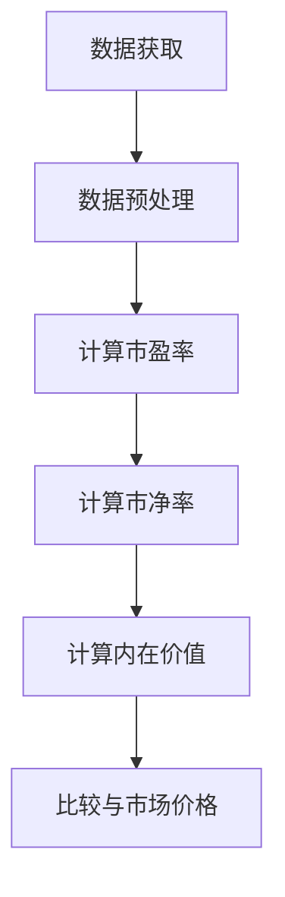
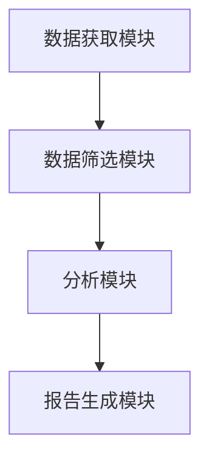
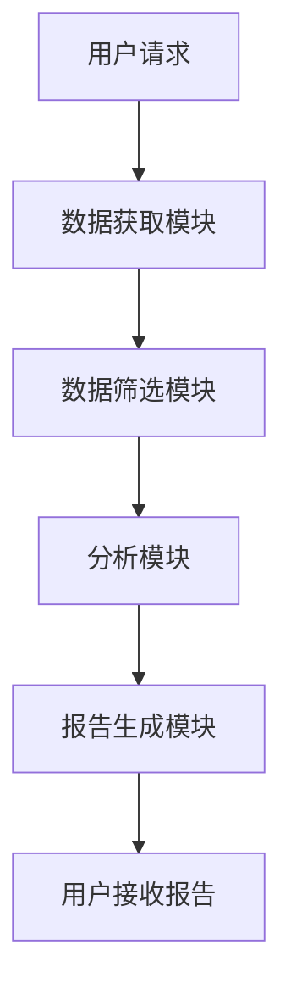

                 


```markdown
# 格雷厄姆特价股票理论的现代化应用

## 关键词
- 格雷厄姆投资理论
- 特价股票
- 价值投资
- 现代化应用
- 技术分析
- 系统架构
- Python代码

## 摘要
格雷厄姆的投资理论是价值投资的基石，其核心是寻找市场低估的特价股票。本文将详细探讨如何将格雷厄姆的理论与现代技术相结合，利用算法和系统架构设计，实现自动化投资决策。通过Python代码和Mermaid图表，本文将展示如何在实际应用中筛选出具有安全边际的特价股票，并提供最佳实践建议。

---

# 第一部分: 格雷厄姆特价股票理论的概述

## 第1章: 格雷厄姆投资理论的核心概念
### 1.1 格雷厄姆投资理念的起源
#### 1.1.1 价值投资的起源与发展
价值投资由本杰明·格雷厄姆提出，强调购买被市场低估的股票，追求安全边际。这一理念在20世纪初提出，至今仍被广泛应用于投资领域。

#### 1.1.2 格雷厄姆的投资哲学
格雷厄姆认为，股票的价格波动是机会的来源，投资者应关注内在价值而非市场情绪。他强调安全边际，即买入价格低于内在价值。

#### 1.1.3 格雷厄姆与巴菲特的传承
沃伦·巴菲特是格雷厄姆的得意门生，将价值投资理念发扬光大。巴菲特的成功证明了格雷厄姆理论的持久价值。

## 第2章: 特价股票的定义与特征
### 2.1 特价股票的定义
#### 2.1.1 什么是特价股票
特价股票是指市场价格低于其内在价值的股票。格雷厄姆认为，这种股票具有安全边际，适合长期投资。

#### 2.1.2 特价股票的分类
特价股票可以分为周期性特价股票和非周期性特价股票，分别适用于不同市场环境。

#### 2.1.3 特价股票的边界与外延
特价股票的边界包括行业、市场和时间因素。外延则涉及与成长型股票和其他投资策略的对比。

### 2.2 特价股票的核心特征
#### 2.2.1 市盈率低于行业平均水平
市盈率（P/E）是衡量股票价值的重要指标。当市盈率低于行业平均水平时，股票可能被低估。

#### 2.2.2 市净率低于行业平均水平
市净率（P/B）是另一个关键指标。当市净率低于行业平均水平时，股票可能具有投资价值。

#### 2.2.3 股价低于内在价值
内在价值是股票的真正价值，与市场波动无关。当股价低于内在价值时，股票具有投资吸引力。

### 2.3 特价股票的对比分析
#### 2.3.1 与成长型股票的对比
成长型股票注重未来增长潜力，而特价股票注重当前低估。两者在投资策略和风险方面存在差异。

#### 2.3.2 与周期性股票的对比
周期性股票受经济周期影响较大，而特价股票通常具有较高的防御性。

## 第3章: 格雷厄姆特价股票理论的数学模型
### 3.1 内在价值的计算公式
#### 3.1.1 内在价值的定义
内在价值是基于公司基本面计算的股票真实价值。

#### 3.1.2 内在价值的计算公式
$$ V = \frac{E}{(1 + r)^n} $$
其中，E为公司未来现金流，r为折现率，n为时间跨度。

### 3.2 市盈率与市净率的对比
#### 3.2.1 市盈率的计算公式
$$ P/E = \frac{P}{E} $$
P为股价，E为每股收益。

#### 3.2.2 市净率的计算公式
$$ P/B = \frac{P}{B} $$
P为股价，B为每股净资产。

### 3.3 特价股票的筛选标准
#### 3.3.1 市盈率低于行业平均水平
通过比较市盈率，筛选出具有低估潜力的股票。

#### 3.3.2 市净率低于行业平均水平
市净率低于行业平均水平的股票可能具有投资价值。

#### 3.3.3 股价低于内在价值
当股价低于内在价值时，股票具有安全边际。

## 第4章: 格雷厄姆特价股票理论的算法实现
### 4.1 特价股票筛选算法
#### 4.1.1 数据获取与预处理
从金融数据源获取股票数据，清洗并标准化。

#### 4.1.2 市盈率与市净率计算
使用Python计算市盈率和市净率，并与行业平均水平比较。

#### 4.1.3 内在价值计算与比较
通过数学模型计算内在价值，比较与市场价格的差异。

### 4.2 算法流程图


### 4.3 Python代码实现
```python
import pandas as pd

# 获取股票数据
data = pd.read_csv('stock_data.csv')

# 计算市盈率
data['P/E'] = data['Price'] / data['Earnings']

# 计算市净率
data['P/B'] = data['Price'] / data['Book Value']

# 计算内在价值
data['Intrinsic Value'] = data['Earnings'] / (1 + data['Discount Rate']) ** n

# 筛选特价股票
cheap_stocks = data[data['P/E'] < data['Industry Average P/E']]
```

## 第5章: 系统分析与架构设计
### 5.1 系统功能设计
#### 5.1.1 数据获取模块
从金融API获取实时股票数据。

#### 5.1.2 数据筛选模块
根据格雷厄姆理论筛选特价股票。

#### 5.1.3 分析模块
计算市盈率、市净率和内在价值，生成报告。

### 5.2 系统架构设计


### 5.3 系统接口设计
API接口用于获取股票数据，筛选模块返回符合条件的股票列表。

### 5.4 系统交互流程


## 第6章: 项目实战
### 6.1 环境安装
安装Python、Pandas、金融数据API库。

### 6.2 核心实现
编写Python代码，实现数据获取、筛选和分析。

### 6.3 案例分析
分析历史数据，筛选出符合格雷厄姆标准的股票。

### 6.4 实际应用
展示如何利用筛选出的股票构建投资组合。

## 第7章: 最佳实践与小结
### 7.1 投资策略
根据市场环境调整投资策略，注重风险控制。

### 7.2 风险管理
分散投资，避免过度集中，定期复盘。

### 7.3 持续学习
关注市场变化，不断优化投资策略。

### 7.4 注意事项
避免短期波动影响决策，注重长期价值。

### 7.5 拓展阅读
推荐相关书籍和资源，鼓励深入学习。

## 第8章: 总结与展望
### 8.1 核心内容回顾
总结格雷厄姆理论的现代化应用，强调技术的重要性。

### 8.2 未来展望
展望技术如何进一步推动投资理论的发展，优化投资决策。

## 第9章: 参考文献
列出所有引用的文献和工具，确保学术严谨性。
```

通过以上目录大纲，我们可以系统地探讨格雷厄姆特价股票理论的现代化应用，从理论到实践，从分析到系统设计，逐步深入。

