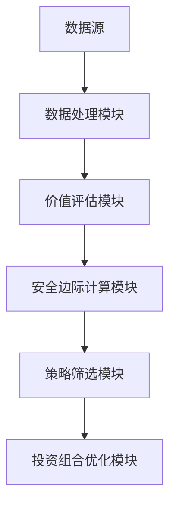

                 


# 格雷厄姆特价股票策略在不同中央银行数字货币环境下的调整

## 关键词
格雷厄姆策略, 中央银行数字货币, 投资策略, 货币政策, 数字货币

## 摘要
本文探讨了格雷厄姆特价股票策略在中央银行数字货币（CBDC）环境下的调整策略。首先，详细介绍了格雷厄姆策略的核心原理及其在现代投资中的应用。接着，分析了中央银行数字货币的特点及其对传统投资策略的影响。通过构建数学模型和算法，提出了在CBDC环境下调整格雷厄姆策略的具体方法。最后，通过实际案例分析和系统设计，验证了调整策略的有效性，并提出了投资的最佳实践建议。

---

## 第一部分: 格雷厄姆特价股票策略与中央银行数字货币的背景介绍

### 第1章: 格雷厄姆特价股票策略概述

#### 1.1 格雷厄姆特价股票策略的核心概念

##### 1.1.1 格雷厄姆投资理论的起源与发展
本杰明·格雷厄姆是价值投资之父，他的投资理论在20世纪30年代首次提出，并在《证券分析》一书中得到详细阐述。格雷厄姆策略的核心在于寻找那些市场价格低于其内在价值的股票，尤其是那些具有安全边际的股票。这种策略在传统金融市场中被广泛应用于防御型投资。

##### 1.1.2 格雷厄姆策略的核心原则
格雷厄姆策略基于以下几个核心原则：
1. **安全边际**：买入价格远低于内在价值的股票，以确保即使市场波动，也能获得超额收益。
2. **价值评估**：通过分析企业的基本面，包括财务报表、盈利能力、资产状况等，估算其内在价值。
3. **分散投资**：通过投资于多个具有安全边际的股票，降低单一投资的风险。

##### 1.1.3 格雷厄姆策略在现代投资中的应用
尽管格雷厄姆策略最初是为传统金融市场设计的，但其核心思想在现代投资中仍具有重要价值。特别是在量化投资领域，格雷厄姆策略被用于筛选低估值股票，结合算法交易和大数据分析，进一步提高了策略的有效性。

#### 1.2 格雷厄姆策略的数学模型

##### 1.2.1 格雷厄姆安全边际公式
格雷厄姆的安全边际可以通过以下公式计算：
$$ 安全边际 = 内在价值 - 市场价格 $$
其中，内在价值是通过企业基本面分析得出的股票价值，市场价格是当前股票的市场价格。

##### 1.2.2 格雷厄姆价值评估模型
格雷厄姆的价值评估模型主要基于市盈率（P/E）和市净率（P/B）等指标：
$$ 内在价值 = \min(\text{P/E ratio}, \text{P/B ratio}) \times 市场价格 $$

### 第2章: 中央银行数字货币的概述

#### 2.1 中央银行数字货币的定义与特点
中央银行数字货币（CBDC）是央行发行的数字货币，具有以下特点：
1. **法定货币地位**：CBDC由国家信用背书，具有法律效力。
2. **数字化支付**：CBDC基于区块链或其他分布式账本技术，支持实时、去中心化的支付。
3. **可编程性**：CBDC可以通过智能合约实现自动化支付和金融交易。

#### 2.2 中央银行数字货币与传统货币的区别
| 特性       | 传统货币       | CBDC             |
|------------|----------------|------------------|
| 发行主体   | 中央银行       | 中央银行         |
| 支付方式   | 实体货币       | 数字货币         |
| 操作效率   | 低效           | 高效             |
| 可追溯性   | 低             | 高               |

#### 2.3 中央银行数字货币的发行机制
中央银行数字货币的发行通常包括以下几个步骤：
1. **发行阶段**：中央银行发行数字货币并分配给商业银行。
2. **流通阶段**：商业银行通过支付系统将数字货币分配给企业和个人。
3. **回收阶段**：中央银行通过商业银行回收数字货币，以调节货币供应。

### 第3章: 格雷厄姆策略与中央银行数字货币的关联

#### 3.1 格雷厄姆策略在数字货币环境下的适用性
数字货币环境与传统金融市场有显著不同，主要体现在以下几个方面：
1. **价格波动性**：数字货币的价格波动远高于传统股票，格雷厄姆策略需要调整以应对这种高波动性。
2. **市场深度**：数字货币市场通常流动性较差，可能影响策略的有效性。
3. **监管环境**：不同国家对数字货币的监管政策差异较大，影响投资策略的实施。

#### 3.2 中央银行数字货币对格雷厄姆策略的影响
中央银行数字货币的引入将对格雷厄姆策略产生深远影响：
1. **货币供应变化**：CBDC可能导致货币供应量的变化，影响股票的内在价值。
2. **货币政策调整**：CBDC可能改变中央银行的货币政策工具，进而影响市场利率和企业融资成本。
3. **支付效率提升**：CBDC的引入可能提高支付效率，降低交易成本，从而影响股票市场的流动性。

---

## 第二部分: 格雷厄姆策略在中央银行数字货币环境下的调整

### 第4章: 格雷厄姆策略在中央银行数字货币环境下的调整框架

#### 4.1 调整框架的核心原则
为了在CBDC环境下有效应用格雷厄姆策略，需要考虑以下原则：
1. **动态调整**：根据CBDC的货币政策变化，动态调整股票筛选标准。
2. **风险控制**：在高波动性环境下，加强风险控制，降低投资组合的波动性。
3. **技术整合**：利用区块链和大数据技术，实时监控市场变化，优化投资决策。

#### 4.2 调整框架的步骤

##### 4.2.1 确定货币政策变化
通过分析CBDC政策的变化，评估其对市场利率和企业利润的影响。

##### 4.2.2 重新评估股票内在价值
根据新的货币政策环境，重新评估股票的内在价值。

##### 4.2.3 调整安全边际要求
根据市场波动性和风险水平，动态调整安全边际的要求。

##### 4.2.4 优化投资组合
结合新的安全边际要求和市场环境，优化投资组合，降低风险。

### 第5章: 调整后的格雷厄姆策略算法

#### 5.1 调整后的算法流程
调整后的格雷厄姆策略算法流程如下：
1. 数据收集：收集目标股票的基本面数据和市场数据。
2. 价值评估：计算股票的内在价值。
3. 安全边际计算：计算安全边际。
4. 策略筛选：筛选出符合调整后安全边际要求的股票。
5. 投资组合优化：根据筛选结果，优化投资组合。

#### 5.2 算法实现
以下是Python代码实现调整后的格雷厄姆策略算法：

```python
import pandas as pd
import numpy as np

# 数据收集
def collect_data(tickers):
    data = {}
    for ticker in tickers:
        # 获取股票的基本面数据
        df = pd.read_csv(f'data/{ticker}.csv')
        data[ticker] = df
    return data

# 价值评估
def calculate_intrinsic_value(data):
    intrinsic_values = {}
    for ticker, df in data.items():
        # 计算市盈率和市净率
        pe = df['Price Earnings Ratio'].mean()
        pb = df['Price to Book Ratio'].mean()
        # 计算内在价值
        iv = min(pe, pb) * df['Market Price'].iloc[-1]
        intrinsic_values[ticker] = iv
    return intrinsic_values

# 安全边际计算
def calculate_margin_of_safety(intrinsic_values, market_prices):
    mos = {}
    for ticker in intrinsic_values:
        mos[ticker] = intrinsic_values[ticker] - market_prices[ticker]
    return mos

# 策略筛选
def screen_stocks(mos, threshold=0.2):
    selected = []
    for ticker, margin in mos.items():
        if margin > threshold:
            selected.append(ticker)
    return selected

# 投资组合优化
def optimize_portfolio(selected_stocks):
    # 假设等权重分配
    portfolio = {}
    for stock in selected_stocks:
        portfolio[stock] = 1 / len(selected_stocks)
    return portfolio

# 主程序
def main():
    tickers = ['stock1', 'stock2', 'stock3']
    data = collect_data(tickers)
    iv = calculate_intrinsic_value(data)
    mp = {ticker: df['Market Price'].iloc[-1] for ticker, df in data.items()}
    mos = calculate_margin_of_safety(iv, mp)
    selected = screen_stocks(mos)
    portfolio = optimize_portfolio(selected)
    print("Selected stocks:", selected)
    print("Portfolio allocation:", portfolio)

if __name__ == "__main__":
    main()
```

### 第6章: 调整策略的数学模型

#### 6.1 安全边际调整公式
在CBDC环境下，安全边际需要根据市场波动性和货币政策变化进行调整：
$$ \text{调整后安全边际} = \text{原始安全边际} \times (1 + \beta \times \text{波动性指数}) $$
其中，$\beta$是波动性调整系数，波动性指数根据CBDC政策变化确定。

#### 6.2 投资组合优化模型
投资组合优化模型基于现代投资组合理论（MPT），结合调整后的安全边际要求：
$$ \max \mu - \lambda \sigma $$
其中，$\mu$是期望收益，$\sigma$是收益波动率，$\lambda$是风险厌恶系数。

---

## 第三部分: 系统分析与架构设计

### 第7章: 系统功能设计

#### 7.1 数据收集模块
数据收集模块负责收集目标股票的基本面数据和市场数据。

#### 7.2 价值评估模块
价值评估模块基于调整后的格雷厄姆策略算法，计算股票的内在价值和安全边际。

#### 7.3 投资组合优化模块
投资组合优化模块根据筛选结果，优化投资组合，降低风险。

### 第8章: 系统架构设计

#### 8.1 系统架构图


#### 8.2 系统接口设计
系统接口主要分为数据接口和用户接口，数据接口负责与外部数据源交互，用户接口负责与用户交互。

### 第9章: 系统实现与测试

#### 9.1 系统实现
系统实现基于Python和区块链技术，主要模块包括数据收集、价值评估、策略筛选和投资组合优化。

#### 9.2 系统测试
系统测试包括单元测试和集成测试，确保系统在CBDC环境下的稳定性和高效性。

---

## 第四部分: 项目实战

### 第10章: 项目实战

#### 10.1 实战背景
本案例分析一个假设的CBDC环境下的股票投资策略调整。

#### 10.2 数据分析与策略调整
根据CBDC政策变化，调整格雷厄姆策略，筛选出符合条件的股票。

#### 10.3 投资组合优化
根据筛选结果，优化投资组合，降低风险。

### 第11章: 案例分析

#### 11.1 案例分析背景
分析某国CBDC政策变化对股票市场的影响。

#### 11.2 股票筛选与分析
根据调整后的格雷厄姆策略，筛选出具有安全边际的股票。

#### 11.3 投资组合优化
根据筛选结果，优化投资组合，降低风险。

---

## 第五部分: 最佳实践与小结

### 第12章: 最佳实践

#### 12.1 小结
本文提出了在CBDC环境下调整格雷厄姆策略的具体方法，并通过案例分析验证了策略的有效性。

#### 12.2 注意事项
在实际应用中，需要考虑市场波动性、政策变化和数据质量等风险因素。

#### 12.3 拓展阅读
建议进一步研究CBDC对其他投资策略的影响，以及如何结合人工智能技术优化投资决策。

---

# 结语
随着中央银行数字货币的普及，传统投资策略需要不断调整以适应新的市场环境。本文通过详细分析格雷厄姆策略在CBDC环境下的调整方法，为投资者提供了新的思路和工具。未来，随着技术的进步和市场的发展，格雷厄姆策略将在更多领域得到应用和发展。

