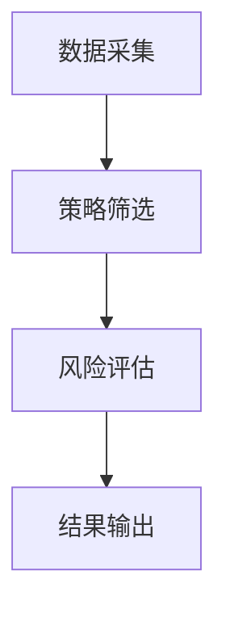

                 


# 格雷厄姆特价股票策略在不同企业文化生态中的适应

## 关键词：格雷厄姆策略，企业文化，股票投资，价值投资，投资策略

## 摘要：本文探讨了格雷厄姆特价股票策略在不同企业文化生态中的适应性，分析了该策略在不同国家和行业中的应用效果，并提出了相应的优化建议。文章通过详细分析企业文化对投资策略的影响，提出了系统性的解决方案，并给出了实际案例。

---

## 第一部分: 格雷厄姆特价股票策略概述

### 第1章: 格雷厄姆特价股票策略的核心理念

#### 1.1 格雷厄姆投资理论的起源与发展

##### 1.1.1 格雷厄姆投资理论的起源
本杰明·格雷厄姆是价值投资的鼻祖，他在20世纪30年代提出了“廉价购买”的理念，即通过寻找市场价格低于其内在价值的股票进行投资。这一理论在1934年出版的《证券分析》中得到了详细阐述。

##### 1.1.2 特价股票策略的定义与特点
格雷厄姆的特价股票策略强调以低于公司净资产价值的价格购买股票。其特点包括：
1. 重视安全边际：买入价格远低于内在价值。
2. 低市盈率和低市净率：选择市盈率和市净率低于市场平均水平的股票。
3. 高股息率：关注高股息率的股票，以提供稳定的现金流。

##### 1.1.3 格雷厄姆策略的核心思想
格雷厄姆认为，市场先生是不可预测的，投资者应专注于寻找被市场低估的股票，并长期持有，避免短期波动的影响。

#### 1.2 特价股票策略的数学模型与公式

##### 1.2.1 格雷厄姆的内在价值计算公式
内在价值是基于公司基本面计算的理论价值。格雷厄姆提出的计算公式为：
$$
\text{内在价值} = \frac{\text{净利润} \times 4}{\text{市盈率}} + \frac{\text{股东权益}}{2}
$$

##### 1.2.2 市盈率与市净率的比较分析
市盈率（P/E）和市净率（P/B）是衡量股票价值的重要指标。格雷厄姆建议选择P/E和P/B均低于市场平均水平的股票。

##### 1.2.3 投资组合优化的数学模型
格雷厄姆的投资组合优化模型可以表示为：
$$
\text{最优组合} = \argmin_w \left( \sigma^2(w) \right)
$$
其中，$\sigma^2(w)$表示投资组合的风险。

### 第2章: 不同企业文化生态的多样性

#### 2.1 企业文化生态的定义与分类

##### 2.1.1 企业文化的定义
企业文化是指企业在长期经营过程中形成的共同价值观、行为准则和习惯。它影响企业的决策、管理和员工行为。

##### 2.1.2 不同类型企业文化的特点
1. **美国企业文化**：强调创新、自由和竞争。
2. **日本企业文化**：强调团队合作、忠诚和集体主义。
3. **新兴市场企业文化**：强调快速变化和灵活性。

##### 2.1.3 企业文化生态对投资策略的影响
不同企业文化可能导致不同的财务政策和管理风格，从而影响股票的价值和风险。

### 第3章: 格雷厄姆策略在不同企业文化生态中的适应性分析

#### 3.1 美国企业文化生态中的应用

##### 3.1.1 美国企业文化的特征与格雷厄姆策略的契合点
美国企业注重创新和自由，这与格雷厄姆策略的灵活性相符。格雷厄姆策略在美国市场表现良好，尤其是在经济衰退期间。

##### 3.1.2 格雷厄姆策略在美国市场的成功案例
例如，巴菲特在早期应用格雷厄姆策略，成功投资于低价股票，取得了巨大成功。

#### 3.2 日本企业文化生态中的应用

##### 3.2.1 日本企业文化的特征与格雷厄姆策略的契合点
日本企业强调团队合作和忠诚，这可能导致股价低估，为格雷厄姆策略提供了机会。

##### 3.2.2 格雷厄姆策略在日本市场的挑战与解决方案
日本市场的低波动性和高债务可能导致格雷厄姆策略失效，解决方案包括调整安全边际和关注财务杠杆。

#### 3.3 新兴市场企业文化生态中的应用

##### 3.3.1 新兴企业文化的特征与格雷厄姆策略的契合点
新兴市场企业快速变化，格雷厄姆策略可以通过寻找低估值股票获得收益。

##### 3.3.2 格雷厄姆策略在新兴市场的成功案例
例如，在中国市场上，格雷厄姆策略成功应用于一些低估值的制造业企业。

---

## 第二部分: 格雷厄姆策略在企业文化生态中的系统性分析

### 第4章: 格雷厄姆策略在企业文化生态中的系统性分析

#### 4.1 企业文化生态对投资策略的影响机制
企业文化通过影响企业的财务政策和管理行为，间接影响股票的价值和风险。

#### 4.2 格雷厄姆策略在不同企业文化生态中的调整策略

##### 4.2.1 美国市场的策略调整
- 突出创新和自由，选择具有高增长潜力的企业。
- 灵活调整安全边际。

##### 4.2.2 日本市场的策略调整
- 强调团队合作和忠诚，选择财务稳健的企业。
- 调整市盈率和市净率的标准。

##### 4.2.3 新兴市场的策略调整
- 关注快速变化和灵活性，选择具有高增长潜力的企业。
- 重视财务杠杆和债务风险。

### 第5章: 格雷厄姆策略在企业文化生态中的系统架构

#### 5.1 系统架构设计
- 数据采集模块：收集企业基本面数据和文化特征。
- 策略筛选模块：应用格雷厄姆策略筛选股票。
- 风险评估模块：评估文化对企业投资策略的影响。

#### 5.2 系统功能设计
使用mermaid绘制系统功能模块图：



---

## 第三部分: 格雷厄姆策略在企业文化生态中的实践与总结

### 第6章: 格雷厄姆策略在企业文化生态中的实践

#### 6.1 项目实战

##### 6.1.1 环境安装
- 数据获取工具：数据库或API。
- 开发工具：Python和相关库。

##### 6.1.2 核心代码实现
```python
def graham_strategy(stock_data):
    # 计算内在价值
    intrinsic_value = stock_data['净利润'] * 4 / stock_data['市盈率'] + stock_data['股东权益'] / 2
    # 筛选低估值股票
    selected_stocks = stock_data[(intrinsic_value > stock_data['股价']) &
                                 (stock_data['市盈率'] < 15) &
                                 (stock_data['市净率'] < 2)]
    return selected_stocks
```

##### 6.1.3 实例分析
以某新兴市场的制造业公司为例，分析其财务数据，应用格雷厄姆策略筛选出符合条件的股票，并解读结果。

### 第7章: 总结与展望

#### 7.1 格雷厄姆策略在不同企业文化生态中的总结
格雷厄姆策略在不同文化中表现各异，需根据具体情况调整策略。

#### 7.2 注意事项
- 注意文化差异对投资策略的影响。
- 保持对市场的敏感性，及时调整策略。

#### 7.3 拓展阅读
推荐相关书籍和研究，深入探讨企业文化对投资策略的影响。

---

## 结语

格雷厄姆特价股票策略在不同企业文化生态中的适应性是一个复杂但值得深入探讨的问题。通过系统分析和实际案例，我们可以更好地理解策略的适用性和优化方向，为投资者提供有力的指导。

