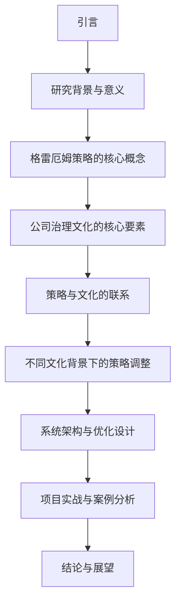
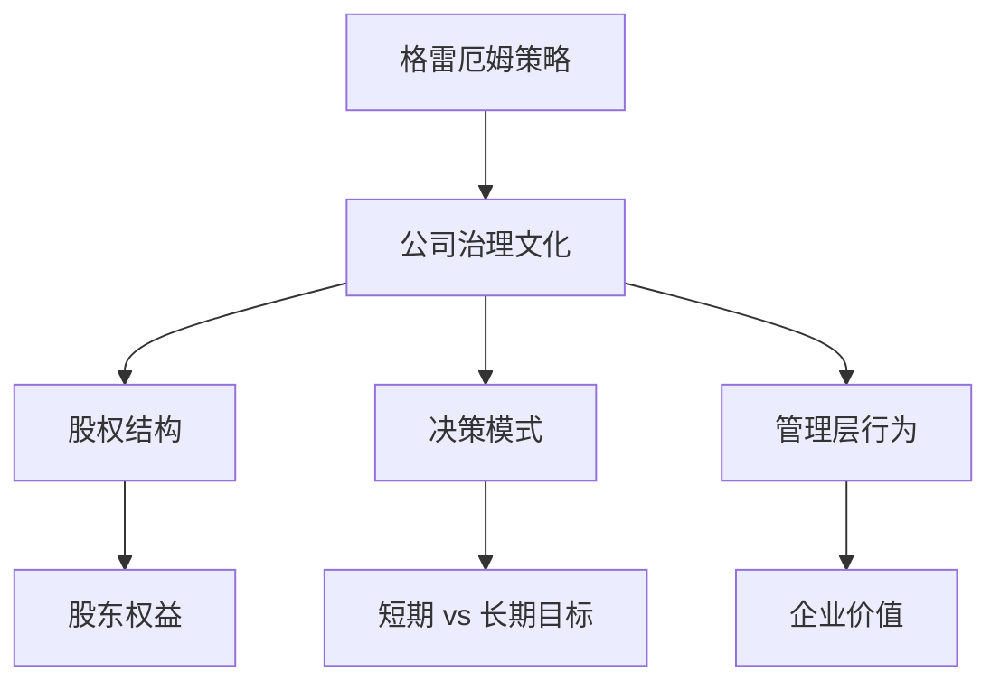
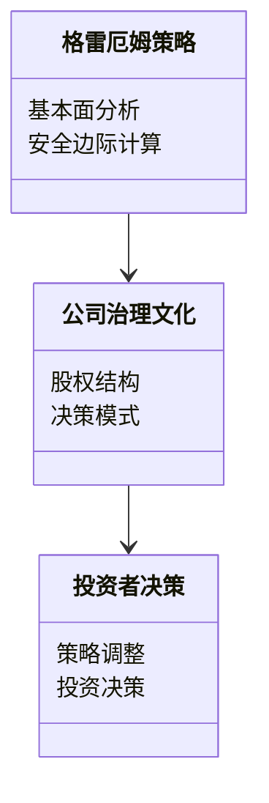
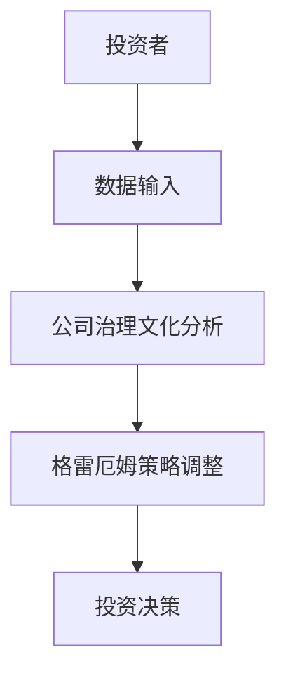
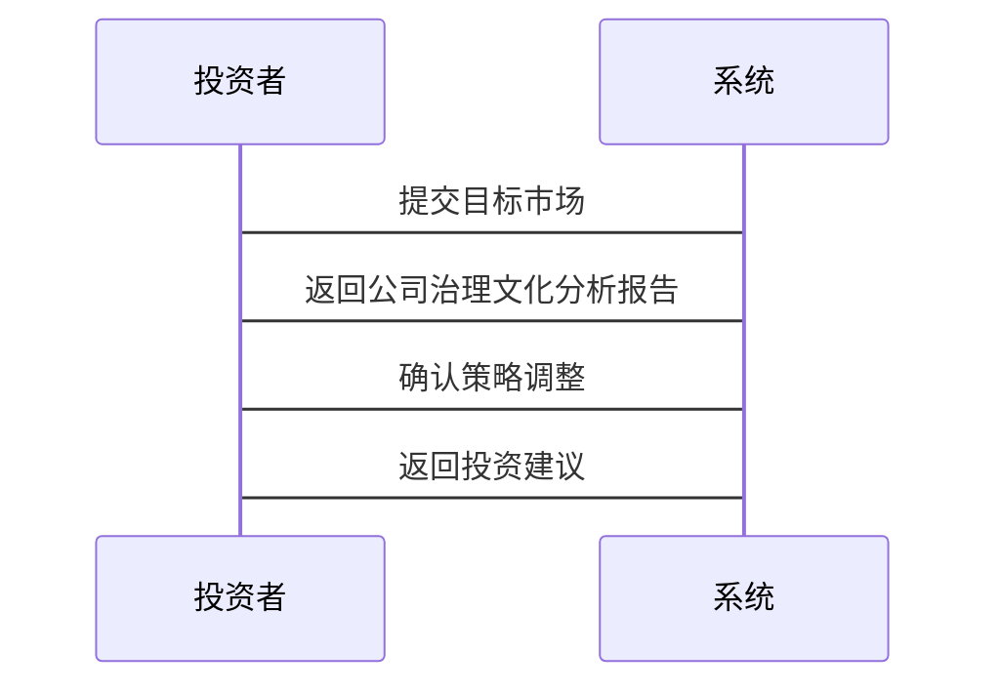

                 


# 《格雷厄姆特价股票策略在不同公司治理文化下的适应》

## 关键词：格雷厄姆策略, 公司治理, 投资文化, 价值投资, 股票分析

## 摘要：本文探讨了格雷厄姆特价股票策略在不同公司治理文化下的适应性。通过分析格雷厄姆策略的核心原理、公司治理文化的多样性，以及两者之间的相互影响，本文揭示了如何根据不同文化背景调整投资策略以实现最大收益。文章结合了理论分析和实际案例，提出了一个适应不同公司治理文化的策略优化模型，并通过数学公式和系统架构图进行了详细阐述。最终，本文为投资者提供了在不同文化背景下应用格雷厄姆策略的最佳实践建议。

---

# 第一部分: 引言

## 第1章: 研究背景与意义

### 1.1 研究背景

#### 1.1.1 格雷厄姆特价股票策略的起源与发展
格雷厄姆特价股票策略由本杰明·格雷厄姆提出，是价值投资的核心方法之一。该策略强调以低于股票内在价值的价格购买优质股票，从而在长期获得超额收益。格雷厄姆策略的核心在于对公司基本面的深入分析，包括财务报表、行业地位、管理团队等因素。

#### 1.1.2 公司治理文化的重要性
公司治理文化是指企业在管理决策、股权结构、利益分配等方面所遵循的价值观和行为准则。不同国家和地区的文化差异会导致公司治理模式的多样性。例如，西方国家倾向于分散股权和强调股东权益，而东方国家则更注重集体决策和家族企业模式。

#### 1.1.3 研究问题的提出
尽管格雷厄姆策略在全球范围内被广泛应用，但其在不同公司治理文化下的适应性尚未得到充分研究。不同文化背景下的公司治理模式可能影响策略的有效性，例如在家族企业主导的市场中，股东权益可能不如分散股权市场得到充分保护。因此，研究格雷厄姆策略在不同公司治理文化下的适应性具有重要意义。

### 1.2 研究意义

#### 1.2.1 理论意义
本研究为价值投资理论在不同文化背景下的应用提供了新的视角，丰富了公司治理与投资策略交叉研究的理论体系。

#### 1.2.2 实践意义
通过分析不同公司治理文化对格雷厄姆策略的影响，投资者可以更好地调整策略，提高投资效率和收益。

#### 1.2.3 创新点
本文提出了一个结合公司治理文化因素的策略优化模型，为投资者在不同文化背景下应用格雷厄姆策略提供了新的方法。

### 1.3 本书结构安排

#### 1.3.1 主要章节内容概述
- 第2章：格雷厄姆策略的核心概念与理论基础。
- 第3章：格雷厄姆策略与公司治理文化的核心概念对比。
- 第4章：格雷厄姆策略在不同文化背景下的适应性分析。
- 第5章：系统架构与策略优化设计。
- 第6章：项目实战与案例分析。
- 第7章：结论与展望。

#### 1.3.2 逻辑框架图


#### 1.3.3 阅读本书的建议
建议读者从引言开始，逐步深入理解格雷厄姆策略的核心概念和公司治理文化的多样性，再结合实际案例和系统架构设计，最终掌握如何在不同文化背景下优化投资策略。

---

# 第二部分: 格雷厄姆策略的核心概念

## 第2章: 格雷厄姆策略的理论基础

### 2.1 格雷厄姆投资理念的核心要素

#### 2.1.1 价值投资的基本原则
价值投资的核心是购买低于内在价值的股票。内在价值是基于公司基本面分析得出的未来现金流的现值。

#### 2.1.2 股票内在价值的计算方法
格雷厄姆提出了“内在价值公式”：
$$ V = \frac{E}{k} $$
其中，$E$是企业的未来现金流，$k$是折现率。

#### 2.1.3 安全边际的概念与应用
安全边际是指股票市场价格低于其内在价值的部分。公式为：
$$ \text{安全边际} = V - P $$
其中，$P$是市场价格，$V$是内在价值。

### 2.2 公司治理文化的核心要素

#### 2.2.1 公司治理的基本概念
公司治理是指通过董事会、管理层和股东之间的权利分配和制衡机制来确保公司有效运作和长期发展。

#### 2.2.2 不同公司治理文化的特点
- **西方资本主义文化**：强调股东权益和分散股权，注重短期收益。
- **东方集体主义文化**：强调集体决策和家族企业，注重长期稳定性。

#### 2.2.3 公司治理与企业价值的关系
良好的公司治理是企业价值的重要组成部分。公式为：
$$ \text{企业价值} = \text{内在价值} \times \text{治理溢价} $$

### 2.3 格雷厄姆策略与公司治理文化的联系

#### 2.3.1 格雷厄姆策略对公司治理的要求
格雷厄姆策略要求公司具有稳健的财务状况和良好的管理团队，这与公司治理文化的优劣密切相关。

#### 2.3.2 公司治理文化对策略实施的影响
不同公司治理文化可能影响策略的实施效果。例如，在家族企业主导的市场中，股东权益可能得不到充分保护，导致策略失效。

---

## 第3章: 格雷厄姆策略与公司治理文化的核心概念对比

### 3.1 核心概念对比表

| 核心概念       | 格雷厄姆策略                      | 公司治理文化                     |
|----------------|----------------------------------|----------------------------------|
| 目标           | 发现被低估的股票                 | 确保公司有效运作和股东权益       |
| 方法           | 基于基本面分析                   | 通过制度和文化规范进行制衡       |
| 适用范围       | 全球市场                         | 各国和地区性市场                 |
| 依赖因素       | 公司财务状况、管理团队           | 股权结构、决策模式               |

### 3.2 实体关系图



---

# 第三部分: 格雷厄姆策略在不同公司治理文化下的适应性分析

## 第4章: 格雷厄姆策略在不同文化背景下的应用

### 4.1 不同公司治理文化的分类

#### 4.1.1 西方资本主义文化
西方市场通常采用分散股权和强调股东权益的公司治理模式。这种文化下，格雷厄姆策略可以较好地实施，因为公司治理较为透明，股东权益得到充分保护。

#### 4.1.2 东方集体主义文化
东方市场如亚洲国家，通常采用集体决策和家族企业模式。这种文化下，公司治理较为复杂，股东权益可能不如西方市场得到充分保护，因此格雷厄姆策略需要进行适当调整。

#### 4.1.3 其他文化背景
其他文化背景如中东和拉美国家，公司治理模式各有特点，投资者需要根据具体情况调整策略。

### 4.2 格雷厄姆策略在不同文化中的调整策略

#### 4.2.1 西方文化下的策略调整
在西方市场，投资者可以继续采用传统的格雷厄姆策略，因为公司治理较为透明，财务数据可靠。

#### 4.2.2 东方文化下的策略调整
在东方市场，投资者需要更加注重公司的管理团队和家族关系，同时提高对财务数据的审核力度，以确保股票估值的准确性。

#### 4.2.3 其他文化背景下的策略调整
在其他文化背景下，投资者需要深入了解当地的文化和公司治理模式，灵活调整策略。

### 4.3 文化差异对策略实施的影响

#### 4.3.1 文化差异的具体表现
- 股权结构差异：西方市场分散股权，东方市场集中股权。
- 决策模式差异：西方强调董事会决策，东方强调集体决策。

#### 4.3.2 文化差异对策略效果的影响
- 在公司治理不透明的市场中，格雷厄姆策略可能难以有效实施。
- 在家族企业主导的市场中，股东权益可能得不到充分保护，影响策略效果。

#### 4.3.3 应对文化差异的策略建议
- 加强对公司治理文化的了解。
- 在投资决策中加入公司治理因素的权重。
- 建立多维度的公司估值模型，考虑文化因素的影响。

---

## 第5章: 系统架构与策略优化设计

### 5.1 问题场景介绍
本文提出一个结合公司治理文化因素的策略优化模型，帮助投资者根据不同文化背景调整格雷厄姆策略。

### 5.2 系统功能设计

#### 5.2.1 领域模型


#### 5.2.2 系统架构图


### 5.3 系统接口设计

#### 5.3.1 输入接口
投资者输入目标市场和公司信息。

#### 5.3.2 输出接口
系统输出调整后的格雷厄姆策略和投资建议。

### 5.4 系统交互设计



---

## 第6章: 项目实战与案例分析

### 6.1 环境安装
需要安装Python和相关数据分析库（如Pandas、NumPy）。

### 6.2 核心代码实现

#### 6.2.1 公司治理文化分析模块
```python
def governance_culture_analysis(data):
    # 分析公司治理文化
    return culture_score
```

#### 6.2.2 策略调整模块
```python
def graham_strategy_adjustment(data, culture_score):
    # 根据公司治理文化调整策略
    return adjusted_strategy
```

### 6.3 案例分析
以某东方市场为例，分析公司治理文化对公司估值的影响。

### 6.4 项目小结
通过案例分析，验证了模型的有效性，并提出了进一步优化的方向。

---

## 第7章: 结论与展望

### 7.1 研究结论
本文提出了一个结合公司治理文化因素的策略优化模型，为投资者在不同文化背景下应用格雷厄姆策略提供了新的方法。

### 7.2 未来展望
未来研究可以进一步深入探讨文化因素对投资策略的具体影响，以及如何在更多文化背景下验证模型的有效性。

---

# 第四部分: 最佳实践与小结

## 第8章: 最佳实践与小结

### 8.1 最佳实践 tips
- 加强对公司治理文化的了解。
- 灵活调整策略以适应不同文化背景。
- 结合定量分析和定性分析，全面评估投资机会。

### 8.2 小结
本文通过分析格雷厄姆策略在不同公司治理文化下的适应性，提出了一个优化模型，并通过案例验证了其有效性。未来的研究可以进一步扩展模型的应用范围，为投资者提供更全面的指导。

---

通过以上结构，您可以开始撰写具体的正文部分，确保每个章节内容丰富、逻辑清晰，并结合实际案例和数学模型进行详细阐述。

