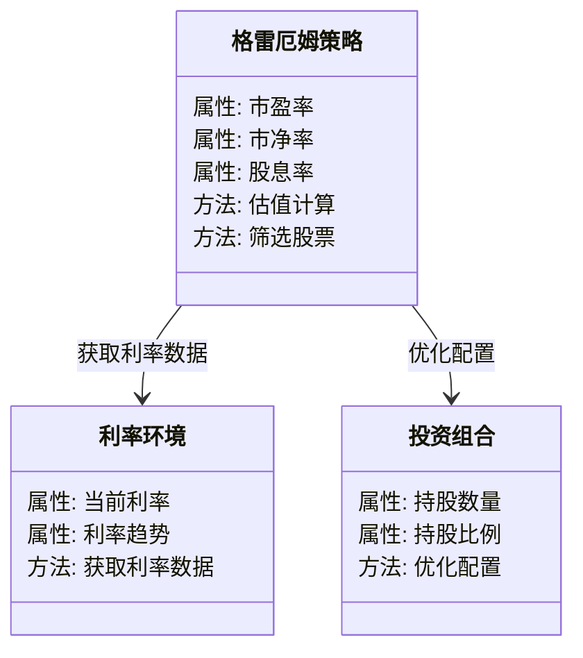
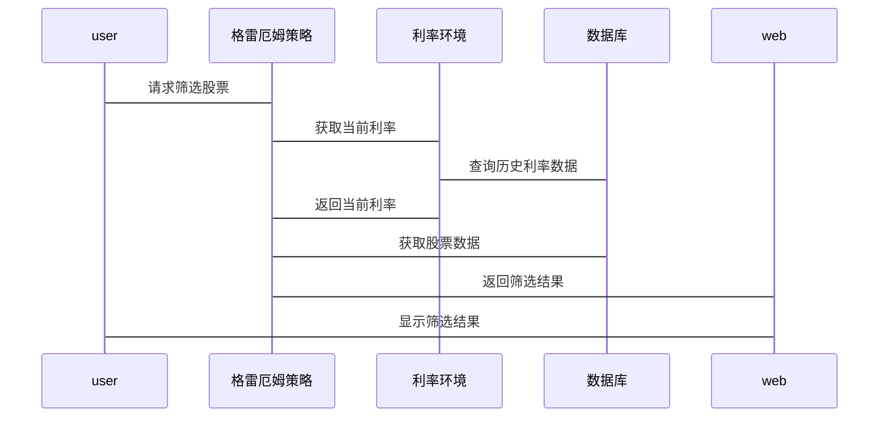

                 


# 格雷厄姆特价股票策略在不同利率环境中的效果

> 关键词：格雷厄姆策略，价值投资，利率环境，股票估值，投资策略优化

> 摘要：格雷厄姆的价值投资策略在不同利率环境下表现如何？本文通过分析低利率、高利率和加息周期下的市场环境，探讨格雷厄姆策略的有效性，并提出优化建议。通过实证分析和系统设计，结合技术手段，为投资者提供在不同利率环境下的策略调整方案。

---

## 第一部分: 格雷厄姆特价股票策略概述

### 第1章: 价值投资与格雷厄姆策略

#### 1.1 价值投资的基本原理

##### 1.1.1 价值投资的定义与核心理念
价值投资是一种以基本面分析为基础的投资策略，核心理念是寻找市场低估的股票进行长期投资。其核心在于寻找安全边际，即股票的市场价格低于其内在价值。

##### 1.1.2 格雷厄姆投资策略的起源与发展
本杰明·格雷厄姆是价值投资的鼻祖，他在《 Intelligent Investor》中提出了一系列估值方法，如市盈率、市净率和股息率等，为后续投资者提供了理论基础。

##### 1.1.3 特价股票的定义与特点
特价股票是指市场价格低于其内在价值的股票，具有低市盈率、低市净率和高股息率的特点。

#### 1.2 利率环境对股市的影响

##### 1.2.1 利率与股票市场的基本关系
利率是影响股市的重要因素。低利率环境下，资金成本降低，企业盈利能力提高，股市整体估值上升；高利率环境下，企业融资成本增加，股市估值可能受到抑制。

##### 1.2.2 不同利率环境下的市场表现
低利率环境可能推动成长型股票表现优异，而高利率环境可能使高负债企业面临更大的压力。

##### 1.2.3 利率周期对投资策略的影响
在利率上升周期中，债券等固定收益资产的吸引力增强，可能分流股市资金；在利率下降周期中，股票市场可能受益于资金流入。

### 第2章: 格雷厄姆特价股票策略的核心要素

#### 2.1 格雷厄姆的估值方法

##### 2.1.1 市盈率与市净率的定义与应用
市盈率（P/E）= 价格/每股收益；市净率（P/B）= 价格/每股净资产。这两种指标用于评估股票的相对估值。

##### 2.1.2 股息率与股息支付率的计算
股息率= 每股股息/股价；股息支付率= 股息/净利润。高股息率股票在高利率环境下更具吸引力。

##### 2.1.3 内在价值的估算公式
内在价值= 股票未来现金流的现值。格雷厄姆常用简化模型进行估值。

#### 2.2 利率环境对估值的影响

##### 2.2.1 利率变化对股票估值的影响
利率上升会提高折现率，降低股票的内在价值；利率下降则会降低折现率，提升股票估值。

##### 2.2.2 不同利率环境下估值方法的调整
在高利率环境下，应更注重股息率和ROE；在低利率环境下，可适当提高市盈率的容忍度。

##### 2.2.3 利率风险对投资组合的影响
高利率环境下，应减少对高负债企业的投资；低利率环境下，可增加对成长型企业配置。

### 第3章: 格雷厄姆策略在不同利率环境下的表现

#### 3.1 低利率环境下的策略分析

##### 3.1.1 低利率环境下的市场特征
低利率环境下，资金成本降低，企业盈利改善，成长型股票可能表现较好。

##### 3.1.2 格雷厄姆策略的有效性分析
低利率环境下，格雷厄姆策略的选股标准可能过于严格，导致错失成长型股票机会。

##### 3.1.3 低利率环境下策略的优化建议
适当放宽市盈率标准，增加对成长型股票的关注。

#### 3.2 高利率环境下的策略调整

##### 3.2.1 高利率环境下的市场挑战
高利率环境下，企业融资成本上升，部分企业可能面临盈利压力。

##### 3.2.2 格雷厄姆策略的适应性分析
高利率环境下，格雷厄姆策略的高股息率和低市盈率标准更具优势。

##### 3.2.3 高利率环境下策略的调整策略
增加对高股息率股票的配置，减少对高负债企业的投资。

#### 3.3 利率周期对策略效果的影响

##### 3.3.1 利率周期的定义与分类
利率周期包括上升周期、下降周期和底部周期。

##### 3.3.2 不同利率周期下策略的适用性
在利率上升周期，注重防守性；在利率下降周期，注重进攻性。

##### 3.3.3 利率周期变化中的风险控制
通过分散投资和动态调整持仓结构，降低利率周期变化对投资组合的影响。

---

## 第二部分: 格雷厄姆策略的系统分析与优化

### 第4章: 系统分析与架构设计方案

#### 4.1 问题场景介绍
在不同利率环境下，如何优化格雷厄姆策略的选股标准，提高投资组合的收益和风险调整后的收益。

#### 4.2 项目介绍
基于格雷厄姆策略的股票筛选系统，结合当前利率环境进行动态优化。

#### 4.3 系统功能设计

##### 4.3.1 领域模型（Mermaid类图）


#### 4.4 系统架构设计（Mermaid架构图）
```mermaid
docker
    services {
        db
        web
        worker
    }
```

#### 4.5 系统接口设计
- API接口：获取实时利率数据、筛选股票列表、计算投资组合收益。

#### 4.6 系统交互设计（Mermaid序列图）


### 第5章: 项目实战

#### 5.1 环境安装
- 安装Python、Pandas、NumPy、Scikit-learn和Plotly。

#### 5.2 核心代码实现

##### 5.2.1 数据获取与处理
```python
import pandas as pd
import requests
from bs4 import BeautifulSoup

def get_stock_data():
    url = "http://example.com/stock_data"
    response = requests.get(url)
    soup = BeautifulSoup(response.text, 'html.parser')
    data = pd.read_html(soup.prettify())
    return data
```

##### 5.2.2 格雷厄姆策略筛选
```python
def graham_screen(data, rate):
    # 计算市盈率
    data['PE'] = data['Price'] / data['EPS']
    # 计算市净率
    data['PB'] = data['Price'] / data['BVPS']
    # 筛选条件
    mask = (data['PE'] < 15) & (data['PB'] < 2) & (data['股息率'] > rate)
    return data[mask]
```

##### 5.2.3 投资组合优化
```python
import numpy as np
from scipy.optimize import minimize

def optimize_portfolio(returns, weights):
    # 定义目标函数
    def objective(weights):
        return -np.sum(returns * weights)
    # 定义约束条件
    constraints = [{'type': 'eq', 'fun': lambda w: np.sum(w) - 1}]
    # 求解
    result = minimize(objective, weights, constraints=constraints)
    return result.x
```

#### 5.3 案例分析
以当前低利率环境为例，筛选出一批高股息率的股票，并优化投资组合配置。

#### 5.4 项目总结
通过技术手段实现格雷厄姆策略的动态优化，能够在不同利率环境下有效提高投资收益。

---

## 第三部分: 总结与展望

### 第6章: 总结

#### 6.1 核心观点回顾
- 格雷厄姆策略在不同利率环境下表现各异，需动态调整。
- 低利率环境下应适当放宽估值标准，高利率环境下注重高股息率股票。

#### 6.2 研究不足与未来方向
- 当前研究基于历史数据，未来需结合实时数据进行动态调整。
- 可进一步研究人工智能技术在策略优化中的应用。

### 第7章: 展望

#### 7.1 技术进步对投资策略的影响
人工智能和大数据技术将推动投资策略的进一步优化和个性化定制。

#### 7.2 未来研究方向
- 开发动态调整的智能投资系统。
- 结合宏观经济指标进行多维度策略优化。

---

## 结语

格雷厄姆特价股票策略在不同利率环境下的效果，不仅需要理论分析，更需要结合实际市场环境和技术手段进行动态优化。通过系统设计和技术创新，投资者可以更好地应对复杂多变的市场环境，实现稳健的投资收益。

---

**注意事项：** 本文内容仅为示例，实际投资需谨慎，建议结合专业投资顾问的指导进行决策。

