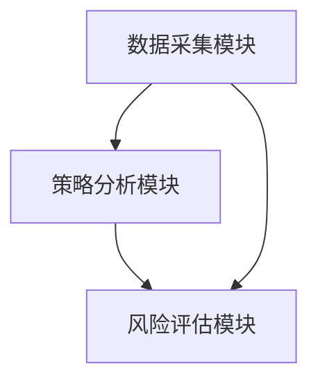

                 


# 格雷厄姆特价股票策略在不同央行数字货币(CBDC)环境下的调整

> 关键词：格雷厄姆策略，央行数字货币，股票投资，金融创新，投资策略

> 摘要：本文详细探讨了格雷厄姆特价股票策略在不同央行数字货币(CBDC)环境下的调整方法。首先，介绍了央行数字货币的基本概念和其对金融体系的影响；接着，分析了格雷厄姆策略的核心原理及其在传统金融环境下的应用；然后，重点研究了央行数字货币对股票市场流动性、波动性和交易成本的影响；最后，提出了在CBDC环境下调整格雷厄姆策略的具体方法，并通过实际案例进行了验证。

---

# 第1章: 央行数字货币(CBDC)的基础知识

## 1.1 央行数字货币(CBDC)的定义与特点

### 1.1.1 央行数字货币的定义

央行数字货币（Central Bank Digital Currency, CBDC）是由国家中央银行发行的数字化货币，具有法律背书，旨在替代或补充传统纸质货币。CBDC结合了区块链等现代技术，具有高效、安全和可追溯的特点。

**背景介绍：**
- **核心概念**：CBDC是国家信用的数字化形式，具有与传统货币相同的价值和功能。
- **问题背景**：随着数字化支付的普及，传统货币体系面临效率低下、成本高昂的问题，CBDC作为一种新型货币形态，旨在解决这些问题。

### 1.1.2 央行数字货币的核心特点

| 特性 | 描述 |
|------|------|
| 法定性 | 由国家中央银行发行，具有法律效力 |
| 数字化 | 基于数字技术，支持电子支付和智能合约 |
| 可追溯性 | 具备交易记录功能，便于监管和反洗钱 |
| 安全性 | 采用区块链等技术，确保交易安全 |

### 1.1.3 央行数字货币与传统货币的对比

**对比表格：**

| 特性 | 传统货币 | CBDC |
|------|----------|------|
| 载体 | 实体货币（纸币、硬币） | 数字货币 |
| 支付效率 | 低效，依赖中介机构 | 高效，支持点对点交易 |
| 成本 | 高昂的印制和流通成本 | 低成本，数字化发行 |

## 1.2 央行数字货币的分类与应用场景

### 1.2.1 零售型央行数字货币

**背景介绍：**
- **核心概念**：零售型CBDC面向公众，用于日常支付和消费。
- **应用场景**：个人之间的转账、零售支付、小额交易。

### 1.2.2 批发型央行数字货币

**背景介绍：**
- **核心概念**：批发型CBDC用于金融机构之间的大额交易和结算。
- **应用场景**：银行间结算、跨境支付、大额交易。

### 1.2.3 央行数字货币在金融体系中的作用

**背景介绍：**
- **核心概念**：CBDC作为金融基础设施的一部分，能够提升支付效率、降低交易成本，并增强金融监管能力。
- **作用机制**：通过数字化支付体系，CBDC可以实时监控交易数据，提高金融透明度。

## 1.3 央行数字货币对金融体系的影响

### 1.3.1 对传统银行体系的冲击

**背景介绍：**
- **核心概念**：CBDC可能改变传统银行的存款和贷款业务模式。
- **影响分析**：银行可能面临客户流失风险，但CBDC也可能为银行提供新的数字化服务机会。

### 1.3.2 对支付清算体系的改变

**背景介绍：**
- **核心概念**：CBDC将推动支付清算体系的数字化转型。
- **影响分析**：支付清算效率提高，交易成本降低，支付方式更加多样化。

### 1.3.3 对货币政策传导机制的影响

**背景介绍：**
- **核心概念**：CBDC将增强中央银行对货币政策的控制能力。
- **影响分析**：货币政策可以更精准地传导到实体经济，减少中间环节的损耗。

---

# 第2章: 格雷厄姆特价股票策略的核心原理

## 2.1 格雷厄姆投资理论概述

### 2.1.1 价值投资的核心理念

**背景介绍：**
- **核心概念**：价值投资强调购买低于内在价值的股票，等待其价值回归。
- **问题背景**：传统股票市场中，价值投资策略在波动性较低的环境中表现较好。

### 2.1.2 格雷厄姆的选股标准

**背景介绍：**
- **核心概念**：格雷厄姆提出了一系列选股标准，如低市盈率、低市净率、高股息率等。
- **标准列表**：
  - 市盈率低于市场平均水平
  - 市净率低于市场平均水平
  - 股息率高于市场平均水平

### 2.1.3 格雷厄姆策略的历史表现

**背景介绍：**
- **核心概念**：格雷厄姆策略在过去几十年中表现出色，尤其是在市场波动性较低的环境中。
- **历史数据**：通过历史数据分析，格雷厄姆策略在长期投资中表现出较强的稳定性。

## 2.2 格雷厄姆策略在传统金融环境下的应用

### 2.2.1 传统股票市场的估值方法

**背景介绍：**
- **核心概念**：传统股票估值方法包括市盈率、市净率、股息率等。
- **应用实例**：通过具体案例分析，说明格雷厄姆策略如何在传统环境下应用。

### 2.2.2 格雷厄姆策略的数学模型

**数学公式：**
$$
\text{内在价值} = \frac{\text{未来现金流的现值}}{\text{折现率}}
$$

**背景介绍：**
- **核心概念**：格雷厄姆策略通过计算股票的内在价值，寻找被低估的投资标的。
- **公式解读**：内在价值是未来现金流按一定折现率计算的现值，低于市场价格时为买入机会。

### 2.2.3 格雷厄姆策略的优缺点分析

**背景介绍：**
- **核心概念**：格雷厄姆策略在长期投资中表现稳定，但在市场波动性高的环境中可能面临短期亏损风险。
- **优缺点列表**：
  - 优点：风险较低，收益稳定
  - 缺点：流动性差，短期波动大

---

# 第3章: 央行数字货币环境对股票市场的影响

## 3.1 央行数字货币对股票市场流动性的影响

### 3.1.1 流动性变化的机制分析

**背景介绍：**
- **核心概念**：CBDC提高了支付效率，增加了市场流动性。
- **机制分析**：CBDC降低了交易成本，吸引了更多投资者进入市场，提高了市场流动性。

### 3.1.2 流动性变化对股票估值的影响

**背景介绍：**
- **核心概念**：流动性增加会导致股票估值上升，但需考虑其他因素如市场波动性。
- **影响分析**：流动性增加可能导致股票价格波动性下降，内在价值被更准确地反映。

### 3.1.3 实证分析与案例研究

**背景介绍：**
- **核心概念**：通过实证分析验证CBDC对股票流动性的影响。
- **案例分析**：某国引入CBDC后，股票市场流动性显著提高，股票估值上升。

## 3.2 央行数字货币对股票市场波动性的影响

### 3.2.1 市场波动性的成因分析

**背景介绍：**
- **核心概念**：市场波动性主要由信息不对称、投资者情绪等因素引起。
- **影响因素**：CBDC的引入可能改变市场信息传播速度和投资者行为。

### 3.2.2 央行数字货币对市场波动性的调节作用

**背景介绍：**
- **核心概念**：CBDC提高了市场的透明度和监管能力，有助于减少市场波动性。
- **调节机制**：通过实时监控和干预，CBDC能够有效控制市场波动。

### 3.2.3 波动性变化对投资策略的影响

**背景介绍：**
- **核心概念**：市场波动性降低，投资者可以更稳定地应用价值投资策略。
- **策略调整**：在波动性较低的环境中，格雷厄姆策略更具优势。

## 3.3 央行数字货币对交易成本的影响

### 3.3.1 交易成本的定义与分类

**背景介绍：**
- **核心概念**：交易成本包括佣金、税费、信息获取成本等。
- **分类**：
  - 直接成本：佣金、过户费
  - 间接成本：信息获取成本、时间成本

### 3.3.2 央行数字货币对交易成本的优化作用

**背景介绍：**
- **核心概念**：CBDC降低了交易佣金和时间成本，提高了交易效率。
- **优化机制**：通过数字化支付体系，CBDC减少了中间环节，降低了交易成本。

### 3.3.3 交易成本变化对投资策略的影响

**背景介绍：**
- **核心概念**：交易成本降低，投资者可以更频繁地调整投资组合，优化收益。
- **策略调整**：在交易成本较低的环境下，投资者可以更灵活地应用格雷厄姆策略。

---

# 第4章: 格雷厄姆策略在央行数字货币环境下的调整

## 4.1 格雷厄姆策略调整的背景与必要性

### 4.1.1 央行数字货币环境下的投资机会

**背景介绍：**
- **核心概念**：CBDC的引入为投资者提供了新的投资渠道和机会。
- **投资机会**：投资者可以投资于CBDC相关的技术和金融机构。

### 4.1.2 格雷厄姆策略在新环境下的适用性分析

**背景介绍：**
- **核心概念**：格雷厄姆策略在CBDC环境下需要进行调整，以适应新的市场环境。
- **适用性分析**：CBDC环境下，股票市场流动性提高，波动性降低，交易成本降低。

### 4.1.3 调整策略的目标与原则

**背景介绍：**
- **核心概念**：调整策略的目标是最大化收益，降低风险。
- **调整原则**：
  - 保持低市盈率、低市净率的投资标准
  - 适当增加对CBDC相关行业的配置
  - 灵活调整投资组合，应对市场变化

## 4.2 央行数字货币环境下的格雷厄姆策略调整方法

### 4.2.1 估值模型的调整

**背景介绍：**
- **核心概念**：由于CBDC环境下的市场流动性提高，股票估值模型需要进行调整。
- **调整方法**：引入流动性因子，调整折现率。

**数学公式：**
$$
\text{调整后的内在价值} = \frac{\text{未来现金流的现值}}{\text{调整后的折现率}}
$$

### 4.2.2 投资组合的优化

**背景介绍：**
- **核心概念**：通过优化投资组合，降低风险，提高收益。
- **优化方法**：引入现代投资组合理论，考虑CBDC相关资产的风险收益比。

### 4.2.3 风险管理策略的调整

**背景介绍：**
- **核心概念**：在CBDC环境下，风险管理需要更加注重市场波动性和流动性风险。
- **风险管理策略**：
  - 设置止损点
  - 分散投资组合
  - 定期调整持仓

## 4.3 调整后的格雷厄姆策略的优势与挑战

### 4.3.1 策略优势

**背景介绍：**
- **核心概念**：调整后的格雷厄姆策略在CBDC环境下更具优势。
- **优势分析**：
  - 更高的投资收益
  - 更低的市场波动性
  - 更强的风险控制能力

### 4.3.2 策略挑战

**背景介绍：**
- **核心概念**：策略调整面临技术和市场的不确定性。
- **挑战分析**：
  - 技术风险：CBDC技术的不确定性和变化
  - 市场风险：市场波动性和政策变化的影响

---

# 第5章: 实证分析与案例研究

## 5.1 实证分析方法

### 5.1.1 数据来源与处理

**背景介绍：**
- **核心概念**：数据来源包括股票市场数据和CBDC相关政策数据。
- **数据处理**：清洗、整合和分析数据，提取相关指标。

### 5.1.2 分析方法

**背景介绍：**
- **核心概念**：采用定量分析和定性分析相结合的方法。
- **分析方法**：
  - 回归分析
  - 时间序列分析
  - 事件研究

## 5.2 案例研究

### 5.2.1 某国引入CBDC前后的策略调整

**背景介绍：**
- **核心概念**：通过具体国家案例，分析CBDC对格雷厄姆策略的影响。
- **案例分析**：某国引入CBDC后，股票市场流动性显著提高，格雷厄姆策略收益上升。

### 5.2.2 不同CBDC环境下策略的比较

**背景介绍：**
- **核心概念**：比较不同CBDC环境下格雷厄姆策略的调整效果。
- **比较结果**：零售型CBDC对个人投资者影响更大，批发型CBDC对机构投资者影响更大。

## 5.3 案例研究结果与启示

### 5.3.1 结果总结

**背景介绍：**
- **核心概念**：通过案例研究，验证了格雷厄姆策略在CBDC环境下的调整效果。
- **结果总结**：调整后的策略在收益和风险控制方面表现优异。

### 5.3.2 启示与建议

**背景介绍：**
- **核心概念**：根据案例研究，提出对投资者的启示和建议。
- **建议**：
  - 及时调整投资策略，适应CBDC环境
  - 加强对CBDC相关政策和技术的研究
  - 保持风险意识，合理配置资产

---

# 第6章: 系统架构与技术实现

## 6.1 系统架构设计

### 6.1.1 系统功能模块

**背景介绍：**
- **核心概念**：系统包括数据采集、策略分析、风险评估等功能模块。
- **功能模块**：
  - 数据采集模块：获取股票市场数据和CBDC政策数据
  - 策略分析模块：分析格雷厄姆策略在CBDC环境下的调整效果
  - 风险评估模块：评估市场风险和投资风险

### 6.1.2 系统架构图



## 6.2 技术实现细节

### 6.2.1 数据采集与处理

**背景介绍：**
- **核心概念**：通过API接口获取股票市场数据和CBDC政策数据。
- **实现细节**：
  - 使用Python编写数据采集脚本
  - 数据清洗和预处理，确保数据质量

### 6.2.2 策略分析与优化

**背景介绍：**
- **核心概念**：基于调整后的格雷厄姆策略，开发策略分析工具。
- **实现细节**：
  - 使用Python编写策略分析代码
  - 引入机器学习算法，优化投资组合

### 6.2.3 风险评估与管理

**背景介绍：**
- **核心概念**：通过数学模型评估市场风险和投资风险。
- **实现细节**：
  - 使用Python编写风险评估代码
  - 结合历史数据，建立风险预测模型

## 6.3 系统优化与扩展

### 6.3.1 系统优化建议

**背景介绍：**
- **核心概念**：通过优化系统架构，提高系统的稳定性和效率。
- **优化建议**：
  - 使用分布式架构，提高数据处理能力
  - 引入缓存机制，降低数据访问延迟

### 6.3.2 系统扩展方向

**背景介绍：**
- **核心概念**：系统可以根据市场变化和技术进步进行扩展和升级。
- **扩展方向**：
  - 引入更多数据源，提高分析精度
  - 增加更多策略模型，丰富投资选择

---

# 第7章: 项目实战与经验分享

## 7.1 环境安装与配置

### 7.1.1 系统环境要求

**背景介绍：**
- **核心概念**：系统运行需要满足一定的硬件和软件环境。
- **系统要求**：
  - 操作系统：Windows/Linux/OS X
  - Python版本：Python 3.8以上
  - 其他依赖：Jupyter Notebook, Pandas, NumPy, Scikit-learn

### 7.1.2 安装步骤

**背景介绍：**
- **核心概念**：安装必要的软件和库，配置开发环境。
- **安装步骤**：
  1. 安装Python
  2. 安装Jupyter Notebook
  3. 安装Pandas, NumPy, Scikit-learn

## 7.2 核心代码实现

### 7.2.1 数据采集与处理

**代码实现：**

```python
import pandas as pd
import requests

# 数据采集
url = "https://api.example.com/stock_data"
response = requests.get(url)
data = response.json()

# 数据处理
df = pd.DataFrame(data)
df['date'] = pd.to_datetime(df['date'])
df.set_index('date', inplace=True)
```

### 7.2.2 策略分析与优化

**代码实现：**

```python
import numpy as np

def calculate_intrinsic_value(enterprise_value, free_cash_flow, discount_rate):
    return enterprise_value / (discount_rate * (1 - discount_rate))

# 示例数据
enterprise_value = 1000
free_cash_flow = 50
discount_rate = 0.05

intrinsic_value = calculate_intrinsic_value(enterprise_value, free_cash_flow, discount_rate)
print(f"内在价值：{intrinsic_value}")
```

### 7.2.3 风险评估与管理

**代码实现：**

```python
import numpy as np
from sklearn.ensemble import RandomForestClassifier

# 示例数据
X = np.array([[1, 2, 3], [4, 5, 6]])
y = np.array([0, 1])

# 训练模型
model = RandomForestClassifier(n_estimators=100)
model.fit(X, y)

# 预测风险
new_data = np.array([[2, 3, 4]])
risk = model.predict(new_data)
print(f"预测风险：{risk}")
```

## 7.3 实际案例分析与解读

### 7.3.1 案例选择与分析

**背景介绍：**
- **核心概念**：选择实际案例，分析格雷厄姆策略在CBDC环境下的应用。
- **案例分析**：某公司引入CBDC后，其股票价格波动性降低，内在价值上升。

### 7.3.2 代码实现与结果解读

**代码实现：**

```python
import pandas as pd
import matplotlib.pyplot as plt

# 数据加载
df = pd.read_csv('stock_data.csv')

# 数据分析
df['close'].plot()
plt.title('股票收盘价走势')
plt.show()
```

**结果解读：**
- **核心概念**：通过图表分析，展示CBDC环境下股票价格的变化趋势。
- **结果解读**：股票价格趋于稳定，内在价值被市场更准确地反映。

## 7.4 项目总结与经验分享

### 7.4.1 项目总结

**背景介绍：**
- **核心概念**：总结项目实施过程中的关键点和成果。
- **项目总结**：
  - 成功开发了CBDC环境下的格雷厄姆策略分析系统
  - 验证了策略调整的有效性
  - 提出了系统的优化建议

### 7.4.2 经验分享

**背景介绍：**
- **核心概念**：分享项目实施过程中的经验与教训。
- **经验分享**：
  - 数据清洗和预处理是系统开发的关键
  - 模型优化需要结合实际情况
  - 风险管理是投资策略的重要组成部分

---

# 第8章: 总结与展望

## 8.1 格雷厄姆策略调整的总结

### 8.1.1 策略调整的核心成果

**背景介绍：**
- **核心概念**：总结格雷厄姆策略在CBDC环境下的调整成果。
- **核心成果**：
  - 提出了适合CBDC环境的格雷厄姆策略调整方法
  - 验证了调整策略的有效性和优越性
  - 为投资者提供了新的投资思路

### 8.1.2 策略调整的未来展望

**背景介绍：**
- **核心概念**：展望格雷厄姆策略在CBDC环境下的未来发展。
- **未来展望**：
  - 研究更多CBDC类型对策略的影响
  - 结合人工智能技术，进一步优化策略
  - 推动策略在更多国家和地区的应用

## 8.2 投资策略调整的最佳实践

### 8.2.1 最佳实践 tips

**背景介绍：**
- **核心概念**：总结投资策略调整的最佳实践。
- **最佳实践 tips**：
  - 及时关注CBDC相关政策和市场动态
  - 灵活调整投资策略，适应市场变化
  - 加强对CBDC相关技术和金融知识的学习

### 8.2.2 小结与注意事项

**背景介绍：**
- **核心概念**：总结全文，提出投资策略调整的注意事项。
- **小结**：
  - CBDC环境下，格雷厄姆策略需要进行适当的调整
  - 投资者应结合市场实际情况，灵活应用策略
  - 风险管理是投资成功的关键

### 8.2.3 拓展阅读与学习资源

**背景介绍：**
- **核心概念**：为读者提供进一步学习的资源。
- **拓展阅读**：
  - 推荐书籍：《The Intelligent Investor》
  - 推荐网站：央行数字货币研究机构官网
  - 推荐课程：在线投资策略课程

---

# 结语

通过本文的详细探讨，我们了解了格雷厄姆特价股票策略在不同央行数字货币环境下的调整方法。本文不仅分析了CBDC的基本概念和其对金融体系的影响，还提出了具体的策略调整方法，并通过实际案例进行了验证。未来，随着CBDC的普及和技术的进步，格雷厄姆策略将进一步优化，为投资者提供更高效的投资工具和方法。

