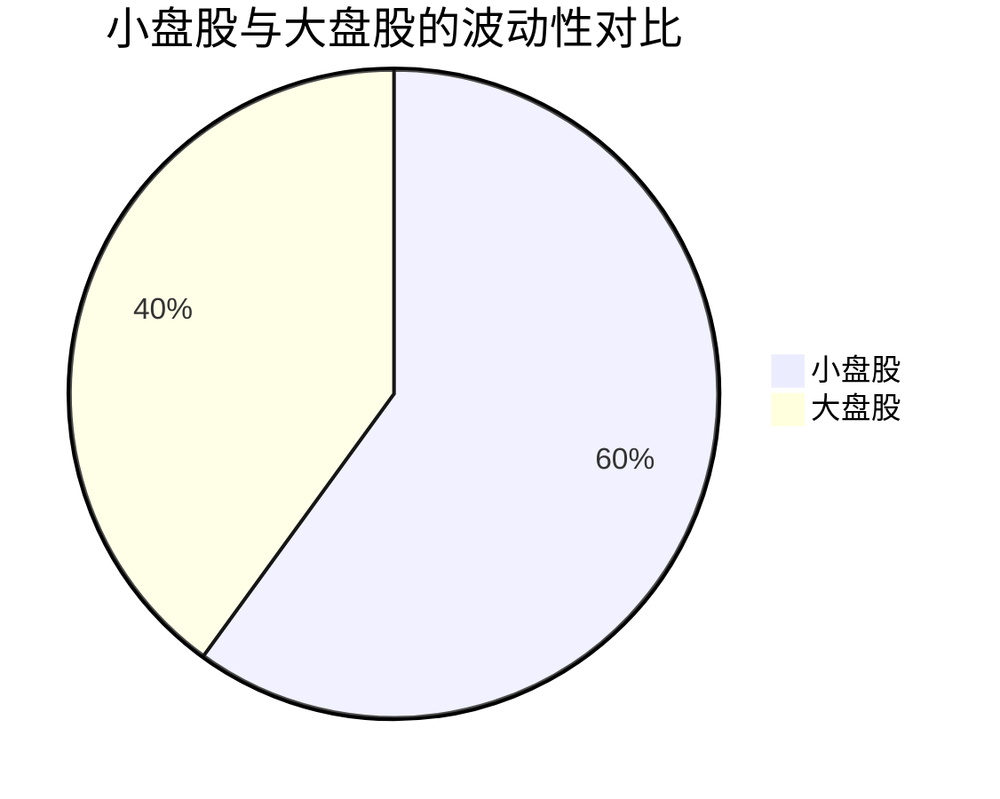
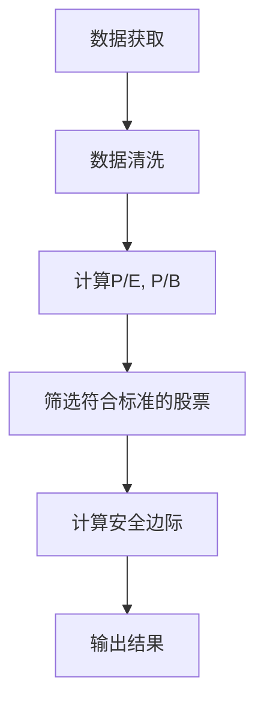
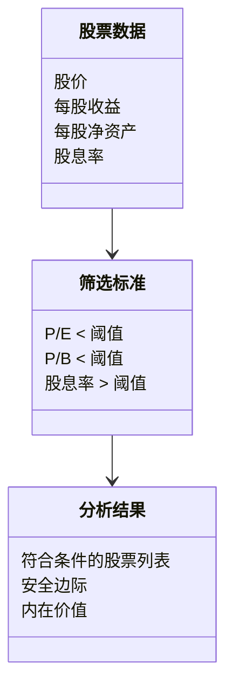
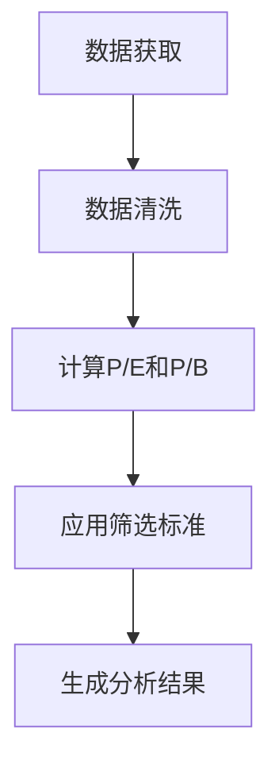

                 


# 格雷厄姆特价股票策略在不同市值公司中的效果比较

## 关键词：价值投资，格雷厄姆策略，小盘股，中盘股，大盘股，股票分析

## 摘要

本文详细探讨了格雷厄姆特价股票策略在不同市值公司中的应用效果。通过分析小盘股、中盘股和大盘股的特点，结合格雷厄姆的安全边际和内在价值理论，本文旨在比较不同市值公司中该策略的有效性。文章从背景介绍、核心概念、算法原理、系统架构到项目实战，全面解析了格雷厄姆策略在不同市值公司中的实施效果，并提出了相应的优化建议。

---

## 第一部分：格雷厄姆特价股票策略概述

### 第1章：价值投资与格雷厄姆策略背景

#### 1.1 价值投资的起源与发展

##### 1.1.1 价值投资的定义与核心理念
价值投资是一种投资策略，强调以低于内在价值的价格购买优质资产。其核心理念是通过深入分析企业的基本面，寻找市场低估的机会。格雷厄姆是价值投资的鼻祖，他提出了“安全边际”概念，即以低于估算价值的价格购买资产，以降低风险。

##### 1.1.2 格雷厄姆投资理论的贡献
格雷厄姆在《 Intelligent Investor》中系统阐述了价值投资理论，提出了多项筛选指标，如市盈率（P/E）、市净率（P/B）等，为后续投资者提供了重要参考。他的理论强调长期投资和安全边际，至今仍是价值投资的核心。

##### 1.1.3 格雷厄姆策略在现代投资中的地位
尽管市场环境变化，格雷厄姆策略仍被广泛应用于股票筛选中，尤其是寻找低估股票。然而，不同市值公司的特点可能会影响策略的有效性，因此需要深入比较。

#### 1.2 格雷厄姆特价股票策略的核心概念

##### 1.2.1 安全边际的定义与计算
安全边际 = 股票市场价格 < 内在价值 × 安全边际比例（通常为 20%-30%）。公式为：
$$ \text{安全边际} = \text{内在价值} \times (1 - \text{安全边际比例}) $$

##### 1.2.2 内在价值的评估方法
内在价值是公司未来现金流的现值，可通过DCF模型计算：
$$ \text{内在价值} = \sum_{t=1}^{n} \frac{\text{现金流}_t}{(1 + r)^t} + \frac{\text{残值}}{(1 + r)^n} $$

##### 1.2.3 稀有低价股票的筛选标准
格雷厄姆筛选标准包括低市盈率（<15）、低市净率（<1.5）和高股息率（>5%）。表格对比不同市值公司的筛选标准：

| 市值规模 | 筛选标准 |
|---------|----------|
| 小盘股 | P/E <10, P/B <1.2, 股息率>6% |
| 中盘股 | P/E <12, P/B <1.5, 股息率>5% |
| 大盘股 | P/E <15, P/B <2, 股息率>4% |

---

### 第2章：不同市值公司的特点与投资策略

#### 2.1 小盘股、中盘股和大盘股的定义与特征

##### 2.1.1 小盘股的定义与风险
小盘股指市值在50亿以下的公司，波动性高，风险大，但成长潜力大。图表对比小盘股与大盘股的波动性：



##### 2.1.2 中盘股的定义与平衡性
中盘股指市值在50亿至500亿之间的公司，风险和回报介于小盘股和大盘股之间。

##### 2.1.3 大盘股的定义与稳定性
大盘股指市值在500亿以上的公司，波动低，稳定性高，但成长性有限。

#### 2.2 不同市值公司对格雷厄姆策略的适用性

##### 2.2.1 小盘股的高增长潜力
小盘股可能因市场低估而被格雷厄姆策略筛选，但高波动性可能导致短期亏损。案例分析：某小盘股的筛选与表现。

##### 2.2.2 中盘股的稳定性与成长性
中盘股在筛选时可能面临较高的市盈率，但其稳定性和成长性使其成为平衡型投资者的首选。

##### 2.2.3 大盘股的安全性与低波动性
大盘股的筛选标准较宽松，但其低波动性和安全性使其成为保守投资者的首选。

---

## 第二部分：格雷厄姆策略的数学模型与算法原理

### 第3章：格雷厄姆策略的数学模型

#### 3.1 格雷厄姆策略的核心公式

##### 3.1.1 市盈率（P/E）计算公式
$$ \text{市盈率} = \frac{\text{股价}}{\text{每股收益}} $$

##### 3.1.2 市净率（P/B）计算公式
$$ \text{市净率} = \frac{\text{股价}}{\text{每股净资产}} $$

##### 3.1.3 内在价值计算公式
$$ \text{内在价值} = \text{股息率} \times \text{市盈率} $$

#### 3.2 格雷厄姆策略的筛选标准

##### 3.2.1 稀有低价股票的筛选条件
$$ \text{股价} < \text{内在价值} \times (1 - \text{安全边际比例}) $$

##### 3.2.2 安全边际的计算公式
$$ \text{安全边际} = \text{内在价值} \times \text{安全边际比例} $$

##### 3.2.3 市场波动对策略的影响
格雷厄姆策略在市场波动较大时更具优势，但需动态调整筛选标准。

---

### 第4章：格雷厄姆策略的算法实现

#### 4.1 算法流程图



#### 4.2 Python实现代码

```python
import pandas as pd

def graham_screen(data, market_cap):
    # 计算P/E和P/B
    data['P/E'] = data['股价'] / data['每股收益']
    data['P/B'] = data['股价'] / data['每股净资产']
    
    # 根据市值规模筛选
    if market_cap == '小盘股':
        data = data[data['P/E'] < 10]
        data = data[data['P/B'] < 1.2]
        data = data[data['股息率'] > 6]
    elif market_cap == '中盘股':
        data = data[data['P/E'] < 12]
        data = data[data['P/B'] < 1.5]
        data = data[data['股息率'] > 5]
    else:
        data = data[data['P/E'] < 15]
        data = data[data['P/B'] < 2]
        data = data[data['股息率'] > 4]
        
    return data
```

---

## 第三部分：不同市值公司中的策略效果比较

### 第5章：小盘股与格雷厄姆策略

#### 5.1 小盘股的市场特点

##### 5.1.1 小盘股的高波动性
小盘股的波动性较高，可能导致策略在短期内表现不佳，但长期可能有更高回报。

##### 5.1.2 小盘股的高成长潜力
小盘股的成长空间较大，适合长期投资者，但需注意高风险。

### 第6章：中盘股与格雷厄姆策略

#### 6.1 中盘股的市场特点

##### 6.1.1 中盘股的稳定性与成长性
中盘股在筛选时可能面临较高的市盈率，但其稳定性和成长性使其成为平衡型投资者的首选。

##### 6.1.2 中盘股的风险与回报
中盘股的风险和回报介于小盘股和大盘股之间，适合风险承受能力中等的投资者。

### 第7章：大盘股与格雷厄姆策略

#### 7.1 大盘股的市场特点

##### 7.1.1 大盘股的安全性与稳定性
大盘股的波动性较低，安全性较高，适合保守型投资者。

##### 7.1.2 大盘股的低成长性
大盘股的成长性较低，但其稳定性和安全性使其成为长期投资者的首选。

---

## 第四部分：系统分析与架构设计

### 第8章：系统分析与架构设计

#### 8.1 问题场景介绍
本文构建了一个分析系统，用于比较格雷厄姆策略在不同市值公司中的效果。系统包括数据收集、处理、分析和可视化模块。

#### 8.2 系统功能设计

##### 8.2.1 领域模型图


#### 8.3 系统架构设计



#### 8.4 系统接口设计
系统接口包括数据输入、筛选标准设置和结果输出，支持用户自定义筛选条件。

---

## 第五部分：项目实战

### 第9章：项目实战

#### 9.1 环境配置

##### 9.1.1 Python环境安装
安装Python和必要的库（pandas, numpy）。

#### 9.2 核心实现

##### 9.2.1 数据获取与清洗
使用pandas获取并清洗股票数据，确保数据完整性。

##### 9.2.2 筛选算法实现
根据市值规模应用格雷厄姆筛选标准，输出符合条件的股票列表。

##### 9.2.3 结果可视化
绘制符合条件股票的分布图，展示策略效果。

#### 9.3 实际案例分析

##### 9.3.1 小盘股案例
分析某小盘股的筛选与表现，验证策略的有效性。

##### 9.3.2 大盘股案例
分析某大盘股的筛选与表现，比较策略在不同市值公司中的效果。

---

## 第六部分：总结与展望

### 第10章：总结与展望

#### 10.1 研究总结
格雷厄姆策略在不同市值公司中的效果因市场环境和公司特征而异，小盘股波动性高，中盘股平衡性好，大盘股安全性高。

#### 10.2 研究展望
未来研究可结合大数据和机器学习，优化筛选模型，提高策略效果。

---

## 第七部分：小结与注意事项

### 第11章：小结

#### 11.1 核心发现
格雷厄姆策略在不同市值公司中的效果差异显著，需根据市场环境和公司特征灵活调整。

#### 11.2 最佳实践
投资者应结合市场周期和自身风险偏好，合理配置不同市值公司的投资比例。

---

## 第八部分：参考文献与拓展阅读

### 第12章：参考文献与拓展阅读

#### 12.1 参考文献
1. 格雷厄姆《 Intelligent Investor》
2. 现代投资组合理论相关文献

#### 12.2 拓展阅读
1. 价值投资在新兴市场的应用
2. 机器学习在股票筛选中的应用

---

以上是《格雷厄姆特价股票策略在不同市值公司中的效果比较》的技术博客文章大纲和内容概要。

