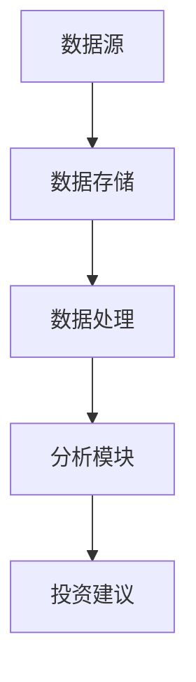

                 


# 格雷厄姆特价股票策略在不同市场信息效率下的表现

## 关键词：格雷厄姆策略、市场信息效率、股票投资、价值投资、安全边际

## 摘要：  
格雷厄姆特价股票策略是一种经典的低估值投资策略，旨在通过寻找市场价格低于内在价值的股票来实现长期收益。本文系统地分析了该策略在不同市场信息效率下的表现，结合数学模型、系统架构设计和实证分析，深入探讨了其在有效市场和非有效市场中的优缺点，并通过实际案例展示了策略的实现和应用效果。

---

## 第一部分: 引言

### 第1章: 股票投资与市场信息效率概述

#### 1.1 股票投资的基本概念  
股票投资是指通过购买公司股份，期望通过股价上涨或股息收入获得收益的一种投资方式。股票市场的价格波动受到多种因素的影响，包括公司基本面、市场情绪、宏观经济环境等。  

#### 1.2 市场信息效率的定义与分类  
市场信息效率反映了市场中信息的传播和反映在股价中的速度和程度。根据有效市场假说（Efficient Market Hypothesis, EMH），市场可以分为以下三类：  
1. **强有效市场**：所有信息（包括内部信息）都已经反映在股价中。  
2. **半强有效市场**：公开信息已经反映在股价中。  
3. **弱有效市场**：只有历史价格信息已经反映在股价中。  

#### 1.3 格雷厄姆特价股票策略的基本概念  
格雷厄姆特价股票策略是由本杰明·格雷厄姆提出的一种价值投资方法，主要通过寻找市场价格显著低于内在价值的股票来实现超额收益。该策略强调安全边际，即市场价格与内在价值之间的折扣越大，投资的安全性越高。

---

## 第二部分: 格雷厄姆策略的核心要素

### 第2章: 格雷厄姆策略的基本框架

#### 2.1 格雷厄姆策略的核心原则  
1. **安全边际**：购买价格远低于内在价值的股票，以降低投资风险。  
2. **低市盈率和低市净率**：选择市盈率（P/E）和市净率（P/B）低于行业平均水平的股票。  
3. **高股息率**：关注高股息率的股票，以获得稳定的现金流。  

#### 2.2 特价股票的识别标准  
1. **市盈率（P/E）**：计算公式为：$$P/E = \frac{\text{股价}}{\text{每股净利润}}$$  
2. **市净率（P/B）**：计算公式为：$$P/B = \frac{\text{股价}}{\text{每股净资产}}$$  
3. **内在价值评估**：通过DCF模型（现金流贴现法）或其他方法估算股票的内在价值。  

#### 2.3 格雷厄姆策略的优缺点分析  
- **优点**：注重安全边际，适合长期投资者，能够在市场波动中获得超额收益。  
- **缺点**：在强有效市场中，低价股票可能并不存在，策略可能失效。  

---

## 第三部分: 格雷厄姆策略在不同市场信息效率下的表现

### 第3章: 有效市场假说下的格雷厄姆策略

#### 3.1 强有效市场中的格雷厄姆策略  
在强有效市场中，所有信息（包括内部信息）均已反映在股价中，因此低价股票可能并不存在。格雷厄姆策略在这种市场中的表现可能不佳，因为安全边际难以实现。  

#### 3.2 半强有效市场中的格雷厄姆策略  
在半强有效市场中，公开信息已经反映在股价中，但市场可能存在短期波动。格雷厄姆策略仍有一定的适用性，尤其是当市场出现短期恐慌时，可能会出现低估股票的机会。  

#### 3.3 弱有效市场中的格雷厄姆策略  
在弱有效市场中，历史价格信息已经反映在股价中，但市场参与者可能忽视基本面因素。格雷厄姆策略在这种市场中表现较好，因为可以通过基本面分析找到低估股票。

### 第4章: 非有效市场中的格雷厄姆策略

#### 4.1 新兴市场中的格雷厄姆策略  
新兴市场通常存在较大的波动性和信息不对称，为格雷厄姆策略提供了机会。但投资者需要更加谨慎地评估公司的基本面，因为许多公司可能缺乏透明的财务数据。  

#### 4.2 小盘股市场中的格雷厄姆策略  
小盘股市场通常存在较高的波动性和较低的流动性，但许多小盘股可能被市场忽视，从而出现低估的机会。格雷厄姆策略在这种市场中表现较好，尤其是在市场情绪低迷时。

---

## 第四部分: 系统架构设计与项目实战

### 第5章: 系统架构设计

#### 5.1 系统功能设计  
1. 数据收集模块：收集股票的市场数据和财务数据。  
2. 分析模块：计算市盈率、市净率等指标，并评估股票的内在价值。  
3. 策略执行模块：根据格雷厄姆策略筛选出低估股票，并生成投资建议。  

#### 5.2 系统架构设计  
以下是系统架构的Mermaid图：  


#### 5.3 系统接口设计  
1. 数据接口：从数据源获取股票数据。  
2. 分析接口：计算股票的估值指标并输出结果。  
3. 投资建议接口：根据分析结果生成投资建议。  

### 第6章: 项目实战

#### 6.1 环境安装  
- 安装Python和相关库（如Pandas、NumPy、Matplotlib）。  

#### 6.2 核心实现代码  
以下是计算市盈率和市净率的Python代码：  
```python
import pandas as pd

# 假设df是包含股票数据的DataFrame
df['P/E'] = df['股价'] / df['每股净利润']
df['P/B'] = df['股价'] / df['每股净资产']
```

#### 6.3 案例分析  
以苹果公司为例，计算其市盈率和市净率，并与行业平均水平进行对比。  

---

## 第五部分: 总结与展望

### 第7章: 总结

#### 7.1 格雷厄姆策略的核心思想  
格雷厄姆策略强调安全边际和低估值，适合在非有效市场中应用。  

#### 7.2 市场信息效率对策略的影响  
在强有效市场中，格雷厄姆策略可能失效；在弱有效市场和非有效市场中，策略表现较好。  

#### 7.3 投资者注意事项  
1. 结合市场环境选择策略。  
2. 定期评估投资组合，及时调整。  
3. 保持长期投资视角，避免短期波动干扰。  

### 第8章: 展望

#### 8.1 格雷厄姆策略的未来应用  
随着人工智能和大数据技术的发展，格雷厄姆策略可以通过量化方法进一步优化。  

#### 8.2 投资者的最佳实践  
1. 深入学习基本面分析。  
2. 结合技术分析进行综合判断。  
3. 定期复盘，总结经验教训。  

---

## 附录: 拓展阅读

1. 格雷厄姆的《 Intelligent Investor 》  
2. 有效市场假说的相关文献  
3. Python金融分析库的使用教程  

---

通过以上分析，可以得出结论：格雷厄姆策略在不同市场信息效率下的表现存在显著差异，投资者需要根据市场环境灵活调整策略，并结合技术分析和基本面分析进行综合判断。

