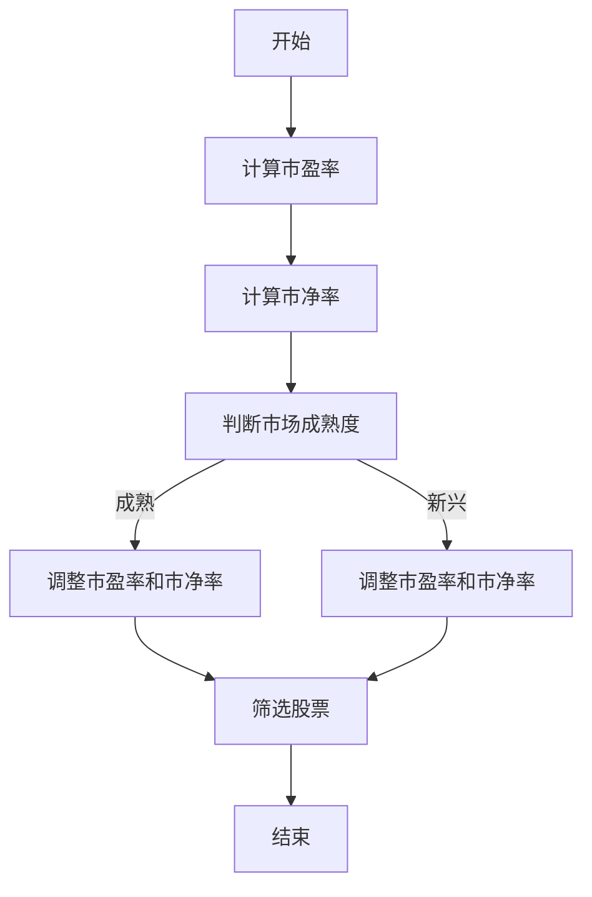
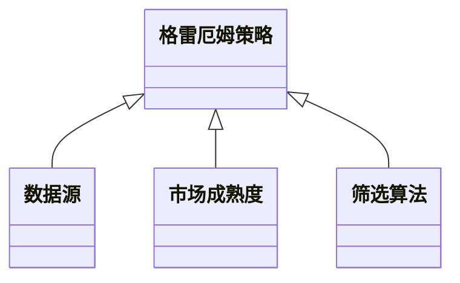
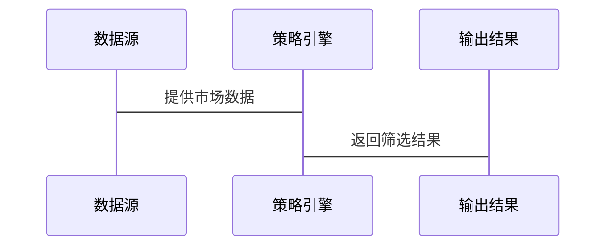

                 


# 格雷厄姆特价股票策略在不同市场成熟度中的动态调整

## 关键词：格雷厄姆策略、市场成熟度、价值投资、市盈率、市净率、动态调整、股票投资

## 摘要：本文深入分析了格雷厄姆特价股票策略在不同市场成熟度中的应用与调整。通过探讨市场成熟度对策略的影响，结合数学模型和算法优化，提出了一种动态调整方法，以提高策略在不同市场环境下的适用性和盈利能力。

---

## 第一部分：背景介绍

### 第1章：价值投资与格雷厄姆策略概述

#### 1.1 价值投资的基本概念
- 1.1.1 价值投资的定义与核心理念
  价值投资是一种长期投资策略，强调购买被市场低估的资产。其核心理念是寻找那些市场价格低于其内在价值的股票，长期持有以实现资本增值。
- 1.1.2 格雷厄姆的价值投资理论
  本杰明·格雷厄姆是价值投资的鼻祖，他提出了“廉价的伟大”理念，主张通过分析财务报表和估值指标来识别被低估的股票。
- 1.1.3 特价股票策略的起源与发展
  格雷厄姆策略的核心在于寻找具有低市盈率（P/E）和低市净率（P/B）的股票，这些股票通常被认为被市场低估。

#### 1.2 市场成熟度的定义与影响
- 1.2.1 市场成熟度的定义
  市场成熟度是指市场的发育程度，包括市场规模、流动性、参与者成熟度等因素。成熟市场通常具有完善的法律法规、透明的信息披露和理性的投资者行为。
- 1.2.2 不同市场成熟度下的投资环境差异
  新兴市场通常波动较大，信息不透明，而成熟市场则更加稳定，信息透明。
- 1.2.3 市场成熟度对投资策略的影响
  在成熟市场中，格雷厄姆策略可能面临更高的竞争压力，而在新兴市场中，可能更容易找到低估的股票，但风险也更大。

---

## 第二部分：核心概念与联系

### 第2章：格雷厄姆策略与市场成熟度的关系

#### 2.1 格雷厄姆策略的核心要素
- 2.1.1 市盈率（P/E）的计算与应用
  $$P/E = \frac{Price}{Earnings}$$
  低市盈率通常意味着股票价格相对于其盈利水平较低，可能被低估。
- 2.1.2 市净率（P/B）的计算与应用
  $$P/B = \frac{Price}{Book\ Value}$$
  低市净率表明股票价格低于其账面价值，可能被低估。
- 2.1.3 股息率与股息支付率的分析
  股息率高的股票可能具有较高的分红回报，而高股息支付率可能表明公司愿意将利润返还给股东。

#### 2.2 市场成熟度对策略的影响
- 2.2.1 不同市场成熟度下的投资机会分析
  - 新兴市场：机会多，风险高，适合寻找快速增长的公司。
  - 成熟市场：机会稳定，风险较低，适合寻找低估的蓝筹股。
- 2.2.2 市场成熟度与投资风险的关系
  成熟市场风险较低，但竞争激烈，新兴市场风险较高，但可能有更高的回报。
- 2.2.3 市场成熟度对策略调整的必要性
  根据市场成熟度调整格雷厄姆策略的参数，以适应不同市场环境。

---

## 第三部分：算法原理与数学模型

### 第3章：格雷厄姆策略的数学模型

#### 3.1 格雷厄姆策略的基本公式
- 3.1.1 市盈率公式：$$P/E = \frac{Price}{Earnings}$$
- 3.1.2 市净率公式：$$P/B = \frac{Price}{Book\ Value}$$
- 3.1.3 股息率公式：$$Dividend\ Yield = \frac{Dividends}{Price} \times 100\%$$

#### 3.2 动态调整模型
- 3.2.1 根据市场成熟度调整市盈率的公式
  在成熟市场中，格雷厄姆建议的市盈率上限可能需要调整为15倍，而在新兴市场中，可以放宽至20倍。
- 3.2.2 根据市场成熟度调整市净率的公式
  在成熟市场中，市净率的上限可能为1.5倍，而在新兴市场中，可以放宽至2倍。

#### 3.3 算法流程图


#### 3.4 算法实现代码
```python
def calculate_pe(prices, earnings):
    return [prices[i]/earnings[i] for i in range(len(prices))]

def calculate_pb(prices, book_values):
    return [prices[i]/book_values[i] for i in range(len(prices))]

def adjust_for_market_maturity(pe, pb, market_maturity):
    if market_maturity == '成熟':
        pe_adjusted = min(pe, 15)
        pb_adjusted = min(pb, 1.5)
    else:
        pe_adjusted = min(pe, 20)
        pb_adjusted = min(pb, 2)
    return pe_adjusted, pb_adjusted

def main():
    prices = [100, 150, 200]
    earnings = [10, 15, 20]
    book_values = [50, 75, 100]
    pe = calculate_pe(prices, earnings)
    pb = calculate_pb(prices, book_values)
    market_maturity = '成熟'  # 可以改为'新兴'
    pe_adj, pb_adj = adjust_for_market_maturity(pe, pb, market_maturity)
    print(f"调整后的市盈率为：{pe_adj}")
    print(f"调整后的市净率为：{pb_adj}")

if __name__ == "__main__":
    main()
```

---

## 第四部分：系统分析与架构设计

### 第4章：系统功能设计与架构

#### 4.1 领域模型（Mermaid 类图）


#### 4.2 系统架构设计（Mermaid 架构图）
```mermaid
container 系统架构 {
    数据源 --> 数据处理模块
    数据处理模块 --> 策略引擎
    策略引擎 --> 输出结果
}
```

#### 4.3 系统接口设计与交互（Mermaid 序列图）


---

## 第五部分：项目实战

### 第5章：实战案例与分析

#### 5.1 环境配置
- 安装必要的Python库：pandas、numpy、matplotlib

#### 5.2 核心代码实现
```python
import pandas as pd

def load_data(file_path):
    return pd.read_csv(file_path)

def apply_adjustments(data, market_maturity):
    data['调整后市盈率'] = data['市盈率'].where(data['市盈率'] <= 15, data['市盈率'] * 0.8)
    data['调整后市净率'] = data['市净率'].where(data['市净率'] <= 1.5, data['市净率'] * 0.8)
    return data

def main():
    data = load_data('stock_data.csv')
    adjusted_data = apply_adjustments(data, '成熟')
    print(adjusted_data[['市盈率', '调整后市盈率', '市净率', '调整后市净率']].head())

if __name__ == "__main__":
    main()
```

#### 5.3 实际案例分析
- 选择几个不同成熟度的市场，应用调整后的策略，进行回测和分析。

---

## 第六部分：最佳实践与总结

### 第6章：总结与展望

#### 6.1 最佳实践 tips
- 定期调整策略参数以适应市场变化。
- 结合技术分析和基本面分析，提高策略的有效性。
- 注意数据质量，确保估值指标的准确性。

#### 6.2 小结
通过动态调整格雷厄姆策略，可以更好地适应不同市场成熟度的环境，提高投资收益。

#### 6.3 注意事项
- 避免过度依赖单一指标，结合多种估值方法。
- 保持对市场的持续关注和研究。

#### 6.4 拓展阅读
- 格雷厄姆的《 Intelligent Investor》
- 《投资学》教材中关于市场成熟度的内容。

---

通过以上思考和撰写，本文系统地探讨了格雷厄姆特价股票策略在不同市场成熟度中的动态调整，结合理论分析和实际案例，为投资者提供了实用的指导。

